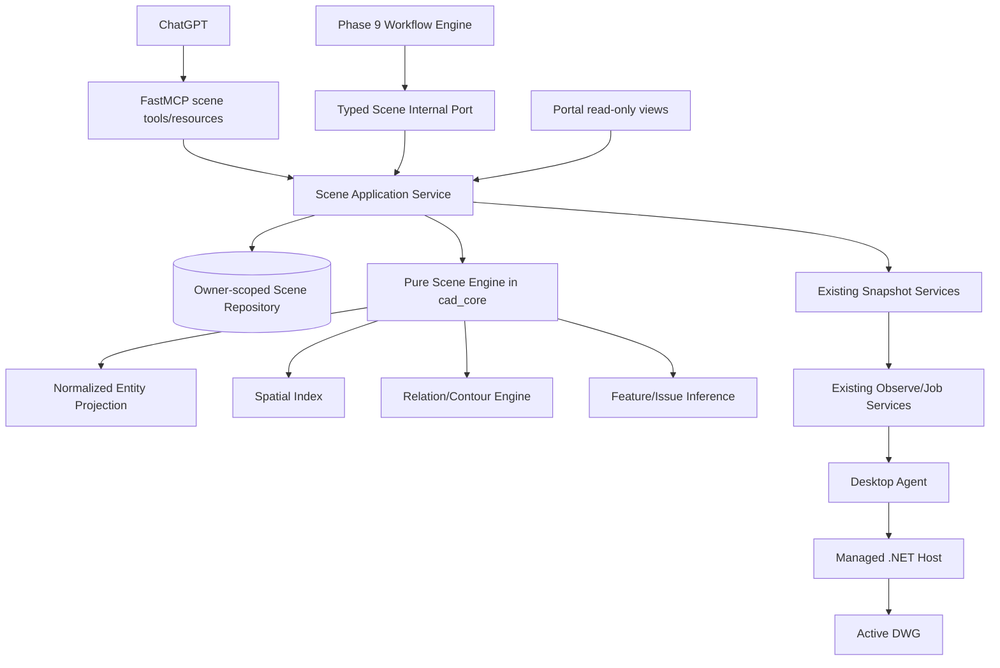

# Phase 10 — Scene Graph and Drawing Intelligence

> Trạng thái: kế hoạch kiến trúc và triển khai sau khi Phase 9 được merge vào `main` qua PR #13.
>
> Baseline bắt buộc: commit `2217bd0387bcc8e5f2a4d9c0235c58e52dd3eab7` hoặc commit mới hơn trên `main` có chứa toàn bộ PR #13.
>
> Phase 9 đạt **Engineering GO** cho Skill and Workflow Platform, gồm public OAuth workflow, trusted Portal approval, Gateway restart, Agent reconnect và no-duplicate evidence trên AutoCAD Mechanical 2025 R25.
>
> Những claim chưa có vẫn gồm ChatGPT Agent-to-AutoCAD end-to-end, Customer Pilot, production CA/timestamp, full release-family certification, AutoCAD LT write và production scale.
>
> Phase 10 xây drawing intelligence **read-only, bounded, deterministic và evidence-backed** phía trên immutable drawing snapshots. Nó không mở thêm write authority, không biến inference thành sự thật CAD, không xây graph database sớm và không thay thế đường `prepare → preview → approval → commit → validate → recovery/rollback` của Phase 6–9.

---

## 0. Chỉ dẫn bắt buộc cho Codex local

Codex thực hiện Phase 10 trong local repository. Bắt đầu từ `main` mới nhất nhưng **không làm trực tiếp trên `main`**.

### 0.1. Tạo nhánh triển khai

```powershell
git status --short
git fetch origin
git checkout main
git pull --ff-only origin main
git checkout -b codex/phase-10-scene-graph-drawing-intelligence
```

Nếu working tree không sạch, `main` không fast-forward được, hoặc nhánh trên đã tồn tại với lịch sử không rõ nguồn gốc:

- không force;
- không reset;
- không xóa thay đổi local;
- dừng mutation;
- ghi rõ blocker;
- chỉ tiếp tục review read-only nếu còn hữu ích.

Nhánh triển khai phải sinh từ `main` chứa PR #13. Không dùng lại nhánh Phase 9 làm baseline.

### 0.2. Tài liệu và code phải đọc trước

Đọc tối thiểu:

```text
docs/architecture/fastmcp-multi-user-autocad-plan.md
docs/architecture/Phase-6-plus.md
docs/architecture/Phase-7.md
docs/architecture/Phase-8.md
docs/architecture/Phase-9.md
docs/architecture/phase9-workflow-boundaries-adr.md
docs/architecture/phase8-implementation-evidence.md
docs/architecture/appendix-user-interface.md
docs/security/phase9-threat-model.md
docs/security/phase9-security-review.md

services/gateway/src/autocad_gateway/app.py
services/gateway/src/autocad_gateway/contracts.py
services/gateway/src/autocad_gateway/services.py
services/gateway/src/autocad_gateway/snapshots.py
services/gateway/src/autocad_gateway/durable_services.py
services/gateway/src/autocad_gateway/composition.py
services/gateway/src/autocad_gateway/workflows/
services/gateway/src/autocad_gateway/infrastructure/sqlite/

packages/contracts/src/autocad_contracts/agent_protocol.py
packages/contracts/src/autocad_contracts/phase9_contracts.py
packages/cad_core/src/cad_core/
packages/skill_catalog/

src/autocad_mcp/part_detection.py
src/autocad_mcp/dimension_intelligence.py
src/autocad_mcp/dimension_workflow.py
src/autocad_mcp/auto_dimension_tool.py

apps/desktop_agent/src/autocad_desktop_agent/runtime/
native/autocad_managed_host/src/AutocadMcp.Host.Core/
native/autocad_managed_host/src/AutocadMcp.Host.R25/AutoCadEntitySnapshotOperations.cs
apps/web_portal/
```

Mọi nhận xét về baseline phải dẫn tới file, class, function, schema hoặc test cụ thể. Phân biệt rõ:

- đã xác minh;
- suy luận;
- chưa đủ dữ liệu;
- quyết định mới của Phase 10.

### 0.3. Baseline trước khi sửa code

Chạy ít nhất:

```powershell
python scripts/test-phase9-conformance.py
```

Sau đó tái chạy các suite Phase 9 đã dùng để chốt PR #13 bằng command hiện hành trong repo/CI:

- root Python;
- Gateway;
- contracts;
- Desktop Agent;
- Managed .NET Host Core;
- Portal unit;
- Portal E2E;
- Phase 8 conformance;
- Host contract tests.

Baseline acceptance gần nhất của PR #13 là:

| Suite | Evidence gần nhất |
|---|---:|
| Phase 9 conformance | 90 passed |
| Root Python | 414 passed, 1 skipped |
| Gateway | 323 passed |
| Contracts | 132 passed |
| Desktop Agent | 156 passed |
| Managed .NET | 74 passed |
| Portal unit | 35 passed |
| Portal E2E | 10 passed |
| Phase 8 conformance | 39 passed |
| Host contracts | 23 passed |

Không coi số trên là hard-coded vĩnh viễn. Ghi lại command thật, commit, OS, Python/.NET/Node versions, test counts và skips của baseline hiện tại.

Không bắt đầu implementation nếu:

- Phase 9 conformance đỏ;
- public OAuth/workflow snapshot không nhất quán;
- Phase 6–9 write/recovery regression đỏ;
- Managed Host contract test đỏ;
- working tree có thay đổi không giải thích được.

### 0.4. Quy tắc làm việc

- Không rollback hoặc viết lại Phase 0–9.
- Không xóa legacy local MCP, AutoLISP/File IPC, Managed .NET hoặc ezdxf path.
- Không đổi public write semantics để thuận tiện cho Scene Graph.
- Không dùng FastMCP object/decorator trong scene domain engine.
- Không đưa Autodesk assemblies vào Gateway hoặc `cad_core`.
- Không chạy arbitrary Python/C#/LISP/shell/SQL/HTTP/plugin từ scene query hay inference rule.
- Không thêm user-supplied expression language, regex tùy ý hoặc dynamic `eval`.
- Không cho inferred feature trực tiếp authorize modify/delete/commit.
- Không tự động tin text trong DWG là instruction cho model.
- Mỗi slice phải có contract, test, budget, failure behavior và rollback/disable path.
- Commit nhỏ theo slice; không gom toàn bộ Phase 10 thành một commit khổng lồ.
- Subagent review độc lập không được sửa cùng một nhóm file tại cùng thời điểm.

---

## 1. Executive summary

Phase 9 đã tạo lớp reuse/orchestration ở phía trên CAD Program:

```text
ChatGPT
→ discover skill
→ durable workflow
→ observe/query
→ planner/template
→ prepare/preview
→ trusted approval
→ commit/job/recovery
→ validate/finish
```

Nhưng dữ liệu quan sát hiện chủ yếu vẫn là entity list:

```text
LINE / CIRCLE / LWPOLYLINE
+ layer
+ geometry bounded
+ document_revision
```

ChatGPT vẫn phải tự suy luận từ nhiều entity rời rạc và không có một model chuẩn về:

- entity nào thuộc cùng một chi tiết;
- entity nào nối nhau hoặc nằm trong nhau;
- đường nào song song, vuông góc, đồng tâm hoặc chồng nhau;
- contour nào đóng/mở;
- vòng tròn nào có thể là hole;
- hình nào có thể là slot, pattern hoặc part;
- dimension/text nào liên quan tới geometry nào;
- lỗi hình học nào là exact, lỗi nào chỉ là heuristic.

Phase 10 thêm lớp derived intelligence:

```text
Immutable drawing snapshot
→ normalized entity projection
→ bounded spatial index
→ exact/derived relations
→ contour and component graph
→ feature inference
→ anomaly/validation reports
→ concise public summary + paginated resources
```

Kiến trúc chốt:

1. **Snapshot vẫn là source of truth cho một lần phân tích.**
2. **Scene là immutable derived artifact, owner-scoped và revision-pinned.**
3. **Scene engine nằm trong pure Python `cad_core`, không nằm trong FastMCP, Agent hoặc Host.**
4. **Managed Host chỉ cung cấp geometry/evidence chính xác hơn; không suy luận business feature.**
5. **Inference luôn có confidence, evidence, algorithm version và source entity refs.**
6. **Exact relation khác heuristic feature. Không gộp hai loại thành một boolean “true”.**
7. **Scene query bounded/paginated; không đổ toàn bộ graph vào model context.**
8. **Phase 9 workflow có thể dùng scene qua typed internal steps, nhưng không tạo tool theo feature/skill.**
9. **Scene data không cấp quyền write. Mọi write vẫn phải revalidate exact entity/document evidence qua Phase 6–9.**
10. **Phase 10 core ưu tiên 2D mechanical model-space trên Managed .NET R25, sau đó mới chứng minh portable subset cho ezdxf/LT.**

---

## 2. Baseline đã xác minh sau Phase 9

### 2.1. Public surface hiện hành

Public MCP hiện có các nhóm chính:

- device/observation:
  - `cad_list_devices`;
  - `cad_observe`;
  - `cad_query`;
  - `cad_get_job`;
- CAD Program/recovery:
  - `cad_prepare_program`;
  - `cad_preview`;
  - `cad_commit`;
  - `cad_validate`;
  - rollback/recovery tools theo profile;
- workflow:
  - `cad_start_workflow`;
  - `cad_get_workflow`;
  - `cad_control_workflow`;
  - catalog/run resources.

Phase 10 không đổi tên hoặc làm yếu các tools trên.

### 2.2. Snapshot/query contract hiện tại

`CadEntity` hiện chỉ đảm bảo:

```text
entity_id
entity_type
layer
geometry | null
geometry_truncated
```

`CadQueryInput` hiện filter theo:

```text
snapshot_id
types
layers
cursor
limit
```

Đây là contract phù hợp cho entity paging, nhưng chưa đủ để biểu diễn relation, contour, feature, issue và inference evidence.

### 2.3. Geometry hiện có trên Managed .NET R25

`AutoCadEntitySnapshotOperations` hiện trả additive metadata gồm:

- handle;
- type;
- layer;
- space;
- bounds;
- geometry;
- geometry_truncated;
- fingerprint.

Geometry exact hiện được materialize rõ cho:

- `LINE`: start/end;
- `CIRCLE`: center/radius;
- `LWPOLYLINE`: points/closed, giới hạn 4096 vertices.

Các type khác có thể có bounds/fingerprint nhưng geometry `null`. Phase 10 không được quảng cáo relation/feature exact cho type thiếu source geometry.

### 2.4. Pure legacy intelligence có thể tái sử dụng có chọn lọc

`src/autocad_mcp/part_detection.py` đã có:

- backend-neutral `Bounds`;
- normalized `EntityRecord`;
- bbox intersection/containment;
- stable part ordering;
- selection theo part/region/entity;
- ezdxf adapter.

`src/autocad_mcp/dimension_intelligence.py` đã có deterministic helpers cho:

- repeated hole pattern;
- concentric groups;
- obround slot pattern;
- chamfer/fillet patterns;
- symmetry;
- dimension audit/repair suggestions.

Nhưng code legacy chưa tự động đạt chuẩn Phase 10. Codex phải review:

- tolerance semantics;
- stable IDs;
- entity order invariance;
- source evidence;
- confidence meaning;
- unsupported/truncated geometry;
- O(n²) paths;
- assumptions về ezdxf facade;
- owner/revision/storage lifecycle.

Chỉ extract pure algorithms/fixtures có test. Không kéo memory store, MCP registration hoặc backend-private state vào Gateway production path.

### 2.5. Phase 9 workflow foundation có thể tái sử dụng

Phase 9 đã có:

- immutable skill/workflow definitions;
- bounded step registry;
- durable runs/steps/events/waits;
- CAS transitions;
- deterministic child idempotency;
- outbox dispatch;
- restart/reconcile;
- exact write recovery boundary;
- no arbitrary executable step.

Scene operations phải compose với nền này. Không tạo một workflow engine thứ hai.

### 2.6. Những khoảng trống quyết định scope Phase 10

- snapshot local cũ có bounded in-memory storage/TTL;
- production-like flow có durable jobs và owner-scoped records nhưng scene artifact chưa tồn tại;
- `cad_query` chỉ query entity type/layer;
- relation/feature IDs chưa có contract;
- annotation geometry chưa đủ đồng đều;
- Arc/Ellipse/Insert/Dimension/Text projection chưa đủ cho mọi inference;
- no scene-level storage, digest, resource pagination hoặc capability matrix;
- no prompt-injection policy cho drawing text;
- no bounded performance evidence cho graph build trên drawing lớn.

---

## 3. Mục tiêu Phase 10

1. Tạo strict `cad.scene/1` cho immutable owner-scoped scene artifact.
2. Tạo strict node/relation/feature/issue/evidence contracts.
3. Tạo normalized entity projection versioned, runtime-neutral cho subset 2D đã chứng minh.
4. Tạo bounded deterministic spatial index, không O(n²) không kiểm soát.
5. Tạo exact/derived relations ưu tiên:
   - connected;
   - touch/intersect;
   - overlap/duplicate;
   - inside/contains;
   - parallel/perpendicular;
   - concentric;
   - aligned.
6. Tạo contour/component model cho closed polyline và bounded line/arc loops đã chứng minh.
7. Tạo feature inference v0 cho:
   - part/component;
   - hole;
   - repeated-hole pattern;
   - concentric group;
   - slot;
   - centerline candidate;
   - basic annotation link khi evidence đủ.
8. Tạo read-only anomaly/validation reports cho:
   - duplicate geometry;
   - degenerate geometry;
   - open contour;
   - unsupported/truncated geometry;
   - orphan/ambiguous annotation;
   - inconsistent repeated feature.
9. Tạo concise scene summary và bounded paginated resources.
10. Expose tối đa hai public scene tools hoặc một reviewed equivalent, không tool-per-relation/feature.
11. Cho Phase 9 workflow dùng scene bằng typed internal steps.
12. Thêm Portal read-only scene visibility và evidence drill-down.
13. Giữ freeform CAD Program và toàn bộ Phase 6–9 write path hoạt động nguyên trạng.
14. Chứng minh live R25 rằng scene build không đổi DWG/document revision.
15. Chứng minh owner isolation, cursor binding, resource bounds và prompt-injection redaction.
16. Giữ LT read compatibility và ezdxf golden path xanh.
17. Không tuyên bố Customer Pilot GO.

---

## 4. Non-goals

- general AI/ML vision model;
- OCR hoặc screenshot-only feature recognition;
- graph neural network;
- arbitrary natural-language scene query chạy trong Gateway;
- user-authored query language hoặc expression engine;
- graph database, vector database, PostGIS hoặc distributed graph service;
- automatic model call bên trong Gateway;
- automatic CAD write từ inferred feature;
- public modify/delete/topology expansion;
- AutoCAD LT write;
- broad 3D solids/BRep intelligence;
- full assembly semantics;
- xref traversal hoặc external file crawling;
- dynamic block semantic reconstruction hoàn chỉnh;
- perfect dimension associativity reconstruction;
- arbitrary tolerance profiles do model gửi;
- marketplace inference plugins;
- third-party executable analyzers;
- production scale migration sang PostgreSQL/queue/multi-worker không có load evidence;
- customer installer/distribution của Phase 11;
- billing/quota product của Phase 12.

---

## 5. Architecture và responsibility boundary



### 5.1. FastMCP

Chỉ sở hữu:

- public tool/resource declaration;
- typed input/output;
- OAuth scope binding;
- correlation middleware;
- safe error projection;
- resource links.

Không sở hữu:

- geometry algorithms;
- tolerance logic;
- graph build;
- scene storage semantics;
- workflow state;
- AutoCAD runtime logic.

### 5.2. Gateway Scene Application Service

Sở hữu:

- owner/device/snapshot authorization;
- scene build request validation;
- profile/capability resolution;
- scene cache/dedup by canonical digest;
- storage/TTL/retention;
- pagination/cursors;
- public projection/redaction;
- workflow scene port;
- audit/correlation;
- feature flags và budgets.

Không sở hữu Autodesk object logic.

### 5.3. `cad_core` Scene Engine

Sở hữu pure deterministic logic:

- normalized geometry models;
- coordinate/tolerance helpers;
- spatial index;
- relation calculation;
- contour/component graph;
- feature inference;
- issue detection;
- canonical IDs/digests;
- golden/headless tests.

Không import:

- FastMCP;
- Gateway repositories;
- Auth0/OAuth;
- SQLite;
- Autodesk assemblies;
- Desktop Agent.

### 5.4. Desktop Agent

Giữ nguyên responsibility:

- outbound WSS;
- device/session proof;
- runtime routing;
- command ledger;
- hard pause/write lock;
- exact Agent/Host contract forwarding.

Phase 10 Agent changes chỉ được additive để chuyển richer read payload/capability evidence nếu existing transport không đủ.

Agent không suy luận hole/slot/part và không nhận scene skill content.

### 5.5. Managed .NET Host

Chỉ cung cấp exact bounded source facts:

- entity identity/type/layer/space;
- normalized geometry fields;
- bounds;
- fingerprint;
- document/revision evidence;
- unsupported/truncated reasons.

Host không tạo scene graph hoặc feature confidence.

### 5.6. ezdxf

Dùng cho:

- offline fixtures;
- golden scene tests;
- algorithm development;
- cross-runtime normalized subset comparison;
- performance fixtures.

Không được dùng để authorize live DWG write hoặc claim exact AutoCAD associativity.

### 5.7. AutoLISP/File IPC

Giữ LT read compatibility. Chỉ expose subset geometry thực sự có evidence.

Không fake unsupported fields và không silent fallback từ Managed .NET sang LT semantics.

---

## 6. Scene contracts

### 6.1. Schema family

Tạo data-only strict contracts, dự kiến:

```text
cad.scene/1
cad.scene-node/1
cad.scene-relation/1
cad.scene-contour/1
cad.scene-feature/1
cad.scene-issue/1
cad.scene-evidence/1
cad.scene-query/1
```

Tên cuối có thể điều chỉnh trong ADR, nhưng phải giữ các boundary trên rõ ràng.

### 6.2. Scene root

Một scene root tối thiểu gồm:

```json
{
  "schema_version": "cad.scene/1",
  "scene_id": "scn:...",
  "source_snapshot_id": "...",
  "device_id": "...",
  "document_id": "...",
  "document_revision": "...",
  "space": "model",
  "projection_version": "cad.entity-projection/2",
  "engine_version": "scene-engine/1.0.0",
  "profile_id": "mechanical-2d/1",
  "tolerance_profile": {...},
  "source_digest": "sha256:...",
  "scene_digest": "sha256:...",
  "counts": {...},
  "capabilities": [...],
  "warnings": [...],
  "resource_uris": {...}
}
```

Owner identity không cần xuất trong public payload nhưng phải tồn tại trong repository key/filter.

### 6.3. Normalized node

Node tối thiểu:

```text
node_id
source_entity_id
entity_type
layer
space
bounds
geometry
geometry_status
fingerprint
source_runtime
source_capabilities
```

`geometry_status` phải phân biệt:

- `exact`;
- `bounded_projection`;
- `truncated`;
- `unsupported`;
- `unavailable`;
- `invalid`.

Không dùng `geometry=null` như thể mọi trường hợp giống nhau.

### 6.4. Relation

Relation tối thiểu:

```text
relation_id
relation_type
source_node_ids
directionality
evidence_strength
confidence
metrics
tolerance_used
algorithm_version
source_entity_refs
```

`evidence_strength` tối thiểu:

- `exact_source_geometry`;
- `derived_exact`;
- `bounded_heuristic`;
- `unsupported`.

### 6.5. Feature

Feature tối thiểu:

```text
feature_id
feature_type
source_node_ids
source_relation_ids
geometry_summary
confidence
evidence
algorithm_version
limitations
```

Feature không được chỉ có `confidence=1.0` mà thiếu lý do.

### 6.6. Issue/anomaly

Issue tối thiểu:

```text
issue_id
code
severity
source_node_ids
source_relation_ids
message_key
evidence
confidence
suggested_action
write_authority=false
```

`message_key` và typed data nên tách khỏi prose để test/dịch/UI ổn định.

### 6.7. Stable IDs

Trong cùng một scene:

- entity node ID ổn định theo source entity ID;
- relation ID derive từ canonical relation type + sorted node IDs + normalized discriminator;
- feature ID derive từ feature type + sorted source evidence + algorithm version;
- issue ID derive từ issue code + sorted source evidence + detector version.

Entity order, JSON key order hoặc pagination order không được làm đổi ID/digest.

Không yêu cầu ID sống qua một document revision mới. Cross-revision matching là deferred decision.

### 6.8. Canonical digest

`source_digest` phải bind:

- source snapshot ID;
- document ID/revision;
- entity fingerprints/projection;
- space;
- analysis profile;
- tolerance profile;
- source capability evidence.

`scene_digest` bind thêm:

- scene schema;
- engine/algorithm versions;
- canonical nodes/relations/contours/features/issues.

Server tính digest. Không tin digest do model/client gửi.

---

## 7. Coordinate, space và tolerance policy

### 7.1. Scope v0

Phase 10 core ưu tiên:

- 2D model-space;
- planar geometry;
- WCS-normalized XY;
- AutoCAD Mechanical 2025 R25 Managed .NET;
- entity subset đã có exact projection hoặc được bổ sung có test.

Không trộn model space và paper space trong một component graph.

### 7.2. Coordinate normalization

Codex phải xác minh:

- WCS/OCS behavior;
- normal/elevation;
- block transform;
- polyline bulge/arc semantics;
- angle units;
- drawing insertion units.

Nếu một entity không thể normalize chính xác, đánh dấu unsupported/bounded; không tự chiếu “gần đúng” mà không evidence.

### 7.3. Tolerance profile

Không dùng một epsilon global tùy tiện.

Tolerance profile phải versioned và gồm ít nhất:

- drawing unit evidence;
- absolute floor;
- relative-to-extents component;
- angular tolerance;
- endpoint tolerance;
- radius tolerance;
- duplicate tolerance;
- maximum allowed tolerance.

Default mechanical profile phải deterministic. Model/user không được gửi arbitrary tolerance vượt policy.

### 7.4. Exact và heuristic

Ví dụ:

- cùng center/radius trong tolerance có thể là `derived_exact`;
- “có vẻ là centerline” dựa layer/linetype/proximity là `bounded_heuristic`;
- text gần một circle không tự động trở thành exact annotation link.

Public result phải giữ distinction này.

---

## 8. Normalized entity projection v2

### 8.1. Mục tiêu

Tạo projection versioned, additive, runtime-neutral đủ cho scene v0.

### 8.2. Managed R25 source types ưu tiên

Tier A — bắt buộc exact:

- LINE;
- CIRCLE;
- LWPOLYLINE, gồm closed và bulge nếu có;
- ARC.

Tier B — bổ sung nếu evidence đủ trong Phase 10:

- ELLIPSE;
- INSERT/block reference transform/name;
- TEXT/MTEXT bounded anchor/content policy;
- DIMENSION bounded definition points/measurement/style;
- POINT;
- SPLINE chỉ khi có bounded safe representation.

Không block Phase 10 core nếu Tier B chưa đủ. Support matrix phải nói thật.

### 8.3. Projection rules

Mỗi projection phải:

- strict type;
- finite numbers only;
- bounded vertex/text/attribute counts;
- explicit truncation reason;
- no arbitrary object dump;
- no file path/extension data ngoài allowlist;
- no raw AutoCAD object serialization;
- canonical numeric normalization phục vụ digest;
- preserve source fingerprint.

### 8.4. Protocol/versioning

Ưu tiên additive payload schema/version trong existing `cad.agent/2` result.

Chỉ bump Agent protocol nếu thật sự breaking. Nếu bump:

- support min/max negotiation;
- old Agent fails `capability_missing` hoặc returns reduced scene support;
- no silent downgrade;
- add compatibility tests.

---

## 9. Spatial index và complexity budgets

### 9.1. Không O(n²) không giới hạn

Naive all-pairs relation scan là NO-GO.

Scene engine cần bounded candidate generation, ví dụ:

- deterministic uniform grid;
- sweep-line/bbox interval strategy;
- reviewed equivalent không cần native dependency.

Không thêm graph/spatial database chỉ để giải quyết Phase 10.

### 9.2. Budgets

Config/profile phải có hard limits, tối thiểu:

```text
max_source_entities
max_projected_bytes
max_spatial_cells
max_candidates_per_node
max_relation_candidates
max_relations
max_contours
max_features
max_issues
max_build_seconds
max_scene_bytes
max_page_size
```

Default phải nhỏ hơn upper bound và có server-side cap.

Nếu vượt budget:

- fail `scene_budget_exceeded`, hoặc
- trả một clearly marked incomplete scene nếu ADR cho phép.

Không được trả partial graph mà không có `complete=false`, truncation reasons và omitted counts.

### 9.3. Benchmark fixtures

Tối thiểu:

- 100 entities;
- 1,000 entities;
- 5,000 simple entities;
- dense overlap adversarial fixture;
- repeated grid;
- long polyline near vertex cap.

Ghi runtime/memory và chứng minh candidate count bounded.

---

## 10. Relation engine

### 10.1. V0 required relations

- `connected_endpoint`;
- `touch`;
- `intersect`;
- `overlap`;
- `duplicate_geometry`;
- `inside` / `contains`;
- `parallel`;
- `perpendicular`;
- `concentric`;
- `aligned`.

### 10.2. Semantics

Mỗi relation cần định nghĩa:

- entity type combinations được hỗ trợ;
- symmetry/directionality;
- tolerance;
- metrics;
- exact/heuristic strength;
- unsupported behavior;
- stable ID discriminator;
- test vectors.

Ví dụ `parallel` không chỉ là bool; cần angle delta và tolerance.

### 10.3. Intersection/overlap

Không quảng cáo robust computational geometry cho type chưa hỗ trợ.

V0 có thể giới hạn:

- line-line;
- line-circle;
- circle-circle;
- polyline segment combinations có budget.

Arc/bulge support phải có golden vectors trước khi claim.

### 10.4. Duplicate detection

Phân biệt:

- exact same geometry;
- reversed endpoints;
- same circle;
- same polyline canonical direction;
- near duplicate trong tolerance;
- overlapping but not duplicate.

Cleanup workflow vẫn audit-only nếu delete/topology chưa được mở.

---

## 11. Contour, component và part graph

### 11.1. V0 contour

Bắt buộc:

- closed LWPOLYLINE contour;
- simple connected LINE loop nếu deterministic;
- open-chain issue;
- nested contour relation.

Arc-assisted contour chỉ claim khi exact endpoint/bulge semantics đã đủ.

### 11.2. Component graph

Tạo connected components từ typed relations, không chỉ bbox overlap.

Có thể tái sử dụng ý tưởng stable part ordering từ `part_detection.py`, nhưng component membership phải dựa evidence rõ.

### 11.3. Part inference

`part` là feature inferred, không phải AutoCAD entity.

Part v0 có thể dựa:

- one outer contour;
- contained holes/features;
- connected component;
- model-space separation.

Phải trả limitations cho touching/overlapping assemblies.

---

## 12. Feature inference v0

### 12.1. Hole

Có thể infer hole khi:

- circle/closed circular geometry;
- nằm trong outer contour/part;
- geometry exact;
- not annotation/construction by policy;
- source evidence đầy đủ.

Không tự kết luận manufacturing through-hole/depth/thread nếu drawing không chứa evidence.

### 12.2. Repeated-hole pattern

Tái sử dụng/viết lại pure logic từ legacy:

- equal radii within tolerance;
- centers;
- quantity;
- optional row/rectangular/polar classification nếu deterministic;
- confidence/evidence.

### 12.3. Concentric group

- same center within tolerance;
- distinct radii;
- source entities exact;
- metrics expose center delta.

### 12.4. Slot

V0 hỗ trợ exact bounded signatures, ví dụ:

- closed obround polyline;
- two semicircular arcs + two tangent/parallel lines;
- validated width/length.

Không infer slot từ bbox alone.

### 12.5. Centerline candidate

Heuristic có thể dùng:

- linetype/layer name;
- geometry through circle centers;
- symmetry.

Luôn `bounded_heuristic`; không dùng làm destructive authority.

### 12.6. Annotation links

Phase 10 chỉ làm mức evidence cho phép:

- exact dimension definition points nếu Host exports;
- dimension measurement/style;
- text/leader proximity là heuristic;
- ambiguous links phải giữ nhiều candidates hoặc issue.

Không quảng cáo full AutoCAD associative dimension graph nếu chưa đọc association objects chính xác.

---

## 13. Anomaly và validation reports

Required read-only detectors:

- zero-length line;
- zero/near-zero radius;
- duplicate entity;
- invalid/non-finite projection;
- geometry truncated;
- unsupported entity affecting completeness;
- open contour;
- self-intersection nếu exact subset hỗ trợ;
- orphan dimension/text candidate;
- inconsistent hole diameter trong repeated set;
- overlapping features;
- ambiguous part membership.

Severity không đồng nghĩa write permission.

`cad_validate` có thể consume scene report additively, nhưng Phase 10 không được làm yếu existing receipt/checkpoint validation.

---

## 14. Public MCP interface

### 14.1. Nguyên tắc

- Không tool-per-relation.
- Không tool-per-feature.
- Không một mega-tool chứa arbitrary query AST.
- Không trả full scene graph trong một tool result.
- Tools read-only và runtime-neutral.
- Resources owner-scoped, bounded, paginated.

### 14.2. Đề xuất public tools

Đề xuất mặc định:

```text
cad_build_scene
cad_query_scene
```

Có thể chốt một smaller reviewed equivalent trong ADR.

#### `cad_build_scene`

Input khái niệm:

```text
source_snapshot_id
analysis_profile
space
include_sections
idempotency_key
```

Output:

```text
scene_id
source_snapshot_id
document_revision
scene_digest
complete
counts
warnings
summary_uri
nodes_uri
relations_uri
contours_uri
features_uri
issues_uri
evidence_uri
```

Semantics:

- read-only;
- canonical same request may reuse same immutable scene;
- no AutoCAD dispatch if source snapshot already has sufficient geometry;
- if richer source observation is required, use existing observe/job path explicitly, not hidden write-like retry.

#### `cad_query_scene`

Typed filters only:

```text
scene_id
section: nodes | relations | contours | features | issues
entity_types
relation_types
feature_types
issue_codes
source_entity_ids
confidence_min
cursor
limit
```

No arbitrary expression language.

### 14.3. Resources

Dự kiến:

```text
cad://scenes/{scene_id}/summary
cad://scenes/{scene_id}/nodes
cad://scenes/{scene_id}/relations
cad://scenes/{scene_id}/contours
cad://scenes/{scene_id}/features
cad://scenes/{scene_id}/issues
cad://scenes/{scene_id}/evidence
```

Large sections phải paginated hoặc require query parameters.

### 14.4. Existing `cad_query`

Giữ entity query semantics hiện tại.

Không nhét toàn bộ scene filters vào `cad_query` nếu làm schema phình hoặc phá snapshot compatibility.

### 14.5. Contract version

Public contract bump additive, dự kiến `cad.mcp/1.6` hoặc reviewed equivalent.

Old tools/snapshots phải giữ schema snapshot regression.

---

## 15. Scene repository và lifecycle

### 15.1. SQLite first

Tiếp tục SQLite durable truth. Không đổi database vì Phase 10.

Dự kiến migration additive:

```text
0012_phase10_scenes.sql
```

Tên cuối phụ thuộc migration hiện hành.

### 15.2. Scene records

Persist tối thiểu:

- owner subject;
- scene ID/digest;
- source snapshot/document/revision;
- device;
- profile/tolerance/engine versions;
- completeness/truncation;
- counts;
- canonical payload hoặc section artifacts;
- created/expires timestamps;
- audit correlation.

### 15.3. Immutability và dedup

- scene immutable sau publication;
- same owner + same source digest + same engine/profile may reuse exact scene;
- conflicting duplicate payload reject;
- engine/profile version change creates scene mới;
- no mutation in place.

### 15.4. Retention

Scene retention phải explicit và bounded.

Nếu source snapshot có TTL ngắn hơn scene:

- scene vẫn phải retain source digest/evidence đủ cho audit;
- không giả vờ rebuild được khi source payload đã mất;
- public resource phải nói `source_snapshot_available`.

### 15.5. Cursor binding

Cursor bind:

- owner-scoped scene ID;
- section;
- exact filter hash;
- offset/page;
- projection version.

Tampered/mismatched cursor trả safe invalid request, không leak cross-owner existence.

---

## 16. Phase 9 workflow integration

### 16.1. Typed internal step kinds

Có thể bổ sung bounded step kinds:

```text
build_scene
query_scene
validate_scene
```

Không cho workflow definition gọi arbitrary public MCP tool.

### 16.2. Retry class

Scene build/query là deterministic/read effect khi source snapshot immutable.

Child idempotency phải derive từ:

```text
run_id + step_id + attempt + action + source_digest
```

Không dùng random key sau restart.

### 16.3. Reference workflow integration

Tối thiểu nâng cấp hai workflow:

1. `drawing.cleanup-audit`
   - dùng scene duplicate/degenerate/open-contour issues;
   - vẫn read-only;
   - no delete/OVERKILL/purge.

2. `mechanical.auto-dimension-overall`
   - dùng part/contour selection evidence;
   - vẫn tạo CAD Program qua existing Phase 8 planner/prepare/preview path;
   - scene inference không tự approve hoặc commit.

Plate-hole workflow có thể dùng scene post-validation để xác nhận pattern/expected entities.

### 16.4. Workflow restart

Gateway restart phải giữ:

- scene ID/digest;
- source snapshot/revision refs;
- workflow child refs;
- no duplicate scene record;
- no duplicate CAD effect.

---

## 17. Security và trust model

### 17.1. Drawing content là untrusted input

Text, attributes, block names, layer names và metadata trong DWG có thể chứa prompt injection.

Rules bắt buộc:

- không coi drawing text là system/developer instruction;
- label raw text là untrusted content;
- omit/redact raw text mặc định trong scene summary;
- bounded text retrieval chỉ khi explicitly requested và authorized;
- no automatic execution based on drawing text;
- no URL/file path following;
- no embedded command interpretation.

### 17.2. Owner isolation

Cross-owner scene/snapshot/resource IDs trả `not_found` trước payload lookup.

Bao phủ:

- build;
- query;
- resource read;
- workflow refs;
- Portal views;
- audit.

### 17.3. Complexity/DoS

Reject:

- unbounded entity sets;
- malicious dense overlap causing pair explosion;
- huge polylines;
- deep JSON;
- non-finite numbers;
- overlong text/attributes;
- arbitrary filter lists;
- excessive page sizes;
- recursive blocks/xrefs không budget.

### 17.4. Inference cannot grant authority

Bất biến:

```text
feature_id != entity authority
confidence != approval
scene report != commit proof
```

Nếu CAD Program sau này tham chiếu feature/part:

- resolve thành exact immutable entity refs;
- bind same source snapshot/revision;
- revalidate capability/document before preview/commit;
- fail stale/conflict;
- never select extra entities heuristically at commit time.

### 17.5. Secrets/privacy

Không log raw drawing payload mặc định.

Audit giữ:

- IDs;
- digests;
- counts;
- profile/engine versions;
- truncation/warnings;
- owner/device/correlation;
- safe error codes.

---

## 18. Capability model

Tách hai lớp capability:

### 18.1. Source/runtime capability

Ví dụ:

```text
entity.geometry.line/1
entity.geometry.circle/1
entity.geometry.polyline/1
entity.geometry.arc/1
entity.annotation.dimension/1
entity.block.reference/1
```

### 18.2. Gateway analysis capability

Ví dụ:

```text
scene.core/1
scene.relations.core2d/1
scene.contours.simple2d/1
scene.features.mechanical2d/1
scene.annotation-links.basic/1
scene.issues.cleanup-audit/1
```

Public scene result phải chỉ rõ:

- source capabilities available;
- analysis capabilities applied;
- missing capabilities;
- incomplete reasons.

Không quảng cáo `scene.features.mechanical2d/1` nếu source geometry thiếu.

---

## 19. Portal/UI scope

Portal Phase 10 chỉ read-only:

- scene list/details;
- source snapshot/document revision;
- completeness/warnings;
- counts;
- filters cho relation/feature/issue;
- confidence/evidence drill-down;
- source entity refs;
- engine/profile versions;
- correlation với workflow/program/validation.

Không yêu cầu graph canvas phức tạp.

Không thêm:

- edit scene;
- approve inference;
- direct CAD write;
- retry write;
- arbitrary query editor.

ChatGPT vẫn là work surface chính. Portal là diagnostics/evidence surface.

---

## 20. Implementation slices

### Slice 10.0 — Baseline, ADR và threat model delta

Deliverables:

- baseline report;
- Scene Graph boundaries ADR;
- public surface decision;
- tolerance/ID/digest decision;
- threat model delta;
- exact v0 support matrix;
- benchmark fixtures plan.

Exit:

- no code beyond contracts/fixtures until boundary accepted;
- no unresolved question về scene authority vs CAD authority.

### Slice 10.1 — Strict contracts và golden vectors

Add:

- Phase 10 contracts;
- canonical digest helpers;
- cursor/filter contracts;
- forbidden/unbounded input tests;
- golden JSON vectors.

Exit:

- strict extra-forbid;
- finite/bounded values;
- stable digest across key/entity order;
- conflicting duplicate reject.

### Slice 10.2 — Normalized entity projection v2

Add:

- runtime-neutral projection models;
- Managed R25 additive geometry fields;
- Agent projection forwarding;
- ezdxf adapter;
- LT subset adapter or explicit capability-missing behavior.

Exit:

- LINE/CIRCLE/LWPOLYLINE/ARC exact fixtures;
- truncation/unsupported explicit;
- same supported fixture normalizes equivalently across R25 and ezdxf within declared tolerance.

### Slice 10.3 — Spatial index và relation core

Add:

- deterministic index;
- candidate budgets;
- required v0 relations;
- stable relation IDs;
- adversarial performance tests.

Exit:

- no unbounded all-pairs path;
- entity-order invariant output;
- budget failure safe.

### Slice 10.4 — Contour/component/part

Add:

- closed polyline contours;
- simple line loop graph;
- open contour issues;
- nested containment;
- component/part inference.

Exit:

- stable memberships;
- ambiguous/touching parts declared;
- no bbox-only slot/hole claims.

### Slice 10.5 — Mechanical features và issues

Add:

- holes;
- repeated-hole pattern;
- concentric groups;
- bounded slots;
- centerline candidates;
- cleanup/anomaly detectors;
- basic annotation links if source evidence exists.

Exit:

- every feature has evidence/confidence/limitations;
- every detector has typed code;
- no write authority.

### Slice 10.6 — Repository, service, public tools/resources

Add:

- SQLite migration/repository;
- SceneApplicationService;
- feature flags/budgets;
- `cad_build_scene`/`cad_query_scene` or reviewed equivalent;
- resource templates;
- FastMCP snapshots;
- owner isolation/cursor tests.

Exit:

- public result concise;
- section pages bounded;
- restart-safe immutable scene;
- existing public tools unchanged.

### Slice 10.7 — Workflow và Portal integration

Add:

- typed workflow scene steps;
- cleanup audit integration;
- auto-dimension/plate validation integration where safe;
- Portal read-only views;
- correlation links.

Exit:

- workflow restart retains scene child refs;
- no duplicate scene/CAD effect;
- approval boundary unchanged.

### Slice 10.8 — Cross-runtime, security, performance và live evidence

Add:

- Phase 10 conformance script;
- CI workflow;
- performance evidence;
- cross-runtime matrix;
- live R25 evidence;
- rollback/operations guide;
- final security review.

Exit:

- all GO gates met;
- flags default off outside explicit lab profile;
- Customer Pilot remains separately gated.

---

## 21. Testing matrix

### 21.1. Contract tests

- strict unknown-field rejection;
- canonical digest;
- stable IDs;
- invalid confidence/tolerance;
- non-finite values;
- size/depth limits;
- cursor/filter binding;
- schema snapshots.

### 21.2. Geometry unit tests

Fixtures:

- rectangle from four lines;
- closed polyline plate;
- plate with four circles;
- flange concentric circles;
- obround slot;
- open chain;
- duplicate/reversed line;
- near-parallel tolerance boundary;
- tangent/intersect circle cases;
- nested contours;
- rotated geometry;
- large-coordinate drawing;
- mixed model/paper spaces;
- truncated polyline;
- unsupported entity.

### 21.3. Metamorphic/determinism tests

- shuffled entity order same scene digest;
- shuffled JSON keys same digest;
- reversed line endpoints same duplicate relation;
- translated drawing preserves relation topology;
- rotated drawing preserves invariant relations within tolerance;
- duplicate build request returns same scene identity or exact equivalent according ADR;
- algorithm version change creates new scene.

### 21.4. Repository tests

- owner-scoped lookup;
- cross-owner not_found;
- immutable insert;
- exact duplicate idempotent;
- conflicting duplicate reject;
- expiry/retention;
- restart retrieval;
- migration checksum;
- no orphan sections.

### 21.5. Public MCP tests

- tools/resources only under Phase 10 flag/profile;
- read-only annotations;
- OAuth `autocad.read` sufficient;
- write scope not required for scene build/query;
- bounded structured output;
- resource links valid;
- old tool schema snapshots unchanged;
- no tool-per-feature.

### 21.6. Workflow tests

- build/query scene steps;
- deterministic child keys;
- restart before/after scene persist;
- scene revocation/profile disable;
- stale source snapshot;
- workflow cancellation;
- no write retry changes;
- cleanup remains read-only;
- inferred selection revalidated before program prepare.

### 21.7. Security tests

- prompt injection text in DWG remains untrusted/redacted;
- URL/path/command-like text not followed;
- arbitrary filter/expression rejected;
- dense overlap budget;
- huge polyline budget;
- owner/device/snapshot IDOR;
- cursor tamper;
- raw payload not leaked in logs/errors;
- feature confidence cannot lower risk/assurance;
- feature ID cannot be submitted as direct commit authority.

### 21.8. Cross-runtime tests

- R25 vs ezdxf normalized subset;
- unsupported LT geometry returns capability reason;
- no LT write enabled;
- no silent runtime fallback;
- runtime/source capability evidence visible.

### 21.9. Performance tests

Record:

- source entity count;
- candidate pairs;
- relation count;
- build time;
- peak memory if measurable;
- scene bytes;
- truncation/budget result.

CI test phải deterministic và không flaky timing-only. Heavy benchmark có thể tách controlled job nhưng cần retained evidence.

---

## 22. Live AutoCAD Mechanical 2025 R25 evidence

Use signed bounded lab profile hiện có.

Retain ít nhất ba drawings:

### Drawing A — plate/hole pattern

Expected evidence:

- observe detail;
- exact document revision;
- scene build;
- one part/outer contour;
- four hole features;
- repeated-hole pattern;
- expected inside/concentric/aligned relations where applicable;
- no DWG revision change;
- Gateway restart;
- same scene retrievable;
- no CAD effect.

### Drawing B — slot/concentric geometry

Expected evidence:

- exact LINE/CIRCLE/ARC/LWPOLYLINE source projection;
- slot feature with source evidence;
- concentric group;
- confidence/limitations;
- no write.

### Drawing C — cleanup/anomaly fixture

Expected evidence:

- exact duplicate;
- zero/degenerate geometry if AutoCAD permits fixture;
- open contour;
- read-only issue report;
- workflow cleanup audit uses same scene;
- document revision unchanged;
- restart returns durable report.

Live artifact phải ghi:

- baseline/implementation commits;
- Agent/Host/package versions/hashes;
- runtime/capability manifest;
- drawing fixture identity;
- source snapshot/revision;
- scene/profile/engine versions/digests;
- counts;
- commands;
- failures/retests;
- operator/date;
- proof document revision unchanged.

Không dùng headless-only evidence để claim live R25 GO.

---

## 23. Feature flags và rollout

Dự kiến additive flags:

```text
phase10_scene_engine_enabled
phase10_public_scene_tools_enabled
phase10_scene_resources_enabled
phase10_mechanical_features_enabled
phase10_annotation_links_enabled
phase10_workflow_scene_steps_enabled
phase10_portal_scene_views_enabled
```

Rules:

- default off ngoài explicit lab profile;
- scene core có thể bật trước public tools;
- annotation links bật riêng;
- workflow integration bật sau public/domain conformance;
- disable public tools không phá existing scene audit records;
- disabling inference không xóa scenes cũ;
- no destructive DB downgrade.

---

## 24. Suggested code/file scope

Expected additions/changes:

```text
packages/contracts/src/autocad_contracts/phase10_contracts.py
packages/contracts/tests/test_phase10_*.py

packages/cad_core/src/cad_core/scene/
  models.py
  projection.py
  tolerances.py
  spatial_index.py
  relations.py
  contours.py
  features.py
  issues.py
  canonical.py
packages/cad_core/tests/scene/

services/gateway/src/autocad_gateway/scenes/
  service.py
  repository.py
  cursors.py
  public_projection.py
services/gateway/src/autocad_gateway/infrastructure/sqlite/migrations/
services/gateway/src/autocad_gateway/infrastructure/sqlite/
services/gateway/src/autocad_gateway/app.py
services/gateway/src/autocad_gateway/contracts.py
services/gateway/src/autocad_gateway/composition.py
services/gateway/src/autocad_gateway/workflows/
services/gateway/tests/phase10/
services/gateway/snapshots/

apps/desktop_agent/src/autocad_desktop_agent/runtime/
apps/desktop_agent/tests/

native/autocad_managed_host/src/AutocadMcp.Host.Core/
native/autocad_managed_host/src/AutocadMcp.Host.R25/AutoCadEntitySnapshotOperations.cs
native/autocad_managed_host/tests/

apps/web_portal/
tests/phase10/
scripts/test-phase10-conformance.py
.github/workflows/phase10-scene-intelligence.yml

docs/architecture/Phase-10.md
docs/architecture/phase10-scene-boundaries-adr.md
docs/architecture/phase10-conformance-matrix.md
docs/architecture/evidence/
docs/security/phase10-threat-model.md
docs/security/phase10-security-review.md
docs/operations/phase10-scene-rollback.md
```

Không tạo toàn bộ file máy móc nếu existing structure có vị trí tốt hơn. Mọi deviation phải giải thích.

Expected unchanged unless source evidence requires additive read projection:

```text
Phase 7 approval authority
Phase 7 recovery/rollback semantics
Phase 8 CAD Program compiler/execution semantics
Managed Host write operation registry
AutoLISP write path
public write tools
```

---

## 25. Subagent review plan

Dùng tối đa năm review streams:

1. **Contracts/public/storage reviewer**
   - schema, IDs, digests, pagination, SQLite, owner isolation.

2. **Geometry/algorithm reviewer**
   - tolerance, spatial index, relations, contours, feature inference, determinism.

3. **Runtime/cross-runtime reviewer**
   - R25 projection, Agent transport, ezdxf parity, LT capability honesty.

4. **Security/workflow/UI reviewer**
   - prompt injection, authority boundary, Phase 9 integration, Portal read-only scope.

5. **Performance/E2E reviewer**
   - adversarial budgets, CI matrix, live R25 fixtures, evidence quality.

Integration owner:

- resolves conflicting contracts;
- owns migration/public surface;
- prevents duplicate scene abstractions;
- runs final full suite;
- decides GO/NO-GO.

Subagent findings phải được ghi lại trước integration. Không merge blind recommendations.

---

## 26. Start gates

GO to implementation only when:

- main contains PR #13;
- Phase 0–9 baseline green;
- exact scene v0 support matrix accepted;
- Scene Graph boundary ADR accepted;
- public tool count/schemas agreed;
- stable ID/digest rules agreed;
- tolerance policy agreed;
- source projection Tier A agreed;
- storage/retention plan agreed;
- prompt-injection/redaction policy agreed;
- no scene inference is treated as write authority;
- benchmark/adversarial plan agreed.

---

## 27. Phase 10 Engineering GO

GO only when all are true:

1. `cad.scene/1` strict, immutable và versioned.
2. Node/relation/feature/issue contracts strict và bounded.
3. Scene bind exact source snapshot/document revision.
4. Same canonical source/profile/engine produces deterministic digest.
5. Entity order không đổi scene semantics/IDs.
6. Relation IDs stable trong scene scope.
7. Every feature has confidence, evidence, algorithm version và limitations.
8. Unsupported/truncated geometry được báo rõ.
9. Spatial candidate generation bounded; không unbounded O(n²).
10. Dense/adversarial fixture fails safely hoặc completes trong budget.
11. Scene repository owner-scoped, immutable và restart-safe.
12. Cross-owner IDs/resources return not_found.
13. Cursor binds scene/section/filter và rejects tamper.
14. Public surface thêm tối đa hai scene tools hoặc smaller reviewed equivalent.
15. No tool-per-feature/relation.
16. Scene tools/resources read-only và require appropriate read scope.
17. Drawing text treated as untrusted and bounded/redacted.
18. No arbitrary query/expression/code/path/URL execution.
19. Phase 9 workflow scene steps survive restart.
20. Cleanup workflow remains read-only.
21. Inferred feature never bypasses prepare/preview/approval/commit.
22. Existing Phase 6–9 write/recovery semantics unchanged.
23. Existing public tool snapshots/regression green.
24. Managed R25 Tier A projection live proven.
25. At least required relation/part/hole/slot fixtures live or explicitly reduced by accepted support matrix.
26. Live scene build leaves document revision unchanged.
27. Gateway restart retains scene/report without duplicate CAD effect.
28. ezdxf golden parity for portable subset green.
29. LT read regression green; LT write remains disabled.
30. Phase 10 security review has no open critical/high blocker.
31. Performance evidence retained.
32. Conformance/ADR/threat/evidence/rollback docs committed.
33. All Phase 10 flags default off outside explicit lab profile.
34. Final report states Engineering GO/NO-GO and Customer Pilot remains separate.

---

## 28. NO-GO conditions

NO-GO nếu:

- Scene Graph chỉ là đổi tên entity list;
- relation/feature không bind source snapshot/revision;
- IDs thay đổi theo entity iteration order;
- graph build dùng unbounded all-pairs scan;
- confidence không có evidence/meaning;
- bbox-only được quảng cáo là exact hole/slot/part;
- unsupported geometry bị bỏ qua mà scene vẫn claim complete;
- partial/truncated scene không được đánh dấu;
- drawing text được đưa vào model như trusted instruction;
- scene query cho arbitrary expression/eval/regex/code/path/URL;
- cross-owner scene ID tiết lộ tồn tại;
- scene payload/log leak raw drawing content không policy;
- feature ID được dùng trực tiếp làm commit authority;
- inference hạ risk/assurance/approval requirement;
- workflow gọi arbitrary MCP tool hoặc executable plugin;
- scene state chỉ nằm trong memory cho production-like profile;
- restart tạo duplicate scene hoặc duplicate CAD effect;
- Phase 7/8 write path bị fork thành scene execution path mới;
- public MCP nổ thành tool-per-relation/feature;
- Agent/Host nhận skill/inference code;
- graph database/distributed queue được thêm không có evidence;
- LT write được bật;
- Phase 10 GO dựa trên headless test mà thiếu required live R25 evidence;
- Customer Pilot được tuyên bố GO chỉ vì Scene Graph hoạt động.

---

## 29. Rollback/disable strategy

Nếu Phase 10 có sự cố:

1. disable public scene tools;
2. disable workflow scene steps;
3. disable inference packs riêng;
4. giữ scene records read-only cho audit nếu safe;
5. không xóa source snapshots/workflow/program/job/receipt records;
6. existing `cad_observe`/`cad_query` tiếp tục hoạt động;
7. existing Phase 6–9 write path tiếp tục hoạt động;
8. stop new scene builds;
9. retain immutable scenes/evidence;
10. invalidate vulnerable engine/profile version qua policy;
11. bump engine version sau fix; không mutate scene cũ;
12. no destructive DB downgrade;
13. Portal scene views chuyển read-only/disabled banner;
14. reconcile workflows đang chờ scene thành paused/needs_attention theo typed policy, không auto-write.

---

## 30. Deliverables

Required:

- `docs/architecture/Phase-10.md` cập nhật implementation evidence;
- Scene Graph boundaries ADR;
- Phase 10 threat model/security review;
- strict contracts/golden vectors;
- normalized entity projection v2;
- pure scene engine;
- spatial index/relations/contours/features/issues;
- SQLite migration/repository;
- public tools/resources/snapshots;
- workflow scene integration;
- Portal read-only views;
- conformance/failure/security/performance matrix;
- cross-runtime fixtures;
- live R25 evidence;
- CI workflow;
- rollback/operations guide.

Final Codex report phải state:

- branch and commits;
- baseline commit;
- files changed;
- architecture implemented;
- contract/public surface delta;
- migrations;
- supported entity/relation/feature matrix;
- exact vs heuristic semantics;
- budgets/performance;
- workflow integrations;
- automated test commands/counts;
- live AutoCAD evidence;
- cross-runtime evidence;
- security review outcome;
- known limitations/risks;
- feature flags;
- Engineering GO/NO-GO;
- Customer Pilot status.

---

## 31. Definition of Done

Phase 10 hoàn tất khi hệ thống có thể lấy một immutable owner-scoped drawing snapshot, tạo một deterministic bounded scene pinned vào exact document revision, cung cấp normalized nodes, exact/derived relations, contours/components, evidence-backed mechanical features và read-only anomaly reports qua một public surface nhỏ với paginated resources; scene/workflow state sống qua Gateway restart, không leak cross-owner data, không bị prompt injection từ drawing text, không tạo CAD effect, và bất kỳ hành động sửa bản vẽ nào vẫn phải quay về exact Phase 6–9 CAD Program, preview, trusted approval, commit, validation, recovery và rollback authority.

Phase 10 **không hoàn tất** chỉ vì demo nhận ra vài hình tròn là lỗ. Nó chỉ đạt Engineering GO khi contracts, determinism, budgets, security, durability, cross-runtime honesty và live R25 no-write evidence cùng được chứng minh.
