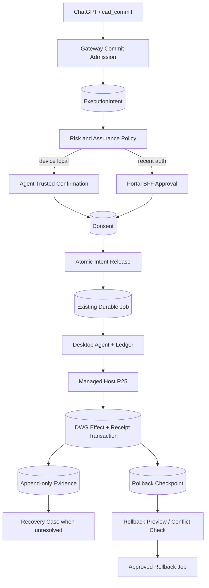

# Phase 7 — Durable Recovery, Trusted Approval and Conflict-Safe Rollback

> Trạng thái: kế hoạch triển khai chi tiết đã đối chiếu với Phase 6 trên `main`.
>
> Baseline đã xác minh: PR #10 merge tại commit
> `6edb9d9fb06b7e8565436b90e6891be80da0c7e0` ngày 2026-07-27.
>
> Phase 6 đạt **Engineering GO cho local integration** nhưng vẫn **Customer Pilot NO-GO**.
>
> Tài liệu nguồn:
>
> - fastmcp-multi-user-autocad-plan.md
> - Phase-6-plus.md
> - Phase-6.md
> - phase6-public-cad-program-evidence.md
> - appendix-user-interface.md
> - Phase-3.1.md

## 1. Executive summary

Phase 6 đã đưa create-only CAD Program lên public owner-scoped flow:

```text
Observe → Prepare → Preview → Commit → Validate
```

Baseline thật hiện có:

- `cad.program/0.2` strict với bảy create-only operations;
- public tools `cad_prepare_program`, `cad_preview`, `cad_commit`, `cad_validate`;
- exact Gateway-owned preview/receipt/validation identifiers;
- Managed .NET R25 transaction preview/abort và commit;
- effect và durable DWG receipt trong cùng AutoCAD transaction;
- duplicate commit trả receipt cũ, không tạo effect thứ hai;
- `outcome_unknown` giữ write lock và chỉ được giải phóng bằng exact receipt reconciliation;
- Agent restart chỉ resume trạng thái chưa bắt đầu;
- Portal Phase 6 chỉ quan sát, không có approval mutation;
- write mặc định tắt, LT write vẫn tắt.

Phase 7 **không xây lại** các nền móng trên. Phase 7 bổ sung C2 control envelope quanh commit và rollback:

```text
ChatGPT calls existing cad_commit
→ Gateway creates/reuses immutable execution intent
→ policy determines required assurance
→ trusted Agent or Portal approves exact intent
→ Gateway atomically consumes consent and creates one durable commit job
→ existing Agent/Host path executes with append-only evidence
→ existing receipt reconciliation proves success or opens recovery case
→ a Phase-7 checkpoint can be previewed and rolled back only when conflict-free
```

Không thành phần nào được suy đoán success chỉ vì AutoCAD đang mở, document revision đổi, entity count đổi hoặc WSS reconnect. Authoritative success vẫn là exact Host receipt bound với execution digest.

## 2. Kết luận rà soát kế hoạch cũ

Hướng kiến trúc cũ vẫn đúng, nhưng các điểm sau phải sửa để khớp code Phase 6:

| Điểm cũ | Kết luận sau Phase 6 | Điều chỉnh Phase 7 |
|---|---|---|
| Xem `outcome_unknown` và receipt reconcile như năng lực mới | Phase 6 đã triển khai lock retention và exact terminal reconciliation | Phase 7 chỉ mở rộng thành operator-facing recovery case và fault-injection matrix |
| Identity gate yêu cầu intent/consent/checkpoint/recovery đã owner-filtered | Đây là record chưa tồn tại trước Phase 7, tạo dependency vòng tròn | Owner filtering của record mới là deliverable và exit gate của Phase 7 |
| Agent local approval và Portal recent-auth là dependency | Hai presenter này chính là implementation scope Phase 7 | Chỉ identity/pairing/session boundary hiện có là dependency |
| Milestone `effect_committed` rồi `receipt_committed` | Host Phase 6 ghi effect và receipt trong cùng transaction | Không mô hình hóa durable state “effect-only”; terminal Host evidence là `effect_and_receipt_committed` |
| Tạo tool mới `cad_request_commit` | `cad_commit` đã là public contract Phase 6 | Giữ tên `cad_commit`, mở rộng output theo intent/approval/job state |
| Phase 6 receipt mặc nhiên đủ cho rollback | Receipt v2 có handle/type/layer/bounds nhưng chưa có geometry fingerprint/provenance đủ mạnh | Chỉ commit mới có Phase-7 checkpoint mới được rollback; receipt cũ mặc định không eligible |
| `released` và `consumed` cùng nằm trong Consent state | Ranh giới atomic không rõ | `released` thuộc ExecutionIntent; Consent chỉ có one-time `consumed` |
| Intent bind WSS session | Session reconnect là ephemeral và không nên tự làm mất approval | Bind stable device identity generation/key; decision vẫn phải đến từ current authenticated session |

## 3. Định nghĩa C2

Trong dự án này, C2 là create-only write path đầu tiên có:

1. public CAD Program v0 đã có từ Phase 6;
2. immutable execution intent trước effect-bearing job;
3. trusted approval ngoài model theo policy;
4. one-time consent consumption và one-job release;
5. append-only execution evidence, không tạo state machine thứ hai;
6. single-effect semantics trong tested fault model nhờ transaction + durable receipt;
7. operator recovery cho unresolved `outcome_unknown`;
8. create-only rollback checkpoint, preview, approval, conflict detection và receipt;
9. hard pause, revoke và kill switches xuyên intent/consent/job/recovery lifecycle.

C2 không tuyên bố “exactly-once delivery” trên mạng. Mục tiêu là **at-most-one CAD effect trong tested model**, với retry/idempotency dựa trên immutable binding và durable receipt.

C2 không có nghĩa là broad modify/delete/pattern, mọi AutoCAD release, production scale, AutoCAD LT write hoặc arbitrary code.

## 4. Baseline đã xác minh

### 4.1. Gateway và public contract

Đã có trong:

- `services/gateway/src/autocad_gateway/program_services.py`;
- `services/gateway/src/autocad_gateway/application/job_service.py`;
- `services/gateway/src/autocad_gateway/infrastructure/sqlite/program_repository.py`;
- `services/gateway/src/autocad_gateway/infrastructure/sqlite/migrations/0005_phase6_programs.sql`;
- `services/gateway/src/autocad_gateway/app.py`;
- `services/gateway/src/autocad_gateway/contracts.py`.

Confirmed behavior:

- prepare không dispatch;
- preview/commit/validate tạo durable job;
- preview, runtime, package, capability, registry và policy được pin;
- one write lock per device/document;
- request wait timeout tách khỏi durable job deadline;
- conflicting idempotency bị chặn;
- commit `outcome_unknown` không bị deadline sweep biến thành retryable failure;
- exact receipt reconciliation mới giải phóng retained write lock.

### 4.2. Desktop Agent

Đã có trong:

- `apps/desktop_agent/src/autocad_desktop_agent/program_executor.py`;
- `apps/desktop_agent/src/autocad_desktop_agent/ledger.py`;
- `apps/desktop_agent/src/autocad_desktop_agent/runtime/broker.py`;
- `apps/desktop_agent/src/autocad_desktop_agent/core.py`;
- `apps/desktop_agent/src/autocad_desktop_agent/ui/window.py`.

Confirmed behavior:

- typed Program command;
- exact payload/binding/deadline validation;
- RuntimeBroker selects Managed .NET R25 without write fallback;
- local write lock và hard pause;
- durable ledger;
- safe resume only before Host execution starts;
- started commit không blind retry.

### 4.3. Managed Host R25

Đã có trong:

- `native/autocad_managed_host/src/AutocadMcp.Host.Core/CadProgramV02.cs`;
- `native/autocad_managed_host/src/AutocadMcp.Host.R25/CadProgramHostOperations.cs`;
- `native/autocad_managed_host/src/AutocadMcp.Host.R25/AutoCadProgramOperations.cs`;
- `native/autocad_managed_host/src/AutocadMcp.Host.R25/DrawingProgramLedger.cs`.

Confirmed behavior:

- preview transaction abort;
- create-only commit trong một database transaction;
- durable receipt XRecord và created entities commit cùng transaction;
- receipt lookup sau Host/Agent restart và DWG reopen;
- exact duplicate trả receipt cũ;
- receipt v2 chứa created entity handle, type, layer và bounds.

### 4.4. Portal

Phase 6 Portal có owner-scoped pages cho program, preview, job, receipt và validation. Nó không có approval hoặc rollback mutation. Phase 7 phải mở rộng trên BFF/Gateway boundary hiện có, không để browser tự gửi trusted owner/risk/binding.

## 5. Start gates và external gates

### 5.1. Engineering start gates — đã đạt

- Phase 6 merge trên `main`;
- strict cross-language contract và digest tests xanh;
- public prepare/preview/commit/validate owner-scoped;
- live Mechanical 2025 preview no-effect và commit single-effect;
- durable DWG receipt;
- stale environment invalidation;
- write lock/hard pause;
- unknown commit retained và exact receipt reconciliation;
- LT/read regression xanh;
- Portal observation-only safety boundary.

### 5.2. External customer-pilot gates — vẫn còn

Các gate sau không chặn Phase 7 engineering, nhưng chặn Customer Pilot GO:

- CA-issued code-signing certificate và trusted timestamp;
- private-key custody, malware scan, SBOM và build provenance approval;
- authenticated public Gateway OAuth lifecycle trên pilot tenant;
- live revoke/re-pair drill;
- pilot-device modal/busy và unknown-outcome reconciliation drill;
- telemetry soak 3–7 ngày;
- support ownership và explicit pilot cohort approval.

### 5.3. Không được coi là dependency

Các mục sau là deliverable của Phase 7, không phải precondition:

- owner filtering cho intent/consent/checkpoint/recovery records;
- Agent local confirmation;
- Portal recent-auth approval;
- rollback checkpoint/preview/commit;
- RecoveryCase UI và operator workflow.

## 6. Mục tiêu

1. Tách admission, approval, job creation, execution, effect và outcome.
2. Model/public MCP caller không thể approve, giảm assurance hoặc tự tạo approval proof.
3. Exact retry của `cad_commit` trả cùng intent/consent/job/receipt theo binding.
4. Một intent release tối đa một commit job.
5. Consent required được consume cùng transaction với job creation.
6. Giữ existing durable job state machine làm source of truth.
7. Mở rộng evidence/reconcile mà không tạo đường re-execute mới.
8. Biến unresolved `outcome_unknown` thành durable owner-scoped recovery case.
9. Productize rollback create-only cho **Phase-7 checkpoints mới**, không giả định receipt cũ đủ an toàn.
10. Giữ Managed .NET R25 là C2 write path duy nhất; LT write vẫn off.

## 7. Non-goals

- broad modify/delete/purge/move/copy/pattern/block editing;
- arbitrary code/command/path/plugin;
- rollback cho mọi receipt Phase 6 cũ;
- tự động xóa layer;
- organization/team ownership;
- billing;
- skill/workflow orchestration;
- Scene Graph;
- full installer/update ecosystem;
- multi-worker/PostgreSQL migration;
- semantic conflict auto-merge;
- generic AutoCAD Undo as rollback guarantee;
- silent runtime fallback;
- manual mark-success để che unknown outcome;
- customer production scale.

## 8. Kiến trúc delta



Ranh giới:

- FastMCP/public tool chỉ tạo hoặc đọc domain state;
- Gateway domain quyết định intent, assurance, consent và release;
- existing job service tiếp tục dispatch/reconcile;
- Agent UI là trusted presenter, không phải policy engine;
- Portal BFF là trusted presenter dùng authenticated browser session;
- Host là authority cho transaction, receipt, checkpoint query và rollback execution.

## 9. Execution intent

### 9.1. Không thêm approval vào Job state machine

Không thêm `awaiting_approval` vào `jobs.state`.

Effect-bearing `program_commit` job chỉ tồn tại sau khi intent được release. Deny/expiry/invalidation không tạo Agent command và không chiếm document write lock lâu dài.

### 9.2. Intent fields

`ExecutionIntentRecord` tối thiểu bind:

- `intent_id`, owner và actor principal;
- action `program_commit` hoặc `rollback_commit`;
- device ID và stable device identity generation/key thumbprint;
- document ID và expected revision;
- program ID/revision/digest;
- preview ID/digest/execution digest/expiry;
- deterministic receipt ID và commit execution digest;
- runtime/Host/Agent package pins;
- capability/registry/policy pins;
- risk class và required assurance;
- trusted effect summary derived server-side;
- intent digest, created/expiry timestamps;
- nullable consent ID và released job ID.

Không bind approval vào ephemeral WSS session ID. Normal reconnect không tự làm mất consent nếu stable device identity và mọi immutable pin còn nguyên. Re-pair, key rotation hoặc ownership change phải invalidate.

### 9.3. Intent states

```text
awaiting_approval
ready
released
denied
expired
invalidated
cancelled
```

- `ready`: policy không yêu cầu consent hoặc consent đã approved;
- `released`: exact job đã được tạo/reused và `job_id` được bind;
- terminal denial states không được quay lại `ready`.

### 9.4. Existing `cad_commit` behavior

Không tạo `cad_request_commit` mới.

`cad_commit` tiếp tục là public tool và thực hiện:

1. owner-check preview;
2. revalidate exact Phase 6 binding;
3. create/reuse immutable intent by idempotency key + request hash;
4. calculate assurance;
5. return one of:
   - `approval_required` + intent/consent resource;
   - `released` + job resource;
   - current nonterminal job state;
   - existing receipt for exact duplicate;
   - denial/invalidation error.

Output mở rộng additive; không đổi nghĩa `receipt_id` hoặc `job_id` đã có.

Phase 6 direct-commit behavior chỉ được giữ trong explicit lab compatibility profile. Nó không được quảng cáo là C2 hoặc customer-pilot path.

## 10. Consent và trusted approval

### 10.1. Consent states

```text
requested
approved
denied
expired
invalidated
consumed
```

`released` không phải Consent state. Nó là Intent state sau job creation.

`approved` là authorization decision chưa dùng. `consumed` là one-time state đã được dùng để release exact intent.

### 10.2. Assurance levels

- `none`: chỉ explicit Phase 6 local lab compatibility, không phải C2;
- `device_local_confirmation`: local operator trên paired device;
- `user_recent_auth`: authenticated Portal session với recent-auth;
- `user_recent_auth_plus_device_local`: deferred; chỉ thêm khi threat model chứng minh cần hai người/bề mặt.

Phase 7 chỉ có create-only commit và create-only rollback:

- create-only commit: policy có thể yêu cầu local confirmation hoặc recent-auth;
- rollback: destructive floor, recent-auth mặc định;
- lab rollback local-only chỉ được phép bằng explicit test policy và entity budget nhỏ.

Final assurance là mức nghiêm ngặt nhất của operation floor, deployment profile, owner policy, device policy và computed risk. UI/model không thể hạ mức.

### 10.3. Agent local confirmation

Gateway gửi bounded `approval_request` tới **current authenticated session của exact device**. Request chứa intent/consent IDs, intent digest, challenge nonce, expiry và trusted summary.

Agent UI:

- render server-derived fields;
- không render model narrative như trusted fact;
- approve/deny qua Agent Core;
- decision bind device key/session proof, consent ID, intent digest, nonce, decision và timestamp;
- không gọi Host hoặc execute operation.

Gateway từ chối decision từ old/replaced session, wrong device, wrong nonce, expired consent hoặc mismatched intent digest.

### 10.4. Portal approval

Portal mutation đi qua BFF/Gateway API:

- principal lấy từ authenticated session;
- CSRF và origin checks;
- recent-auth enforced server-side;
- owner không lấy từ browser body;
- risk/assurance không lấy từ browser body;
- immutable intent details được đọc lại từ Gateway trước decision;
- exact intent digest và consent version dùng optimistic concurrency.

### 10.5. Atomic release

Live runtime/document revalidation có thể xảy ra trước SQLite transaction; Agent và Host vẫn revalidate lần cuối trước effect.

Trong một Gateway transaction/CAS:

1. load owner-scoped intent và consent;
2. require intent `ready` hoặc consent `approved`;
3. require not expired/invalidated and exact stored binding unchanged;
4. CAS consent `approved → consumed` khi required;
5. create/reuse one `program_commit` job với existing idempotency semantics;
6. acquire existing per-document write lock;
7. set intent `released` + exact `job_id`;
8. append audit/evidence event;
9. commit.

Nếu connection/runtime thay đổi sau preflight, Agent/Host fail closed. Không rollback consent về `approved` để release job khác; same intent/job được retry/reconciled.

## 11. Evidence model

### 11.1. Giữ một state machine

`jobs.state` từ Phase 3.1/6 vẫn là lifecycle authority. `execution_evidence_events` là append-only audit/recovery evidence, không phải state machine song song.

### 11.2. Authoritative order

1. Managed Host durable receipt/checkpoint bound exact execution digest trong DWG;
2. Agent durable ledger bound Host evidence;
3. Gateway durable job/result/materialized receipt.

Intermediate milestone chỉ phục vụ diagnostics và reconcile. Nó không tự chứng minh success.

### 11.3. Host milestones

Vì effect và receipt commit cùng transaction, không persist durable state `effect_committed` trước `receipt_committed`.

Milestones tối thiểu:

```text
host_admitted
transaction_opened
transaction_aborted
or
effect_and_receipt_committed
result_serialized
```

Nếu process/pipe fail trước transaction commit, expected outcome là no effect + no receipt. Nếu fail sau commit, receipt phải tồn tại dù result bị mất.

### 11.4. Agent/Gateway evidence

Map additively lên ledger/state hiện có:

```text
received
accepted
host_dispatch_started
host_result_received
terminal_persisted
gateway_result_acknowledged
```

Evidence event có:

- source `gateway|agent|host`;
- monotonic source sequence;
- job/command/intent IDs;
- payload/execution/receipt digest khi applicable;
- bounded typed payload;
- source timestamp và Gateway received timestamp;
- unique constraint `(job_id, source, source_sequence)`.

Duplicate exact event là idempotent. Conflicting duplicate là `needs_attention`.

## 12. Fault/drop matrix

Phase 7 mở rộng Phase 6 recovery, không giả định mọi drop point là một durable state khác nhau.

Test tối thiểu:

1. trước intent creation;
2. sau intent creation trước consent;
3. approval response mất trước Gateway persist;
4. sau consent approved trước release;
5. release transaction race giữa hai callers;
6. sau job creation trước Gateway dispatch;
7. sau dispatch trước Agent receive;
8. sau Agent receive trước ACK;
9. sau ACK trước Host dispatch;
10. sau Host admission trước transaction open;
11. exception/crash trong transaction trước commit;
12. ngay sau transaction commit trước Host result;
13. sau Host result trước Agent terminal persist;
14. sau Agent persist trước Gateway result;
15. sau Gateway result/materialization trước client response;
16. WSS replacement/revoke tại pending approval, queued, started và unknown states.

Expected semantics:

- pre-transaction proven `not_started` có thể release/requeue **same job** theo existing state machine;
- transaction failure trước commit tạo no effect và no receipt;
- receipt proves success even when Host/Agent/Gateway result is lost;
- started without receipt proof remains `outcome_unknown`;
- no new commit job may be created from same consumed consent;
- exact client retry returns existing intent/job/result/receipt;
- conflicting retry fails before dispatch;
- no tested path produces a second CAD effect.

## 13. Reconcile và recovery case

### 13.1. Existing reconcile remains primary

Phase 6 đã có reconnect descriptor, Agent ledger evidence và exact receipt materialization. Phase 7 extends descriptors with intent/consent/evidence IDs; it does not add re-execution.

Agent recovery:

- inspect local ledger;
- query Host receipt/checkpoint by exact receipt/execution digest;
- never call preview/commit during reconcile;
- return bounded source-attributed evidence.

Host recovery query:

- read-only;
- validate exact document identity;
- lookup receipt/checkpoint;
- return `not_found`, `committed`, `rolled_back`, `conflict` or malformed-ledger error;
- never mutate drawing.

### 13.2. Reconcile outcomes

| Evidence | Gateway action |
|---|---|
| Proven not-started | Resume/requeue same job if deadline/policy permits |
| Exact commit receipt | Materialize success idempotently and release write lock |
| Proven transaction abort/no effect | Fail/cancel safely and release lock |
| Started but inconclusive | Keep `outcome_unknown` and open/update recovery case |
| Evidence digest/source conflict | `needs_attention`, freeze automatic recovery |
| Exact rollback receipt | Materialize rolled-back terminal state idempotently |

### 13.3. RecoveryCaseRecord

Create automatically when:

- bounded reconcile attempts remain inconclusive;
- required document is closed/unavailable;
- evidence conflicts;
- deadline has passed but exact commit outcome is still unknown;
- operator intervention is needed.

Record contains:

- owner-scoped immutable execution binding;
- intent/consent/job/receipt references;
- ordered evidence timeline;
- missing evidence and latest query result;
- current device/document/runtime/package state;
- safe actions;
- resolution version/CAS;
- operator notes and audit.

Safe actions:

- retry exact evidence query;
- ask user to reopen exact DWG;
- collect redacted diagnostics;
- materialize success only from exact Host receipt;
- mark unresolved/needs-support.

Prohibited:

- re-run original write;
- manual mark-success without receipt;
- generic Undo;
- releasing retained lock merely to hide alert;
- deleting history.

## 14. Checkpoint và rollback v0

### 14.1. Receipt v2 is not automatically rollback-safe

Phase 6 receipt v2 records handles, types, layers and bounds. Bounds alone do not prove an entity is unchanged, and layer names do not prove the layer was created by this program.

Therefore:

- existing Phase 6 receipts remain valid execution evidence;
- existing receipts default to `rollback_eligible=false`;
- Phase 7 must not fabricate checkpoint provenance retroactively;
- only commits produced with a Phase-7 checkpoint record are publicly rollbackable.

### 14.2. Checkpoint contract

Add a separate versioned `cad.rollback.checkpoint/1` record committed in the same AutoCAD transaction as the create-only effect and receipt.

Checkpoint binds:

- original receipt/program/preview/execution digests;
- exact document ID and revision before/after;
- each created entity handle, type, layer, canonical geometry/properties fingerprint;
- whether any non-entity object was created;
- runtime/package/registry/policy;
- checkpoint digest/version.

Phase 7 v0 does **not** remove layers, styles, blocks or other shared objects. Even if `ensure_layer` created a layer, rollback removes only created entities. Shared-object cleanup is deferred until provenance/dependency rules are stronger.

### 14.3. Rollback lifecycle

```text
receipt/checkpoint inspect
→ cad_preview_rollback
→ Host read-only entity/fingerprint/dependency check
→ immutable rollback plan + conflict report
→ trusted approval
→ cad_commit_rollback
→ Host erase transaction + rollback receipt
→ rollback validation
```

### 14.4. Strict conflict policy

Rollback v0 fails closed when:

- checkpoint absent/unsupported;
- document identity differs;
- current document revision differs from checkpoint revision-after;
- any created entity is missing;
- entity type/layer/geometry fingerprint differs;
- dependency/reference safety cannot be proven;
- runtime/package/registry/policy cannot execute exact rollback;
- rollback plan expired or digest changed;
- original commit or checkpoint evidence mismatches.

Exact revision equality intentionally rejects unrelated later drawing edits. Scoped rebase/conflict relaxation belongs to Phase 8, not Phase 7.

### 14.5. Rollback execution

Rollback payload is generated server/Host-side from checkpoint evidence. Model/browser cannot supply arbitrary handles or erase list.

Host:

- rechecks exact checkpoint and current fingerprints;
- opens one transaction;
- erases only checkpoint-owned created entities;
- writes rollback receipt in same transaction;
- exact duplicate returns existing rollback receipt;
- conflicting duplicate fails closed.

Rollback receipt binds original receipt, checkpoint, rollback plan/execution digest, removed entity evidence and revision before/after.

## 15. Public surface delta

Existing public tools remain:

```text
cad_prepare_program
cad_preview
cad_commit
cad_validate
cad_get_job
```

Phase 7 additions:

```text
cad_preview_rollback
cad_commit_rollback
```

Behavior changes/additions:

- `cad_commit` may return `approval_required` with intent/consent resources and no job yet;
- repeated `cad_commit` returns current intent/job/receipt;
- `cad_get_job` includes bounded evidence summary and recovery link;
- rollback tools only accept receipt/checkpoint identifiers, never raw entity lists;
- no public approval tool.

Resources:

```text
cad://intents/{intent_id}
cad://consents/{consent_id}
cad://jobs/{job_id}
cad://evidence/{job_id}
cad://recovery/{case_id}
cad://checkpoints/{checkpoint_id}
cad://rollbacks/{rollback_id}
cad://rollback-receipts/{receipt_id}
```

All resources are owner-scoped, bounded and return `not_found` on cross-owner access.

## 16. Storage và transaction boundaries

Add migration:

```text
services/gateway/src/autocad_gateway/infrastructure/sqlite/migrations/
0006_phase7_approval_recovery_rollback.sql
```

Records:

- `execution_intents`;
- `consents`;
- `execution_evidence_events`;
- `recovery_cases`;
- `rollback_checkpoints`;
- `rollback_plans`;
- `rollback_receipts`.

Required constraints:

- immutable intent digest;
- one consent per required-assurance intent version;
- one released job per intent;
- one checkpoint per original commit receipt;
- one rollback plan digest per checkpoint/current revision;
- one rollback effect/receipt per rollback plan;
- evidence event source sequence uniqueness;
- owner key on every public lookup;
- additive foreign keys to Phase 6 program/preview/job/receipt records.

Atomic units:

1. consent consume + job create/reuse + intent release + write-lock acquisition;
2. terminal job result + receipt/checkpoint materialization + evidence event;
3. recovery case resolution CAS;
4. rollback terminal result + rollback receipt materialization.

External socket/Host calls must not run inside SQLite transactions.

## 17. Protocol delta

### 17.1. Gateway–Agent `cad.agent/2`

Additive typed messages/capabilities:

- approval request/decision control messages;
- intent/consent IDs and intent digest in commit command evidence;
- extended reconcile descriptors/results;
- rollback preview/commit/validate command kinds;
- checkpoint/rollback receipt evidence;
- bounded evidence sequence acknowledgments.

No arbitrary generic action envelope.

### 17.2. Agent–Host `cad.host/1`

Add explicit registry operations:

- receipt/checkpoint read-only lookup;
- rollback preview/conflict query;
- rollback commit;
- rollback validation.

Approval is not sent to Host as a user-controlled boolean. Host receives a Gateway-generated execution binding proving the released intent/consent decision and still revalidates runtime/document/checkpoint.

### 17.3. Capability negotiation

Capability manifest advertises separately:

- `cad.approval.device_local/1`;
- `cad.recovery.receipt_query/1`;
- `cad.rollback.checkpoint/1`;
- `cad.rollback.preview/1`;
- `cad.rollback.commit/1`.

Missing capability returns `capability_missing`; no fallback to generic Undo, COM or AutoLISP write.

## 18. UI

### 18.1. Desktop Agent

Add:

- pending trusted confirmation count;
- exact trusted summary;
- approval expiry and assurance;
- approve/deny local only when policy permits;
- intent/consent/job/evidence timeline;
- outcome unknown recovery link;
- rollback eligibility/conflict status;
- support/correlation ID.

Hard pause:

- invalidates or blocks unreleased intents according to policy;
- blocks new Host admission;
- does not claim an already committed effect was cancelled;
- keeps started/unknown job visible for recovery.

### 18.2. Portal

Add owner-scoped pages/actions for:

- immutable intent;
- consent state and assurance;
- recent-auth approve/deny;
- activity/evidence timeline;
- recovery case;
- rollback checkpoint/preview/conflict/receipt.

Portal must show old Phase 6 receipts as “Rollback unavailable: no Phase-7 checkpoint” rather than offering a risky action.

### 18.3. ChatGPT UX

ChatGPT must distinguish:

```text
prepared
previewed
waiting for trusted approval
released/queued
executing
committed
validated
outcome unknown
rollback previewed
rolled back
```

ChatGPT never says it approved, never asks the user to type “confirm” into chat as security approval and never suggests retrying an unknown write.

## 19. Security invariants

- no MCP approval tool;
- no `confirm=true` or model-issued approval token;
- server-derived owner, risk, assurance, effect summary and binding;
- CSRF/origin/recent-auth on Portal mutations;
- local decision bound current authenticated device session and stable device identity;
- one-time consent nonce and consume;
- expiry/replay/CAS race tests;
- cross-owner access returns `not_found`;
- re-pair/key rotation/revoke invalidates pending approval;
- document/runtime/package/capability/registry/policy change blocks release/effect;
- no token/private key/pipe secret in UI/logs;
- no arbitrary rollback entity list;
- rollback only from Host-committed checkpoint;
- evidence/recovery history append-only or versioned, never overwritten silently.

## 20. Feature flags và rollout

```text
AUTOCAD_MCP_PHASE7_C2_ENABLED=0
AUTOCAD_MCP_TRUSTED_APPROVAL_ENABLED=0
AUTOCAD_MCP_DEVICE_LOCAL_APPROVAL_ENABLED=0
AUTOCAD_MCP_PORTAL_RECENT_AUTH_APPROVAL_ENABLED=0
AUTOCAD_MCP_PUBLIC_ROLLBACK_ENABLED=0
AUTOCAD_MCP_RECOVERY_CASES_ENABLED=0
AUTOCAD_MCP_PHASE6_DIRECT_COMMIT_LAB_ENABLED=0
```

Rules:

- all default off;
- Phase 6 read/public resources remain available independently;
- direct commit lab flag requires existing managed-write allowlist and must be rejected in production/C2 profile;
- approval presenter switches do not bypass assurance floor;
- rollback has separate kill switch;
- recovery records remain readable after effect-bearing features are disabled;
- LT write remains false.

## 21. Implementation slices

Không gom toàn Phase 7 thành một PR lớn.

### Slice 1 — Contracts, migration and domain states

- intent/consent/checkpoint/rollback/recovery schemas;
- migration `0006`;
- repositories, owner filtering, CAS/idempotency tests;
- no public/UI mutation yet.

### Slice 2 — Gateway commit admission

- extend existing `cad_commit` output;
- intent creation/reuse;
- assurance policy;
- atomic consent consume/job release;
- resources and FastMCP snapshots;
- Phase 6 direct lab compatibility flag.

### Slice 3 — Agent local approval

- typed approval request/decision;
- device/session proof;
- Agent Core/UI;
- replay/replacement/revoke tests.

### Slice 4 — Portal recent-auth approval

- BFF endpoints;
- CSRF/origin/recent-auth;
- immutable detail/approve/deny pages;
- owner IDOR and browser contract tests.

### Slice 5 — Evidence and recovery

- append-only evidence events;
- reconcile extension;
- automatic RecoveryCase lifecycle;
- operator UI and diagnostics;
- no re-execution path.

### Slice 6 — Host checkpoint and rollback

- checkpoint v1 written with new commits;
- rollback preview/conflict query;
- rollback transaction + receipt + validation;
- public rollback tools/resources;
- old receipt ineligibility.

### Slice 7 — Fault injection, live evidence and release review

- full automated fault matrix;
- Mechanical 2025 live drills;
- revoke/re-pair and unknown-outcome drill;
- docs/evidence/runbook;
- Engineering and Customer Pilot GO/NO-GO separated.

Each slice must keep Phase 0–6 regression green and be independently disableable.

## 22. Test matrix

### 22.1. Domain/storage

- immutable intent and digest;
- exact/conflicting idempotency;
- consent expiry/deny/invalidation;
- approval consume race;
- one intent/consent → one job;
- owner isolation;
- intent release transaction rollback;
- append-only evidence uniqueness;
- recovery resolution CAS;
- checkpoint/rollback unique constraints.

### 22.2. Gateway/public contract

- existing Phase 6 output compatibility;
- `cad_commit` approval-required/released/existing receipt variants;
- no job before required approval;
- exact retry returns same records;
- stale preview/document/runtime/policy invalidates release;
- no public approval tool in snapshots;
- rollback tools reject raw entity payloads and old receipts.

### 22.3. Agent/protocol

- current vs replaced session approval;
- wrong device/key/nonce/digest/expiry;
- local hard pause during pending, released and started states;
- restart before/after decision;
- exact/conflicting duplicate evidence;
- recovery query never executes operation.

### 22.4. Managed Host

- checkpoint committed with effect/receipt;
- transaction exception leaves no effect/receipt/checkpoint;
- checkpoint survives reload/reopen;
- rollback preview clean/conflict;
- entity changed/deleted/dependency/unknown-type conflict;
- strict revision mismatch;
- rollback commit and receipt same transaction;
- duplicate rollback no second effect;
- no layer deletion;
- no generic Undo/arbitrary handles.

### 22.5. Portal

- recent-auth required;
- CSRF/origin/session mismatch;
- cross-owner direct URL/mutation;
- approval expiry/replay/version conflict;
- no trusted rendering of model text;
- old receipt shows rollback unavailable;
- unknown outcome has no retry-write action.

### 22.6. Regression

- Phase 0–6 Gateway/contract/Agent/Host suites;
- FastMCP tool/resource snapshots;
- identity/pairing and replacement session;
- LT read compatibility;
- telemetry fail-open;
- packaging rollback;
- Portal Phase 6 observation pages.

## 23. Live acceptance on Mechanical 2025

1. Prepare/preview a create-only program.
2. `cad_commit` creates intent and returns `approval_required` under C2 test policy.
3. Chat/model retry returns same intent and cannot approve.
4. Approve through Agent local presenter; exactly one job is released.
5. Repeat with Portal recent-auth presenter.
6. Run fault injections before transaction, inside transaction before commit and after transaction commit.
7. Verify drawing changes at most once.
8. Lose Host/Agent/Gateway result and recover exact receipt.
9. Force unresolved started case and verify retained lock + RecoveryCase, no retry.
10. Reopen exact DWG and resolve from Host receipt query.
11. Create a new Phase-7 checkpointed commit.
12. Preview rollback, approve, commit and validate removal.
13. Duplicate rollback returns same receipt without second effect.
14. Modify/delete a checkpoint entity and verify fail-closed conflict.
15. Make unrelated drawing edit and verify strict revision conflict.
16. Verify old Phase 6 receipt cannot be publicly rolled back.
17. Revoke/re-pair during pending approval and verify invalidation + old session rejection.
18. Hard pause during queued/started states and verify truthful outcome handling.

## 24. GO/NO-GO

### 24.1. Engineering GO

GO when:

- all Phase 7 automated suites and Phase 0–6 regression are green;
- model cannot approve or lower assurance;
- consent consume and one-job release are atomic;
- fault matrix produces no duplicate effect;
- exact outcome is proved or remains safely unknown;
- recovery case is owner-scoped and non-destructive;
- checkpointed rollback is conflict-aware, strict and idempotent;
- old receipts are not falsely advertised as rollbackable;
- hard pause/revoke/kill switches behave correctly across lifecycle;
- live Mechanical 2025 evidence is complete.

### 24.2. Customer Pilot GO

Ngoài Engineering GO, cần hoàn tất toàn bộ external gates ở section 5.2, production config review, support/runbook ownership và explicit pilot cohort approval.

### 24.3. NO-GO

NO-GO nếu bất kỳ điều nào xảy ra:

- started write có thể tạo job/effect thứ hai;
- success được suy đoán không có exact receipt;
- consent có thể replay/self-issue hoặc dùng cho intent khác;
- old/replaced device session approve được;
- rollback dùng generic Undo, raw model handles hoặc xóa layer/shared object không có provenance;
- effect có thể commit mà receipt/checkpoint không cùng transaction;
- recovery history bị overwrite hoặc unknown lock bị giải phóng tùy tiện;
- public/C2 profile còn bypass direct commit ngoài explicit lab flag.

## 25. Rollback của Phase 7 rollout

- disable Phase 7 C2, approval presenters và public rollback;
- preserve intents/consents/evidence/recovery/checkpoint/rollback records;
- disable direct Phase 6 lab commit outside controlled lab;
- return production profile to read-only if recovery semantics regress;
- do not delete or auto-resolve unknown cases;
- retain Phase 6 observation/program/preview/receipt resources;
- keep LT compatibility unchanged;
- package rollback follows existing signed/previous-known-good process.

## 26. Definition of Done

Phase 7 hoàn tất khi existing Phase 6 create-only path được bọc bằng immutable intent và trusted approval không thể do model giả mạo; consent chỉ release một durable job; tested network/process failures không tạo duplicate CAD effect; exact receipt reconciliation hoặc durable RecoveryCase xử lý mọi outcome không rõ; và chỉ commit mới có Phase-7 checkpoint mới được rollback bằng preview, strict conflict checks, trusted approval và idempotent rollback receipt.