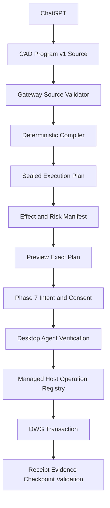

# Phase 8 — CAD Program v1, Effect Model and Cross-Runtime Capability

> Trạng thái: kế hoạch kiến trúc và triển khai đã rà soát lại sau khi PR #11 merge vào `main`.
>
> Baseline repository: merge commit `1faa28cbaccba646715b8007ed191df28f1ddda4` ngày 2026-07-28.
>
> Phase 7 đã merge implementation cho intent, trusted approval, evidence, recovery và create-only rollback. Automated suites trong PR #11 xanh, nhưng live AutoCAD Mechanical 2025 acceptance của Phase 7 chưa được chạy trong PR và security scan đã được chủ động bỏ qua. Vì vậy Phase 8 được phép bắt đầu contract/compiler work, nhưng chưa được coi Phase 7 đã đạt đầy đủ Engineering GO theo chính exit gate trong `Phase-7.md`.
>
> Phase 8 giữ public MCP surface nhỏ, Managed .NET R25 là write baseline đầu tiên, AutoCAD LT write tiếp tục tắt, và ezdxf chỉ là headless/offline path không có quyền chứng minh live DWG commit.

## 1. Executive summary

Hướng chính của kế hoạch Phase 8 cũ vẫn đúng:

- mở CAD Program mạnh hơn thay vì tạo hàng trăm public primitive tools;
- dùng Managed .NET làm primary runtime cho AutoCAD Full;
- dùng capability negotiation và conformance evidence thay vì hứa parity giả giữa .NET, LT và ezdxf;
- giữ preview, trusted approval, recovery, receipt và rollback làm safety envelope.

Tuy nhiên kế hoạch cũ có hai giả định quá mạnh cần sửa.

Thứ nhất, Phase 7 rollback hiện chỉ bảo vệ create-only commit bằng `cad.rollback.checkpoint/1`: checkpoint lưu các entity đã tạo, còn rollback xóa đúng các entity đó khi fingerprint và document revision còn khớp. Cơ chế này không thể tự động khôi phục entity đã move, rotate, trim, fillet, chamfer hoặc erase. Phase 8 không được mở modify/delete chỉ vì Phase 7 đã có rollback.

Thứ hai, high-level CAD Program v1 có variables, expressions và repeat không nên được Gateway, Agent và Host tự diễn giải độc lập sau approval. Cách an toàn hơn là:

```text
ChatGPT
→ CAD Program v1 source
→ Gateway validates and compiles
→ immutable sealed execution plan
→ preview of that exact plan
→ Phase 7 intent and trusted approval bind the exact plan digest
→ Agent and Host verify, but do not reinterpret the source
→ exact operation registry executes
→ receipt, evidence, checkpoint and validation
```

Phase 8 vì vậy được tổ chức quanh bốn nền tảng:

1. versioned source contract và deterministic compiler;
2. sealed low-level execution plan và effect manifest;
3. operation classes có rollback strategy rõ ràng;
4. capability/conformance theo operation pack, runtime family, entity type và support state.

Cross-runtime trong Phase 8 có nghĩa là **một contract và capability model có thể biểu đạt đúng sự khác nhau giữa runtime**, không có nghĩa mọi runtime phải làm được mọi operation.

## 2. Kết luận rà soát kế hoạch cũ

| Điểm trong kế hoạch cũ | Kết luận sau Phase 7 | Điều chỉnh bắt buộc cho Phase 8 |
|---|---|---|
| Baseline chỉ ghi “sau Phase 6 và Phase 7 đạt exit gate” | PR #11 đã merge code và automated tests, nhưng chưa chạy live Phase 7 Mechanical 2025 acceptance | Tách start gate cho contract/compiler khỏi live rollout gate cho effect-bearing operations |
| “Reuse Phase 7 rollback” cho broad modify/delete | `cad.rollback.checkpoint/1` chỉ chứa `created_entities`; rollback chỉ erase entity do checkpoint sở hữu | Thêm effect model và checkpoint/restore strategy v2 trước khi mở in-place modify hoặc delete |
| CAD Program v1 được mô tả như một payload chạy trực tiếp | Multiple high-level evaluators làm tăng nguy cơ digest drift và approval mismatch | Tách immutable source program khỏi sealed expanded execution plan |
| Move/copy/rotate/scale/mirror cùng một nhóm | Copy/pattern thường tạo entity mới; move/rotate/scale thường sửa entity hiện hữu | Rollout theo effect class, không rollout theo tên command AutoCAD |
| Offset/fillet/chamfer/trim/extend cùng một nhóm | Offset có thể là create-equivalent; trim/extend/fillet/chamfer thay đổi topology/entity hiện hữu | Create-equivalent được mở trước; topology-changing operations là conditional packs |
| Patch/rebase chỉ nói invalid preview/consent | Phase 7 intent, consent và job là immutable records | Cấm patch/rebase thay thế một released hoặc started execution; luôn tạo lineage mới |
| Capability tier chỉ theo runtime | Support thực tế còn phụ thuộc operation version, entity type, object ownership, release family và rollback strategy | Capability key và conformance evidence phải granular hơn tier name |
| Cross-runtime có thể bị hiểu là parity | Current write path trong `RuntimeBroker` chỉ nhận exact Managed .NET R25; LT write bị reject | R25 là first execution target; LT write certification và các release family khác là conditional, không phải implicit exit |
| Public MCP ghi chung chung “rollback tools” | Phase 7 đã có tên cụ thể `cad_preview_rollback` và `cad_commit_rollback` | Giữ đúng tool names hiện tại và không tạo primitive tool mới |

## 3. Baseline đã xác minh trên `main`

### 3.1. CAD Program v0.2

`packages/contracts/src/autocad_contracts/program.py` hiện có:

- strict `cad.program/0.2` và `cad.program/0.2` operation registry;
- tối đa 256 operations/entities, 4,096 vertices và payload/result/artifact budgets;
- bảy create-only operations:
  - `ensure_layer`;
  - `create_line`;
  - `create_circle`;
  - `create_polyline`;
  - `create_rectangle`;
  - `create_text`;
  - `create_dimension_linear`;
- exact document/snapshot/revision binding;
- prior-operation output reference mới chỉ dành cho layer;
- strict canonical digest và cross-language Host contract.

Phase 8 phải mở rộng từ contract thật này, không thiết kế lại từ một DSL giả định.

### 3.2. Public MCP surface

Phase 6/7 public tools hiện gồm:

- `cad_list_devices`;
- `cad_observe`;
- `cad_query`;
- `cad_get_job`;
- `cad_prepare_program`;
- `cad_preview`;
- `cad_commit`;
- `cad_validate`;
- `cad_preview_rollback` trong Phase 7 profile;
- `cad_commit_rollback` trong Phase 7 profile.

Phase 7 còn expose owner-scoped resources cho intent, consent, evidence, recovery, checkpoint, rollback plan và rollback receipt.

Approval không phải MCP tool. Browser/model không được gửi trusted owner, risk, entity handles hoặc approval proof.

### 3.3. Phase 7 guarantees và giới hạn

`packages/contracts/src/autocad_contracts/phase7.py` hiện định nghĩa:

- `cad.execution-intent/1`;
- `cad.consent/1`;
- `cad.execution-evidence/1`;
- `cad.recovery-case/1`;
- `cad.rollback.checkpoint/1`;
- `cad.rollback.plan/1`;
- `cad.rollback.receipt/1`.

Execution intent đã bind program, preview, execution digest, runtime pins, capability manifest hash, operation registry hash, policy version, risk và required assurance.

Rollback checkpoint v1 chỉ chứa:

- exact original receipt/program/preview/execution binding;
- document revision before/after;
- entity handle, type, layer và canonical fingerprint của entity đã tạo;
- `non_entity_object_created` marker;
- runtime/policy pins.

Nó không lưu pre-image để phục hồi entity bị sửa/xóa và không cho phép xóa layer/style/block/shared object.

### 3.4. Runtime baseline

`apps/desktop_agent/src/autocad_desktop_agent/runtime/broker.py` hiện:

- cho phép read fallback theo policy;
- không cho write fallback;
- reject LT write;
- yêu cầu exact `managed_dotnet`, role `primary`, Host family `R25` và AutoCAD Full 2025;
- kiểm tra package, capability manifest, registry version/hash và policy pins trước write.

Vì vậy Phase 8 first live target là Managed .NET R25. Contract vẫn runtime-neutral, nhưng support cho AutoCAD Full 2018–2024 phải được earned theo host-family/release evidence, không được suy ra từ R25.

### 3.5. Phase 7 status gate

PR #11 báo cáo automated validation:

- Contracts: 65 passed;
- Gateway: 234 passed;
- Desktop Agent: 130 passed;
- Managed Host Core: 49 passed;
- Managed Host R25 build: succeeded;
- Web Portal unit/component: 35 passed;
- Web Portal Playwright E2E: 10 passed;
- Web Portal production build: succeeded.

PR đồng thời ghi rõ:

- live AutoCAD Mechanical 2025 evidence với `drawing33.dwg` chưa chạy;
- Codex Security scan được bỏ qua theo yêu cầu chủ repository.

Điều này không chặn Phase 8 source contract/compiler work. Nó chặn việc tuyên bố Phase 7 full Engineering GO và chặn rollout Phase 8 modify/delete/destructive operation packs.

## 4. Mục tiêu Phase 8 đã sửa

1. Tạo strict `cad.program/1.0` source contract có versioning và bounded semantics.
2. Tạo deterministic Gateway compiler sinh `cad.execution-plan/1` fully resolved.
3. Bind Phase 7 intent/approval vào cả source digest và sealed execution plan digest.
4. Hỗ trợ typed variables, safe expression AST và bounded repeat/pattern.
5. Tạo explicit effect manifest cho từng operation và toàn program.
6. Mở create-equivalent operation packs trước khi mở in-place modify/delete.
7. Hỗ trợ immutable snapshot/query references và prior-operation entity outputs.
8. Tạo immutable program revision, patch và explicit rebase lifecycle.
9. Tạo checkpoint/restore strategy v2 trước khi enable operations sửa hoặc xóa entity hiện hữu.
10. Giữ public MCP tools ổn định; primitive và operation pack chỉ là internal capability.
11. Enforce granular capabilities tại Gateway, Agent và Host.
12. Xây conformance suite theo operation version, runtime family, entity type và support state.
13. Giữ Phase 0–7 read, identity, approval, recovery, receipt và rollback guarantees không regression.

## 5. Non-goals

- arbitrary AutoCAD command, AutoLISP, C#, DLL, shell, Python hoặc reflection;
- arbitrary file/path/network/environment access;
- generic scripting language;
- unbounded loop, recursion hoặc dynamic function lookup;
- full parametric constraint solver;
- automatic feature inference authority;
- broad topology-changing operation support ngay từ đầu;
- generic Undo làm durable rollback guarantee;
- dùng `cad.rollback.checkpoint/1` để giả vờ rollback được modify/delete;
- semantic auto-merge cho destructive program;
- parity giữa Managed .NET, LT và ezdxf;
- production support cho toàn bộ AutoCAD Full 2018–2025 trong cùng một phase;
- customer-supported LT write nếu chưa có real LT certification;
- skill/workflow platform;
- Scene Graph/feature inference;
- organization/team sharing, billing, marketplace hoặc arbitrary third-party plugin;
- production scale migration.

## 6. Kiến trúc source → compiler → sealed plan



### 6.1. CAD Program v1 source

Source program là immutable authoring representation. Nó có thể chứa:

- variables và typed values;
- safe expression AST;
- bounded repeat/pattern;
- source snapshot/query references;
- prior-operation output references;
- reusable component refs;
- preconditions/postconditions;
- requested validation profiles;
- declared budgets;
- required capabilities;
- program lineage.

Source program không phải payload được Host diễn giải trực tiếp.

### 6.2. Sealed execution plan

Gateway compiler phải resolve toàn bộ:

- variables;
- expressions;
- unit conversion;
- repeat/pattern expansion;
- reusable component expansion;
- query materialization;
- operation ordering;
- stable output IDs;
- exact target references;
- operation/entity/vertex/text budgets;
- effect counts;
- required operation registry entries;
- risk floor;
- rollback/checkpoint strategy.

`cad.execution-plan/1` tối thiểu bind:

- source program ID/revision/schema/digest;
- compiler ID/version/hash;
- concrete ordered operations;
- exact materialized entity refs;
- expansion digest;
- effect manifest digest;
- runtime/package/capability/registry/policy pins;
- estimated and hard budgets;
- validation profile refs;
- checkpoint strategy;
- execution plan digest.

Sau preview, Agent và Host chỉ verify plan, pins, budgets và digest. Chúng không được re-expand repeat, re-evaluate source expressions hoặc chọn runtime khác.

### 6.3. Numeric determinism

High-level helpers như polar coordinates và angle conversion phải được compiler resolve thành concrete finite coordinates trước preview.

Contract phải định nghĩa:

- canonical JSON number representation;
- finite bounds;
- unit normalization;
- angle convention;
- rounding/canonicalization rule;
- geometry tolerance cho validation;
- overflow, divide-by-zero và non-finite rejection.

Không dùng platform-specific transcendental evaluation trong Host nếu kết quả đó đã ảnh hưởng preview/approval digest.

## 7. Contract `cad.program/1.0`

### 7.1. Core fields

Source program gồm:

- `schema_version`;
- `program_id` và immutable `program_revision`;
- optional parent program/revision;
- source snapshot/document/revision;
- variables;
- statements/operations;
- preconditions/postconditions;
- budgets;
- required capability set;
- validation profile refs;
- optional component refs;
- source semantic digest.

Runtime/package/registry/policy binding tiếp tục do Gateway tạo, không cho model tự khai.

### 7.2. Safe expression AST

Allowed:

- finite numeric literals;
- typed variables;
- `+ - * /`;
- bounded `min`, `max`, `abs`;
- explicit unit conversion;
- angle conversion;
- point/vector construction;
- polar helper;
- immutable loop index in bounded repeat.

Forbidden:

- eval/reflection;
- string-to-code;
- dynamic function lookup;
- file/network/environment access;
- time/randomness;
- recursion;
- mutation of variables;
- data-dependent unbounded iteration.

AST depth, node count, literal magnitude và expanded result size đều có hard ceiling.

### 7.3. Repeat và pattern

- repeat count phải statically bounded sau compile;
- total expansion phải fit hard operation/entity budgets;
- no while loop;
- nested repeat mặc định depth 1; depth 2 chỉ khi tổng expansion vẫn bounded và có tests;
- compiler sinh stable expanded operation IDs;
- deterministic expansion digest;
- rectangular, linear và polar pattern trước;
- path pattern deferred tới khi path semantics và failure evidence đủ mạnh.

### 7.4. References

References chỉ được target:

- immutable owner-scoped snapshot;
- typed query result materialized trước prepare/compile;
- prior operation output trong cùng sealed plan;
- reusable component version/digest đã pin.

Raw AutoCAD handle/ObjectId không đủ. Materialized entity reference phải bind tối thiểu:

- owner;
- device/document;
- source snapshot ID;
- document revision;
- stable snapshot entity ID;
- expected entity type;
- canonical fingerprint;
- optional owning space/layer/dependency evidence.

Host mới được map stable ref sang current ObjectId/handle sau khi revalidate exact binding.

## 8. Effect model và operation rollout

Operation registry entry v1 phải khai báo tối thiểu:

- operation kind/version;
- effect class;
- accepted entity types;
- output type;
- create/modify/erase counts;
- risk floor;
- preview strategy;
- commit strategy;
- validation strategy;
- checkpoint/rollback strategy;
- runtime support state;
- capability key.

### 8.1. Class A — create-only hoặc create-equivalent

Có thể dùng Phase 7 checkpoint v1 nếu Host chứng minh toàn bộ output entity được checkpoint sở hữu:

- existing v0 operations;
- copy-as-new;
- linear/rectangular/polar pattern-as-new;
- offset-as-new với exact source ref;
- mirror-copy variant;
- insert allowlisted block reference;
- bounded text/mtext;
- additional dimensions/center marks/centerlines;
- leaders theo bounded template.

Rules:

- không sửa source entity;
- không xóa layer/style/block definition/shared object khi rollback;
- non-entity side effects phải được avoid, pre-exist hoặc có explicit unsupported marker;
- checkpoint phải fingerprint từng created entity;
- create-equivalent pack được rollout trước Class B/C/D.

### 8.2. Class B — exact in-place transforms

Bao gồm:

- move;
- rotate;
- scale;
- mirror-in-place nếu thực sự cần.

Không được enable chỉ với checkpoint v1. Mỗi supported entity type phải có:

- exact immutable target refs;
- before-state fingerprint;
- proven checkpoint/restore strategy v2;
- preview and commit parity;
- postcondition validation;
- duplicate/recovery behavior;
- live rollback evidence.

Ưu tiên line, circle và lightweight polyline 2D trước. Custom/vertical objects fail `capability_missing`.

### 8.3. Class C — topology-changing modification

Bao gồm:

- fillet;
- chamfer;
- trim;
- extend;
- join;
- explode.

Đây là conditional operation packs, không phải minimum Phase 8 exit.

Mỗi operation cần semantics riêng cho target/cutter, multiplicity, result mapping, before-image, dependency, tolerance và partial-failure behavior. Không dùng selection mơ hồ hoặc AutoCAD command-line heuristic.

### 8.4. Class D — erase/delete

- exact materialized refs only;
- explicit maximum entity count;
- no broad predicate executed at commit time;
- high/destructive risk floor;
- Phase 7 trusted approval bắt buộc;
- checkpoint/restore v2 bắt buộc cho từng supported object type;
- shared layer/style/block/dependency không bị xóa theo;
- purge vẫn deferred hoặc admin-only packaged workflow trong phase sau.

Delete không phải minimum Phase 8 core exit. Nó chỉ được enable khi destructive extension gate đạt.

## 9. Checkpoint và rollback v2

### 9.1. Backward compatibility

`cad.rollback.checkpoint/1`, plan v1 và receipt v1 tiếp tục immutable cho create-only Phase 7 records.

Không rewrite hoặc reinterpret old checkpoint.

### 9.2. Mục tiêu checkpoint v2

Checkpoint v2 dành cho operations làm thay đổi hoặc xóa entity hiện hữu. Nó phải có operation-specific restore evidence, không chỉ inverse command chung chung.

Candidate fields:

- original entity stable ref;
- exact pre-effect canonical fingerprint;
- allowlisted pre-image/restore descriptor;
- entity type và owning space;
- layer/style/block/dependency refs;
- source and target document revisions;
- operation-specific transform/topology metadata;
- runtime/package/registry/policy/compiler pins;
- bounded restore budget;
- restore strategy version;
- checkpoint digest.

Không cho model gửi raw restore payload, raw handles hoặc arbitrary serialized object.

### 9.3. Restore strategies

Allowed only after Host POC and evidence:

- erase created entity;
- restore allowlisted pre-image;
- replace exact entity from bounded Host-generated descriptor;
- operation-specific inverse only khi được chứng minh không drift và không làm mất metadata.

Generic AutoCAD Undo không phải durable rollback contract.

Nếu một entity/object type không có restore strategy đủ mạnh, operation đó không được commit-enable.

### 9.4. Scoped rollback revalidation

Program rebase và rollback revalidation là hai việc khác nhau.

Phase 7 rollback hiện yêu cầu exact current document revision. Phase 8 có thể POC scoped rollback revalidation sau unrelated edits chỉ khi:

- target fingerprints không đổi;
- dependencies không đổi;
- no conflicting operation touched target ownership;
- runtime/registry/policy pins còn hợp lệ;
- Host chứng minh conflict scope, không chỉ Gateway suy đoán.

Nếu evidence không đủ, tiếp tục strict revision conflict. Không auto-rebase destructive rollback.

## 10. Program revision, patch và rebase

### 10.1. Immutable revisions

Patch luôn tạo program revision mới. Không mutate revision cũ.

Patch có thể:

- add/remove/replace source statements;
- update variables;
- update validation profiles;
- update declared budgets trong policy ceiling;
- change component refs;
- change source snapshot refs chỉ qua explicit rebase.

### 10.2. In-flight rule

Không patch/rebase một execution đã `released`, `dispatched`, `acknowledged`, `running`, `outcome_unknown` hoặc terminal.

Nếu program cần sửa:

- giữ intent/consent/job/evidence cũ immutable;
- chờ exact outcome hoặc recovery state;
- tạo program revision mới;
- compile plan mới;
- preview mới;
- tạo intent/consent mới nếu commit.

### 10.3. Invalidation cascade

Patch/rebase/compiler/registry/runtime/policy change phải tạo new plan digest và làm old preview không reusable.

Old intent/consent không bị xóa; chúng chuyển hoặc được đọc như expired/invalidated theo existing Phase 7 rules. Chúng không được dùng để release plan mới.

### 10.4. Rebase

Rebase so sánh old materialized refs với new snapshot:

- exact unchanged refs có thể carry forward;
- moved/changed/missing/type-changed refs tạo conflict report;
- no automatic semantic merge cho in-place modify/delete;
- model/user phải inspect conflict và tạo revision mới;
- compiler sinh source digest, plan digest và effect manifest mới.

## 11. Capability model

### 11.1. Tiers

| Tier | Meaning |
|---|---|
| `portable_core` | Equivalent semantics đã được chứng minh trên các runtime family được chỉ định |
| `managed_standard` | General AutoCAD Full Managed .NET capability trên host family đã chứng minh |
| `managed_advanced` | Release/vertical/object-specific Managed .NET capability |
| `lt_compat` | Packaged AutoLISP/File IPC compatibility capability có evidence |
| `headless_only` | DXF/offline/test capability, không chứng minh live DWG commit |
| `experimental` | Lab allowlist only |

### 11.2. Granular capability keys

Capability không chỉ là `managed_standard`. Ví dụ:

```text
cad.program.v1.compile
cad.program.v1.repeat.polar
cad.op.copy.line.v1
cad.op.move.circle.v1
cad.op.offset.lwpolyline.v1
cad.rollback.checkpoint.v2.line
cad.validation.geometry.basic.v1
```

Support claim phải bind:

- operation/version;
- entity/object type;
- runtime family/role;
- AutoCAD release family khi cần;
- preview support;
- commit support;
- rollback support;
- conformance evidence version.

### 11.3. Support states

Mỗi capability có state rõ:

- `unsupported`;
- `contract_only`;
- `preview_only`;
- `lab_commit`;
- `certified`.

Gateway chỉ release write khi server allowlist, signed package manifest, current Agent/Host evidence và cohort policy đều cho phép.

Agent self-report hoặc browser input không đủ để nâng capability.

### 11.4. Runtime rules

- first live write target: Managed .NET R25 / AutoCAD Mechanical 2025;
- read fallback có thể giữ policy hiện tại;
- no write fallback after preview;
- LT write tiếp tục off cho tới operation-by-operation real LT certification;
- ezdxf result luôn non-authoritative cho live DWG commit;
- support AutoCAD Full 2018–2024 cần host-family adapter, build/load test và live smoke riêng.

## 12. Public MCP contract

Giữ tool set hiện tại:

- `cad_list_devices`;
- `cad_observe`;
- `cad_query`;
- `cad_get_job`;
- `cad_prepare_program`;
- `cad_preview`;
- `cad_commit`;
- `cad_validate`;
- `cad_preview_rollback`;
- `cad_commit_rollback`.

Không thêm `cad_move`, `cad_rotate`, `cad_trim`, `cad_delete`, v.v.

`cad_prepare_program` được version theo input contract và có thể nhận một trong:

- full v1 source payload;
- bounded source artifact reference;
- explicit patch request against an immutable owner-scoped revision;
- explicit rebase request against a new snapshot.

Không biến `cad_prepare_program` thành mega-tool chứa runtime-specific knobs. Runtime, registry, compiler, policy và risk pins do Gateway quyết định.

Large source/plan/conflict/conformance artifacts dùng owner-scoped resource references thay vì trả toàn bộ trong tool result.

Approval vẫn không phải MCP tool và không có `confirm=true` bypass.

## 13. Storage và lineage

Additive owner-scoped records/fields:

- source program schema version;
- source program revision lineage;
- source semantic digest;
- compiler ID/version/hash;
- sealed execution plan và digest;
- expansion digest;
- effect manifest và digest;
- materialized query result sets;
- stable entity refs/fingerprints;
- component refs;
- patch/rebase lineage;
- conflict reports;
- validation profile refs/results;
- operation pack/version;
- capability support state/evidence;
- checkpoint v2/restore strategy records;
- operation-level receipt and validation evidence.

All program revisions, plans, previews, intents, consents, receipts, checkpoints và conformance records immutable hoặc append-only theo existing Phase 7 patterns.

## 14. Desktop Agent và Managed Host

### Agent

- capability-aware admission;
- verify source/plan/binding/compiler/registry digests;
- verify expansion and hard budgets match Gateway plan;
- per-document write serialization;
- current Phase 7 approval/evidence/recovery reuse;
- no source reinterpretation;
- no runtime fallback after preview;
- no operation outside current signed/allowlisted manifest.

### Host

- explicit typed operation registry;
- no reflection dispatch;
- no arbitrary command execution;
- fully concrete operation payloads;
- operation-specific preview/commit/validate/checkpoint/restore handlers;
- object-type allowlist;
- bounded evidence/result payloads;
- registry hash/version;
- stable entity-ref resolution and fingerprint revalidation;
- atomic effect, receipt and checkpoint materialization where applicable.

## 15. Validation profiles

Validation profile là versioned allowlisted contract, không phải arbitrary script.

Phase 8 nên có tối thiểu:

- `geometry.basic/1`: expected create/modify/erase counts, finite bounds, entity type;
- `document.revision/1`: exact document binding;
- `layer.exists/1`;
- `entity.fingerprint/1`;
- `transform.result/1` cho supported transforms;
- `rollback.eligibility/1`.

Profile version và digest được pin vào plan, preview, intent, receipt và validation result khi có ảnh hưởng safety.

## 16. UI

ChatGPT vẫn là primary authoring interface.

Agent/Portal show bounded trusted summaries:

- source program version/revision;
- compiler và sealed plan version;
- source digest và plan digest rút gọn;
- operation pack/version;
- estimated vs hard operation/entity counts;
- exact create/modify/erase counts;
- target entity types/count;
- required vs available capabilities;
- risk và assurance requirement;
- checkpoint/rollback strategy;
- unsupported operations;
- patch/rebase conflicts;
- exact preview invalidation reason.

UI không cho ordinary user force runtime, capability, risk, owner, entity handles hoặc rollback payload.

## 17. Feature flags

Phase 8 flags phải additive và default-off:

```text
AUTOCAD_MCP_PROGRAM_V1_SOURCE_ENABLED=0
AUTOCAD_MCP_PROGRAM_V1_COMPILER_ENABLED=0
AUTOCAD_MCP_PROGRAM_V1_CREATE_PACK_ENABLED=0
AUTOCAD_MCP_PROGRAM_V1_TRANSFORM_PACK_ENABLED=0
AUTOCAD_MCP_PROGRAM_V1_TOPOLOGY_PACK_ENABLED=0
AUTOCAD_MCP_PROGRAM_V1_DELETE_PACK_ENABLED=0
AUTOCAD_MCP_CHECKPOINT_V2_ENABLED=0
AUTOCAD_MCP_SCOPED_ROLLBACK_REVALIDATION_ENABLED=0
AUTOCAD_MCP_LT_PORTABLE_WRITE_ENABLED=0
AUTOCAD_MCP_OPERATION_PACK_ALLOWLIST=
```

Effect-bearing Phase 8 commit còn yêu cầu Phase 7 C2/trusted approval flags thích hợp. Không tạo bypass mới cho direct v1 commit.

Rollout theo operation pack + runtime family + entity type + cohort, không chỉ một global “managed standard” switch.

## 18. Delivery slices

### Slice 8.0 — Baseline closure và contract freeze

- rerun Phase 0–7 automated regression trên merge commit;
- hoàn tất hoặc ghi rõ waiver cho Phase 7 live Mechanical 2025 acceptance;
- giữ Customer Pilot gates tách khỏi engineering work;
- snapshot current public Phase 7 tools/resources;
- freeze checkpoint v1 backward compatibility;
- viết decision records cho compiler boundary và effect classes.

Contract/compiler work có thể bắt đầu khi automated baseline xanh. Modify/delete rollout không được qua gate nếu Phase 7 live evidence chưa hoàn tất.

### Slice 8.1 — Source contract, compiler và sealed plan

- `cad.program/1.0` source models/schema;
- strict safe AST;
- variables/unit normalization;
- no-op and compile-only evaluator;
- `cad.execution-plan/1`;
- source/compiler/plan digests;
- effect manifest;
- Python canonical tests và C# plan verification/golden vectors;
- no AutoCAD write.

### Slice 8.2 — Create-equivalent operation pack trên R25

- linear/rectangular/polar pattern-as-new;
- copy-as-new;
- offset-as-new cho allowlisted 2D types;
- mirror-copy nếu semantics đủ rõ;
- block insert/attributes theo allowlist;
- selected annotation operations;
- Phase 7 checkpoint v1 reuse chỉ cho created entities;
- live preview/commit/receipt/rollback evidence.

### Slice 8.3 — Snapshot refs, patch và rebase

- typed query materialization;
- stable entity refs;
- prior entity output refs;
- immutable patch lineage;
- explicit rebase/conflict reports;
- in-flight protection;
- old preview/intent/consent invalidation tests.

### Slice 8.4 — Checkpoint v2 POC

- Host-generated before-image/restore descriptor POC;
- line/circle/LWPolyline only;
- checkpoint/plan/receipt v2 contracts;
- restore atomicity and duplicate semantics;
- failure/drop matrix;
- no public modify enablement until POC exit.

### Slice 8.5 — Exact transform pack

- move/rotate/scale for allowlisted entity types;
- mirror-in-place only if needed and proven;
- checkpoint v2 required;
- exact refs, preview parity, validation and rollback;
- Phase 7 intent/approval/recovery reused with new plan/effect pins;
- live R25 evidence.

### Slice 8.6 — Conditional destructive/topology packs

Operation-by-operation only:

- delete exact small set;
- fillet/chamfer;
- trim/extend;
- join/explode only after separate review.

Each pack needs dedicated contract, risk floor, restore strategy, conformance fixtures, fault matrix, live evidence and explicit GO/NO-GO. These packs không phải minimum Phase 8 core exit.

### Slice 8.7 — Cross-runtime conformance

- ezdxf compile/headless fixtures where semantics fit;
- LT compatibility manifest and negative tests;
- optional real LT certification for selected create-equivalent operations;
- additional Managed Host family spikes only when environment available;
- no parity claims without evidence.

Mỗi slice independently disableable và giữ v0.2 create-only path hoạt động.

## 19. Test matrix

### 19.1. Source/compiler

- strict schema and extra-field rejection;
- AST depth/node/literal limits;
- divide-by-zero/non-finite/overflow rejection;
- canonical units/angles/numbers;
- deterministic repeat expansion;
- stable expanded IDs;
- source/compiler/plan digest vectors;
- malicious expression/path/code rejection;
- compiler version change invalidates old preview.

### 19.2. Effect manifest và budgets

- exact create/modify/erase counts;
- expansion estimate equals sealed plan;
- budget overflow before dispatch;
- Agent/Host reject plan count mismatch;
- operation registry and capability mismatch;
- unsupported entity/object type fails closed.

### 19.3. References/patch/rebase

- owner/device/document/snapshot isolation;
- stale fingerprint/revision;
- missing/type-changed/moved refs;
- forward output refs rejection;
- immutable lineage;
- patch/rebase cannot mutate released execution;
- old preview/intent/consent cannot release new plan.

### 19.4. Create-equivalent operations

- pattern geometry and stable output mapping;
- copy/offset/mirror-copy semantics;
- block/attribute allowlist;
- annotation/style refs;
- checkpoint v1 owns every created entity;
- rollback never deletes shared non-entity objects.

### 19.5. Checkpoint v2 và transforms

- pre-image fidelity;
- restore descriptor bounds;
- dependency capture;
- target changed/deleted/replaced conflicts;
- preview/commit/rollback parity;
- duplicate commit/rollback no second effect;
- crash before/inside/after transaction;
- exact receipt/checkpoint atomicity;
- no generic Undo fallback.

### 19.6. Destructive/topology

- exact target/cutter semantics;
- broad selection rejection;
- risk and assurance floor;
- partial topology failure leaves no partial commit;
- restore after delete/trim/fillet failure cases;
- custom/vertical object rejection;
- shared dependencies preserved.

### 19.7. Phase 7 recovery regression

For every new effect class:

- no job before required approval;
- model/browser cannot approve or lower assurance;
- exact retry returns same intent/job/receipt;
- started write never blind retry;
- unknown outcome retains lock and creates/reuses RecoveryCase;
- exact Host receipt proves success;
- recovery query never re-executes;
- registry/runtime/compiler change invalidates preview/consent;
- revoke/re-pair and hard pause remain fail-closed.

### 19.8. Cross-runtime

- portable fixtures by operation/version/entity type/runtime family;
- normalized geometry within declared tolerance;
- same invalid-input category;
- unsupported case returns `capability_missing`;
- ezdxf marked non-authoritative;
- LT write remains off unless exact pack certified;
- no silent approximation or fallback.

## 20. Start gates

### 20.1. Contract/compiler start gate

GO when:

- PR #11 merge baseline is present;
- Phase 0–7 automated regression is green;
- current schema/golden snapshots are regenerated and clean;
- compiler/effect model ADR is accepted;
- no effect-bearing Phase 8 flag is enabled.

PR #11 hiện đã cung cấp phần lớn automated evidence cho gate này.

### 20.2. Create-equivalent live rollout gate

GO when:

- Phase 7 live approval/recovery/rollback acceptance đã hoàn tất hoặc có explicit engineering waiver;
- exact plan preview and approval binding verified;
- new created outputs generate eligible checkpoint v1 evidence;
- full drop/idempotency matrix green;
- live R25 preview/commit/rollback evidence complete.

### 20.3. Modify/delete rollout gate

GO only when:

- checkpoint v2 contract và Host implementation hoàn tất;
- every enabled entity type has restore evidence;
- failure after effect cannot lose both receipt and checkpoint;
- rollback is conflict-aware and idempotent;
- Phase 7 C2 cannot be bypassed;
- live R25 fault/rollback drills complete;
- independent security review covers restore payload and destructive target binding.

### 20.4. Customer Pilot gate

Ngoài Phase 8 engineering exit, vẫn cần toàn bộ external production gates từ Phase 5–7: CA signing, provenance/SBOM/malware approval, public OAuth lifecycle, revoke/re-pair drill, telemetry soak, support ownership và explicit cohort approval.

## 21. Exit criteria

### 21.1. Phase 8 core Engineering GO

- strict `cad.program/1.0` source contract;
- deterministic compiler và strict `cad.execution-plan/1`;
- source, compiler, expanded plan và effect digests có golden parity;
- variables/expressions/repeat bounded và deterministic;
- preview, intent và approval bind exact sealed plan;
- at least one create-equivalent operation pack chạy live trên Mechanical 2025 R25;
- snapshot/query refs và immutable patch/rebase lifecycle hoạt động;
- at least one exact in-place transform pack trên allowlisted 2D entity types có checkpoint v2, validation và rollback evidence;
- no new public primitive tool;
- unsupported operation/entity/runtime fails `capability_missing`;
- Phase 7 approval/recovery/single-effect guarantees không regression;
- v0.2 create-only path và LT read compatibility không regression;
- arbitrary code/path/command remains impossible.

### 21.2. Destructive extension GO

Delete/trim/fillet/chamfer chỉ được quảng cáo khi operation pack tương ứng đạt riêng:

- exact target semantics;
- checkpoint v2 restore evidence;
- trusted approval floor;
- atomic commit/receipt/checkpoint;
- conflict-safe rollback;
- full automated fault matrix;
- live R25 acceptance;
- explicit security review.

Không đạt extension gate không làm Phase 8 core thất bại; pack tiếp tục disabled/deferred.

### 21.3. Cross-runtime claim gate

Portable claim chỉ được công bố cho exact operation/version/entity type/runtime family đã có conformance evidence. LT certification là conditional milestone, không phải implicit core exit.

## 22. NO-GO conditions

NO-GO nếu bất kỳ điều nào xảy ra:

- Host hoặc Agent re-evaluate high-level source sau preview/approval;
- approval bind source digest nhưng không bind exact sealed execution plan/effect digest;
- compiler output không deterministic;
- expanded plan vượt budget sau dispatch;
- in-place modify/delete dùng checkpoint v1 create-only làm rollback guarantee;
- raw model/browser handles hoặc restore payload trở thành destructive authority;
- released/started execution bị patch hoặc rebase tại chỗ;
- runtime/registry/compiler change nhưng old preview/consent vẫn dùng được;
- write silently fallback sang LT/AutoLISP hoặc runtime khác;
- capability self-report đủ để enable write mà không có server allowlist/package evidence;
- topology operation có thể partial-commit;
- effect có thể commit mà receipt/checkpoint không atomic theo required strategy;
- recovery path có thể re-execute started write;
- public MCP nổ thành tool-per-primitive;
- arbitrary code/path/command được đưa trở lại.

## 23. Rollback của Phase 8 rollout

- disable Phase 8 operation packs và compiler flags;
- retain v1 source, plan, intent, consent, evidence, receipt, checkpoint và conformance records cho audit;
- invalidate outstanding v1 previews/consents khi compiler/registry/pack bị disable;
- keep `cad.program/0.2` create-only public path;
- không downgrade-execute v1 source như v0.2;
- keep Phase 7 rollback v1 behavior unchanged;
- disable checkpoint v2/modify packs independently;
- return affected cohort to create-only hoặc read-only khi registry/restore safety không chắc chắn;
- LT compatibility/read path unchanged.

## 24. Definition of Done

Phase 8 hoàn tất khi ChatGPT có thể tạo một CAD Program v1 có variables, expressions, bounded patterns và immutable references; Gateway compile nó thành exact sealed execution plan; preview và Phase 7 trusted approval bind đúng plan/effect digest; create-equivalent operations và ít nhất một exact transform pack chạy trên Managed .NET R25 với deterministic receipt, recovery, validation và operation-appropriate rollback evidence; public MCP surface vẫn nhỏ; unsupported runtime/entity fail closed; và mọi cross-runtime claim được chứng minh thay vì suy đoán.

Broad delete, trim, fillet, chamfer hoặc LT write chỉ được enable bằng operation-pack gate riêng. Chúng không được ép vào Phase 8 core bằng cách làm yếu Phase 7 safety guarantees.