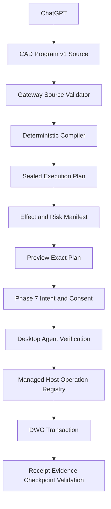

# Phase 8 — CAD Program v1, Effect Model and Cross-Runtime Capability

> Trạng thái: kế hoạch kiến trúc và triển khai đã rà soát lại sau khi PR #11 merge vào `main`.
>
> Baseline Phase 7: implementation, automated suites và live AutoCAD Mechanical 2025 acceptance đã hoàn tất trước khi merge. Theo xác nhận của repository owner, live run đã phát hiện lỗi, các lỗi đã được sửa và retest thành công. PR #11 và tài liệu Phase 7 chưa ghi lại đầy đủ live evidence này; đó là khoản nợ tài liệu/evidence, không phải một engineering gate còn thiếu.
>
> Phase 7 đạt Engineering GO. Customer Pilot vẫn phụ thuộc các external production gates riêng như code signing, provenance, public OAuth lifecycle, telemetry soak, support ownership và explicit pilot cohort approval.
>
> Phase 8 giữ public MCP surface nhỏ, Managed .NET R25 là write baseline đầu tiên, AutoCAD LT write tiếp tục tắt, và ezdxf chỉ là headless/offline path không có quyền chứng minh live DWG commit.

## 1. Executive summary

Hướng chính của kế hoạch Phase 8 cũ vẫn đúng:

- mở CAD Program mạnh hơn thay vì tạo hàng trăm public primitive tools;
- dùng Managed .NET làm primary runtime cho AutoCAD Full;
- dùng capability negotiation và conformance evidence thay vì hứa parity giả giữa .NET, LT và ezdxf;
- giữ preview, trusted approval, recovery, receipt và rollback làm safety envelope.

Tuy nhiên kế hoạch cũ có hai giả định quá mạnh cần sửa.

Thứ nhất, Phase 7 rollback hiện chỉ bảo vệ create-only commit bằng `cad.rollback.checkpoint/1`: checkpoint lưu các entity đã tạo, còn rollback xóa đúng các entity đó khi fingerprint và document revision còn khớp. Cơ chế này không thể tự động khôi phục entity đã move, rotate, trim, fillet, chamfer hoặc erase. Phase 8 không được mở modify/delete chỉ vì Phase 7 đã có rollback.

Thứ hai, high-level CAD Program v1 có variables, expressions và repeat không nên được Gateway, Agent và Host tự diễn giải độc lập sau approval. Luồng an toàn hơn là:

```text
ChatGPT
→ CAD Program v1 source
→ Gateway validates and compiles
→ immutable sealed execution plan
→ preview of that exact plan
→ Phase 7 intent and trusted approval bind exact plan/effect digests
→ Agent and Host verify, but do not reinterpret the source
→ exact operation registry executes
→ receipt, evidence, checkpoint and validation
```

Phase 8 được tổ chức quanh bốn nền tảng:

1. versioned source contract và deterministic compiler;
2. sealed low-level execution plan và effect manifest;
3. operation classes có rollback strategy rõ ràng;
4. capability/conformance theo operation pack, runtime family, entity type và support state.

Cross-runtime trong Phase 8 có nghĩa là **một contract và capability model biểu đạt đúng sự khác nhau giữa runtime**, không có nghĩa mọi runtime phải làm được mọi operation.

## 2. Kết luận rà soát kế hoạch cũ

| Điểm trong kế hoạch cũ | Kết luận sau Phase 7 | Điều chỉnh bắt buộc cho Phase 8 |
|---|---|---|
| Baseline ghi chung chung “sau Phase 6 và Phase 7 đạt exit gate” | Phase 7 implementation, automated suites và live Mechanical 2025 acceptance đã hoàn tất; live evidence bị thiếu trong tài liệu PR | Ghi Phase 7 Engineering GO, đồng thời tạo backfill evidence task để giữ audit trail |
| “Reuse Phase 7 rollback” cho broad modify/delete | `cad.rollback.checkpoint/1` chỉ chứa `created_entities`; rollback chỉ erase entity do checkpoint sở hữu | Thêm effect model và checkpoint/restore strategy v2 trước khi mở in-place modify hoặc delete |
| CAD Program v1 được mô tả như payload chạy trực tiếp | Multiple high-level evaluators làm tăng nguy cơ digest drift và approval mismatch | Tách immutable source program khỏi sealed expanded execution plan |
| Move/copy/rotate/scale/mirror cùng một nhóm | Copy/pattern thường tạo entity mới; move/rotate/scale thường sửa entity hiện hữu | Rollout theo effect class, không rollout theo tên command AutoCAD |
| Offset/fillet/chamfer/trim/extend cùng một nhóm | Offset có thể là create-equivalent; trim/extend/fillet/chamfer thay đổi topology/entity hiện hữu | Create-equivalent mở trước; topology-changing operations là conditional packs |
| Patch/rebase chỉ nói invalid preview/consent | Phase 7 intent, consent và job là immutable records | Cấm patch/rebase thay thế released hoặc started execution; luôn tạo lineage mới |
| Capability tier chỉ theo runtime | Support thực tế còn phụ thuộc operation version, entity type, release family và rollback strategy | Capability key và conformance evidence phải granular hơn tier name |
| Cross-runtime có thể bị hiểu là parity | Current write path chỉ nhận exact Managed .NET R25; LT write bị reject | R25 là first execution target; LT và release family khác là conditional support |
| Public MCP ghi chung chung “rollback tools” | Phase 7 đã có `cad_preview_rollback` và `cad_commit_rollback` | Giữ đúng tool names hiện tại và không tạo primitive tool mới |

## 3. Baseline đã xác minh trên `main`

### 3.1. CAD Program v0.2

`packages/contracts/src/autocad_contracts/program.py` hiện có:

- strict `cad.program/0.2` và operation registry cùng version;
- tối đa 256 operations/entities, 4,096 vertices và bounded payload/result/artifact;
- bảy create-only operations:
  - `ensure_layer`;
  - `create_line`;
  - `create_circle`;
  - `create_polyline`;
  - `create_rectangle`;
  - `create_text`;
  - `create_dimension_linear`;
- exact document/snapshot/revision binding;
- prior-operation output reference hiện chỉ dành cho layer;
- strict canonical digest và cross-language Host contract.

Phase 8 phải mở rộng từ contract thật này, không thiết kế lại từ một DSL giả định.

### 3.2. Public MCP surface

Phase 6/7 public tools hiện gồm:

- `cad_list_devices`;
- `cad_observe`;
- `cad_query`;
- `cad_get_job`;
- `cad_prepare_program`;
- `cad_preview`;
- `cad_commit`;
- `cad_validate`;
- `cad_preview_rollback` trong Phase 7 profile;
- `cad_commit_rollback` trong Phase 7 profile.

Phase 7 còn expose owner-scoped resources cho intent, consent, evidence, recovery, checkpoint, rollback plan và rollback receipt.

Approval không phải MCP tool. Browser/model không được gửi trusted owner, risk, entity handles hoặc approval proof.

### 3.3. Phase 7 guarantees và giới hạn

Phase 7 hiện định nghĩa:

- `cad.execution-intent/1`;
- `cad.consent/1`;
- `cad.execution-evidence/1`;
- `cad.recovery-case/1`;
- `cad.rollback.checkpoint/1`;
- `cad.rollback.plan/1`;
- `cad.rollback.receipt/1`.

Execution intent bind program, preview, execution digest, runtime pins, capability manifest hash, operation registry hash, policy version, risk và required assurance.

Rollback checkpoint v1 chỉ chứa:

- exact original receipt/program/preview/execution binding;
- document revision before/after;
- entity handle, type, layer và canonical fingerprint của entity đã tạo;
- `non_entity_object_created` marker;
- runtime/policy pins.

Nó không lưu pre-image để phục hồi entity bị sửa/xóa và không cho phép xóa layer/style/block/shared object.

### 3.4. Runtime baseline

`RuntimeBroker` hiện:

- cho phép read fallback theo policy;
- không cho write fallback;
- reject LT write;
- yêu cầu exact `managed_dotnet`, role `primary`, Host family `R25` và AutoCAD Full 2025;
- kiểm tra package, capability manifest, registry version/hash và policy pins trước write.

Vì vậy Phase 8 first live target là Managed .NET R25. Contract vẫn runtime-neutral, nhưng support cho AutoCAD Full 2018–2024 phải được earned theo host-family/release evidence, không được suy ra từ R25.

### 3.5. Phase 7 status và evidence debt

PR #11 báo cáo automated validation:

- Contracts: 65 passed;
- Gateway: 234 passed;
- Desktop Agent: 130 passed;
- Managed Host Core: 49 passed;
- Managed Host R25 build: succeeded;
- Web Portal unit/component: 35 passed;
- Web Portal Playwright E2E: 10 passed;
- Web Portal production build: succeeded.

Theo xác nhận của repository owner, Phase 7 còn được chạy live trên AutoCAD Mechanical 2025 trước merge; lỗi tìm thấy trong live run đã được sửa và retest thành công.

Repository hiện thiếu tài liệu evidence tương ứng. Phase 8 phải tạo một backfill evidence record nêu tối thiểu:

- AutoCAD product/release và drawing fixture;
- flows đã chạy: approval, commit, evidence/recovery và rollback;
- lỗi đã phát hiện;
- commit chứa bản sửa;
- kết quả retest;
- operator/date/environment;
- phần evidence nào không còn tái tạo được.

Thiếu record này không hạ Phase 7 khỏi Engineering GO, nhưng phải được xử lý để audit trail và future regression baseline không phụ thuộc trí nhớ cá nhân.

## 4. Mục tiêu Phase 8

1. Tạo strict `cad.program/1.0` source contract có versioning và bounded semantics.
2. Tạo deterministic Gateway compiler sinh `cad.execution-plan/1` fully resolved.
3. Bind Phase 7 intent/approval vào source, sealed plan và effect digests.
4. Hỗ trợ typed variables, safe expression AST và bounded repeat/pattern.
5. Tạo explicit effect manifest cho từng operation và toàn program.
6. Mở create-equivalent operation packs trước in-place modify/delete.
7. Hỗ trợ immutable snapshot/query references và prior-operation entity outputs.
8. Tạo immutable program revision, patch và explicit rebase lifecycle.
9. Tạo checkpoint/restore strategy v2 trước khi enable operations sửa hoặc xóa entity hiện hữu.
10. Giữ public MCP tools ổn định; primitive và operation pack là internal capability.
11. Enforce granular capabilities tại Gateway, Agent và Host.
12. Xây conformance suite theo operation version, runtime family, entity type và support state.
13. Giữ Phase 0–7 read, identity, approval, recovery, receipt và rollback guarantees không regression.

## 5. Non-goals

- arbitrary AutoCAD command, AutoLISP, C#, DLL, shell, Python hoặc reflection;
- arbitrary file/path/network/environment access;
- generic scripting language;
- unbounded loop, recursion hoặc dynamic function lookup;
- full parametric constraint solver;
- automatic feature inference authority;
- broad topology-changing operation support ngay từ đầu;
- generic Undo làm durable rollback guarantee;
- dùng `cad.rollback.checkpoint/1` để giả vờ rollback được modify/delete;
- semantic auto-merge cho destructive program;
- parity giữa Managed .NET, LT và ezdxf;
- production support cho toàn bộ AutoCAD Full 2018–2025 trong cùng một phase;
- customer-supported LT write nếu chưa có real LT certification;
- skill/workflow platform;
- Scene Graph/feature inference;
- organization/team sharing, billing, marketplace hoặc arbitrary third-party plugin;
- production scale migration.

## 6. Kiến trúc source → compiler → sealed plan



### 6.1. CAD Program v1 source

Source program là immutable authoring representation. Nó có thể chứa variables, typed values, safe expression AST, bounded repeat/pattern, snapshot/query references, prior-operation outputs, reusable components, pre/postconditions, validation profiles, budgets, required capabilities và lineage.

Source program không phải payload được Host diễn giải trực tiếp.

### 6.2. Sealed execution plan

Gateway compiler phải resolve toàn bộ:

- variables, expressions và unit conversion;
- repeat/pattern/component expansion;
- query materialization;
- stable output IDs và exact target refs;
- operation/entity/vertex/text budgets;
- effect counts, risk floor và checkpoint strategy;
- required registry entries và validation profiles.

`cad.execution-plan/1` bind tối thiểu:

- source program ID/revision/schema/digest;
- compiler ID/version/hash;
- concrete ordered operations;
- exact materialized refs;
- expansion digest;
- effect manifest digest;
- runtime/package/capability/registry/policy pins;
- estimated and hard budgets;
- validation profile refs;
- checkpoint strategy;
- execution plan digest.

Sau preview, Agent và Host chỉ verify plan, pins, budgets và digests. Chúng không re-expand repeat, re-evaluate source expressions hoặc chọn runtime khác.

### 6.3. Numeric determinism

Compiler resolve high-level helpers thành concrete finite values trước preview. Contract phải định nghĩa canonical numbers, unit normalization, angle convention, rounding, tolerance, overflow, divide-by-zero và non-finite rejection.

Không dùng platform-specific evaluation trong Host nếu kết quả đã ảnh hưởng preview/approval digest.

## 7. Contract `cad.program/1.0`

### 7.1. Core fields

Source program gồm schema version, program/revision/parent lineage, source snapshot/document/revision, variables, operations, pre/postconditions, budgets, required capabilities, validation profiles, component refs và semantic digest.

Runtime/package/registry/policy binding do Gateway tạo, không cho model tự khai.

### 7.2. Safe expression AST

Allowed:

- finite literals và typed variables;
- `+ - * /`;
- bounded `min`, `max`, `abs`;
- unit/angle conversion;
- point/vector và polar helper;
- immutable loop index.

Forbidden:

- eval/reflection/string-to-code;
- dynamic lookup;
- file/network/environment/time/randomness;
- recursion hoặc variable mutation;
- data-dependent unbounded iteration.

AST depth, node count, literal magnitude và expanded result size có hard ceilings.

### 7.3. Repeat và pattern

- repeat count statically bounded sau compile;
- total expansion fit hard budgets;
- no while loop;
- nested repeat mặc định depth 1;
- stable expanded operation IDs và deterministic digest;
- linear, rectangular và polar pattern trước;
- path pattern deferred.

### 7.4. References

Reference chỉ target immutable owner-scoped snapshot, materialized typed query result, prior output trong sealed plan hoặc pinned component.

Raw handle/ObjectId không đủ. Stable entity ref bind owner, device, document, snapshot, revision, entity ID/type/fingerprint và optional dependency evidence. Host map sang current ObjectId/handle chỉ sau exact revalidation.

## 8. Effect model và operation rollout

Operation registry entry v1 khai operation/version, effect class, entity types, outputs, create/modify/erase counts, risk floor, preview/commit/validation/checkpoint strategy, runtime support state và capability key.

### 8.1. Class A — create-only hoặc create-equivalent

Có thể dùng Phase 7 checkpoint v1 nếu Host chứng minh toàn bộ output entity được checkpoint sở hữu:

- existing v0 operations;
- copy-as-new;
- linear/rectangular/polar pattern-as-new;
- offset-as-new;
- mirror-copy;
- allowlisted block insert/attributes;
- bounded annotation/dimensions/center marks/leaders.

Không sửa source entity và không rollback bằng cách xóa shared layer/style/block definition.

### 8.2. Class B — exact in-place transforms

Move, rotate, scale và optional mirror-in-place không được enable chỉ với checkpoint v1. Mỗi entity type cần exact refs, before fingerprint, checkpoint/restore v2, preview parity, validation, duplicate/recovery semantics và live rollback evidence.

Ưu tiên line, circle và lightweight polyline 2D. Custom/vertical objects fail `capability_missing`.

### 8.3. Class C — topology-changing modification

Fillet, chamfer, trim, extend, join và explode là conditional operation packs. Mỗi operation cần semantics riêng cho targets/cutters, result mapping, before-image, dependencies, tolerance và partial failure. Không dùng command-line heuristic hoặc selection mơ hồ.

### 8.4. Class D — erase/delete

- exact materialized refs only;
- explicit maximum count;
- no broad predicate at commit time;
- high/destructive risk floor;
- Phase 7 trusted approval bắt buộc;
- checkpoint/restore v2 cho từng object type;
- không xóa shared layer/style/block/dependency;
- purge deferred.

Delete không phải minimum Phase 8 core exit.

## 9. Checkpoint và rollback v2

### 9.1. Backward compatibility

`cad.rollback.checkpoint/1`, plan v1 và receipt v1 tiếp tục immutable cho create-only Phase 7 records. Không rewrite hoặc reinterpret old checkpoint.

### 9.2. Mục tiêu checkpoint v2

Checkpoint v2 dành cho modify/delete và chứa Host-generated operation-specific restore evidence, gồm stable ref, pre-effect fingerprint, bounded pre-image/restore descriptor, entity type/space, dependency refs, revisions, operation metadata, runtime/registry/policy/compiler pins, restore budget/version và digest.

Model/browser không được gửi raw restore payload hoặc raw handles.

### 9.3. Restore strategies

Chỉ cho phép sau Host POC và evidence:

- erase created entity;
- restore allowlisted pre-image;
- replace exact entity từ bounded Host descriptor;
- operation-specific inverse khi chứng minh không drift.

Generic AutoCAD Undo không phải durable rollback contract.

### 9.4. Scoped rollback revalidation

Scoped revalidation sau unrelated edits chỉ được POC khi target fingerprints/dependencies/pins không đổi và Host chứng minh conflict scope. Nếu evidence không đủ, tiếp tục strict revision conflict. Không auto-rebase destructive rollback.

## 10. Program revision, patch và rebase

Patch luôn tạo immutable revision mới. Không patch/rebase execution đã released, dispatched, running, outcome_unknown hoặc terminal.

Khi sửa program:

- giữ intent/consent/job/evidence cũ immutable;
- tạo source revision, plan, preview và intent/consent mới;
- compiler/registry/runtime/policy change làm old preview không reusable;
- rebase so sánh old refs với snapshot mới và trả conflict report;
- không semantic auto-merge cho in-place modify/delete.

## 11. Capability model

### 11.1. Tiers

| Tier | Meaning |
|---|---|
| `portable_core` | Equivalent semantics có evidence trên runtime families được chỉ định |
| `managed_standard` | AutoCAD Full Managed .NET capability trên host family đã chứng minh |
| `managed_advanced` | Release/vertical/object-specific Managed .NET capability |
| `lt_compat` | Packaged AutoLISP/File IPC capability có evidence |
| `headless_only` | DXF/offline/test, không chứng minh live DWG commit |
| `experimental` | Lab allowlist only |

### 11.2. Granular capability keys

Ví dụ:

```text
cad.program.v1.compile
cad.program.v1.repeat.polar
cad.op.copy.line.v1
cad.op.move.circle.v1
cad.op.offset.lwpolyline.v1
cad.rollback.checkpoint.v2.line
cad.validation.geometry.basic.v1
```

Support claim bind operation/version, entity type, runtime/release family, preview/commit/rollback support và evidence version.

### 11.3. Support states

- `unsupported`;
- `contract_only`;
- `preview_only`;
- `lab_commit`;
- `certified`.

Gateway chỉ release write khi server allowlist, signed package manifest, current Agent/Host evidence và cohort policy cùng cho phép. Agent self-report hoặc browser input không đủ để nâng capability.

### 11.4. Runtime rules

- first live write target: Managed .NET R25 / AutoCAD Mechanical 2025;
- read fallback giữ policy hiện tại;
- no write fallback after preview;
- LT write off tới khi operation-by-operation certification;
- ezdxf non-authoritative cho live DWG commit;
- AutoCAD Full 2018–2024 cần host-family adapter, build/load test và live smoke riêng.

## 12. Public MCP contract

Giữ tool set hiện tại, không thêm `cad_move`, `cad_rotate`, `cad_trim` hoặc `cad_delete`.

`cad_prepare_program` có thể nhận full v1 source, bounded artifact reference, explicit patch hoặc rebase request. Runtime-specific knobs, risk, owner và trusted binding vẫn do Gateway quyết định.

Large source/plan/conflict/conformance artifacts dùng owner-scoped resources. Approval không phải MCP tool và không có `confirm=true` bypass.

## 13. Storage và lineage

Additive owner-scoped records/fields:

- source program schema/revision/lineage/digest;
- compiler ID/version/hash;
- sealed plan, expansion và effect digests;
- materialized query refs và fingerprints;
- component refs;
- patch/rebase conflict reports;
- validation profiles/results;
- operation pack/version;
- capability state/evidence;
- checkpoint v2/restore records;
- operation-level receipt/validation evidence.

Tất cả revisions, plans, previews, intents, consents, receipts, checkpoints và conformance records immutable hoặc append-only theo Phase 7 patterns.

## 14. Desktop Agent và Managed Host

Agent:

- capability-aware admission;
- verify source/plan/compiler/registry/binding digests;
- verify expansion và hard budgets;
- per-document write serialization;
- reuse Phase 7 approval/evidence/recovery;
- no source reinterpretation hoặc write fallback;
- no operation ngoài signed/allowlisted manifest.

Host:

- explicit typed operation registry;
- no reflection/arbitrary commands;
- concrete operation payloads;
- operation-specific preview/commit/validate/checkpoint/restore;
- object-type allowlist;
- bounded evidence/results;
- stable ref resolution và fingerprint revalidation;
- atomic effect, receipt và checkpoint materialization.

## 15. Validation profiles

Tối thiểu:

- `geometry.basic/1`;
- `document.revision/1`;
- `layer.exists/1`;
- `entity.fingerprint/1`;
- `transform.result/1`;
- `rollback.eligibility/1`.

Profile version/digest được pin vào plan, preview, intent, receipt và validation result khi ảnh hưởng safety.

## 16. UI

Agent/Portal hiển thị bounded trusted summaries: source/plan/compiler versions, digests rút gọn, operation packs, estimated/hard counts, create/modify/erase counts, target types, capabilities, risk/assurance, checkpoint strategy, conflicts và preview invalidation reason.

UI không cho ordinary user force runtime, capability, risk, owner, raw handles hoặc rollback payload.

## 17. Feature flags

```text
AUTOCAD_MCP_PROGRAM_V1_SOURCE_ENABLED=0
AUTOCAD_MCP_PROGRAM_V1_COMPILER_ENABLED=0
AUTOCAD_MCP_PROGRAM_V1_CREATE_PACK_ENABLED=0
AUTOCAD_MCP_PROGRAM_V1_TRANSFORM_PACK_ENABLED=0
AUTOCAD_MCP_PROGRAM_V1_TOPOLOGY_PACK_ENABLED=0
AUTOCAD_MCP_PROGRAM_V1_DELETE_PACK_ENABLED=0
AUTOCAD_MCP_CHECKPOINT_V2_ENABLED=0
AUTOCAD_MCP_SCOPED_ROLLBACK_REVALIDATION_ENABLED=0
AUTOCAD_MCP_LT_PORTABLE_WRITE_ENABLED=0
AUTOCAD_MCP_OPERATION_PACK_ALLOWLIST=
```

Flags additive, default-off và rollout theo operation pack + runtime family + entity type + cohort. Phase 8 effect-bearing commit vẫn yêu cầu Phase 7 C2/trusted approval; không tạo direct v1 bypass.

## 18. Delivery slices

### Slice 8.0 — Baseline evidence backfill và contract freeze

- rerun Phase 0–7 automated regression trên merge commit;
- backfill Phase 7 live Mechanical 2025 acceptance evidence từ owner/operator records còn giữ được;
- ghi rõ phần evidence nào được xác nhận nhưng không còn artifact;
- giữ Customer Pilot gates tách khỏi Engineering GO;
- snapshot current Phase 7 tools/resources;
- freeze checkpoint v1 backward compatibility;
- ADR cho compiler boundary và effect classes.

Phase 7 Engineering GO đã đạt. Slice 8.0 xử lý evidence debt và contract freeze, không phải chạy lại Phase 7 như một precondition bắt buộc trừ khi evidence backfill phát hiện mâu thuẫn nghiêm trọng.

### Slice 8.1 — Source contract, compiler và sealed plan

- `cad.program/1.0` source schema;
- strict safe AST và unit normalization;
- compile-only evaluator;
- `cad.execution-plan/1`;
- source/compiler/plan/effect digests;
- Python/C# golden parity;
- no AutoCAD write.

### Slice 8.2 — Create-equivalent pack trên R25

- pattern-as-new, copy-as-new, offset-as-new;
- optional mirror-copy;
- allowlisted block/attributes;
- selected annotations;
- checkpoint v1 cho created entities;
- live preview/commit/receipt/rollback evidence.

### Slice 8.3 — Snapshot refs, patch và rebase

- typed query materialization;
- stable refs và prior entity outputs;
- immutable patch lineage;
- explicit rebase/conflicts;
- in-flight protection và invalidation tests.

### Slice 8.4 — Checkpoint v2 POC

- Host-generated before-image/restore descriptor;
- line/circle/LWPolyline first;
- checkpoint/plan/receipt v2;
- restore atomicity, duplicate semantics và drop matrix;
- no public modify enablement until POC exit.

### Slice 8.5 — Exact transform pack

- move/rotate/scale cho allowlisted types;
- checkpoint v2 required;
- exact refs, preview parity, validation và rollback;
- Phase 7 intent/approval/recovery với new plan/effect pins;
- live R25 evidence.

### Slice 8.6 — Conditional destructive/topology packs

Delete, fillet/chamfer, trim/extend và later join/explode chỉ mở operation-by-operation. Mỗi pack cần contract, risk floor, restore strategy, conformance fixtures, fault matrix, live evidence, security review và explicit GO/NO-GO. Không phải minimum Phase 8 core exit.

### Slice 8.7 — Cross-runtime conformance

- ezdxf compile/headless fixtures;
- LT manifest và negative tests;
- optional real LT certification cho selected create-equivalent operations;
- additional Managed Host family spikes khi có environment;
- no parity claims without evidence.

Mỗi slice independently disableable và giữ v0.2 create-only path hoạt động.

## 19. Test matrix

### 19.1. Source/compiler

Strict schema, AST limits, numeric errors, canonical units, deterministic expansion/IDs/digests, malicious code/path rejection và compiler-version invalidation.

### 19.2. Effect manifest và budgets

Exact create/modify/erase counts, expansion estimate parity, pre-dispatch budget rejection, Agent/Host plan mismatch, registry/capability mismatch và unsupported object fail-closed.

### 19.3. References/patch/rebase

Owner/device/document/snapshot isolation, stale fingerprints, missing/type-changed refs, forward-ref rejection, immutable lineage và no mutation of released executions.

### 19.4. Create-equivalent

Pattern/copy/offset geometry, stable output mapping, block/style allowlist, checkpoint v1 ownership và shared-object preservation.

### 19.5. Checkpoint v2/transforms

Pre-image fidelity, bounded restore descriptor, dependency capture, conflicts, preview/commit/rollback parity, duplicate no-second-effect, crash matrix, atomic receipt/checkpoint và no generic Undo.

### 19.6. Destructive/topology

Exact targets/cutters, broad selection rejection, risk floor, no partial commit, restore failure cases, custom object rejection và shared dependency preservation.

### 19.7. Phase 7 recovery regression

Cho mỗi effect class: no job before approval, no model/browser approval, exact retry, no blind retry after started, retained unknown lock, exact receipt reconciliation, recovery query no re-execute, invalidation on compiler/runtime change và revoke/hard-pause fail-closed.

### 19.8. Cross-runtime

Operation/version/entity/runtime-specific fixtures, tolerance, same invalid-input category, `capability_missing`, ezdxf non-authoritative, LT write default-off và no silent approximation/fallback.

## 20. Start and rollout gates

### 20.1. Contract/compiler start gate

GO when:

- PR #11 merge baseline is present;
- Phase 0–7 automated regression is green;
- Phase 7 live acceptance is recorded as owner-confirmed Engineering GO;
- current schemas/golden snapshots are clean;
- compiler/effect model ADR is accepted;
- no effect-bearing Phase 8 flag is enabled.

Gate này đã đạt về Phase 7 baseline. Evidence backfill là Slice 8.0 documentation task.

### 20.2. Create-equivalent rollout gate

GO when:

- exact plan preview và approval binding verified;
- new outputs generate checkpoint v1 evidence;
- full drop/idempotency matrix green;
- live R25 Phase 8 preview/commit/rollback evidence complete.

Không cần waiver cho Phase 7 live acceptance vì acceptance đó đã hoàn tất trước merge.

### 20.3. Modify/delete rollout gate

GO only when:

- checkpoint v2 contract và Host implementation hoàn tất;
- mỗi enabled entity type có restore evidence;
- effect không thể commit mà mất receipt/checkpoint;
- rollback conflict-aware và idempotent;
- Phase 7 C2 không thể bypass;
- live R25 fault/rollback drills complete;
- independent security review covers restore payload và destructive binding.

### 20.4. Customer Pilot gate

Ngoài Phase 8 Engineering GO, vẫn cần external production gates: CA signing, provenance/SBOM/malware approval, public OAuth lifecycle, revoke/re-pair drill, telemetry soak, support ownership và explicit cohort approval.

## 21. Exit criteria

### 21.1. Phase 8 core Engineering GO

- strict `cad.program/1.0` source contract;
- deterministic compiler và strict `cad.execution-plan/1`;
- source/compiler/plan/effect digest parity;
- bounded variables/expressions/repeat;
- preview, intent và approval bind exact sealed plan;
- ít nhất một create-equivalent pack chạy live R25;
- snapshot/query refs và immutable patch/rebase;
- ít nhất một in-place transform pack có checkpoint v2, validation và rollback evidence;
- no public primitive tool;
- unsupported operation/entity/runtime fails `capability_missing`;
- Phase 7 guarantees không regression;
- v0.2 và LT read không regression;
- arbitrary code/path/command remains impossible.

### 21.2. Destructive extension GO

Delete/trim/fillet/chamfer chỉ được quảng cáo khi exact semantics, checkpoint v2 restore, trusted approval, atomic effect/receipt/checkpoint, conflict-safe rollback, automated fault matrix, live R25 acceptance và security review đều đạt.

Không đạt extension gate không làm Phase 8 core thất bại; pack tiếp tục disabled.

### 21.3. Cross-runtime claim gate

Portable claim chỉ dành cho exact operation/version/entity type/runtime family có conformance evidence. LT certification là conditional milestone, không phải implicit core exit.

## 22. NO-GO conditions

NO-GO nếu:

- Agent/Host re-evaluate source sau preview/approval;
- approval không bind exact plan/effect digest;
- compiler output không deterministic;
- expanded plan vượt budget sau dispatch;
- modify/delete dùng checkpoint v1 làm rollback guarantee;
- raw model/browser handles hoặc restore payload trở thành authority;
- released/started execution bị patch tại chỗ;
- compiler/runtime/registry change nhưng old consent vẫn dùng được;
- write fallback sang LT/AutoLISP/runtime khác;
- self-reported capability đủ để enable write;
- topology operation partial-commit;
- effect commit mà required receipt/checkpoint không atomic;
- recovery re-execute started write;
- public MCP trở thành tool-per-primitive;
- arbitrary code/path/command quay lại.

## 23. Rollback Phase 8 rollout

- disable Phase 8 compiler/operation packs;
- preserve v1 records cho audit;
- invalidate outstanding v1 previews/consents khi pack/registry/compiler disabled;
- giữ `cad.program/0.2` create-only path;
- không downgrade-execute v1 như v0.2;
- giữ Phase 7 rollback v1 unchanged;
- disable checkpoint v2/modify packs independently;
- return cohort to create-only hoặc read-only khi restore safety không chắc chắn;
- LT compatibility/read unchanged.

## 24. Definition of Done

Phase 8 hoàn tất khi ChatGPT có thể tạo CAD Program v1 với variables, expressions, bounded patterns và immutable references; Gateway compile thành exact sealed execution plan; preview và Phase 7 trusted approval bind đúng plan/effect digests; create-equivalent operations và ít nhất một exact transform pack chạy trên Managed .NET R25 với deterministic receipt, recovery, validation và operation-appropriate rollback; public MCP surface vẫn nhỏ; unsupported runtime/entity fail closed; và mọi cross-runtime claim được chứng minh.

Broad delete, trim, fillet, chamfer hoặc LT write chỉ enable bằng operation-pack gate riêng. Chúng không được ép vào Phase 8 core bằng cách làm yếu Phase 7 safety guarantees.
