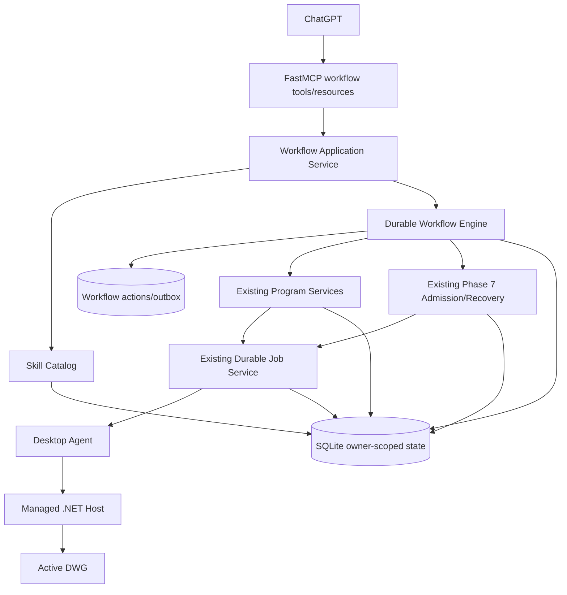

# Phase 9 — Skill and Workflow Platform

> Trạng thái: kế hoạch kiến trúc và triển khai sau khi Phase 8 được merge vào `main` qua PR #12.
>
> Baseline bắt buộc: commit `2a5df4fc7942d3282dc15f3644af9c0ed05cb0f9`.
>
> Phase 8 đạt Engineering GO cho **bounded signed R25 lab profile**. Những claim chưa có gồm production CA/timestamp, public OAuth end-to-end, AutoCAD LT write, delete/topology packs và mixed create-equivalent + exact-transform rollback.
>
> Phase 9 xây một nền tảng skill/workflow bền vững ở Gateway. Nó không mở arbitrary code, không biến mỗi skill thành một MCP tool, không thay thế CAD Program tự do và không kéo Scene Graph của Phase 10 vào sớm.

---

## 0. Chỉ dẫn bắt buộc cho Codex local

Codex thực hiện Phase 9 trong local repository, không làm trực tiếp trên `main`.

### 0.1. Tạo nhánh triển khai mới

```powershell
git status --short
git fetch origin
git checkout main
git pull --ff-only origin main
git checkout -b codex/phase-9-skill-workflow-platform
```

Nếu working tree không sạch, `main` không fast-forward được, hoặc nhánh trên đã tồn tại với lịch sử không rõ nguồn gốc, không force/reset. Dừng phần mutation, ghi lại blocker và tiếp tục review read-only nếu còn hữu ích.

Nhánh tài liệu kế hoạch và nhánh triển khai phải tách nhau. Nhánh triển khai luôn sinh từ `main` mới nhất sau khi tài liệu này được merge.

### 0.2. Baseline trước khi sửa code

Đọc tối thiểu:

- `docs/architecture/fastmcp-multi-user-autocad-plan.md`;
- `docs/architecture/Phase-6-plus.md`;
- `docs/architecture/Phase-7.md`;
- `docs/architecture/Phase-8.md`;
- `docs/architecture/phase8-implementation-evidence.md`;
- `docs/architecture/phase8-security-review.md`;
- `docs/architecture/appendix-user-interface.md`;
- `services/gateway/src/autocad_gateway/app.py`;
- `services/gateway/src/autocad_gateway/durable_services.py`;
- `services/gateway/src/autocad_gateway/application/job_service.py`;
- `services/gateway/src/autocad_gateway/phase7_admission.py`;
- `services/gateway/src/autocad_gateway/phase7_recovery.py`;
- `services/gateway/src/autocad_gateway/phase8_gateway.py`;
- `services/gateway/src/autocad_gateway/infrastructure/sqlite/`;
- `packages/contracts/src/autocad_contracts/phase8_contracts.py`;
- `src/autocad_mcp/auto_dimension_tool.py`;
- `src/autocad_mcp/dimension_workflow.py`;
- `src/autocad_mcp/dimension_intelligence.py`;
- `src/autocad_mcp/part_detection.py`.

Chạy baseline:

```powershell
pwsh -NoProfile -ExecutionPolicy Bypass `
  -File scripts/test-phase8-regression.ps1 -StopOnFailure

python scripts/test-phase8-conformance.py
```

Ghi lại commit, hệ điều hành, Python/.NET/Node versions, test counts và các skip. Không bắt đầu implementation nếu regression Phase 0–8 đỏ do thay đổi local chưa giải thích được.

### 0.3. Quy tắc làm việc

- Không rollback hoặc viết lại chức năng Phase 0–8.
- Không xóa legacy local MCP, File IPC, AutoLISP hoặc ezdxf path.
- Không dùng FastMCP object/decorator bên trong domain engine.
- Không thêm arbitrary Python/C#/LISP/shell/HTTP/plugin execution.
- Không mở delete/topology/LT write chỉ để làm demo workflow.
- Không cho model/browser tạo approval hoặc trusted fields.
- Mỗi slice phải có test, migration, snapshot và rollback path tương ứng.
- Commit nhỏ theo slice; không gom toàn bộ Phase 9 thành một commit khổng lồ.
- Các subagent review độc lập không được cùng sửa một nhóm file tại cùng thời điểm.

---

## 1. Executive summary

Phase 8 đã tạo lớp thi công có cấu trúc:

```text
CAD Program v1 source
→ deterministic compiler
→ sealed execution plan
→ exact preview
→ trusted intent/approval
→ Managed .NET R25 execution
→ receipt/checkpoint/recovery/rollback
```

Phase 9 thêm lớp tái sử dụng ở phía trên:

```text
ChatGPT
→ tìm skill phù hợp
→ khởi tạo durable workflow
→ workflow thu thập input / observe / query
→ planner hoặc template tạo CAD Program
→ existing prepare / preview / patch / rebase
→ trusted approval ngoài model
→ existing commit / job / recovery / rollback
→ validate và hoàn tất
```

Mục tiêu không phải biến hệ thống thành bot macro. Skill phải là một gói kiến thức, schema, capability, template, planner và validation đã version hóa. Workflow chỉ điều phối các primitive an toàn đã tồn tại. ChatGPT vẫn có thể bỏ qua skill và tự tạo CAD Program bằng public flow hiện hành.

Kiến trúc chốt:

1. **Skill catalog first-party, immutable, versioned**.
2. **Workflow definition declarative, bounded, không arbitrary code**.
3. **Workflow run owner-scoped, durable, CAS-protected, restart-safe**.
4. **Mỗi effect CAD vẫn đi qua Phase 6–8 program, preview, approval, job, receipt và recovery**.
5. **Gateway là workflow authority; Agent/Host không biết skill là gì**.
6. **Public MCP chỉ thêm workflow-level tools nhỏ; không tạo tool theo skill**.
7. **Scene Graph, marketplace và broad destructive cleanup được giữ ngoài Phase 9 core**.

---

## 2. Baseline đã xác minh trên `main`

### 2.1. Phase 8 accepted scope

PR #12 đã merge vào `main` tại `2a5df4fc7942d3282dc15f3644af9c0ed05cb0f9`.

Evidence hiện có:

- compiler `cad.program/1.0` version `1.1.0`;
- sealed `cad.execution-plan/1`;
- immutable patch/rebase và conflict reports;
- exact create-equivalent `copy_entity`, `offset_entity`;
- exact transform `move_entity`;
- live R25 evidence trên LINE, CIRCLE, LWPOLYLINE;
- checkpoint v1 cho created output;
- checkpoint v2 cho exact transform pre-image restore;
- signed lab Host `0.8.0`;
- public MCP vẫn giữ Phase 7 surface.

Giới hạn phải được phản ánh vào skill support:

- delete/topology/trim/extend/fillet/chamfer/join/explode: disabled;
- LT write: disabled;
- mixed create-equivalent + transform plan: fail closed;
- support production hoặc toàn bộ AutoCAD 2018–2025: chưa được chứng minh;
- public OAuth/ChatGPT-to-Gateway production run: chưa phải Phase 8 acceptance.

### 2.2. Public MCP surface hiện hành

`services/gateway/snapshots/phase8_tools.json` có:

- `cad_list_devices`;
- `cad_observe`;
- `cad_query`;
- `cad_get_job`;
- `cad_prepare_program`;
- `cad_preview`;
- `cad_commit`;
- `cad_preview_rollback`;
- `cad_commit_rollback`;
- `cad_validate`.

Phase 9 không đổi tên hoặc làm yếu các tools này. Skill/workflow là lớp bổ sung, không phải replacement.

### 2.3. Durable foundation có thể tái sử dụng

Gateway đã có:

- SQLite durable truth;
- owner-scoped repository access;
- job state machine và ordered events;
- idempotency và request hash;
- outbound Agent WSS và reconnect/reconcile;
- Phase 7 immutable intent/consent/recovery;
- Phase 8 immutable program revisions, sealed plans và conflicts;
- maintenance loop;
- FastMCP thin facade;
- Portal approval và observation views.

Workflow run phải compose các service này. Không sao chép một job state machine thứ hai cho từng CAD command.

### 2.4. Legacy workflow knowledge có thể khai thác

Legacy local server đã có:

- part/region/entity selection;
- dimension profiles;
- deterministic candidate generation;
- dimension plan/revision/preview;
- drawing và selected-geometry fingerprint;
- dimension audit và repair suggestions;
- P&ID operations;
- broad primitive tools.

Nhưng legacy lifecycle còn có state trong memory như `_plans`, `_plan_context`, `_audit_context`, backend-private access và local MCP tools theo operation. Phase 9 chỉ tái sử dụng hoặc tách **pure algorithms, profiles, fixtures và domain knowledge**. Không đưa memory store hoặc public legacy tools vào Gateway production path.

### 2.5. Capability gap quyết định scope workflow mẫu

`cad.program/1.0` hiện hỗ trợ create core, `copy_entity`, `offset_entity`, `move_entity`; create core có `create_dimension_linear`. Nó chưa có diameter/radius/center mark, layer reassignment hoặc exact delete.

Vì vậy:

- auto-dimension v0 phải dùng explicit selection và linear dimensions;
- cleanup core phải là audit/plan, không quảng cáo destructive apply;
- domain workflow mẫu nên dùng create-only variables/repeat;
- P&ID có external CTO path, không phù hợp core Phase 9.

---

## 3. Mục tiêu Phase 9

1. Tạo strict `cad.skill/1` cho skill first-party versioned.
2. Tạo strict `cad.workflow-definition/1` cho bounded declarative graph.
3. Tạo durable owner-scoped `cad.workflow-run/1`.
4. Tạo catalog publication/deprecation/default-version lifecycle.
5. Cho ChatGPT tìm skill mà không tăng tool-per-skill.
6. Cho workflow pause/resume, waiting-for-user, waiting-for-approval, waiting-for-job và waiting-for-recovery.
7. Reuse exact CAD Program prepare/preview/patch/rebase/commit/validate lifecycle.
8. Pin skill, workflow, planner, template, policy và capability evidence vào run/audit.
9. Bảo đảm restart/reconnect không mất state hoặc tạo CAD effect lần hai.
10. Ship ba reference workflows phù hợp capability thật:
    - bounded mechanical auto-dimension;
    - drawing cleanup audit/plan;
    - mechanical plate with hole pattern.
11. Thêm Portal workflow visibility và correlation với intent/job/receipt/recovery.
12. Giữ freeform CAD Program path hoàn toàn hoạt động.
13. Giữ Phase 0–8 và LT read regression xanh.

---

## 4. Non-goals

- Scene Graph, relation graph hoặc general feature inference của Phase 10;
- arbitrary workflow scripting;
- arbitrary Python module/class/function import;
- dynamic `eval`, expression language tổng quát hoặc user-supplied code;
- arbitrary MCP tool invocation từ workflow definition;
- HTTP fetch, webhook, shell, file path, URL, DLL, LISP hoặc external plugin loading;
- third-party marketplace;
- tenant-authored executable skills;
- skill editor cho ordinary user;
- billing, subscription, quota product;
- PostgreSQL/queue/multi-worker migration chưa có load evidence;
- scheduled/background workflows;
- broad delete/topology cleanup;
- production CA/customer pilot gates;
- P&ID CTO dependency productization;
- automatic model call bên trong Gateway;
- biến trusted approval thành workflow step do model hoàn tất;
- thay thế public CAD Program tools bằng skill-only UX.

---

## 5. Architecture và responsibility boundary



### FastMCP

Chỉ sở hữu:

- public tool/resource declaration;
- typed input/output;
- auth scope binding;
- correlation middleware;
- safe error projection.

Không sở hữu workflow state, transition, catalog resolution hoặc CAD logic.

### Gateway skill catalog

Sở hữu:

- first-party skill manifests;
- immutable versions/digests;
- default channel;
- publish/deprecate/withdraw status;
- capability/support calculation;
- model-visible guide/resource.

Không thực thi AutoCAD.

### Gateway workflow engine

Sở hữu:

- workflow run state;
- step scheduling;
- wait state;
- CAS transitions;
- deterministic child idempotency keys;
- child program/job/intent/receipt links;
- reconcile;
- safe retry policy;
- cancellation semantics;
- audit events.

Không gọi AutoCAD adapter trực tiếp.

### Existing program/admission/job services

Tiếp tục là authority cho:

- program validation/compiler;
- immutable revisions;
- preview;
- intent và trusted approval;
- write release;
- durable device job;
- recovery;
- rollback;
- validation.

Workflow engine không copy hoặc bypass logic này.

### Desktop Agent / Managed Host

Không cần hiểu `skill_id`, workflow graph hoặc guide text. Agent/Host chỉ nhận existing typed program/rollback commands và exact bindings. Nếu Phase 9 cần thêm field skill/workflow vào Agent/Host payload chỉ để correlation, đó là thiết kế sai; correlation ở Gateway audit là đủ.

---

## 6. Contract model

### 6.1. `cad.skill/1`

Một published skill version là immutable. Tối thiểu có:

```json
{
  "schema_version": "cad.skill/1",
  "skill_id": "mechanical.plate-hole-pattern",
  "version": "1.0.0",
  "title": "Mechanical plate with hole pattern",
  "summary": "Create one bounded rectangular plate drawing.",
  "domain": "mechanical",
  "tags": ["plate", "holes", "pattern"],
  "input_schema_ref": "skill-input:...",
  "output_schema_ref": "skill-output:...",
  "workflow_definition": {
    "workflow_id": "mechanical.plate-hole-pattern",
    "version": "1.0.0",
    "digest": "sha256:..."
  },
  "required_scopes": ["autocad.read", "autocad.write"],
  "required_capabilities": [],
  "required_operation_packs": [],
  "risk_floor": "medium",
  "assurance_floor": "user_recent_auth",
  "planner": null,
  "templates": [],
  "validation_profiles": [],
  "budgets": {},
  "support_policy": {},
  "guide_digest": "sha256:...",
  "manifest_digest": "sha256:..."
}
```

Yêu cầu:

- strict `extra=forbid`;
- semver canonical;
- IDs bounded;
- canonical JSON + domain-separated digest;
- no path, URL, module, class, function hoặc command field;
- input/output schema dùng approved JSON Schema subset;
- guide Markdown không có execution authority;
- risk/assurance là floor, không phải model-controlled final value;
- required capability là exact semantic capability, không chỉ tier chung chung;
- planner/template refs là opaque catalog IDs + version + digest;
- published version không update in place.

### 6.2. `cad.workflow-definition/1`

Workflow definition là DAG bất biến:

- tối đa 64 steps;
- không cycle;
- branch fan-out tối đa 4;
- không loop động;
- mỗi step có stable ID, kind, dependencies, input bindings, output schema, timeout và retry class;
- condition chỉ dùng typed comparison subset trên persisted outputs;
- không arbitrary expression/eval;
- không dynamic step injection;
- no user-controlled step kind.

### 6.3. `cad.workflow-run/1`

Run pins:

- owner/actor;
- skill ID/version/digest;
- workflow ID/version/digest;
- catalog/policy epoch;
- planner registry version/hash;
- template/component digests;
- validated input digest;
- device ID and identity generation;
- initial snapshot/document/revision when applicable;
- current state/state version/current step;
- created/expires/updated timestamps;
- child program/revision/preview/intent/job/receipt/recovery refs;
- result/error summary;
- audit correlation.

### 6.4. Events và waits

Add strict records:

- `cad.workflow-event/1`;
- `cad.workflow-wait/1`;
- `cad.skill-publication/1`.

Event log append-only, monotonically ordered per run. Wait records bind exact run state version and expected response schema digest.

---

## 7. Skill packaging và catalog lifecycle

### 7.1. First-party only trong Phase 9

Source-of-truth skill assets nằm trong repository/release bundle, ví dụ:

```text
packages/skill_catalog/
├─ catalog.json
├─ skills/
│  ├─ mechanical.auto-dimension/1.0.0/
│  │  ├─ skill.json
│  │  ├─ workflow.json
│  │  ├─ input.schema.json
│  │  ├─ output.schema.json
│  │  └─ guide.md
│  ├─ drawing.cleanup-audit/1.0.0/
│  └─ mechanical.plate-hole-pattern/1.0.0/
└─ fixtures/
```

Codex có thể điều chỉnh path để phù hợp packaging thật, nhưng phải giữ:

- no runtime arbitrary filesystem resolution;
- package resources được build vào release;
- catalog manifest hash;
- startup import/verification fail closed;
- no user-supplied path.

### 7.2. Publication

Publication là operator/release action, không public MCP action.

Flow:

```text
reviewed repo assets
→ schema + semantic validation
→ canonical digests
→ test fixtures
→ release catalog manifest
→ Gateway import immutable versions
→ operator promotes default channel
```

### 7.3. Deprecation, withdrawal và rollback

- `published`: allowed for new runs;
- `deprecated`: allowed but not default; warning returned;
- `withdrawn`: no new runs;
- `security_revoked`: existing runs pause before next effect-bearing step.

Rollback không sửa version cũ. Nó đổi default channel về một version đã published và audit action. Active run vẫn pin exact version, trừ security revocation.

### 7.4. Support calculation

Skill availability được tính từ:

- owner/device access;
- current device capability evidence;
- runtime family/release;
- operation pack support state;
- policy/feature flags;
- planner/template availability;
- skill status.

Support output tối thiểu:

- `unsupported`;
- `catalog_only`;
- `dry_run`;
- `preview_only`;
- `lab_commit`;
- `certified`.

Không suy ra support chỉ từ version string hoặc Agent self-report.

---

## 8. Workflow graph và allowed step registry

Workflow definition không gọi tên Python function. Nó dùng allowlisted step kinds ánh xạ tới internal services.

| Step kind | Effect | Internal authority | Retry |
|---|---|---|---|
| `observe` | read | existing observe service | bounded safe retry |
| `query` | read | existing query/snapshot repo | bounded safe retry |
| `run_planner` | pure | allowlisted planner registry | deterministic retry |
| `render_template` | pure | strict template renderer | deterministic retry |
| `prepare_program` | durable metadata | Phase 8 program service | exact idempotent replay |
| `preview_program` | AutoCAD transaction abort | existing preview flow | existing job semantics |
| `wait_user_input` | none | workflow wait service | no auto completion |
| `wait_program_revision` | none | Phase 8 revision refs | no raw patch authority |
| `request_commit` | creates intent, may wait | Phase 7 admission | exact idempotent replay |
| `wait_job` | none | durable job/reconcile | no write retry |
| `validate_receipt` | read from DWG | existing validate flow | bounded safe retry |
| `branch` | pure | typed condition evaluator | deterministic |
| `emit_report` | metadata/artifact | owner-scoped resource store | deterministic |
| `request_rollback` | high risk | existing rollback admission | trusted approval required |
| `finish` | none | workflow engine | once |

Cấm step:

- `run_python`;
- `run_command`;
- `call_tool`;
- `http_request`;
- `load_plugin`;
- `execute_lisp`;
- dynamic module/function;
- arbitrary SQL;
- arbitrary file access.

### 8.1. Planner registry

Một số skill cần pure planner thay vì template tĩnh.

Planner registry:

- code-owned allowlist;
- stable planner ID/version;
- registry hash;
- strict input/output schemas;
- pure deterministic logic;
- no network/filesystem/backend;
- bounded CPU/entity count;
- output persisted và digested;
- not re-evaluated after preview/approval.

Initial planners:

- `mechanical.auto-dimension-overall/1`;
- `drawing.cleanup-audit/1`.

Pure geometry code có thể được extracted từ legacy modules vào shared package. Không import `src/autocad_mcp` backend/server modules vào Gateway.

### 8.2. Template renderer

Template renderer chỉ hỗ trợ:

- typed parameter substitution;
- CAD Program v1 variables;
- bounded repeat;
- explicit condition subset;
- opaque component references đã catalog-resolved.

Không hỗ trợ Jinja/Python expression tùy ý, include path hoặc dynamic template fetch.

---

## 9. Durable workflow state machine

### 9.1. Run states

```text
created
→ running
→ waiting_for_user
→ waiting_for_program_revision
→ waiting_for_trusted_approval
→ waiting_for_job
→ waiting_for_recovery
→ paused
→ succeeded | failed | cancelled | needs_attention
```

State transitions phải được định nghĩa trong domain module riêng, có transition table và tests.

### 9.2. Step states

```text
pending
→ ready
→ dispatch_pending
→ running
→ waiting
→ succeeded | failed | skipped | cancelled | needs_attention
```

### 9.3. CAS và state version

Mọi state mutation cần:

- expected state;
- expected `state_version`;
- transition-specific invariant;
- atomic append event;
- increment state version.

Duplicate identical request trả current durable result. Conflicting request trả `idempotency_conflict` hoặc `stale_workflow_state`.

### 9.4. Durable action/outbox

Không giữ một coroutine sống suốt workflow.

Khi cần gọi service con:

1. transaction ghi step `dispatch_pending`;
2. cùng transaction tạo `workflow_action` với deterministic action ID;
3. runner claim action bằng CAS;
4. gọi internal service với idempotency key dẫn xuất từ run/step/attempt;
5. persist child ref và step state;
6. crash ở bất kỳ điểm nào có thể replay cùng key mà không tạo effect thứ hai.

Dùng cùng SQLite database ở Phase 9. Không cần message broker nếu single-worker profile còn đủ.

### 9.5. Deterministic child keys

Ví dụ:

```text
wf:{run_id}:{step_id}:{attempt}:prepare
wf:{run_id}:{step_id}:{attempt}:preview
wf:{run_id}:{step_id}:{attempt}:commit
wf:{run_id}:{step_id}:{attempt}:validate
```

Không dùng random key sau crash.

### 9.6. Retry

Auto retry chỉ cho:

- pure planner/template;
- read/query;
- metadata/materialization;
- proven not-started child command;
- allowlisted transient errors.

Không auto retry:

- started/inconclusive write;
- `outcome_unknown`;
- trusted approval denial/expiry;
- stale snapshot/revision;
- capability/policy mismatch;
- recovery/rollback conflict.

### 9.7. Cancellation

Cancellation:

- dừng future steps;
- cancel child job chỉ khi existing job semantics cho phép;
- không coi started write là cancelled;
- started/inconclusive write chuyển `waiting_for_recovery` hoặc `needs_attention`;
- không xóa audit, intent, child refs hoặc evidence.

### 9.8. Reconnect và restart

Gateway restart:

- reload non-terminal runs;
- reclaim expired action leases;
- reconcile child jobs/intents/recovery cases;
- không re-run planner nếu output artifact đã persisted;
- không re-request commit nếu intent/job đã tồn tại.

Agent reconnect được existing job/reconcile xử lý. Workflow chỉ quan sát durable child outcome.

---

## 10. Public FastMCP interface

Phase 9 core thêm tối đa bốn workflow-level tools.

### 10.1. `cad_list_skills`

Read-only, idempotent.

Input:

- optional query/domain/tags;
- device ID;
- required support state;
- cursor/limit.

Output:

- bounded summaries;
- exact version/default version;
- support state and reason;
- required capabilities/risk;
- manifest/guide resource links.

Không trả toàn bộ guide/template inline.

### 10.2. `cad_start_workflow`

Creates metadata, không trực tiếp commit CAD.

Input:

- `skill_id`;
- optional exact `skill_version`;
- `device_id`;
- optional `source_snapshot_id`;
- strict `inputs`;
- `idempotency_key`.

Output:

- workflow run ID;
- pinned skill/workflow digests;
- state/state version;
- current step;
- required next action;
- resource URI.

### 10.3. `cad_get_workflow`

Read-only, idempotent.

Input:

- workflow run ID;
- event cursor/limit.

Output:

- bounded state;
- current wait/required action;
- safe child refs;
- ordered events;
- resource URI.

### 10.4. `cad_control_workflow`

Bounded discriminated union:

- `submit_input`;
- `attach_program_revision`;
- `resume`;
- `retry_safe_step`;
- `cancel`.

Requires:

- workflow run ID;
- expected state version;
- action-specific payload;
- idempotency key.

Cấm actions:

- `approve`;
- `set_risk`;
- `set_assurance`;
- `set_capability`;
- `force_commit`;
- raw handle/checkpoint/consent injection.

`attach_program_revision` chỉ nhận owner-scoped immutable `program_id` + revision đã được tạo qua existing `cad_prepare_program` patch/rebase contract.

### 10.5. Resources

Add:

```text
cad://skills
cad://skills/{skill_id}/versions/{version}/manifest
cad://skills/{skill_id}/versions/{version}/guide
cad://workflows/{workflow_run_id}
cad://workflows/{workflow_run_id}/events{?cursor,limit}
cad://workflows/{workflow_run_id}/report
```

Owner-scoped resources phải trả `not_found` cho cross-owner IDs.

Không register một FastMCP prompt/tool cho từng skill.

---

## 11. Persistence design

Tạo additive migration sau `0009`, không sửa migration cũ.

Suggested tables:

### `skill_versions`

- skill ID/version PK;
- status;
- manifest JSON/digest;
- workflow definition ID/version/digest;
- guide digest;
- catalog release digest;
- published/deprecated/withdrawn timestamps;
- immutable binding trigger.

### `skill_channels`

- skill ID/channel PK;
- default version;
- epoch;
- status;
- updated by/operator audit.

### `workflow_definitions`

- workflow ID/version PK;
- definition JSON/digest;
- step count;
- planner/template refs;
- immutable trigger.

### `workflow_runs`

- run ID PK;
- owner/actor;
- pinned skill/workflow/catalog/policy fields;
- device identity;
- initial snapshot/document/revision;
- inputs/result/error JSON + digests;
- state/state version/current step;
- timestamps/deadlines;
- unique owner + idempotency key.

### `workflow_steps`

- run ID + step ID + attempt PK;
- kind/state/state version;
- input/output refs and digests;
- child program/revision/preview/intent/job/receipt/recovery refs;
- error code;
- lease/timestamps.

### `workflow_actions`

- deterministic action ID PK;
- run/step/attempt;
- action kind/payload digest;
- pending/claimed/completed state;
- lease owner/expiry;
- result ref.

### `workflow_waits`

- wait ID PK;
- run/step;
- wait kind;
- expected state version;
- response schema/digest;
- expires/resolved metadata.

### `workflow_events`

- run ID + sequence unique;
- event ID unique;
- type;
- safe payload;
- created timestamp.

Requirements:

- owner filters on every run lookup;
- immutable pinned fields;
- foreign keys to existing program/job/intent records where practical;
- bounded JSON sizes;
- indexes for non-terminal runs, pending actions, owner/state and expiry;
- migration checksum tests;
- rollback is feature disable, not destructive DB downgrade.

---

## 12. Integration với existing services

### 12.1. Không duplicate orchestration

Workflow service gọi ports/adapters quanh:

- observe/query;
- Phase 8 prepare/patch/rebase;
- preview;
- Phase 7 commit admission;
- job lookup;
- recovery lookup;
- validate;
- rollback admission.

Không gọi FastMCP tool functions nội bộ.

### 12.2. Transaction boundary

Nếu existing service call không thể nằm cùng workflow DB transaction, dùng outbox + deterministic idempotency. Không giữ database transaction mở qua network/AutoCAD wait.

### 12.3. Approval

`request_commit` tạo/reuse exact Phase 7 intent.

Workflow state:

- `waiting_for_trusted_approval` khi intent cần consent;
- tự reconcile khi consent release child job;
- denied/expired → terminal hoặc waiting user theo definition;
- model không thể submit consent.

### 12.4. Recovery

Child job `outcome_unknown`:

- workflow không mark failed;
- link/create RecoveryCase;
- state `waiting_for_recovery`;
- no retry write button/action;
- operator resolution can move workflow to validation, rollback or `needs_attention`.

### 12.5. Patch/rebase

Workflow run không mutate sealed program.

- ChatGPT dùng existing `cad_prepare_program` revision request;
- `cad_control_workflow.attach_program_revision` pins new immutable revision;
- workflow invalidates prior preview/intent;
- re-preview required;
- released/started revisions remain protected.

---

## 13. Reference workflows

### 13.1. `mechanical.auto-dimension-overall/1.0.0`

Purpose: tạo dimension tổng thể cho explicit selected 2D geometry.

Inputs:

- device/snapshot;
- exact entity IDs hoặc bounded region;
- profile: `mechanical_mm` initially;
- include width/height;
- spacing/offset;
- target layer;
- optional user review requirement.

Flow:

```text
observe/query
→ validate explicit target set
→ pure planner computes bounds
→ create CAD Program v1 with create_dimension_linear
→ prepare
→ preview
→ wait user review
→ optional immutable program patch
→ request trusted commit
→ wait job/recovery
→ validate
```

Core boundaries:

- LINE/CIRCLE/LWPOLYLINE input;
- overall linear dimensions only;
- no automatic generic part inference authority;
- no diameter/radius/center mark until operation pack exists;
- no clear-existing/delete;
- planner output persisted/digested before preview;
- create-only checkpoint/rollback semantics.

Legacy extraction candidates:

- dimension profile models;
- geometry fingerprint helpers;
- bounded candidate generation;
- fixtures and audit logic.

Do not reuse legacy in-memory plan store or backend-private calls.

### 13.2. `drawing.cleanup-audit/1.0.0`

Purpose: reusable drawing health/cleanup workflow without destructive claim.

Checks:

- exact duplicate geometry candidates;
- zero-length/degenerate candidates;
- unsupported/custom entity summary;
- layer naming/profile anomalies;
- isolated tiny entities;
- dimension/style issues only where current snapshot data supports them;
- bounded counts and evidence.

Flow:

```text
observe/query pages
→ pure deterministic audit
→ emit report with snapshot-bound candidate refs
→ wait user decision/notes
→ finish audit or attach follow-up CAD Program
```

Core Phase 9 is audit/plan only.

Conditional extension `drawing.cleanup-apply` may be enabled later only after exact delete/layer-change operation packs pass Phase 8 destructive extension gates: strict target refs, checkpoint v2 restore, trusted approval, atomic effect/receipt/checkpoint, live fault matrix and security review.

Không gọi legacy `drawing.purge`, `OVERKILL`, raw command hoặc AutoLISP as a shortcut.

### 13.3. `mechanical.plate-hole-pattern/1.0.0`

Purpose: chứng minh reusable parameterized engineering template.

Inputs:

- width/height;
- hole diameter;
- rows/columns;
- X/Y margins;
- layer;
- optional overall dimensions.

Flow:

```text
collect/validate inputs
→ render CAD Program v1 variables + rectangular repeat
→ prepare
→ preview
→ wait trusted approval
→ commit
→ validate
```

Uses:

- `ensure_layer`;
- `create_rectangle`;
- `create_circle` with bounded repeat;
- optional `create_dimension_linear`.

No target refs, no transform, no mixed checkpoint strategy.

### 13.4. P&ID deferred

Legacy P&ID assumes an external CTO library path. Phase 9 core không productize nó vì:

- external package provenance chưa có;
- path/component trust chưa được chuyển thành opaque signed catalog assets;
- block/component governance chưa hoàn chỉnh;
- may require operations outside accepted R25 packs.

P&ID có thể trở thành later first-party skill sau security/package review, không phải reference exit gate.

---

## 14. UI và operator experience

### ChatGPT

- list/search skill;
- start run;
- submit missing input;
- inspect report/state/events;
- attach revised program;
- cannot approve.

### Portal

Add minimal views:

- workflow run list/detail;
- skill/version/support;
- current step/wait;
- child program/preview/intent/job/receipt/recovery links;
- timeline;
- pending approval linked to workflow;
- deprecated/withdrawn warning;
- safe cancel/pause where allowed.

Portal approval continues existing recent-auth flow. Không tạo second consent system.

### Desktop Agent

No skill editor/catalog UI required.

Existing local confirmation should display workflow label/version only if Gateway can pass it as trusted presentation metadata without changing execution authority. Otherwise show existing exact effect summary and Portal shows workflow context.

### Observability

Metrics/logs:

- workflow starts/completions/terminal state;
- wait durations;
- step latency/retry;
- action lease reclaim;
- child job outcome;
- approval/recovery duration;
- skill version/support;
- correlation ID.

No raw drawing content or secrets in telemetry by default.

---

## 15. Security invariants

1. Skill guide text has no execution authority.
2. Published skill/workflow definitions immutable.
3. Exact version/digests pinned to run.
4. No latest-version re-resolution mid-run.
5. No arbitrary code, path, URL, command, plugin or network fetch.
6. Workflow step registry allowlisted in code.
7. Planner registry allowlisted and hash-pinned.
8. User input validated against exact current wait schema.
9. Workflow cannot lower risk/assurance.
10. Model/browser cannot approve.
11. Workflow cannot force runtime/capability.
12. Every owner-scoped ID is filtered before revealing existence.
13. No raw entity handle as destructive authority.
14. All effects go through exact preview/intent/approval/commit.
15. Started/inconclusive write never auto-retried.
16. Skill withdrawal/policy revoke blocks future effects.
17. Capability/runtime/package drift invalidates effect-bearing continuation.
18. Large outputs use bounded resources/artifacts.
19. Third-party skill install absent in Phase 9.
20. Agent/Host wire remains path-free and skill-free.

Create a Phase 9 security review document before effect-bearing workflow GO.

---

## 16. Feature flags

Suggested default-off flags:

```text
AUTOCAD_MCP_PHASE9_SKILL_CATALOG_ENABLED=0
AUTOCAD_MCP_PHASE9_WORKFLOW_ENGINE_ENABLED=0
AUTOCAD_MCP_PHASE9_PUBLIC_WORKFLOW_TOOLS_ENABLED=0
AUTOCAD_MCP_PHASE9_AUTO_DIMENSION_SKILL_ENABLED=0
AUTOCAD_MCP_PHASE9_CLEANUP_AUDIT_SKILL_ENABLED=0
AUTOCAD_MCP_PHASE9_PLATE_PATTERN_SKILL_ENABLED=0
AUTOCAD_MCP_PHASE9_WRITE_WORKFLOWS_ENABLED=0
AUTOCAD_MCP_PHASE9_SKILL_ALLOWLIST=
AUTOCAD_MCP_PHASE9_POLICY_EPOCH=0
```

Rules:

- catalog read can rollout before workflow execution;
- read-only workflows can rollout before write workflows;
- write workflow requires existing Phase 7/8 flags and exact capability support;
- flags do not bypass skill status/policy;
- policy epoch change pauses/invalidate effect continuation as appropriate;
- no skill can enable a disabled CAD operation pack.

---

## 17. Delivery slices

### Slice 9.0 — Baseline, ADR và contract freeze

Deliver:

- baseline report on Phase 8 merge commit;
- current public tools/resources snapshot;
- ADR for skill/workflow boundaries;
- threat model;
- exact reference workflow scope;
- decision that cleanup core is audit-only;
- no product code effect.

Exit:

- regression green;
- contract names/states/step kinds accepted;
- Agent/Host no-change expectation documented;
- no Phase 9 flags enabled.

### Slice 9.1 — Skill contracts và catalog validator

Deliver:

- `cad.skill/1`;
- publication/status contracts;
- strict schema subset;
- canonical digests/golden vectors;
- first-party catalog package;
- loader/validator;
- three draft manifests;
- no workflow run.

Exit:

- malformed/path/module/unknown fields fail;
- immutable version tests;
- support calculation tests;
- catalog snapshot stable.

### Slice 9.2 — Workflow definition và domain state machine

Deliver:

- `cad.workflow-definition/1`;
- allowed step registry;
- run/step/wait/event models;
- transition table;
- pure condition evaluator;
- no service dispatch yet.

Exit:

- cycle/limit/unknown step rejected;
- every transition tested;
- stale state version rejected;
- terminal states immutable.

### Slice 9.3 — SQLite repositories, actions/outbox và runner

Deliver:

- additive migration;
- repositories;
- action lease/claim/reclaim;
- deterministic child keys;
- restart loader/reconciler;
- fake internal ports.

Exit:

- restart at every action boundary does not duplicate action;
- concurrent runners claim once;
- event ordering stable;
- owner isolation green.

### Slice 9.4 — Public catalog/workflow facade

Deliver:

- four public tools;
- resources;
- Phase 9 profile/composition;
- FastMCP schema snapshot;
- auth scopes and safe errors;
- dry-run workflow only.

Exit:

- no skill-per-tool;
- cross-owner `not_found`;
- tool schema snapshot reviewed;
- Phase 8 surface unchanged.

### Slice 9.5 — Pure planners/templates và read-only reference runs

Deliver:

- shared pure planner package/extraction;
- auto-dimension overall planner;
- cleanup audit planner;
- plate template renderer;
- fixtures/golden results;
- report resources.

Exit:

- deterministic hashes;
- bounded CPU/entities;
- no backend/network/filesystem;
- cleanup audit completes after restart;
- no CAD write.

### Slice 9.6 — Existing program/approval/job/recovery integration

Deliver:

- prepare/preview adapters;
- wait user/program revision;
- Phase 7 commit intent integration;
- approval wait;
- child job/recovery reconciliation;
- validation;
- optional rollback branch;
- no Agent/Host semantic change.

Exit:

- approval cannot be supplied through MCP;
- exact duplicate workflow start/control does not duplicate child objects;
- crash/drop matrix proves no second effect;
- `outcome_unknown` becomes recovery wait, not retry.

### Slice 9.7 — Portal, live R25 acceptance và rollout evidence

Deliver:

- Portal run list/detail/timeline;
- links to existing approval/recovery;
- live Mechanical 2025 runs;
- Phase 9 implementation evidence;
- security review;
- conformance matrix;
- rollback drill;
- default-off rollout docs.

Exit:

- three workflows complete within their declared support;
- write workflows preview/approval/commit/validate live;
- cleanup remains honestly audit-only;
- full regression green.

---

## 18. Test matrix

### Contracts/catalog

- unknown fields;
- semver canonicalization;
- duplicate IDs/versions;
- digest mutations;
- malicious path/URL/module/function fields;
- oversized schemas/guides/templates;
- invalid support/risk floors;
- publish/deprecate/withdraw/revoke.

### Workflow definitions

- cycles;
- missing dependencies;
- fan-out/step limits;
- unknown step kinds;
- condition type mismatch;
- forbidden action;
- unbounded wait/retry.

### State machine/concurrency

- all legal/illegal transitions;
- state version race;
- duplicate start/control;
- two runners claim same action;
- lease expiry/reclaim;
- event sequence;
- terminal immutability.

### Restart/failure boundaries

Crash before/after:

- action insert;
- action claim;
- planner output persistence;
- prepare response;
- preview job create/result;
- intent create;
- consent release;
- child job dispatch/ack/start/result;
- validation;
- terminal event.

Every replay must return same child identity or safely reconcile.

### Security/isolation

- cross-owner skill run resource;
- cross-device snapshot;
- withdrawn skill;
- capability spoof;
- model-supplied approval/risk/capability;
- raw handles/checkpoint;
- arbitrary code/path/URL;
- Agent/Host schema remains free of skill guide/template fields.

### Reference workflows

Auto-dimension:

- exact explicit target;
- stale snapshot;
- empty/unsupported target;
- planner determinism;
- user patch/re-preview;
- create-only rollback compatibility.

Cleanup audit:

- duplicates;
- degenerate entities;
- pagination;
- report bounds;
- no destructive command.

Plate pattern:

- variables/units;
- repeat budgets;
- invalid margins/count;
- preview leaves DWG unchanged;
- exact duplicate commit;
- validation.

### Regression

- Phase 0–8 root suites;
- contracts;
- Gateway;
- Desktop Agent;
- Host Core;
- Portal;
- Phase 8 conformance;
- LT write default-off/read regression;
- public surface snapshots.

---

## 19. Live acceptance

Use AutoCAD Mechanical 2025 / Managed .NET R25 first.

At minimum retain evidence for:

### Auto-dimension

- existing drawing fixture;
- explicit LINE/LWPOLYLINE target;
- preview unchanged;
- two overall dimensions created;
- trusted approval;
- receipt/checkpoint;
- validation;
- rollback if eligible;
- no duplicate on retry.

### Plate pattern

- new or controlled drawing;
- variables/repeat;
- preview;
- approval;
- commit;
- expected entity counts/fingerprints;
- validation;
- rollback;
- no mixed transform plan.

### Cleanup audit

- fixture with exact duplicates/degenerate geometry;
- read-only report;
- drawing revision unchanged;
- bounded candidate refs;
- restart before report retrieval;
- same durable report after restart.

Live evidence must record:

- commit;
- skill/workflow versions/digests;
- catalog/policy epoch;
- device/runtime/Host/package/registry;
- drawing fixture;
- operator/date;
- commands/tests;
- failures and retests;
- retained artifacts.

---

## 20. Suggested code/file scope

Expected additions or changes:

```text
packages/contracts/
packages/skill_catalog/
packages/cad_core/                     pure extracted planners if appropriate
services/gateway/src/autocad_gateway/
  skills/
  workflows/
  infrastructure/sqlite/migrations/
  infrastructure/sqlite/
  app.py
  contracts.py
  composition.py
  durable_services.py
services/gateway/tests/
apps/web_portal/
tests/phase9/
scripts/
docs/architecture/
.github/workflows/
```

Expected unchanged unless evidence proves otherwise:

```text
apps/desktop_agent/src/... runtime semantics
native/autocad_managed_host/... execution semantics
lisp-code/
```

Nếu Agent/Host phải đổi để Phase 9 hoạt động, Codex phải giải thích tại sao existing Program/Agent contracts không đủ, bổ sung security review và chạy full cross-stack/live acceptance.

---

## 21. Subagent review plan

Dùng tối đa bốn review streams, mỗi stream trả findings trước khi integration:

1. **Contracts/catalog reviewer**
   - schemas, canonical digests, packaging, publication lifecycle.

2. **Workflow/state reviewer**
   - state machine, CAS, outbox, retries, restart/reconcile.

3. **Security reviewer**
   - arbitrary code/path, approval bypass, owner isolation, withdrawal/revoke.

4. **Reference workflow/E2E reviewer**
   - capability realism, legacy extraction, live acceptance and regression.

Integration owner:

- resolves conflicting proposals;
- owns migrations/public surface;
- prevents duplicate abstractions;
- runs final full suite.

---

## 22. Start gates

GO to implementation only when:

- Phase 8 merge commit is baseline;
- Phase 0–8 regression is green;
- exact public workflow tools are agreed;
- skill/workflow schemas and step registry are bounded;
- cleanup audit-only core decision is accepted;
- no Agent/Host change is required for core;
- three reference skills fit current capabilities;
- threat model accepted.

---

## 23. Phase 9 Engineering GO

GO when all are true:

1. `cad.skill/1` strict and versioned.
2. `cad.workflow-definition/1` bounded and immutable.
3. Workflow runs survive Gateway restart.
4. Concurrent runner/replay cannot duplicate child action.
5. Skill/workflow/planner/template digests pinned to audit.
6. Four public workflow tools or a smaller reviewed equivalent exist.
7. No skill-specific public tools.
8. Freeform CAD Program path remains.
9. Model/browser cannot approve.
10. Write flows reuse Phase 7 admission and Phase 8 sealed plans.
11. Started/unknown write is never workflow-retried.
12. Owner/device/document isolation is green.
13. Deprecate/withdraw/default-version rollback works.
14. Auto-dimension overall workflow completes live R25.
15. Plate pattern workflow completes live R25.
16. Cleanup audit completes with no drawing change.
17. Unsupported runtime reports clear support reason.
18. Phase 0–8 regression remains green.
19. LT write stays disabled and LT read regression is green.
20. Phase 9 security review has no open critical/high blocker.
21. Evidence/conformance/rollback docs are committed.
22. All Phase 9 flags default off outside explicit lab profile.

Customer Pilot remains a separate gate.

---

## 24. NO-GO conditions

NO-GO nếu:

- mỗi skill trở thành một MCP tool;
- skill version được resolve lại giữa workflow;
- workflow state chỉ nằm trong memory;
- workflow gọi FastMCP tool function nội bộ;
- workflow definition chứa Python/module/path/URL/command;
- arbitrary expression/eval/template execution xuất hiện;
- guide text có execution authority;
- model/browser có action `approve`, `force_commit` hoặc trusted field;
- risk/assurance bị skill hoặc user hạ xuống;
- started/unknown write được retry;
- child action dùng random idempotency sau restart;
- workflow terminal state bị mutate;
- cross-owner ID tiết lộ tồn tại;
- cleanup core gọi purge/OVERKILL/delete/raw AutoLISP;
- P&ID external path được đưa vào core;
- Scene Graph được xây trá hình trong Phase 9;
- Agent/Host nhận raw skill/template content;
- public Phase 8 tool contract bị phá;
- LT write được bật không có certification;
- Phase 9 GO dựa trên headless test mà không có required live R25 evidence.

---

## 25. Rollback strategy

Nếu Phase 9 có sự cố:

1. disable public workflow tools;
2. disable workflow runner;
3. keep catalog/resources read-only if safe;
4. preserve immutable runs/events/actions for audit;
5. stop claiming pending actions;
6. allow existing Phase 6–8 CAD Program tools unchanged;
7. do not delete child intent/job/receipt/recovery records;
8. security-revoke affected skill versions;
9. move default channel back to prior version;
10. reconcile started/unknown child writes before closing runs;
11. no destructive DB downgrade;
12. retain Portal read-only diagnostics.

---

## 26. Deliverables

Required:

- `docs/architecture/Phase-9.md` updated with implementation evidence section;
- ADR for skill/workflow boundaries;
- Phase 9 threat/security review;
- skill/workflow schemas and golden vectors;
- catalog manifests/guides/templates;
- SQLite migration/repositories;
- workflow domain/engine/runner;
- public tools/resources and snapshots;
- three reference skills;
- Portal workflow views;
- automated conformance/failure matrix;
- live R25 evidence;
- CI workflow;
- rollback/operations guide.

Final Codex report must state:

- branch and commits;
- files changed;
- architecture implemented;
- public contract delta;
- migrations;
- reference workflows and exact support limits;
- automated test commands/counts;
- live AutoCAD evidence;
- security review outcome;
- known residual risks;
- feature flags;
- Engineering GO/NO-GO;
- Customer Pilot status.

---

## 27. Definition of Done

Phase 9 hoàn tất khi hệ thống có thể discover một skill first-party, pin exact version, tạo một durable workflow run, thu thập input, observe/query, tạo CAD Program bằng planner/template an toàn, preview, chờ user/trusted approval, commit qua existing Phase 7/8 path, survive restart/reconnect, validate và hoàn tất mà không tạo effect lần hai; đồng thời ChatGPT vẫn có thể tự tạo CAD Program ngoài skill, public MCP không nổ thành tool-per-skill, cleanup không bị quảng cáo quá capability thật, và mọi execution authority vẫn nằm trong strict Gateway/Agent/Host contracts.
