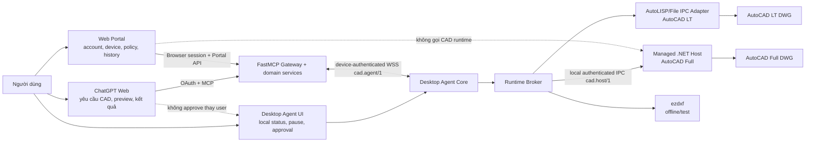
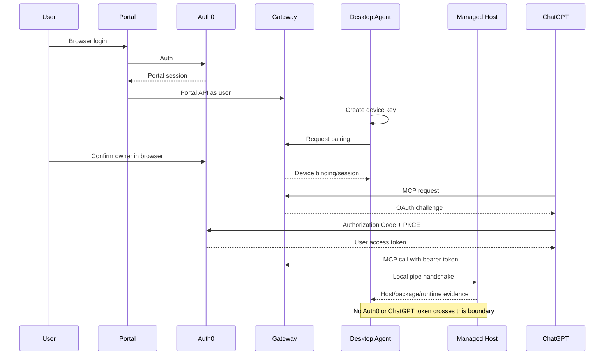

# Phụ lục kiến trúc giao diện người dùng — Runtime-aware Managed .NET primary

> Tài liệu phụ cho:
>
> - [Kế hoạch kiến trúc AutoCAD MCP nhiều người dùng](./fastmcp-multi-user-autocad-plan.md)
> - [Roadmap Phase 6–13](./Phase-6-plus.md)
>
> Nguồn thảo luận UI ban đầu: [context.md](./context.md)
>
> Ngày rà soát: 2026-07-24
>
> Trạng thái: **Phase 4 C1 đã GO trên AutoCAD Mechanical 2025 qua AutoLISP/File IPC compatibility path. Phase 5 đang ở trạng thái kế hoạch, chuyển AutoCAD Full sang Managed .NET primary nhưng vẫn bảo toàn AutoCAD LT 2024+ compatibility.**
>
> Phạm vi: ChatGPT Web, Desktop Agent UI, Web Portal, trang quản trị, onboarding, runtime status, pairing, confirmation/approval, diagnostics, packaging và update UX. Đây là tài liệu kiến trúc; **không triển khai code hoặc thêm dependency trong phụ lục này**.

## 1. Kết luận cập nhật

Định hướng UI cũ vẫn đúng ở cấp sản phẩm:

- Người dùng làm việc chính trong ChatGPT Web.
- Desktop Agent là ứng dụng Windows có trạng thái, system tray, hard pause, pairing, diagnostics và update shell.
- Web Portal quản tài khoản, thiết bị, policy, lịch sử, approval và tải bộ cài.
- Không xây chat riêng, CAD editor hoặc DWG viewer trong Portal ở MVP/pilot.
- Portal không gọi AutoCAD trực tiếp.
- Managed Host chạy trong AutoCAD nhưng **không trở thành một sản phẩm UI thứ tư**.

Phần phải thay đổi sau quyết định Managed .NET primary:

1. Desktop Agent không còn được mô tả là nơi “giữ toàn bộ COM/File IPC/AutoLISP”. Agent sở hữu `RuntimeBroker` và chọn adapter phù hợp:
   - `managed_dotnet` cho AutoCAD Full 2018+ khi Host hợp lệ;
   - `autolisp_file_ipc` cho AutoCAD LT 2024+ hoặc fallback được policy cho phép;
   - `ezdxf_headless` cho offline/test, không đại diện live DWG.
2. UI phải hiển thị **AutoCAD product, runtime role, capability và degradation** ở mức người dùng hiểu được.
3. AutoCAD Full thiếu hoặc lỗi Managed Host không được hiển thị như “sẵn sàng đầy đủ”. UI phải báo `Cần thành phần AutoCAD`, `Chế độ tương thích` hoặc `Khả năng bị giới hạn`.
4. Preview/commit không được đổi runtime âm thầm. Runtime hoặc package thay đổi phải làm preview/approval cũ mất hiệu lực.
5. Bỏ hoàn toàn công tắc “AutoLISP cấp 3”. Public contract cấm arbitrary C#, DLL, AutoLISP, Python, shell và file/network access tùy ý.
6. Roadmap UI phải theo Phase 5–13 mới:
   - Phase 5: runtime foundation;
   - Phase 6: identity/pairing;
   - Phase 7: CAD Program v0;
   - Phase 8: recovery/approval/C2;
   - Phase 12: installer và customer pilot;
   - Phase 13: production operations/ecosystem.

### 1.1. Ma trận thay đổi so với phụ lục cũ

| Nội dung cũ | Quyết định mới |
|---|---|
| Agent giữ COM/File IPC/AutoLISP | Agent giữ network/device/UI/ledger và `RuntimeBroker`; Managed Host giữ AutoCAD Managed .NET API; LT adapter giữ COM/File IPC/AutoLISP. |
| Một trạng thái “AutoCAD đã kết nối” | Tách product, document, runtime và host/package health. |
| PySide6 Agent phải chuyển sang .NET | Không. Managed .NET là CAD runtime in-process, không bắt buộc thay UI Agent. |
| AutoLISP cấp 3 có thể opt-in | Loại bỏ. Chỉ packaged operation/allowlisted compiler target được chạy. |
| Fallback để tăng availability | Read-only chỉ fallback khi policy cho phép và phải hiện degraded; write/preview/rollback không silent fallback. |
| Phase 5 là pairing/Portal | Phase 5 là Runtime Foundation; pairing production chuyển sang Phase 6. |
| Installer chỉ có Agent | Bộ phát hành có Agent, Managed Host bundle theo release family và AutoLISP package cho LT, với version/signature riêng. |
| Một version ứng dụng duy nhất | Gateway, Agent, Managed Host, AutoLISP package, operation registry và hai protocol có version độc lập. |

## 2. Thứ tự ưu tiên tài liệu

Khi có mâu thuẫn:

1. `fastmcp-multi-user-autocad-plan.md` quyết định runtime boundary, capability, security, job semantics và Phase 5.
2. `Phase-6-plus.md` quyết định thứ tự Phase 6–13 và production gates.
3. Phụ lục này quyết định cách biểu diễn các khái niệm đó cho người dùng.
4. `context.md` là nguồn ý tưởng/wireframe, không phải contract triển khai.

UI không được tạo thêm capability, quyền, runtime hoặc job state chỉ vì cách diễn đạt thuận tiện.

## 3. Nguyên tắc sản phẩm

1. **ChatGPT là giao diện làm việc chính.** User mô tả tác vụ, xem preview/result và tiếp tục hội thoại tại đây.
2. **Agent là control plane local.** Nó hiển thị trạng thái máy, AutoCAD, runtime, package, job, write lock, hard pause, consent và diagnostics.
3. **Managed Host là execution component, không phải account app.** Host không đăng nhập Auth0, không giữ ChatGPT token, không mở public port và không quản tenant.
4. **Portal quản lý, không thi công CAD.** Portal gọi Gateway application services, không gọi Named Pipe, COM, LISP hoặc AutoCAD API.
5. **Một state có một nguồn sự thật.** UI chỉ render và gửi typed intent, không tự suy đoán.
6. **Runtime là bằng chứng, không phải tùy chọn trang trí.** UI phải phân biệt primary, compatibility, fallback, degraded, unsupported và headless.
7. **Không hạ AutoCAD Full xuống giới hạn LT.** UI chỉ ẩn/vô hiệu capability không được manifest công bố cho device hiện tại.
8. **Không silent fallback cho write.** Runtime đổi làm program/preview/approval cũ vô hiệu.
9. **Không arbitrary code.** Không có UI cho upload C#/DLL/LISP, nhập command tùy ý hoặc chọn executable/path từ payload remote.
10. **Risk floor không thể bị UI hạ thấp.** Mode tự động vẫn không bỏ approval bắt buộc.
11. **Màn hình chính dùng ngôn ngữ người dùng.** `runtime_id`, manifest hash, pipe session và stack trace chỉ nằm trong chi tiết hỗ trợ.
12. **Mọi destructive action nói rõ hậu quả.** Revoke device, unpair local, rollback, remove record và delete account là các hành động khác nhau.

## 4. Ba bề mặt sản phẩm và một execution component



| Thành phần | Nên làm | Không nên làm |
|---|---|---|
| ChatGPT Web | Nhận ý định, chọn device, gọi tool cấp cao, trình bày runtime/capability warning, preview và result | Quản device key, chọn backend thủ công để vượt policy, tự approve high-risk |
| Desktop Agent UI | Pair/unpair, hiển thị Gateway/AutoCAD/runtime/host/document, write lock, hard pause, local approval, diagnostics, update | Host public MCP, gọi Autodesk API từ widget, quản tenant, cho nhập raw C#/LISP/command |
| Web Portal | Account, devices, default device, runtime/package health, policy, activity, approval, download, admin | Gọi Named Pipe/COM/LISP, đọc DB trực tiếp, thay ChatGPT bằng chat riêng |
| Managed .NET Host | Packaged command bootstrap, host health/evidence và AutoCAD execution | OAuth, Portal, tenant policy, updater UI, Internet/public listener, arbitrary plugin execution |

### 4.1. Có cần UI bên trong AutoCAD không?

Không tạo một UI đầy đủ trong AutoCAD ở Phase 5.

Có thể có các command/palette tối thiểu, ví dụ:

- `AUTOCADMCPSTATUS`: xem Host version, Agent handshake và document state;
- `AUTOCADMCPCONNECT`: yêu cầu Agent thử lại local handshake;
- `AUTOCADMCPDIAGNOSTICS`: tạo mã hỗ trợ đã redaction;
- `AUTOCADMCPUNLOAD` chỉ khi unload an toàn và không có job.

Các command này là bootstrap/support surface. Pairing, policy, approval, account và update vẫn thuộc Agent/Portal.

## 5. Nguồn sự thật của trạng thái UI

| Dữ liệu hiển thị | Nguồn sự thật | UI được phép làm |
|---|---|---|
| User identity/profile | Auth0 + internal user mapping | Portal hiển thị; Agent chỉ hiện account đã pair ở mức tối thiểu |
| Device ownership/revoke | Gateway durable device records | Portal rename/default/revoke; Agent không tự đổi owner |
| Gateway online | WSS session + heartbeat | Agent realtime; Portal dùng timestamp/TTL |
| AutoCAD product/release/vertical | Runtime probe + Host/adapter evidence | UI hiển thị product đã chứng minh, không đoán theo process name |
| Runtime đang chọn | `RuntimeBroker` + capability manifest | Agent/Portal/ChatGPT hiển thị role và degradation; user không ép runtime trái policy |
| Managed Host health | `cad.host/1` handshake, package/version/schema evidence | Agent retry/bootstrap; Portal chỉ đọc trạng thái đã đồng bộ |
| LT adapter health | COM/File IPC/dispatcher probe | Agent hướng dẫn trusted path/dispatcher; không gọi raw LISP |
| Active document/busy/modal | Host hoặc compatibility adapter heartbeat/events | UI hiển thị timestamp và action phù hợp |
| Capability tiers | Canonical capability manifest + hash | UI group theo `portable_core`, `managed_standard`, `managed_advanced`, `lt_compat` |
| Write lock/hard pause | Agent local enforcement, đồng bộ Gateway | Agent đổi ngay local; Portal có thể gửi policy request nhưng Agent là chốt cuối |
| Risk mode | Gateway execution policy + signed/versioned Agent cache | Portal/Agent Settings chỉnh; model không chỉnh |
| Program/preview/runtime binding | Gateway job/program records + Agent/Host evidence | UI chỉ approve exact digest/revision/runtime/package |
| Job/progress/result | Gateway durable truth + Agent/Host ledger/reconcile | UI đọc, cancel/rollback khi state cho phép |
| Approval | Gateway consent record tạo qua trusted human channel | Agent/Portal confirm/deny exact preview; ChatGPT không tự approve |
| Release/update policy | Signed manifests + Gateway cohort policy | Agent verify signature/hash; admin chọn min/recommended cohort |
| ChatGPT app đang được chọn | ChatGPT client | Portal không khẳng định |
| Lần OAuth/MCP call thành công | Gateway audit | Portal hiển thị timestamp/evidence |

## 6. Mô hình hiển thị runtime

### 6.1. Nhãn người dùng

| Runtime/domain state | Nhãn chính | Mô tả ngắn |
|---|---|---|
| `managed_dotnet`, primary | **Hiệu năng đầy đủ (.NET)** | AutoCAD Full đang dùng thành phần Managed .NET chính |
| `autolisp_file_ipc`, LT primary | **Tương thích AutoCAD LT** | Runtime chuẩn dành cho AutoCAD LT 2024+ |
| `autolisp_file_ipc`, Full fallback | **Chế độ tương thích giới hạn** | AutoCAD Full chưa dùng được Managed Host; capability giảm |
| `plugin_required` | **Cần cài thành phần AutoCAD** | Managed Host chưa được cài/load đúng |
| `degraded_compatibility` | **Đang chạy với khả năng giới hạn** | Chỉ tác vụ được policy/capability cho phép mới chạy |
| `runtime_version_mismatch` | **Thành phần AutoCAD không tương thích** | Agent và Host/package cần cập nhật đúng cặp |
| `incompatible` | **Phiên bản AutoCAD chưa được hỗ trợ** | Không nhận job cho runtime này |
| `ezdxf_headless` | **Xử lý DXF ngoại tuyến** | Không phải phiên AutoCAD live và không authorize DWG commit |

Màn hình chính ưu tiên nhãn dễ hiểu. Diagnostics mới hiển thị:

```text
runtime_id=managed_dotnet
runtime_role=primary
host_family=R25
host_version=0.5.0
manifest_hash=...
registry_version=cad.program/0
```

### 6.2. Fallback policy

- Read-only `observe/query` có thể fallback nếu policy cho phép.
- UI phải gắn badge `Khả năng giới hạn` và chỉ ra runtime thực tế.
- Preview/commit/rollback không tự fallback.
- Khi runtime thay đổi sau preview:
  - nút Approve/Commit bị vô hiệu;
  - UI hiển thị `Môi trường thực thi đã thay đổi`;
  - user phải tạo preview mới.
- User không được dùng dropdown runtime để vượt capability/risk policy.
- Diagnostics có thể cho operator chọn feature flag/fallback policy, nhưng không phải setting phổ thông.

## 7. Desktop Agent UI

### 7.1. Lựa chọn công nghệ

**Đề xuất POC/MVP vẫn là Python + PySide6 Widgets**, với điều kiện POC packaging/event-loop/license đạt.

Managed .NET primary không đồng nghĩa Desktop Agent phải viết lại bằng C#:

- Agent hiện sở hữu WSS, pairing, durable ledger, policy, UI, update shell và process supervision.
- Managed Host là plug-in in-process riêng, build theo AutoCAD release family.
- Hai process giao tiếp qua Named Pipe `cad.host/1`.
- Tách UI Agent khỏi Autodesk assemblies giúp Agent chạy khi AutoCAD đóng và giữ LT compatibility.

Trước pilot cần POC:

- `onefile` và `standalone`, startup/RAM/dung lượng;
- Windows 10/11, DPI 100–200%, multi-monitor, dark/light;
- asyncio/WSS cùng UI event loop;
- Named Pipe reconnect và Host unload/reload;
- antivirus/SmartScreen/code signing;
- Qt/PySide6 license;
- crash isolation giữa UI, Agent Core và AutoCAD Host.

### 7.2. Ranh giới code

```text
Desktop Agent UI (PySide6)
  -> Agent application facade / immutable AgentViewState
  -> Agent Core
       - pairing / device session / WSS
       - policy / write lock / hard pause
       - job ledger / reconcile
       - process and package supervision
       - RuntimeBroker
            -> ManagedDotNetAdapter -> cad.host/1 -> AutoCAD Managed Host
            -> AutoLispFileIpcAdapter -> COM/File IPC/dispatcher
            -> EzdxfAdapter -> offline/test
```

Quy tắc:

- Widget không gọi COM, File IPC, Named Pipe hoặc Autodesk API trực tiếp.
- UI gửi typed intent như `retry_gateway`, `retry_runtime_probe`, `install_host`, `set_write_lock`, `approve_preview`.
- Agent Core không import widget cụ thể và phải chạy headless trong test.
- UI thread không chạy WSS, COM, pipe hoặc file wait blocking.
- Host crash/reload không được làm UI process crash.
- Đóng cửa sổ chỉ hide xuống tray; `Thoát Agent` kiểm job và Host state trước khi dừng.

### 7.3. Cửa sổ chính — AutoCAD Full/.NET primary

```text
┌────────────────────────────────────────────────────┐
│  Kỹ Thuật Vàng AutoCAD Agent                       │
├────────────────────────────────────────────────────┤
│  Thiết bị: PC Văn phòng                  ● Sẵn sàng │
│                                                    │
│  Máy chủ                               ● Đã kết nối │
│  AutoCAD                  Mechanical 2025 · Đang mở │
│  Runtime                    Hiệu năng đầy đủ (.NET) │
│  Thành phần AutoCAD                     ● Hoạt động │
│  Bản vẽ                               mat-bich.dwg  │
│  Tác vụ                                Không có     │
│                                                    │
│  Cho phép ChatGPT chỉnh sửa                [ BẬT ]  │
│  Chế độ an toàn                           Cân bằng  │
│                                                    │
│  [ Kết nối lại ]      [ Mở trang quản lý ]         │
│                                                    │
│  Chi tiết kỹ thuật · Hỗ trợ · Phiên bản            │
└────────────────────────────────────────────────────┘
```

### 7.4. Cửa sổ chính — AutoCAD LT

```text
AutoCAD                 AutoCAD LT 2024 · Đang mở
Runtime                 Tương thích AutoCAD LT
Thành phần AutoCAD      AutoLISP package · Hoạt động
Khả năng                Portable core
```

Không hiển thị “thiếu .NET” như lỗi trên LT. LT không được yêu cầu cài Managed Host.

### 7.5. AutoCAD Full thiếu Managed Host

```text
AutoCAD                 AutoCAD 2025 · Đang mở
Runtime                 Chưa sẵn sàng đầy đủ
Thành phần AutoCAD      Cần cài hoặc tải lại
Khả năng                Chỉ đọc giới hạn (nếu policy cho phép)

[ Cài thành phần AutoCAD ] [ Xem hướng dẫn ]
```

Nếu fallback compatibility được bật:

```text
Runtime                 Chế độ tương thích giới hạn
Cảnh báo                Preview/write cũ không còn hiệu lực
```

### 7.6. State nội bộ và câu chữ

| Agent/runtime state | Nhãn chính | Hành động |
|---|---|---|
| `offline` | Mất kết nối máy chủ | Auto reconnect, retry, diagnostics |
| `connecting` | Đang kết nối | Không báo lỗi đỏ trong retry window |
| `online_idle` | Sẵn sàng | Product/runtime/document hợp lệ |
| `online_busy_user` | AutoCAD đang được sử dụng | Chờ/từ chối theo deadline |
| `online_busy_remote` | ChatGPT đang thực hiện tác vụ | Xem chi tiết/cancel nếu safe |
| `modal_dialog` | AutoCAD đang chờ hộp thoại | User xử lý hộp thoại |
| `autocad_closed` | AutoCAD chưa mở | Thử lại; mở AutoCAD chỉ khi đã chứng minh |
| `no_document` | Chưa mở bản vẽ | Mở DWG phù hợp |
| `host_connecting` | Đang kết nối thành phần AutoCAD | Retry bounded |
| `plugin_required` | Cần cài thành phần AutoCAD | Signed installer/bootstrap |
| `host_not_loaded` | Thành phần AutoCAD chưa được tải | Hướng dẫn `SECURELOAD`/trusted path |
| `runtime_version_mismatch` | Thành phần không tương thích | Cập nhật đúng package |
| `degraded_compatibility` | Khả năng đang bị giới hạn | Xem capability và lý do |
| `capability_missing` | Tác vụ không được hỗ trợ trên máy này | Không thay operation gần giống |
| `runtime_changed` | Môi trường thực thi đã thay đổi | Tạo preview mới |
| `paused_by_user` | Đã tạm dừng | Nói rõ read/write bị chặn |
| `update_required` | Cần cập nhật trước khi chạy tác vụ mới | Signed installer, không force giữa job |
| `outcome_unknown` | Cần kiểm tra bản vẽ | Không retry write mù |
| `incompatible` | Phiên bản chưa được hỗ trợ | Support matrix + mã hỗ trợ |

### 7.7. Hai công tắc local

| Điều khiển | Tác dụng | Read/presence | Write |
|---|---|---|---|
| **Cho phép ChatGPT chỉnh sửa** | Write lock per device | Presence và read theo policy vẫn chạy | OFF từ chối write trước execution |
| **Tạm dừng mọi tác vụ từ xa** | Emergency/hard pause | Chỉ heartbeat/local diagnostics cần thiết | Từ chối job mới; cancel ở safe boundary |

Hard pause phải có trong tray. Không gửi `ESC`, kill AutoCAD hoặc abort transaction mù.

### 7.8. Ba lớp quyền không được gộp

| Lớp | Nơi cấu hình | Mục đích |
|---|---|---|
| Device write lock | Agent/Portal device detail | Kill switch local per device |
| Product risk mode | Portal/Agent Settings | Direct/preview/confirmation/approval theo risk matrix |
| ChatGPT app permission | ChatGPT | Permission phía client trước tool call |

`An toàn / Cân bằng / Tự động` là policy UX, **không phải runtime selector** và không mở arbitrary code.

Đề xuất pilot: account mới dùng `An toàn`; write lock OFF cho tới khi user chủ động bật.

### 7.9. Confirmation và approval

Approval trusted bắt đầu ở Phase 8, qua Agent tray hoặc companion web đã login.

**Medium-risk confirmation:**

```text
ChatGPT muốn thêm 18 kích thước vào mat-bich.dwg

Thiết bị: PC Văn phòng
AutoCAD: Mechanical 2025
Runtime: Hiệu năng đầy đủ (.NET)
Ảnh hưởng dự kiến: 18 đối tượng mới
Preview: [Xem hình] [Xem tóm tắt]

[Từ chối]                              [Xác nhận]
```

**High-risk approval:**

```text
Thao tác rủi ro cao

Xóa 42 đối tượng khỏi mat-bich.dwg
Runtime: Managed .NET · Host R25 0.8.1
Preview revision: 17
Approval hết hạn sau: 4:32

Chỉ áp dụng cho đúng preview và runtime này.

[Từ chối]                     [Phê duyệt một lần]
```

Approval bind tối thiểu:

- user/device/document;
- program revision/digest;
- preview/execution digest;
- document revision;
- runtime ID/role/version;
- Host/compiler/package version;
- operation registry hash;
- risk policy version;
- TTL.

Thay đổi bất kỳ mục nào làm consent cũ vô hiệu.

Dialog không được:

- nhận `confirm=true` từ model;
- chỉ hỏi “Bạn có chắc không?”;
- approve khi preview không gắn runtime/evidence;
- giữ nút Commit sau runtime/package change;
- che `outcome_unknown` thành failed;
- có nút “Luôn cho phép arbitrary LISP/C#/DLL”.

### 7.10. System tray

```text
● Máy chủ: Đã kết nối
● AutoCAD: Mechanical 2025
● Runtime: Hiệu năng đầy đủ (.NET)

Mở Agent
Cho phép chỉnh sửa           ✓
Tạm dừng mọi tác vụ
Xem tác vụ hiện tại
Mở Web Portal
Hỗ trợ kỹ thuật
Thoát Agent
```

Nếu Host/plugin lỗi, tray badge đổi vàng và menu có `Kiểm tra thành phần AutoCAD`.

### 7.11. Pairing thay cho login Agent

Pairing production thuộc Phase 6.

- Không có form email/password trong Agent.
- Browser/Auth0 chỉ xác nhận owner của device key.
- Agent lưu device credential trong DPAPI/Credential Manager.
- Managed Host không nhận browser token, user access token hoặc device private key.
- Host chỉ tin local Agent session đã authenticated qua pipe ACL + ephemeral handshake.
- Revoke device đóng WSS và Agent phải invalid local Host session/command admission.

`Gỡ liên kết thiết bị` không xóa account, drawing hoặc AutoCAD plug-in.

### 7.12. Diagnostics và privacy

Diagnostic bundle allowlist:

- Agent/Windows/AutoCAD product/release/vertical;
- runtime ID/role và degradation reason;
- Host family/version/package hash/handshake state;
- LT package/dispatcher version khi dùng;
- capability manifest hash và registry version;
- device/session/job/correlation IDs rút gọn;
- last heartbeat, Host event và cause codes;
- timestamp, redaction report.

Không gồm:

- OAuth token, device private key, pipe secret;
- full path nhạy cảm;
- drawing content/screenshot nếu user chưa chọn;
- full CAD Program;
- raw/generated AutoLISP;
- arbitrary assembly content;
- memory dump mặc định.

Support UI nên giúp phân loại lỗi theo lớp:

```text
Gateway
Desktop Agent
Runtime Broker
Managed .NET Host
AutoLISP/File IPC compatibility
AutoCAD/document
```

### 7.13. Update UX nhiều thành phần

| Giai đoạn | UX |
|---|---|
| Phase 5 lab | Hiển thị Agent/Host/package version; cài thủ công trên máy lab; feature flag rollback |
| Phase 6–8 | Recommended/minimum version policy; không update giữa job; consent invalid khi semantic package đổi |
| Phase 12 pilot | Signed combined installer, staged rollout, previous known-good rollback |
| Phase 13 production | Cohort rollout, compatibility manifest, telemetry và incident rollback |

UI chi tiết phiên bản:

```text
Desktop Agent             1.4.0
Managed Host              R25 0.6.2
AutoLISP package          Không áp dụng
Operation registry        cad.program/0.4
Agent–Gateway protocol    cad.agent/1
Agent–Host protocol       cad.host/1
```

LT tương ứng hiển thị `Managed Host: Không áp dụng`.

Gateway không gửi executable path hoặc arbitrary installer command. Agent chỉ xử lý signed manifest/package đã verify.

## 8. Web Portal

### 8.1. Công nghệ và ranh giới

Đề xuất vẫn là Next.js App Router + TypeScript + Tailwind CSS + shadcn/ui, với Auth0 browser login, nếu POC/dependency review đạt.

Portal là frontend/BFF mỏng:

```text
apps/web_portal/
  -> authenticated Portal API
  -> Gateway application services
  -> owner-scoped repositories/domain
```

Không được:

- đọc/ghi SQLite trực tiếp;
- gọi `/agent/ws` như device;
- gọi `cad.host/1`;
- gọi COM/File IPC/AutoLISP;
- dùng public MCP tool để quản user/device;
- chứa risk engine hoặc runtime selection engine riêng.

### 8.2. Information architecture

User Portal:

1. Tổng quan
2. Thiết bị
3. Kết nối ChatGPT
4. Hoạt động và phê duyệt
5. Tải và cập nhật
6. Tài khoản

Admin có route/role/API riêng.

### 8.3. Tổng quan

```text
Thiết bị online                 2
AutoCAD sẵn sàng                1
Đang dùng .NET primary          1
Đang dùng LT compatibility      1
Khả năng bị giới hạn            0
Tác vụ đang chạy                0
Cần bạn xác nhận                1
```

Mọi số liệu có timestamp và dựa trên heartbeat/manifest thật.

### 8.4. Thiết bị

```text
PC Văn phòng                                      ● Online

AutoCAD Mechanical 2025
Runtime: Hiệu năng đầy đủ (.NET)
Host: R25 0.6.2 · Capability: managed_standard
Bản vẽ: mat-bich.dwg
Quyền chỉnh sửa: Bật · Chế độ: Cân bằng
Agent 1.4.0 · Hoạt động: Vừa xong

[Đặt mặc định] [Đổi tên] [Mở chi tiết]
```

Device detail:

- AutoCAD product/release/vertical đã chứng minh;
- runtime role và degradation reason;
- Host/LT package version;
- capability tiers và unsupported summary;
- document/revision strength;
- write lock/risk mode;
- runtime fallback policy ở khu vực nâng cao, không mặc định mở cho user phổ thông;
- last jobs/activity;
- revoke/credential rotation;
- signed update status.

Không có toggle arbitrary LISP/C#/DLL.

### 8.5. Kết nối ChatGPT

Giữ nguyên nguyên tắc: Portal chỉ hiển thị bằng chứng Gateway biết.

```text
Máy chủ MCP: Sẵn sàng
Lần xác thực thành công gần nhất: ...
Lần dùng AutoCAD MCP gần nhất: ...

[Mở hướng dẫn kết nối] [Mở cài đặt ChatGPT]
[Thu hồi quyền truy cập]
```

Không khẳng định app đang được chọn trong conversation hiện tại.

### 8.6. Hoạt động và phê duyệt

Event summary thêm runtime/evidence khi có ý nghĩa:

```text
10:42 — Đọc trạng thái mat-bich.dwg · Managed .NET
10:45 — Tạo preview 18 kích thước · Host R25
10:47 — Bạn xác nhận preview
10:47 — Đã thêm 18 kích thước
```

Filter:

- device;
- document;
- time;
- read/preview/write/rollback;
- runtime role/family;
- success/failed/cancelled/needs attention;
- skill/workflow khi Phase 10 mở.

`outcome_unknown` không gộp với failed. Runtime fallback/degradation phải audit rõ.

### 8.7. Tải và cập nhật

Portal không bắt user tự chọn `.NET Framework 4.6`, `4.8` hay `.NET 8`.

Download page hiển thị:

- support matrix AutoCAD Full 2018+ theo release family đã chứng minh;
- AutoCAD LT 2024+ compatibility;
- Windows x64 requirement;
- signed Desktop Agent installer;
- Managed Host bundle components;
- AutoLISP package cho LT;
- release date, size, SHA-256/signature, release notes, known issues;
- clean install/upgrade/rollback guide.

Installer/probe chọn đúng component. LT không load Managed .NET component.

### 8.8. Tài khoản

MVP/pilot:

- profile từ IdP;
- default risk mode;
- paired devices;
- revoke all devices;
- Portal sessions;
- account deletion/retention rõ ràng.

Billing chỉ thêm khi domain/subscription được phê duyệt.

### 8.9. Admin

Admin cần xem theo layer/runtime để support:

- users/devices online;
- AutoCAD edition/release/vertical distribution;
- runtime primary/compatibility/degraded distribution;
- Agent/Host/LT package version distribution;
- failed/unknown jobs theo runtime;
- Host handshake/load/SECURELOAD errors;
- revoke user/device;
- kill switch riêng `managed_write`, `lt_write`, high-risk và operation pack;
- min/recommended version theo cohort;
- audit search theo ID/time;
- support matrix và feature rollout.

Admin không được gửi raw command, DLL path, LISP text hoặc installer command tới Agent/Host.

## 9. Bốn luồng danh tính và trust độc lập



| Credential | Holder | Dùng cho | Không dùng cho |
|---|---|---|---|
| Portal browser session | Browser/BFF | Portal API | Agent WSS hoặc Host pipe |
| Device private key/session | Agent | Gateway WSS | Portal login/MCP/Host user identity |
| ChatGPT OAuth token | ChatGPT | `/mcp` | Agent/Portal/Host storage |
| Local Host session nonce/secret | Agent + Host | `cad.host/1` | Gateway/Auth0/tenant ownership |

Managed Host nhận command đã được Agent admission, nhưng vẫn phải validate schema, deadline, document, capability, command ID và payload hash.

## 10. URL và API boundary

```text
https://cad.kythuatvang.com/                  Web Portal
https://cad.kythuatvang.com/mcp               FastMCP endpoint
https://cad.kythuatvang.com/api/portal/v1/*   Portal API
https://cad.kythuatvang.com/agent/ws          Agent WSS
https://cad.kythuatvang.com/downloads/*       Signed artifacts/manifests
https://cad.kythuatvang.com/admin              Admin UI
```

`cad.host/1` là local Named Pipe, không có public URL và không đi qua reverse proxy.

Portal API khái niệm có thể bổ sung:

```text
GET  /api/portal/v1/devices/{id}/runtime
GET  /api/portal/v1/devices/{id}/capabilities
GET  /api/portal/v1/devices/{id}/packages
POST /api/portal/v1/devices/{id}/revoke
PUT  /api/portal/v1/devices/{id}/execution-policy
GET  /api/portal/v1/activity
POST /api/portal/v1/consents/{id}/confirm
POST /api/portal/v1/consents/{id}/deny
GET  /api/portal/v1/releases/latest
```

Mọi principal lấy từ authenticated session, không tin `user_id` trong browser payload.

## 11. Onboarding chuẩn theo runtime-aware architecture

```text
1. User vào Portal và đăng nhập.
2. Portal xác định Windows/AutoCAD support matrix và cho tải signed installer.
3. Installer cài Desktop Agent.
4. Với AutoCAD Full, installer cài đúng Managed Host bundle family.
5. Với AutoCAD LT, installer cài compatibility package và không load Managed Host.
6. User chạy Agent trong Windows interactive session.
7. Agent tạo device key; user bấm Liên kết thiết bị.
8. Browser/Auth0 xác nhận owner; Gateway bind device.
9. Agent kết nối Gateway và probe AutoCAD product/release.
10. RuntimeBroker handshake với Managed Host hoặc LT adapter.
11. Agent publish owner-scoped capability manifest.
12. Portal hiển thị runtime/package/capability readiness.
13. User kết nối AutoCAD app với ChatGPT.
14. Gateway ghi nhận first authenticated MCP call.
15. User làm việc chính trong ChatGPT.
```

Không yêu cầu end user:

- sửa `.env`;
- copy token/device credential;
- mở terminal/port/tunnel;
- chọn SDK/.NET family;
- chạy `NETLOAD` từ path do ChatGPT gửi;
- cài Managed Host trên AutoCAD LT;
- chọn từng primitive/tool.

## 12. Phân bổ UI theo Phase 5–13

| Phase | UI tối thiểu | Chưa làm |
|---:|---|---|
| 5 — Runtime Foundation | Agent lab hiển thị product, runtime, Host handshake, document, degradation, feature flag; diagnostics .NET/LT; transaction POC chỉ lab | Production pairing, broad write, customer installer |
| 6 — Identity/Pairing | Portal login tối thiểu, browser pairing, device list/default/revoke, two-user/two-runtime isolation | Broad customer write |
| 7 — CAD Program v0 | Program/preview/result summary, capability missing, runtime pinning, low-risk write controls | Full disconnect recovery/approval polish |
| 8 — Recovery/Approval/C2 | Trusted Agent/Portal approval, write lock, hard pause, rollback, outcome unknown/manual recovery | Broad operation set |
| 9 — CAD Program v1 | Capability-aware modify/delete/pattern UI, high-risk approval, operation pack status | Skill marketplace |
| 10 — Skill/Workflow | Skill/workflow progress, waiting for user/approval, version/support range | Scene Graph viewer lớn |
| 11 — Scene Intelligence | Bounded entity/relation/feature summaries, confidence/evidence, artifact pagination | CAD editor/DWG viewer |
| 12 — Packaging/Pilot | Signed installer, runtime-aware onboarding, update/rollback, companion web, support diagnostics | Broad production scale |
| 13 — Production/Ecosystem | Quota/SLO/admin/incident UI, staged skill/capability rollout, tenant-aware support | Arbitrary third-party code |

Portal không phải big bang ở Phase 12: pairing/device pages bắt đầu Phase 6; Phase 12 hoàn thiện packaging và pilot UX.

## 13. Trạng thái tải và lỗi

Mọi action bất đồng bộ có ba tầng:

1. Admission.
2. Execution.
3. Outcome.

Không dùng spinner vô hạn. UI luôn có:

- support/job/correlation ID;
- timestamp cuối;
- runtime thực tế;
- lý do đang chờ;
- retry chỉ khi semantics cho phép;
- không có retry cho `outcome_unknown` write.

| Domain state/error | Copy người dùng |
|---|---|
| `managed_plugin_not_loaded` | “Thành phần AutoCAD chưa được tải. Hãy kiểm tra cài đặt hoặc trusted location.” |
| `host_version_mismatch` | “Desktop Agent và thành phần AutoCAD không tương thích. Hãy cập nhật đúng bộ.” |
| `secureload_blocked` | “AutoCAD đã chặn thành phần vì cài đặt bảo mật. Mở hướng dẫn khắc phục.” |
| `degraded_compatibility` | “Máy đang chạy ở chế độ tương thích với khả năng giới hạn.” |
| `runtime_changed` | “Môi trường thực thi đã thay đổi sau khi tạo preview. Hãy tạo preview mới.” |
| `capability_missing` | “Tác vụ này không được hỗ trợ trên phiên bản/runtime hiện tại.” |
| `autocad_busy` | “AutoCAD đang được sử dụng. Tác vụ chưa chạy.” |
| `modal_dialog_active` | “AutoCAD đang chờ một hộp thoại. Hãy xử lý rồi thử lại.” |
| `document_changed` | “Bản vẽ đã thay đổi sau khi tạo preview. Hãy tạo preview mới.” |
| `risk_confirmation_required` | “Cần bạn xác nhận đúng preview trước khi tiếp tục.” |
| `approval_expired` | “Phê duyệt đã hết hạn. Hãy xem preview mới.” |
| `outcome_unknown` | “Không thể xác định thao tác đã hoàn tất hay chưa. Hệ thống sẽ không tự chạy lại.” |
| `lt_version_unsupported` | “AutoCAD LT này chưa hỗ trợ runtime cần thiết. Yêu cầu LT 2024 trở lên.” |
| `incompatible` | “Phiên bản ứng dụng chưa tương thích. Hãy cập nhật trước khi tiếp tục.” |

## 14. Security, privacy và accessibility

### 14.1. Security UI

- Không render token, private key, pipe secret hoặc raw credential.
- Không cho browser gửi owner `user_id` rồi tin nó.
- CSRF cho Portal mutation.
- Recent-auth cho revoke all, account deletion, high-risk approval và admin action.
- Approval hiển thị dữ liệu Gateway/Agent/Host evidence, không tin label do model tự khai.
- Không có file picker để model chọn DLL/LISP/executable.
- Installer/link phải HTTPS, signed, hash-verified.
- Runtime fallback/high-risk/operation pack kill switch có audit.
- Admin impersonation nếu có phải hiện banner/audit; MVP chưa cần.
- Managed Host không có public listener hoặc browser callback.

### 14.2. Accessibility và Windows UX

- Keyboard navigation và visible focus.
- Không chỉ dùng màu để biểu diễn runtime/state.
- Portal đạt WCAG AA; Agent dialog hoạt động ở DPI cao.
- Vietnamese copy mặc định; identifiers kỹ thuật chỉ ở support details.
- Dialog approval không bị ẩn sau AutoCAD, nhưng không always-on-top vô điều kiện.
- Tray notification không chứa full drawing path/content.
- Badge `Compatibility` không dùng câu chữ làm user LT cảm thấy là lỗi; đây là runtime hợp lệ của LT.
- Badge `Fallback/Degraded` phải rõ ràng vì đây là trạng thái khác với LT primary.

## 15. Verification plan

### 15.1. Desktop Agent UI

- Unit test mapping mọi Agent/runtime/Host state sang copy/action.
- Test UI không gọi COM/File IPC/Named Pipe/backend trực tiếp.
- Test Host unload/reload/crash không làm Agent UI crash.
- Test Full/.NET, Full fallback, LT compatibility và no-AutoCAD.
- Test runtime change invalid preview/approval.
- Test write lock/hard pause enforcement khi UI restart/crash.
- Test close-to-tray, exit during job và startup-with-Windows.
- Test DPI, keyboard, multi-monitor, modal/busy.
- Test diagnostics redaction theo runtime.
- Test installer upgrade/rollback trên clean Windows VM.

### 15.2. Managed Host support surface

- Status command không lộ secret/token.
- Host command không quản user/tenant.
- Pipe disconnect không tự retry command.
- Version/package mismatch hiển thị đúng ở Agent.
- SECURELOAD/trusted-path failure có hướng dẫn cụ thể.
- AutoCAD LT không load/register Managed Host.

### 15.3. Portal

- Component tests cho runtime/package/capability states.
- API tests owner isolation, CSRF, admin role, stale policy/manifest.
- Playwright: login, pair, rename/default, revoke, runtime health, risk mode, approval, activity, download.
- Negative E2E: user A đoán device/job/artifact/manifest của user B.
- Portal không hiển thị `ChatGPT đã kết nối` chỉ vì health 200.
- Portal không cho approve sau runtime/package/document change.

### 15.4. E2E đa runtime

1. Pair một Full/.NET device và một LT device.
2. `cad_observe` route đúng runtime và trả evidence đúng.
3. Managed Host unload làm Full device degraded/plugin-required, không giả ready.
4. LT vẫn observe qua compatibility path và không yêu cầu .NET.
5. CAD Program v0 preview/commit trên Full/.NET.
6. Portable operation trên LT chỉ chạy khi manifest hỗ trợ.
7. Runtime đổi sau preview làm commit bị từ chối.
8. Medium/high approval bind đúng digest/runtime/package.
9. Network/Host drop tạo reconcile/needs attention đúng, không duplicate.
10. Revoke đóng WSS và invalid local Host admission.
11. Update/rollback Agent và Host theo compatibility manifest.
12. Diagnostic bundle phân loại đúng Gateway/Agent/Host/LT/drawing.

## 16. Definition of Done

- ChatGPT, Agent và Portal có trách nhiệm/auth principal tách rõ.
- Managed Host không trở thành account/network/business UI.
- Agent UI hiển thị product, runtime role, package health, document và degradation.
- AutoCAD Full dùng nhãn `.NET primary`; LT dùng nhãn compatibility hợp lệ.
- Full fallback không bị nhầm với LT primary.
- Không silent fallback cho preview/commit/rollback.
- Runtime/package change invalid preview và approval.
- Không còn bất kỳ UI nào bật arbitrary LISP/C#/DLL/shell.
- PySide6 Agent có ranh giới rõ với Managed Host C#.
- Write lock, hard pause và risk mode không bị gộp.
- Approval bind user/device/document/runtime/package/registry/digest/TTL.
- Portal không đọc DB hoặc gọi CAD runtime trực tiếp.
- Pairing lưu device identity; Host không nhận Auth0/ChatGPT token.
- Installer/update UX hỗ trợ Agent + Host + LT package có version/signature riêng.
- LT không bị ép cài/load Managed Host.
- Roadmap UI khớp Phase 5–13.
- Two-user/two-device/two-runtime tests không rò dữ liệu.
- E2E chạy trên AutoCAD thật cho Full/.NET và LT compatibility trước pilot.

## 17. Quyết định đã chốt và còn mở

### 17.1. Chốt trong phụ lục

1. ChatGPT Web là nơi làm việc chính.
2. Desktop Agent vẫn là ứng dụng ngoài AutoCAD; Managed Host là plug-in in-process riêng.
3. Agent MVP có thể tiếp tục dùng PySide6 nếu POC đạt; không rewrite UI sang C# chỉ vì runtime chuyển .NET.
4. Managed Host không có login, Portal, public port hoặc arbitrary update.
5. UI runtime-aware với primary/compatibility/fallback/degraded/unsupported.
6. AutoCAD LT compatibility được bảo toàn và không bị coi là lỗi.
7. Không có arbitrary AutoLISP/C#/DLL opt-in.
8. Runtime/package change làm preview/approval cũ vô hiệu.
9. Pairing production thuộc Phase 6; approval/recovery hoàn chỉnh thuộc Phase 8; customer installer/pilot thuộc Phase 12.
10. Không xây chat/CAD editor/DWG viewer/mobile app/billing trong runtime foundation.

### 17.2. Còn mở, cần POC/ADR

1. PySide6 exact version, Widgets hay QML, packaging mode và license path.
2. Named Pipe client library/framing và cách surface Host status an toàn.
3. Có cần AutoCAD palette tối thiểu hay chỉ packaged commands.
4. Managed Host auto-load/bootstrap strategy theo release family và `SECURELOAD`.
5. Combined installer hay bootstrapper tải component theo detected AutoCAD family.
6. Exact policy cho read-only fallback trên AutoCAD Full khi Host lỗi.
7. Default risk mode pilot là An toàn hay Cân bằng; phụ lục đề xuất An toàn.
8. Trusted approval lâu dài ưu tiên Agent tray hay Portal; Phase 8 phải kiểm cả hai.
9. Published ChatGPT app distribution thay developer-mode onboarding khi nào.
10. Signed updater, staged rollout, rollback technology và certificate lifecycle.
11. Mức capability chi tiết nào hiển thị cho user phổ thông, user nâng cao và support.
12. Support floor AutoCAD 2018 theo từng vertical chỉ được chốt sau real load/smoke.

## 18. Nguồn tham chiếu

- [Kiến trúc Managed .NET primary và LT compatibility](./fastmcp-multi-user-autocad-plan.md)
- [Roadmap Phase 6–13](./Phase-6-plus.md)
- [Nội dung thảo luận UI ban đầu](./context.md)
- [OpenAI: Connect from ChatGPT](https://developers.openai.com/apps-sdk/deploy/connect-chatgpt)
- [OpenAI: Apps SDK authentication](https://developers.openai.com/apps-sdk/build/auth)
- [Qt for Python: QSystemTrayIcon](https://doc.qt.io/qtforpython-6/PySide6/QtWidgets/QSystemTrayIcon.html)
- [Qt for Python: pyside6-deploy](https://doc.qt.io/qtforpython-6/deployment/deployment-pyside6-deploy.html)
- [Next.js: Authentication guide](https://nextjs.org/docs/app/guides/authentication)
- [Microsoft: Credentials Management](https://learn.microsoft.com/en-us/windows/win32/secauthn/credentials-management)
