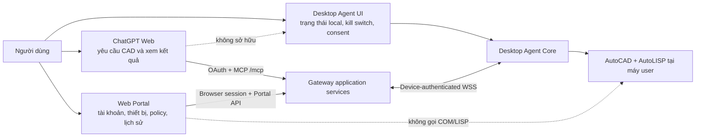
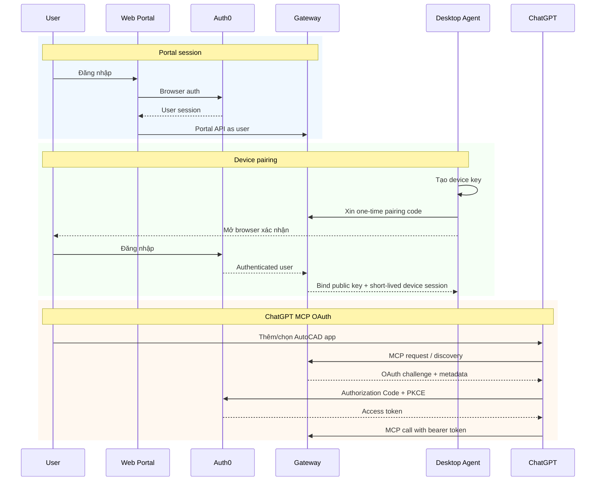

# Phụ lục kiến trúc giao diện người dùng

> Tài liệu phụ cho [Kế hoạch nâng cấp AutoCAD MCP nhiều người dùng](./fastmcp-multi-user-autocad-plan.md)
>
> Nguồn thảo luận UI: [context.md](./context.md)
>
> Ngày rà soát: 2026-07-21
>
> Trạng thái: **phần Desktop Agent Lab read-only của Phase 4 C1 đã được triển khai ngày 2026-07-22; Portal, write lock, risk mode, pairing production và các UI Phase 5+ vẫn là đề xuất, chưa phê duyệt để triển khai**
>
> Phạm vi: Desktop Agent, Web Portal, trang quản trị, onboarding, confirmation/approval và trạng thái người dùng; **không thay đổi code hay dependency**

## 1. Kết luận tương thích

Định hướng trong `context.md` **tương thích phần lớn** với kiến trúc ứng dụng:

- Người dùng làm việc chính trong ChatGPT Web.
- Desktop Agent là cầu nối có trạng thái, chạy trên Windows và giữ toàn bộ COM/File IPC/AutoLISP ở máy người dùng.
- Web Portal quản tài khoản, thiết bị, cài đặt an toàn, lịch sử và tải Agent.
- Không xây thêm trình chat, trình vẽ CAD hoặc DWG viewer trong Portal ở MVP.
- Desktop Agent chạy trong phiên Windows tương tác của user, có system tray và tự phát hiện AutoCAD.
- Portal không chứa logic CAD và không gọi AutoCAD trực tiếp.

Tuy nhiên, phải chỉnh bốn điểm trước khi coi thảo luận UI là một phần của kiến trúc:

1. **“Đăng nhập Agent” phải là pairing thiết bị**, không biến access token của user thành device credential lâu dài.
2. **Ba quyền trong ChatGPT, ba risk mode của sản phẩm và công tắc write trên Agent là ba lớp khác nhau**, không được gộp thành một dropdown.
3. **Portal không sở hữu trạng thái app/plugin bên trong ChatGPT.** Nó chỉ được hiển thị dữ kiện Gateway biết, như lần MCP call thành công gần nhất.
4. **Auto-update chưa thuộc Agent MVP.** MVP chỉ hiển thị phiên bản và hướng dẫn cập nhật có chữ ký; tự động cập nhật thuộc phase hardening sau pilot.

### 1.1. Ma trận đối chiếu

| Đề xuất trong `context.md` | Mức tương thích | Quyết định trong phụ lục |
| --- | --- | --- |
| ChatGPT Web là nơi làm việc chính | Tương thích | Giữ nguyên. Không xây chat riêng trong Portal. |
| Desktop Agent dùng Python + PySide6 | Tương thích có điều kiện | Chọn cho POC/MVP UI; pin version, kiểm packaging, DPI, antivirus và license trước pilot. Repo hiện chưa có dependency PySide6. |
| Portal dùng Next.js + TypeScript + Tailwind + shadcn/ui | Tương thích có điều kiện | Dùng như app frontend riêng; không được truy cập SQLite trực tiếp hoặc chứa domain policy. Repo hiện chưa có frontend/package Node. |
| Agent tự phát hiện và reconnect AutoCAD | Tương thích | Agent Core sở hữu state machine; UI chỉ render state và cho retry thủ công khi cần. |
| System tray và tự khởi động khi user đăng nhập | Tương thích | Giữ; không chạy phần AutoCAD integration dưới `LocalSystem`. |
| Nút bật/tắt điều khiển từ ChatGPT | Tương thích một phần | Đổi nhãn chính thành “Cho phép ChatGPT chỉnh sửa”; OFF chặn write. Thêm “Tạm dừng mọi tác vụ” cho emergency/hard pause. |
| `Chỉ xem / Hỏi trước khi sửa / Cho phép sửa` | Chưa tương thích với domain model | Tách thành write lock và risk mode `An toàn / Cân bằng / Tự động`; không tạo bộ mode thứ hai. |
| Agent login bằng browser Auth0 và lưu token | Tương thích một phần | Browser dùng để xác nhận pairing; Agent lưu device private key/credential, không dùng user token làm danh tính WSS lâu dài. |
| Portal có trạng thái “ChatGPT đã kết nối” | Chưa đủ dữ liệu | Hiển thị `Chưa ghi nhận / Đã xác thực gần đây / Lỗi xác thực gần đây`, dựa trên audit thật; không tuyên bố biết app có đang được chọn trong chat. |
| Portal có nút “Ngắt kết nối ChatGPT” | Tương thích một phần | Đổi thành “Thu hồi quyền truy cập”; giải thích user có thể còn phải gỡ app trong ChatGPT. |
| Portal yêu cầu Agent cập nhật | Tương thích một phần | Chỉ gửi notification/policy `recommended` hoặc `required`; không gửi lệnh chạy installer tùy ý. |
| Agent tự động cập nhật trong MVP | Không khớp roadmap | MVP chỉ thông báo + installer có chữ ký; auto-update sau pilot. |
| `agent.cad...` và `api.cad...` riêng | Có thể dùng, chưa cần | MVP ưu tiên một origin và route tách; chỉ tách subdomain khi vận hành cần. |
| Admin tách khỏi Portal user | Tương thích | Tách route, role và API; có thể vẫn chung codebase/deployment ban đầu. |
| Billing để chỗ sẵn | Chưa cần | Chỉ giữ navigation/feature placeholder nếu có kế hoạch thật; không thiết kế schema billing trong MVP. |

## 2. Thứ tự ưu tiên tài liệu

Khi có mâu thuẫn:

1. Kế hoạch kiến trúc chính quyết định security boundary, ownership, risk, job state, AutoLISP và protocol.
2. Phụ lục này quyết định cách biểu diễn các khái niệm đó cho người dùng.
3. `context.md` là nguồn ý tưởng và wireframe, không phải contract triển khai.

UI không được tự tạo thêm quyền hoặc state chỉ vì cách diễn đạt thuận tiện. Ví dụ, một nút có chữ “Đã kết nối ChatGPT” không thể biến thành nguồn sự thật nếu Gateway không nhận được bằng chứng tương ứng.

## 3. Nguyên tắc sản phẩm

1. **ChatGPT là giao diện làm việc chính.** Người dùng mô tả việc CAD, xem kết quả và tiếp tục hội thoại tại đây.
2. **Agent chỉ hiển thị trạng thái và điểm kiểm soát local.** Nó không phải CAD editor hoặc chat client.
3. **Portal quản lý, không điều khiển CAD trực tiếp.** Portal tạo policy/consent/job-management request qua Gateway application services.
4. **Một state chỉ có một nguồn sự thật.** UI khác nhau đọc cùng state, không tự suy đoán và ghi đè lẫn nhau.
5. **Nói ngôn ngữ người dùng.** Màn hình chính không hiển thị COM, IPC, WSS, JWT, scope, payload hash hoặc stack trace.
6. **Thông tin kỹ thuật nằm trong diagnostics có kiểm soát.** Dữ liệu copy ra phải loại token, full path nhạy cảm, full CAD Program và LISP cấp 3.
7. **Risk floor không thể bị UI hạ thấp.** Mode Tự động vẫn không bỏ approval high-risk hoặc mở very-high operation.
8. **Mọi destructive action trong Portal phải mô tả hậu quả.** `Revoke`, `remove`, `unpair`, `delete account` là các hành động khác nhau.

## 4. Ba bề mặt và ranh giới trách nhiệm



| Bề mặt | Việc nên làm | Việc không nên làm |
| --- | --- | --- |
| ChatGPT Web | Nhận ý định, chọn device, gọi tool cấp cao, trình bày preview/result, tiếp tục self-correct | Quản device key, tự bật LISP cấp 3, tự tạo high-risk approval. |
| Desktop Agent UI | Pair/unpair, trạng thái Gateway/AutoCAD/document, write lock, hard pause, local consent, diagnostics, update notice | Host MCP public, quản tenant, hiển thị toàn bộ audit của user, cho sửa CAD bằng UI riêng. |
| Web Portal | Account, devices, default device, risk policy, LISP cấp 3 opt-in, activity, downloads, admin | Gửi COM/LISP trực tiếp, truy cập DB không qua application service, thay ChatGPT bằng chat riêng. |

## 5. Nguồn sự thật của từng trạng thái

| Dữ liệu hiển thị | Nguồn sự thật | UI được phép làm gì |
| --- | --- | --- |
| User identity/profile | Auth0 + `users` mapping ở Gateway | Portal hiển thị; Agent chỉ hiển thị account đã pair ở mức tối thiểu. |
| Device ownership/revoke | Gateway SQLite `devices` | Portal rename/default/revoke; Agent không tự đổi owner. |
| Gateway online | WSS session + heartbeat | Agent hiển thị realtime; Portal dùng last heartbeat. |
| AutoCAD/document/busy/modal | Agent runtime + heartbeat | Agent hiển thị realtime; Portal/ChatGPT đọc snapshot/presence có timestamp. |
| Write lock/hard pause | Agent local state, đồng bộ lên Gateway | Agent thay đổi ngay local; Portal có thể yêu cầu nhưng Agent là enforcement cuối. |
| Risk mode | Gateway `execution_policies`, Agent giữ signed/versioned cache | Portal/Agent Settings chỉnh qua authenticated policy API; model không chỉnh. |
| LISP cấp 3 opt-in | Gateway policy + Agent local enforcement | Chỉ trusted Portal/Agent UI của user/admin được bật; tool payload không được bật. |
| Job/progress/result | Gateway durable job + Agent ledger/reconcile | Các UI chỉ đọc và gửi cancel/rollback request có điều kiện. |
| Confirmation/approval | Gateway consent record, được tạo từ trusted UI | Agent/Portal tạo record đúng digest; ChatGPT tool không tự approve. |
| ChatGPT app đang được chọn trong conversation | ChatGPT client | Portal không được khẳng định trạng thái này. |
| Lần MCP call/OAuth thành công gần nhất | Gateway audit | Portal được hiển thị timestamp và actor/client evidence. |
| Agent release/update policy | Signed release manifest + Gateway policy | Agent xác minh chữ ký/hash; admin chỉ chọn recommended/required version. |

## 6. Desktop Agent

### 6.1. Lựa chọn công nghệ

**Đề xuất POC/MVP: Python + PySide6 Widgets.**

Lý do phù hợp kiến trúc:

- Agent Core và AutoCAD adapters đều là Python/pywin32.
- UI có thể gọi application-facing interface trong cùng package mà không cần Rust/JavaScript sidecar.
- Qt for Python có `QSystemTrayIcon` cho tray/menu/notification và có `pyside6-deploy` để tạo bản phân phối Windows.
- UI nhỏ, chủ yếu là trạng thái, button, dialog và settings; không cần web runtime riêng.

Đây chưa phải dependency được duyệt. Trước pilot cần POC:

- đóng gói `onefile` và `standalone`, đo startup/RAM/dung lượng;
- thử Windows 10/11, DPI 100–200%, multi-monitor và dark/light theme;
- kiểm antivirus/SmartScreen và code-signing;
- kiểm event-loop với asyncio/WSS/COM;
- rà nghĩa vụ license Qt/PySide6 cho cách phân phối thực tế.

Tài liệu Qt xác nhận `QSystemTrayIcon` hỗ trợ icon, context menu và trạng thái visible; `pyside6-deploy` có cấu hình deployment reproducible và hỗ trợ `onefile`/`standalone`:

- [QSystemTrayIcon](https://doc.qt.io/qtforpython-6/PySide6/QtWidgets/QSystemTrayIcon.html)
- [pyside6-deploy](https://doc.qt.io/qtforpython-6/deployment/deployment-pyside6-deploy.html)

### 6.2. Ranh giới code

```text
Desktop Agent UI (PySide6)
  -> Agent application facade / observable state
  -> Agent Core: connection, pairing, policy, ledger, executor
  -> AutoCAD runtime adapter: COM, File IPC, AutoLISP
```

Quy tắc:

- Widget không gọi trực tiếp `FileIPCBackend` hoặc COM.
- UI subscribe một immutable `AgentViewState` và gửi typed intent như `retry_autocad`, `set_write_lock`, `approve_preview`.
- Agent Core không import widget cụ thể; có thể chạy headless trong test.
- UI thread không chạy WSS/COM blocking operation.
- Đóng cửa sổ chỉ hide xuống tray; menu `Thoát Agent` mới dừng process sau khi kiểm job đang chạy.

### 6.3. Cửa sổ chính

```text
┌──────────────────────────────────────────────┐
│  Kỹ Thuật Vàng AutoCAD Agent                 │
├──────────────────────────────────────────────┤
│  Thiết bị: PC Văn phòng              ● Sẵn sàng│
│                                              │
│  Máy chủ                         ● Đã kết nối │
│  AutoCAD                         ● Đã kết nối │
│  Bản vẽ                          mat-bich.dwg  │
│  Tác vụ                          Không có      │
│                                              │
│  Cho phép ChatGPT chỉnh sửa          [ BẬT ]  │
│  Chế độ an toàn                     Cân bằng  │
│                                              │
│  [ Kết nối lại ]       [ Mở trang quản lý ]  │
│                                              │
│  Cài đặt nâng cao · Hỗ trợ · Phiên bản 1.2.0 │
└──────────────────────────────────────────────┘
```

Điều chỉnh so với wireframe nguồn:

- Không dùng một công tắc mơ hồ “Điều khiển từ ChatGPT”. Công tắc chính chỉ rõ nó kiểm soát **write**.
- Hiển thị `Tác vụ` để user biết Agent đang chạy job từ xa hay AutoCAD đang bận do user.
- `Đăng xuất` được thay bằng `Gỡ liên kết thiết bị` trong Settings; đây là destructive action cần confirm.
- `Kết nối lại` retry cả Gateway/AutoCAD theo phần đang lỗi; bình thường Agent tự reconnect.
- `Mở AutoCAD` chỉ thêm sau POC chứng minh cách chọn đúng installation/profile. Gateway không được gửi raw executable path.

### 6.4. State nội bộ và câu chữ người dùng

Màn hình chính vẫn chỉ có vài dòng, nhưng không được làm mất các state quan trọng của kiến trúc:

| Agent state | Nhãn chính | Mô tả/hành động |
| --- | --- | --- |
| `offline` | Mất kết nối máy chủ | “Đang thử kết nối lại…”; cho retry và diagnostics. |
| `connecting` | Đang kết nối | Không hiện lỗi đỏ khi vẫn trong retry window. |
| `online_idle` | Sẵn sàng | Gateway và AutoCAD/document đều hợp lệ. |
| `online_busy_user` | AutoCAD đang được sử dụng | Không đổ lỗi; remote job chờ hoặc từ chối theo deadline. |
| `online_busy_remote` | ChatGPT đang thực hiện tác vụ | Hiển thị tên tác vụ dễ hiểu và nút xem chi tiết/cancel nếu còn an toàn. |
| `modal_dialog` | AutoCAD đang chờ hộp thoại | “Hãy xử lý hộp thoại trong AutoCAD rồi thử lại.” |
| `autocad_closed` | AutoCAD chưa mở | Cho `Thử lại`; `Mở AutoCAD` chỉ khi capability đã được chứng minh. |
| `no_document` | Chưa mở bản vẽ | “Hãy mở một bản vẽ trong AutoCAD.” |
| `paused_by_user` | Đã tạm dừng | Nói rõ read/write nào đang bị chặn. |
| `update_required` | Cần cập nhật Agent | Không nhận job không tương thích; dẫn tới signed installer. |
| `incompatible` | Phiên bản không tương thích | Hiển thị mã hỗ trợ, không show protocol internals trên màn hình chính. |

Error kỹ thuật vẫn giữ trong diagnostic bundle dưới `cause_code`, nhưng user copy phải ngắn và có bước tiếp theo.

### 6.5. Hai công tắc local khác nhau

Để giải quyết mâu thuẫn giữa `context.md` và `paused_by_user`, Agent có hai hành động:

| Điều khiển | Tác dụng | Presence/read | Write |
| --- | --- | --- | --- |
| **Cho phép ChatGPT chỉnh sửa** | Write lock thường ngày | Gateway vẫn thấy máy; ChatGPT có thể đọc trạng thái/snapshot theo policy | OFF thì từ chối mọi write trước dispatch/execution. |
| **Tạm dừng mọi tác vụ từ xa** | Emergency/hard pause | Chỉ heartbeat/presence và local diagnostics tiếp tục; command đọc mới cũng có thể bị từ chối | Từ chối job mới; job đang chạy cancel ở safe boundary, không gửi ESC mù. |

Tray phải có hard pause vì đây là điểm xử lý nhanh nhất. Cửa sổ chính ưu tiên write lock vì dễ hiểu hơn cho dùng hằng ngày.

### 6.6. Ba lớp quyền không được gộp

| Lớp | Nơi cấu hình | Giá trị | Mục đích |
| --- | --- | --- | --- |
| Device write lock | Agent và device detail trong Portal | Chỉ đọc / Cho phép chỉnh sửa | Kill switch local per device. |
| Product risk mode | Portal/Agent Settings | An toàn / Cân bằng / Tự động | Quyết định direct, preview, confirmation, approval theo risk matrix. |
| ChatGPT app permission | Cài đặt Apps/Plugins trong ChatGPT | Do ChatGPT cung cấp | Quyết định ChatGPT có hỏi thêm trước tool call hay không. |

Ba lựa chọn trong `context.md` được chuyển như sau:

| Câu chữ cũ | Mapping đúng |
| --- | --- |
| `Chỉ xem` | Device write lock OFF. |
| `Hỏi trước khi sửa` | Không tạo mode mới; gần nhất là product mode `An toàn`. |
| `Cho phép sửa` | Device write lock ON, sau đó vẫn phải chọn `An toàn`, `Cân bằng` hoặc `Tự động`. |

Đề xuất cho pilot: account mới dùng mode **An toàn**, LISP cấp 3 OFF. Đây là đề xuất UI cần được phê duyệt để đóng open question trong kế hoạch chính.

ChatGPT hiện có permission settings riêng và dùng tool annotations cùng permission đó để quyết định confirmation. Các cài đặt này không thay domain enforcement của Gateway/Agent; high-risk approval vẫn phải có trusted record đúng digest. [OpenAI – Connect from ChatGPT](https://developers.openai.com/apps-sdk/deploy/connect-chatgpt)

### 6.7. Confirmation và approval dialog

Agent UI là trusted channel đầu tiên ở POC C2.

**Medium-risk confirmation:**

```text
ChatGPT muốn thêm 18 kích thước vào mat-bich.dwg

Thiết bị: PC Văn phòng
Ảnh hưởng: 18 đối tượng mới
Preview: [Xem hình] [Xem tóm tắt]

[Từ chối]                         [Xác nhận]
```

**High-risk approval:**

```text
Thao tác rủi ro cao

Xóa 42 đối tượng khỏi mat-bich.dwg
Preview revision: 17
Approval hết hạn sau: 4:32

Thao tác chỉ áp dụng cho đúng preview này.

[Từ chối]                    [Phê duyệt một lần]
```

**AutoLISP cấp 3:** bổ sung intent, code size, estimated entity count, code hash rút gọn và nút xem code trong panel riêng. Sửa code, đổi document hoặc hết TTL làm dialog cũ vô hiệu. Không có nút “Luôn cho phép LISP cấp 3”.

Dialog không được:

- chỉ hỏi `Bạn có chắc không?` mà thiếu device/document/diff;
- nhận một boolean `confirm=true` từ tool call;
- cho approve khi preview không rollback sạch;
- che trạng thái `outcome_unknown` bằng thông báo “thất bại” đơn giản.

Nếu outcome không xác định:

```text
Không thể xác định thao tác đã hoàn tất hay chưa.

Không chạy lại lệnh. Hãy mở bản vẽ và kiểm tra thay đổi.
[Xem chi tiết] [Mở hướng dẫn khôi phục]
```

### 6.8. System tray

```text
● Máy chủ: Đã kết nối
● AutoCAD: Sẵn sàng

Mở Agent
Cho phép chỉnh sửa       ✓
Tạm dừng mọi tác vụ
Mở Web Portal
Hỗ trợ kỹ thuật
Thoát Agent
```

Nếu có job đang chạy, `Thoát Agent` mở confirm giải thích hậu quả; không kill process ngay. Nếu một AutoLISP command không thể cancel an toàn, UI nói rõ Agent sẽ thoát sau safe boundary hoặc chuyển outcome sang cần kiểm tra.

### 6.9. Pairing thay cho login truyền thống

Màn hình đầu tiên có nút:

```text
Liên kết thiết bị với tài khoản
```

Không dùng form email/password trong Agent. Browser login chỉ xác nhận user nào sở hữu device key vừa tạo. Sau khi pair:

- Agent giữ Ed25519 private key trong DPAPI/Credential Manager hoặc secret storage tương đương;
- Gateway giữ public key, owner và trạng thái revoke;
- WSS dùng device challenge/session token ngắn hạn;
- Agent không cần giữ refresh token của user như danh tính thiết bị lâu dài.

`Gỡ liên kết thiết bị` phải:

1. cảnh báo job đang chạy;
2. revoke device ở Gateway khi online;
3. xóa local device credential sau khi có bằng chứng revoke hoặc theo recovery procedure;
4. không xóa tài khoản user hoặc drawing.

### 6.10. Diagnostics và privacy

Mục `Hỗ trợ kỹ thuật`:

- Kiểm tra kết nối.
- Sao chép mã hỗ trợ.
- Tạo diagnostic bundle.
- Mở thư mục log.
- Mở trang hỗ trợ.

Diagnostic bundle được allowlist field, không copy nguyên log folder. Tối thiểu gồm:

- Agent/Windows/AutoCAD version;
- device ID rút gọn và session state;
- package/compiler manifest hashes;
- last heartbeat/job/correlation IDs;
- error/cause codes;
- timestamp và redaction report.

Không gồm token, private key, full path, drawing content, screenshot, full CAD Program hoặc full LISP cấp 3 nếu user chưa chủ động chọn đính kèm.

### 6.11. Update UX

| Giai đoạn | UI | Hành vi |
| --- | --- | --- |
| C1–C2 | `Phiên bản`, `Đã mới nhất`, `Có bản mới` | User mở/download signed installer thủ công; Agent xác minh manifest/hash/signature. |
| Pilot hardening | `Khuyến nghị cập nhật` / `Bắt buộc cập nhật trước khi chạy job mới` | Gateway policy chọn min/recommended version; không force giữa job. |
| Sau pilot | `Cập nhật và khởi động lại` | Chỉ sau khi signed updater, staged rollout và rollback installer được kiểm thử. |

Admin action “Yêu cầu cập nhật” chỉ thay policy/notification. Nó không gửi executable path hay command tùy ý cho Agent.

## 7. Web Portal

### 7.1. Lựa chọn công nghệ và ranh giới

**Đề xuất:** Next.js App Router + TypeScript + Tailwind CSS + shadcn/ui, dùng Auth0 cho browser login.

Stack này tương thích nếu Portal là một frontend/BFF mỏng:

```text
apps/web_portal/
  -> authenticated Portal API
  -> Gateway application services
  -> repositories/domain
```

Không được:

- import Python domain bằng workaround;
- đọc/ghi file SQLite trực tiếp;
- gọi `/agent/ws` như device;
- gọi public MCP tools để quản lý user/device;
- chứa một bản risk engine khác với Gateway.

Next.js có hướng dẫn tách authentication, session management và authorization; Portal vẫn phải kiểm authorization ở Gateway cho mọi resource, không tin route guard phía trình duyệt. [Next.js authentication guide](https://nextjs.org/docs/app/guides/authentication)

### 7.2. Information architecture MVP

Portal user có sáu khu vực, nhưng phần device detail chứa đầy đủ policy:

1. **Tổng quan**
2. **Thiết bị**
3. **Kết nối ChatGPT**
4. **Hoạt động**
5. **Tải Desktop Agent**
6. **Tài khoản**

Admin dùng route/navigation riêng và role riêng.

### 7.3. Tổng quan

Hiển thị dữ kiện có timestamp:

```text
Thiết bị online             2
AutoCAD sẵn sàng            1
Tác vụ đang chạy            0
Cần bạn xác nhận            1
```

Không cộng `online` từ record device chưa bị revoke. Online phải dựa trên heartbeat TTL. `AutoCAD sẵn sàng` phải loại busy/modal/no-document.

### 7.4. Thiết bị

Card/list tối thiểu:

```text
PC Văn phòng                                      ● Online

AutoCAD Mechanical 2025
Bản vẽ: mat-bich.dwg
Quyền chỉnh sửa: Bật · Chế độ: Cân bằng
Agent 1.2.0 · Hoạt động: Vừa xong

[Đặt mặc định] [Đổi tên] [Mở chi tiết]
```

Device detail:

- Rename.
- Set/unset default.
- Write lock.
- Risk mode: An toàn/Cân bằng/Tự động.
- Capability summary và AutoCAD/Agent version.
- AutoLISP cấp 3 danger zone, OFF mặc định.
- Last activity/jobs.
- Revoke access.
- Remove record sau revoke theo retention policy.

`Thu hồi quyền` và `Xóa thiết bị` không đặt cạnh nhau với cùng màu/ý nghĩa:

- **Revoke:** đóng session, chặn reconnect, giữ audit/job history.
- **Remove khỏi danh sách:** chỉ được thực hiện sau revoke và theo retention; không xóa audit bắt buộc.

Nếu user có một device online/ready, ChatGPT/Gateway có thể chọn theo policy. Nếu có nhiều device và chưa có default phù hợp, ChatGPT phải hỏi hoặc trả danh sách; Portal không tự chuyển default theo trạng thái online.

### 7.5. Kết nối ChatGPT

Trang này hữu ích cho onboarding, nhưng phải dùng các nhãn có thể chứng minh:

```text
Kết nối ChatGPT với AutoCAD

Máy chủ MCP: Sẵn sàng
Lần xác thực thành công gần nhất: 10:42, 21/07/2026
Lần dùng AutoCAD MCP gần nhất: 10:45, 21/07/2026

MCP URL
https://cad.kythuatvang.com/mcp        [Sao chép]

[Mở hướng dẫn kết nối] [Mở cài đặt ChatGPT]
[Thu hồi quyền truy cập]
```

Không hiển thị một boolean “Đã kết nối” nếu chỉ có health check. Gateway không biết chắc:

- app có còn nằm trong danh sách ChatGPT hay không;
- app có đang được chọn trong conversation hiện tại hay không;
- user đã đổi permission level bên trong ChatGPT hay chưa.

Đây là suy luận kiến trúc từ việc luồng cài app, chọn app trong conversation và permission settings đều nằm trong ChatGPT. Tài liệu OpenAI hiện hướng dẫn user tạo/quản lý app trong ChatGPT, nhập public `/mcp` URL, rồi chọn app trong một chat mới. [OpenAI – Connect from ChatGPT](https://developers.openai.com/apps-sdk/deploy/connect-chatgpt)

`Kiểm tra kết nối` được tách thành:

- `Kiểm tra máy chủ`: Portal gọi health/readiness phù hợp, không chứng minh OAuth của ChatGPT.
- `Kiểm tra tài khoản`: xác minh Portal session/user mapping.
- `Dùng thử trong ChatGPT`: mở hướng dẫn và yêu cầu user gọi một read-only tool; Gateway ghi nhận audit thành công.

`Thu hồi quyền truy cập` phải giải thích:

- Gateway/Auth0 revoke grant/session/token theo khả năng provider;
- access token đã phát có thể còn hiệu lực tới khi hết hạn nếu không có immediate revocation/introspection;
- user có thể cần remove/disable app trong ChatGPT để hoàn tất phía client.

POC dùng developer mode. Khi phát hành rộng, copy/hướng dẫn phải chuyển sang luồng app/plugin đã publish; không bắt end user cấu hình developer mode nếu distribution model không yêu cầu.

### 7.6. Hoạt động

Hiển thị event summary do Gateway dựng, không render raw logs:

```text
10:42 — ChatGPT đọc trạng thái mat-bich.dwg
10:45 — Đã tạo preview cho 18 kích thước
10:47 — Bạn xác nhận thay đổi
10:47 — Đã thêm 18 kích thước
```

Filter:

- Device.
- Document display name/fingerprint an toàn.
- Thời gian.
- Read/preview/write/rollback.
- Thành công/thất bại/cần kiểm tra.

Event high-risk/LISP cấp 3 hiển thị code hash và link artifact theo quyền, không show full code trong table. `outcome_unknown` phải nổi bật và không được gộp vào `failed`.

### 7.7. Tải Desktop Agent

Hiển thị:

- latest stable version;
- Windows/AutoCAD versions đã được xác nhận, không viết “mọi phiên bản”;
- release date, file size, SHA-256/signature status;
- ba bước cài đặt;
- link release notes và known issues.

OS detection chỉ là gợi ý. Server không thay đổi download tự động dựa trên User-Agent nếu có nguy cơ trả nhầm architecture/channel.

### 7.8. Tài khoản

MVP:

- Display name/email từ identity provider.
- Default risk mode.
- Sessions/paired devices link.
- Sign out Portal.
- Sign out/revoke all devices với confirmation riêng.
- Account deletion request và tác động/retention rõ ràng.

Đổi password thực hiện qua Auth0/account provider, không tạo password form riêng trong Portal.

Billing/package chỉ thêm khi domain/subscription đã được duyệt. Không để một menu trống hoặc giá giả trong MVP.

### 7.9. Admin

Admin có thể chung Next.js app ban đầu nhưng phải tách:

- route `/admin`;
- server-side role check;
- API namespace;
- audit actor/reason;
- navigation và error boundary.

MVP admin:

- users/devices online và version distribution;
- failed/unknown jobs;
- revoke user/device;
- cohort/feature kill switches;
- min/recommended Agent version;
- audit search theo ID/timestamp, không secret dump;
- plan/quota view nếu domain đã có.

Không cần chart phức tạp. Table/filter/export bounded hữu ích hơn.

## 8. Ba luồng danh tính độc lập



Không dùng lẫn credential:

| Credential | Holder | Dùng cho | Không dùng cho |
| --- | --- | --- | --- |
| Portal browser session | Browser/Portal BFF | Portal API | Agent WSS hoặc MCP call thay ChatGPT. |
| Device private key/session token | Desktop Agent | `/agent/ws` | Đăng nhập Portal hoặc đại diện user gọi MCP. |
| ChatGPT OAuth access token | ChatGPT | `/mcp` | Lưu trong Agent hoặc truyền qua Portal UI. |

OpenAI mô tả ChatGPT là OAuth client, Auth0/IdP là authorization server và MCP Gateway là resource server; Gateway phải tự verify issuer, audience, expiry và scopes trên từng request. [OpenAI – Apps SDK authentication](https://developers.openai.com/apps-sdk/build/auth)

Việc Desktop Agent dùng Authorization Code + PKCE hay một pairing browser flow/Device Authorization Grant riêng vẫn là quyết định POC. Dù chọn cách nào, kết quả lâu dài phải là **device identity**, không phải user bearer token được giữ vô hạn trong Agent.

## 9. URL và API boundary

MVP ưu tiên một public origin để giảm cookie/CORS/proxy complexity:

```text
https://cad.kythuatvang.com/                  Web Portal
https://cad.kythuatvang.com/mcp               FastMCP endpoint
https://cad.kythuatvang.com/api/portal/v1/*   Portal API
https://cad.kythuatvang.com/agent/ws          Agent WSS
https://cad.kythuatvang.com/downloads/*       Signed installer/manifest
https://cad.kythuatvang.com/admin              Admin UI
```

Route có auth riêng:

| Route | Principal | Auth |
| --- | --- | --- |
| `/mcp` | ChatGPT acting for user | OAuth bearer + FastMCP/domain authorization. |
| `/api/portal/v1/*` | Browser user | Auth0-backed browser session/BFF; CSRF cho mutation. |
| `/agent/ws` | Device | Device key challenge + short-lived session token. |
| `/admin`, `/api/admin/v1/*` | Admin human | Browser session + server-side admin role + audit reason. |
| `/downloads/*` | Public hoặc authenticated theo release | Signed metadata; không cho path tùy ý. |

Conceptual Portal API, không phải contract implementation cuối:

```text
GET    /api/portal/v1/me
GET    /api/portal/v1/overview
GET    /api/portal/v1/devices
PATCH  /api/portal/v1/devices/{id}
POST   /api/portal/v1/devices/{id}/revoke
PUT    /api/portal/v1/devices/{id}/execution-policy
GET    /api/portal/v1/activity
GET    /api/portal/v1/chatgpt-evidence
GET    /api/portal/v1/agent-releases/latest
POST   /api/portal/v1/consents/{id}/confirm
POST   /api/portal/v1/consents/{id}/deny
```

Mọi endpoint nhận principal từ session, không nhận `user_id` tin cậy từ browser payload. Repository query vẫn owner-scoped như kiến trúc chính.

Chỉ tách `agent.cad...` hoặc `api.cad...` khi có lý do vận hành rõ: independent deployment, mTLS policy, CDN/cache boundary hoặc team ownership. User-facing UI vẫn chỉ quảng bá Portal URL và MCP URL cần thiết.

## 10. Onboarding chuẩn

```text
1. User vào cad.kythuatvang.com và đăng nhập.
2. Portal cho tải signed Desktop Agent.
3. User cài và chạy Agent trong phiên Windows của mình.
4. Agent tạo device key và user bấm “Liên kết thiết bị”.
5. Browser/Auth0 xác nhận account và Gateway bind public key.
6. Agent tự kết nối Gateway, phát hiện AutoCAD và active document.
7. Portal hiển thị “Thiết bị sẵn sàng” dựa trên heartbeat thật.
8. User làm theo hướng dẫn thêm AutoCAD app/MCP trong ChatGPT.
9. ChatGPT OAuth với Auth0; Gateway nhận first authenticated MCP call.
10. Portal hiển thị “Đã ghi nhận kết nối gần đây” kèm timestamp.
11. Từ đây user làm việc chính trong ChatGPT.
```

Không yêu cầu end user:

- tạo tunnel/subdomain riêng;
- copy token;
- sửa `.env`;
- mở terminal;
- chọn port;
- cấu hình từng device thành một MCP server riêng.

POC/developer mode có thể cần copy MCP URL. Luồng production published app/plugin có thể loại bỏ bước này; onboarding copy phải version theo distribution stage và tài liệu OpenAI hiện hành.

## 11. Phân bổ theo roadmap kiến trúc

| Phase/POC | UI tối thiểu phải có | Chưa làm trong phase |
| --- | --- | --- |
| Phase 0–3 / A–B | Không cần UI sản phẩm; fake status/contract test | PySide6, Portal production. |
| Phase 4 / C1 | Agent lab window: Gateway, AutoCAD, document, retry, diagnostics, hard pause; ChatGPT Web E2E | Write mode, approval, full Portal. |
| Phase 5 / E | Pairing browser page, device list, revoke, two-user isolation, minimal Portal login | CAD Program/write. |
| Phase 6 / D | Simulator UI/Portal representation cho risk report, preview và ba mode | Real AutoCAD commit UI. |
| Phase 7 / F | Job status cho reconnect/outcome unknown và recovery instruction | Broad end-user polish. |
| Phase 8 / C2 | Trusted local confirmation/approval, write lock, risk settings, rollback, LISP cấp 3 danger zone | Auto-update rộng, billing. |
| Phase 9–10 | Skill/activity/scene summaries có bounded refs | Web CAD editor/3D viewer. |
| Phase 11 | Full Portal/admin MVP, signed installer/update UX, retention/support/runbook | HA/mobile/team nếu chưa có nhu cầu. |

Portal không phải một “big bang” ở Phase 11: pairing page/device list tối thiểu xuất hiện từ Phase 5. Phase 11 mới hoàn tất product polish, admin và operations.

## 12. Trạng thái tải và lỗi trên UI

Mọi action bất đồng bộ cần ba tầng feedback:

1. **Admission:** request đã được Gateway chấp nhận hay từ chối ngay.
2. **Execution:** queued/waiting/running/progress hoặc waiting for user.
3. **Outcome:** succeeded/failed/cancelled/rolled back/needs attention.

Không dùng spinner vô hạn. UI phải luôn có:

- job/correlation support ID;
- timestamp cuối;
- lý do đang chờ dễ hiểu;
- retry chỉ khi operation/policy cho phép;
- không hiện nút retry cho `outcome_unknown` write.

Các copy mẫu:

| Domain state/error | Copy người dùng |
| --- | --- |
| `autocad_busy` | “AutoCAD đang được sử dụng. Tác vụ chưa chạy.” |
| `modal_dialog_active` | “AutoCAD đang chờ một hộp thoại. Hãy xử lý hộp thoại rồi thử lại.” |
| `document_changed` | “Bản vẽ đã thay đổi sau khi tạo preview. Hãy tạo preview mới.” |
| `risk_confirmation_required` | “Cần bạn xác nhận preview trước khi tiếp tục.” |
| `lisp_level3_disabled` | “AutoLISP nâng cao chưa được bật cho thiết bị này.” |
| `approval_expired` | “Phê duyệt đã hết hạn vì lý do an toàn. Hãy xem preview mới.” |
| `outcome_unknown` | “Không thể xác định thao tác đã chạy xong hay chưa. Hệ thống sẽ không tự chạy lại.” |
| `incompatible` | “Phiên bản Agent chưa tương thích. Hãy cập nhật trước khi tiếp tục.” |

## 13. Security và accessibility requirements

### 13.1. Security UI

- Không render access token/device secret/private key.
- Không để browser gửi owner `user_id` và tin vào nó.
- CSRF protection cho Portal cookie mutations.
- Re-auth hoặc recent-auth cho account deletion, revoke all, LISP cấp 3 opt-in và admin action quan trọng.
- Approval bind digest/revision/TTL; UI hiển thị dữ liệu server ký/xác nhận, không dữ liệu model tự ghi nhãn.
- External link/installer phải HTTPS và release signature/hash được Agent kiểm.
- Admin impersonation nếu có phải hiện banner và audit; MVP tốt nhất chưa có impersonation.

### 13.2. Accessibility và Windows UX

- Keyboard navigation và visible focus.
- Không chỉ dùng màu đỏ/xanh để biểu diễn state; có text/icon.
- Contrast đạt WCAG AA cho Portal; dialog Agent phải đọc được ở DPI cao.
- Vietnamese copy là mặc định; technical identifiers giữ nguyên khi cần support.
- Button destructive có label cụ thể, không chỉ “OK”.
- Dialog không bị ẩn sau AutoCAD; đồng thời không luôn-on-top làm gián đoạn CAD khi không cần.
- Notification tray không chứa drawing path hoặc nội dung nhạy cảm.

## 14. Verification plan khi triển khai

### 14.1. Desktop Agent UI

- Unit test mapping mọi Agent state/error sang copy/action.
- Test UI không gọi COM/backend trực tiếp.
- Test close-to-tray, exit during job và startup-with-Windows.
- Test write lock/hard pause được Agent Core enforce dù UI crash/restart.
- Test consent digest/TTL/document revision mismatch.
- Test DPI, keyboard, multi-monitor, AutoCAD modal/busy.
- Test installer/signature/upgrade/rollback trên clean Windows VM.

### 14.2. Portal

- Component tests cho device/risk/activity states.
- API tests cho owner isolation, CSRF, admin role và stale policy version.
- Playwright E2E: login, pair device, rename/default, revoke, risk mode, consent, activity filter, download.
- Negative E2E: user A đoán ID device/job/artifact của user B.
- Test ChatGPT page không hiển thị “đã kết nối” chỉ vì `/healthz` trả 200.
- Accessibility audit và responsive layout; mobile chỉ cần quản trị cơ bản, không chạy CAD.

### 14.3. E2E ba bề mặt

1. Pair Agent qua Portal.
2. ChatGPT `cad_observe` đúng device.
3. Low-risk write theo mode.
4. Medium-risk preview -> local confirm -> commit.
5. High-risk preview -> approval đúng digest -> commit.
6. Revoke device trong Portal -> socket đóng -> Agent UI đổi state -> ChatGPT call bị từ chối.
7. Network drop -> Portal/Agent/ChatGPT cùng phản ánh `outcome_unknown`, không surface nào cho retry mù.

## 15. Definition of Done cho UI appendix

- Ba surface có trách nhiệm và auth principal tách rõ.
- Agent main screen không có thuật ngữ kỹ thuật, nhưng state mapping không làm mất busy/modal/reconnect/unknown.
- User có write lock và hard pause rõ nghĩa.
- Risk mode chỉ là `An toàn / Cân bằng / Tự động`; LISP cấp 3 là opt-in riêng.
- Medium/high consent dialog hiển thị device, document, preview/diff, risk và expiry.
- Portal không đọc DB trực tiếp hoặc gọi AutoCAD/MCP như user.
- Trang ChatGPT chỉ hiển thị server evidence, không giả vờ sở hữu client state.
- Pairing lưu device identity, không dùng user token làm device identity.
- Update UX khớp phase và không cho Gateway remote-execute installer.
- Two-user/two-device UI/API tests không rò dữ liệu chéo.
- UI E2E đi qua C1 và C2 thật, không chỉ mock/HTTP 200.

## 16. Quyết định đã chốt và còn mở

### 16.1. Chốt trong phụ lục

1. ChatGPT Web là nơi làm việc chính.
2. Agent MVP dùng PySide6 nếu POC packaging/event-loop/license đạt.
3. Portal có thể dùng Next.js stack nhưng chỉ là frontend/BFF của Gateway services.
4. Agent pairing và ChatGPT OAuth là hai flow độc lập.
5. Write lock, risk mode và ChatGPT permission là ba lớp độc lập.
6. Portal không tuyên bố biết app đang được chọn trong ChatGPT.
7. Auto-update không thuộc MVP C1/C2.
8. Không xây chat/CAD editor/DWG viewer/mobile app/billing trong MVP.

### 16.2. Còn mở, cần POC/ADR

1. PySide6 exact version, Widgets hay QML, packaging mode và Qt license path.
2. Agent pairing dùng browser callback + one-time code, native PKCE hay Auth0 Device Authorization Grant.
3. Trusted consent channel lâu dài ưu tiên Agent tray hay Portal; POC C2 dùng Agent trước.
4. Default account mới có chính thức là An toàn hay Cân bằng; phụ lục đề xuất An toàn cho pilot.
5. `Mở AutoCAD` có được hỗ trợ và chọn đúng installation/profile bằng cách nào.
6. Portal/Next.js deploy chung host qua reverse proxy hay tách service/subdomain.
7. Cơ chế revoke Auth0 nào tạo được trạng thái gần-real-time và UI copy tương ứng.
8. Installer/updater, signing certificate, staged rollout và rollback technology.
9. Published app/plugin distribution thay developer-mode onboarding vào thời điểm nào.

## 17. Nguồn tham chiếu

- [Kiến trúc FastMCP multi-user của repo](./fastmcp-multi-user-autocad-plan.md)
- [Nội dung thảo luận UI ban đầu](./context.md)
- [OpenAI: Connect from ChatGPT](https://developers.openai.com/apps-sdk/deploy/connect-chatgpt)
- [OpenAI: Apps SDK authentication](https://developers.openai.com/apps-sdk/build/auth)
- [Qt for Python: QSystemTrayIcon](https://doc.qt.io/qtforpython-6/PySide6/QtWidgets/QSystemTrayIcon.html)
- [Qt for Python: pyside6-deploy](https://doc.qt.io/qtforpython-6/deployment/deployment-pyside6-deploy.html)
- [Next.js: Authentication guide](https://nextjs.org/docs/app/guides/authentication)
- [Microsoft: Interactive Services](https://learn.microsoft.com/en-us/windows/win32/services/interactive-services)
- [Microsoft: Credentials Management](https://learn.microsoft.com/en-us/windows/win32/secauthn/credentials-management)

