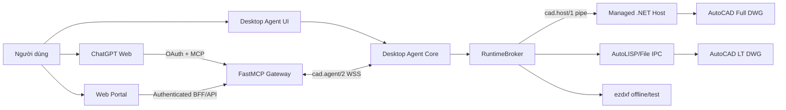

# Phụ lục kiến trúc giao diện người dùng — Runtime-aware Managed .NET primary

> Tài liệu phụ cho:
>
> - [fastmcp-multi-user-autocad-plan.md](./fastmcp-multi-user-autocad-plan.md)
> - [Phase-6-plus.md](./Phase-6-plus.md)
> - [Phase-6.md](./Phase-6.md)
> - [Phase-7.md](./Phase-7.md)
> - [Phase-8.md](./Phase-8.md)
>
> Ngày đồng bộ: 2026-07-26, sau merge PR #8.
>
> Trạng thái: Phase 5 runtime/identity/local-write foundation đã có engineering evidence. Phase 6 hiện là public CAD Program v0; Phase 7 là recovery/approval/rollback; Phase 8 là CAD Program v1.

## 1. Kết luận sản phẩm

- Người dùng làm việc chính trong ChatGPT Web.
- Desktop Agent là control plane local: pairing, runtime state, write lock, hard pause, trusted local confirmation, diagnostics và update shell.
- Web Portal quản account, device, policy, activity, approval, download và admin.
- Managed Host chạy trong AutoCAD nhưng không trở thành account/UI app riêng.
- Không xây chat riêng, CAD editor hoặc DWG viewer trong Portal ở các phase hiện tại.
- Portal và Agent UI không tự tạo domain state; chúng render state từ Gateway/Agent Core.
- Không có UI cho raw C#/DLL/LISP/command/path.
- Write không silent fallback runtime.
- Model không thể tự approve.

## 2. Bốn bề mặt


```mermaid
flowchart LR
    U[Người dùng] --> CHAT[ChatGPT Web]
    U --> PORTAL[Web Portal]
    U --> UI[Desktop Agent UI]

    CHAT -->|OAuth + MCP| GW[FastMCP Gateway]
    PORTAL -->|Authenticated BFF/API| GW
    UI --> CORE[Desktop Agent Core]
    GW <-->|cad.agent/2 WSS| CORE

    CORE --> BROKER[RuntimeBroker]
    BROKER -->|cad.host/1 pipe| HOST[Managed .NET Host]
    BROKER --> LT[AutoLISP/File IPC]
    BROKER --> EZ[ezdxf offline/test]

    HOST --> CADF[AutoCAD Full DWG]
    LT --> CADLT[AutoCAD LT DWG]
```

| Surface | Nên làm | Không nên làm |
|---|---|---|
| ChatGPT Web | hiểu yêu cầu, observe/query, tạo CAD Program, trình bày preview/result | giữ device key, ép runtime, tự approve |
| Desktop Agent UI | local state, pair/unpair, write lock, hard pause, confirmation, diagnostics | gọi Host/COM/LISP trực tiếp, quản tenant |
| Web Portal | account/device/policy/activity/approval/download/admin | gọi Named Pipe/COM/LISP, dùng MCP tool để quản user |
| Managed Host | AutoCAD health/evidence/execution | OAuth, Internet listener, tenant policy, arbitrary plugin |

## 3. Nguồn sự thật

| Dữ liệu UI | Nguồn sự thật |
|---|---|
| User profile | Auth0 + internal owner mapping |
| Device ownership/revoke | Gateway durable device records |
| Gateway online | WSS session + heartbeat |
| AutoCAD product/release | Runtime probe + Host/adapter evidence |
| Runtime selected | RuntimeBroker + capability manifest |
| Host/package health | cad.host handshake and signed package evidence |
| Active document/busy/modal | runtime events/probe |
| Write lock/hard pause | Agent local enforcement synchronized to Gateway |
| Program/preview binding | Gateway immutable program/preview records |
| Job/progress/outcome | Gateway durable job truth + Agent/Host evidence |
| Approval | Gateway consent record changed by trusted presenter |
| Rollback/recovery | Gateway checkpoint/recovery records + Host receipt |
| Release status | signed release/compatibility manifests |

UI không suy đoán readiness từ process name, health 200 hoặc AutoCAD đang mở.

## 4. Runtime labels

| Domain state | User label | Meaning |
|---|---|---|
| `managed_dotnet`, primary | **Hiệu năng đầy đủ (.NET)** | AutoCAD Full dùng Managed Host primary |
| `autolisp_file_ipc`, LT primary | **Tương thích AutoCAD LT** | Runtime hợp lệ của LT 2024+ |
| Full using compatibility fallback | **Chế độ tương thích giới hạn** | .NET Host unavailable/policy fallback; capability reduced |
| Host missing | **Cần thành phần AutoCAD** | Managed Host chưa load/cài đúng |
| Version/package mismatch | **Cần cập nhật đúng bộ** | Agent/Host/registry incompatible |
| No AutoCAD | **Chưa mở AutoCAD** | Agent online nhưng runtime unavailable |
| Busy/modal | **AutoCAD đang bận/chờ hộp thoại** | Không dispatch mutation |
| Headless | **Xử lý DXF ngoại tuyến** | Không đại diện live DWG |

Không chỉ dùng màu; badge phải có text và support details.

## 5. Desktop Agent UI

### 5.1. Main status

Hiển thị:

- Gateway online/offline;
- paired account ở mức tối thiểu;
- AutoCAD product/release/vertical;
- active document basename;
- runtime label và degradation reason;
- Host/compatibility package version;
- write lock;
- hard pause;
- current job/state;
- pending trusted confirmation;
- update status;
- support/correlation ID.

### 5.2. Actions

- Pair/unpair local device;
- Open Portal;
- retry local Host handshake;
- enable/disable local write lock;
- hard pause immediately;
- approve/deny exact intent when `device_local_confirmation` is allowed;
- collect redacted diagnostics;
- check signed update;
- exit safely when no effect-bearing job is active.

UI actions gọi Agent Core typed intents, không gọi Named Pipe/COM/File IPC directly.

### 5.3. Write states

```text
Read-only
Write enabled locally
Previewing
Waiting for confirmation
Approved / releasing
Executing
Validating
Succeeded
Failed
Outcome unknown
Needs attention
Rollback available
Rollback conflict
```

`outcome_unknown` không có nút Retry write. Chỉ có evidence refresh, diagnostics, open recovery case và support guidance.

### 5.4. Hard pause

Hard pause:

- blocks new admission before Host;
- persists through UI restart;
- reflects to Gateway heartbeat;
- does not fake-cancel an effect already committed;
- shows current job and safe next action;
- can be triggered without Portal/Internet.

### 5.5. Trusted local confirmation

Dialog renders only trusted fields:

- operation/program summary derived from immutable program;
- exact document;
- entity/operation counts;
- runtime/package/registry;
- risk/assurance;
- preview timestamp/expiry;
- validation warnings;
- intent/support IDs.

Model-supplied narrative may be shown separately as untrusted context, never as binding facts.

## 6. Web Portal

### 6.1. Information architecture

1. Tổng quan
2. Thiết bị
3. Kết nối ChatGPT
4. Chương trình CAD và preview
5. Hoạt động, phê duyệt và recovery
6. Tải và cập nhật
7. Tài khoản
8. Admin riêng

### 6.2. Dashboard

Ví dụ:

```text
Thiết bị online              2
AutoCAD sẵn sàng             1
.NET primary                 1
LT compatibility             1
Chế độ giới hạn              0
Tác vụ đang chạy             0
Cần xác nhận                 1
Cần xử lý outcome unknown    0
```

Số liệu có timestamp và nguồn truth.

### 6.3. Device list/detail

Hiển thị:

- owner-safe device name;
- online/offline/stale;
- AutoCAD product/release/vertical;
- runtime role/degradation;
- Host/LT package version;
- capability tiers;
- document/revision strength;
- local write lock/hard pause;
- current/recent jobs;
- signed update state;
- revoke/rotate controls.

Không có toggle arbitrary code hoặc force runtime trái policy.

### 6.4. Program and preview

Phase 6 pages show:

- program ID/revision/schema;
- source snapshot/document revision;
- operation/entity estimates;
- required/available capabilities;
- risk class;
- preview exact binding;
- invalidation reason;
- job/validation/receipt links.

Preview is not approval. Copy must not say “đã được duyệt” after preview success.

### 6.5. Approval and recovery

Phase 7 pages show:

- immutable execution intent;
- consent state/assurance/expiry;
- recent-auth requirement;
- approve/deny;
- release/job timeline;
- evidence milestones;
- outcome unknown recovery case;
- rollback preview/conflict/receipt.

Portal recent-auth must be enforced server-side. Browser cannot send trusted owner or risk override.

### 6.6. Activity

Events include:

```text
10:42 — Observe drawing · Managed .NET
10:45 — Preview CAD Program 0.2 · transaction aborted
10:47 — Confirmation requested
10:48 — Approved via Portal recent-auth
10:48 — Commit started
10:48 — Receipt recorded · 5 entities created
10:49 — Validation succeeded
```

Filters:

- device/document/time;
- read/preview/write/rollback;
- runtime/family;
- program/skill/workflow;
- success/failed/cancelled/outcome-unknown/needs-attention.

### 6.7. Downloads and updates

Portal presents:

- supported/certified release families;
- AutoCAD LT 2024+ compatibility status;
- signed installer/bundle/package;
- release date/size/hash/signature/timestamp;
- release notes/known issues;
- min/recommended versions;
- upgrade/rollback guide.

Do not present uncertified family as supported. Installer/probe chooses correct component; LT must not load Managed Host.

## 7. ChatGPT UX

ChatGPT:

- asks user intent and missing CAD parameters;
- calls observe/query;
- creates program;
- clearly distinguishes prepared/previewed/approved/committed/validated;
- reports runtime/capability warnings;
- links trusted approval/recovery resources when needed;
- never claims it approved on user’s behalf;
- never suggests retry for unknown write outcome;
- uses stable high-level tools, not runtime-specific primitive tools.

Example lifecycle copy:

```text
Đã chuẩn bị chương trình, chưa sửa bản vẽ.
Đã tạo preview; giao dịch thử đã bị hủy nên DWG chưa thay đổi.
Tác vụ cần bạn xác nhận trong Agent/Portal.
Đã commit và xác thực 5 đối tượng mới.
```

## 8. Phase allocation

| Phase | UI minimum | Not yet |
|---:|---|---|
| 5 | runtime/product/package status, pairing, device list/revoke, diagnostics | public write |
| 6 | program/preview/result/validation summary, capability missing, runtime pinning, low-risk pilot controls | trusted approval/rollback |
| 7 | Agent/Portal approval, write lock/hard pause, recovery timeline, rollback/conflict | broad operations |
| 8 | v1 capability/risk, patch/rebase/conflict, operation pack status | skill platform |
| 9 | skill/workflow catalog/progress/waiting states/version support | large Scene viewer |
| 10 | bounded relation/feature summaries and confidence/evidence | CAD editor |
| 11 | signed onboarding/download/update/rollback/customer pilot UX | broad production scale |
| 12 | quota/SLO/admin/incident/cohort/ecosystem UI | arbitrary third-party code |

## 9. Domain error copy

| Code/state | User copy |
|---|---|
| `managed_plugin_not_loaded` | Thành phần AutoCAD chưa được tải. Hãy kiểm tra cài đặt hoặc trusted location. |
| `host_version_mismatch` | Desktop Agent và thành phần AutoCAD không tương thích. Hãy cập nhật đúng bộ. |
| `secureload_blocked` | AutoCAD đã chặn thành phần vì thiết lập bảo mật. |
| `degraded_compatibility` | Máy đang chạy ở chế độ tương thích với khả năng giới hạn. |
| `runtime_changed` | Môi trường thực thi đã thay đổi. Hãy tạo preview mới. |
| `capability_missing` | Tác vụ không được hỗ trợ trên runtime/phiên bản hiện tại. |
| `autocad_busy` | AutoCAD đang được sử dụng. Tác vụ chưa chạy. |
| `modal_dialog_active` | AutoCAD đang chờ một hộp thoại. Hãy xử lý trước. |
| `document_changed` | Bản vẽ đã thay đổi sau preview. Hãy tạo preview mới. |
| `risk_confirmation_required` | Cần bạn xác nhận đúng preview trước khi tiếp tục. |
| `approval_expired` | Phê duyệt đã hết hạn. Hãy xem preview mới. |
| `approval_invalidated` | Preview hoặc môi trường đã thay đổi; phê duyệt cũ không còn hiệu lực. |
| `outcome_unknown` | Chưa thể xác định thao tác đã hoàn tất hay chưa. Hệ thống sẽ không tự chạy lại. |
| `rollback_conflict` | Bản vẽ đã thay đổi; rollback tự động không an toàn. |
| `incompatible` | Phiên bản ứng dụng chưa tương thích. Hãy cập nhật. |

## 10. Security and privacy

- no token/private key/pipe secret rendering;
- no full sensitive path by default;
- no drawing content/screenshot without explicit inclusion;
- CSRF/origin protection for Portal mutations;
- recent-auth for high assurance actions;
- approval fields from immutable records;
- signed HTTPS downloads;
- risk floor cannot be lowered by UI;
- admin actions audited;
- diagnostic bundle allowlisted/redacted;
- tray notifications do not include full drawing path/content.

## 11. Accessibility and Windows UX

- keyboard navigation and visible focus;
- no color-only state;
- Portal WCAG AA target;
- Agent high-DPI/multi-monitor support;
- Vietnamese default copy;
- approval dialog discoverable but not unconditional always-on-top;
- Compatibility label is valid for LT, distinct from degraded fallback;
- destructive actions state exact consequence.

## 12. Verification

### Agent UI

- state-to-copy/action mapping;
- UI cannot directly call CAD backends;
- Host crash/unload does not crash UI;
- Full primary/fallback, LT, no-AutoCAD;
- runtime change invalidates preview/consent;
- hard pause persists;
- exit during job;
- DPI/keyboard/multi-monitor;
- diagnostics redaction.

### Portal

- component tests for runtime/program/consent/recovery states;
- owner isolation and direct URL guesses;
- CSRF/recent-auth;
- pair/rename/default/revoke;
- program/preview/validation;
- approval expiry/invalidation;
- outcome unknown and rollback conflict;
- download/update support claims.

### End-to-end

1. Pair Full/.NET and compatibility/no-AutoCAD devices under separate owners.
2. Verify owner-only listing and runtime state.
3. Phase 6 prepare/preview/commit/validate on R25 lab.
4. Phase 7 approve through Agent/Portal and test failure/recovery.
5. Confirm ChatGPT cannot approve.
6. Confirm LT write stays disabled without certification.
