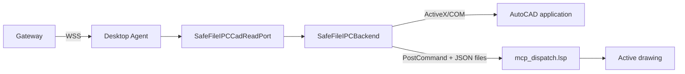
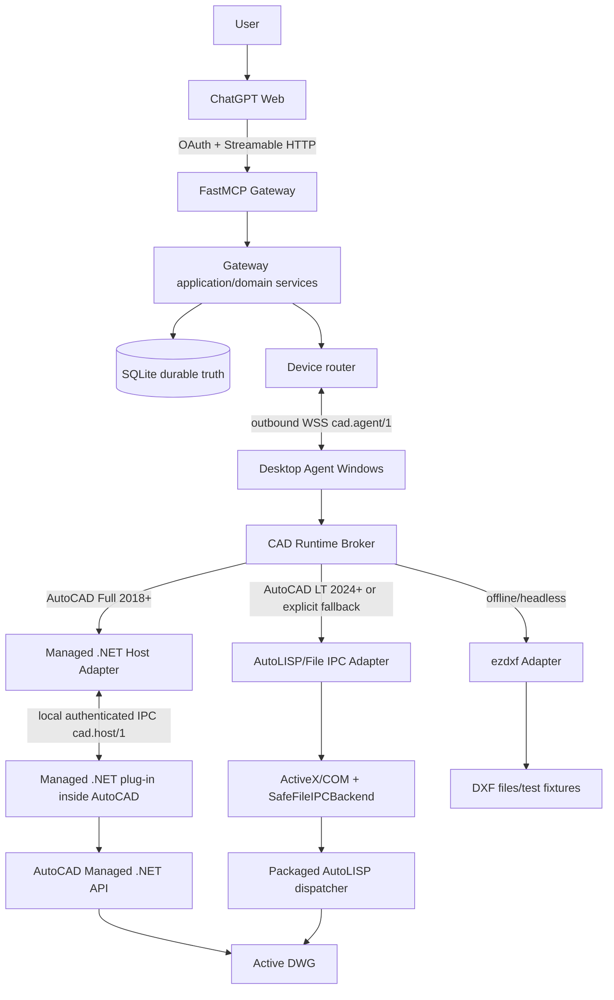

# Kế hoạch kiến trúc AutoCAD MCP nhiều người dùng — Managed .NET primary, AutoCAD LT compatibility

> Trạng thái cập nhật 2026-07-25: **Phase 0–3.1 đã triển khai; Phase 4 C1 đã GO; Phase 5 runtime foundation và R25 POC đã triển khai trên AutoCAD Mechanical 2025 thật. Family cũ và LT real certification được operator tạm defer. R25 signing/rollback engineering đã có lab evidence; production vẫn cần CA timestamp, authorized clean-VM run, two-user/two-device và pilot telemetry.** Evidence: [phase5-runtime-foundation-evidence.md](./phase5-runtime-foundation-evidence.md).
>
> Baseline: nhánh `main`, commit Phase 4 completion `85776db5d6b2f538f39c1410626eb133cf94d75b` hoặc mới hơn.
>
> Phạm vi thay đổi: kiến trúc sản phẩm, runtime abstraction, packaging, capability, migration và lộ trình Phase 5+. Không triển khai code trong tài liệu này.

## 1. Executive summary

Phase 4 đã chứng minh tuyến thực tế sau hoạt động trên AutoCAD Mechanical 2025:

```text
ChatGPT Web
→ FastMCP Gateway trên VPS
→ outbound WSS
→ Desktop Agent Windows
→ SafeFileIPCBackend
→ ActiveX/COM
→ PostCommand/File JSON
→ packaged AutoLISP dispatcher
→ AutoCAD Mechanical 2025
```

Đây là một thành công quan trọng về Gateway, durable job, WSS, Desktop Agent, packaging và public E2E. Tuy nhiên, nó chỉ chứng minh rằng AutoCAD bản đầy đủ có thể chạy bằng compatibility runtime vốn được thiết kế quanh giới hạn của AutoCAD LT. Nó chưa chứng minh kiến trúc runtime tối ưu cho AutoCAD Full.

Quyết định sản phẩm mới:

1. **AutoCAD Full 2018 trở lên trên Windows dùng Managed .NET làm runtime chính.**
2. **AutoCAD LT 2024 trở lên giữ AutoLISP/File IPC làm compatibility runtime.**
3. **ezdxf giữ vai trò headless preview, test, DXF offline và simulator; không đại diện cho hành vi DWG/AutoCAD thật.**
4. Không loại bỏ `SafeFileIPCBackend`, `mcp_dispatch.lsp`, current LT flow hoặc regression tests.
5. Public MCP tools, Gateway job model và Gateway–Agent protocol không bị tách thành hai sản phẩm. Cùng một CAD Program và cùng một job contract được thực thi qua runtime phù hợp với edition/version/capability của máy.
6. AutoCAD Full không còn bị giới hạn bởi mẫu số chung thấp nhất của AutoCAD LT. Capability manifest phải cho phép Full công bố năng lực mạnh hơn.
7. Desktop Agent vẫn là process ngoài AutoCAD, giữ WSS, pairing, UI, ledger và update. Một **Managed .NET plug-in chạy in-process trong AutoCAD** cung cấp CAD host chính và giao tiếp cục bộ với Agent qua IPC được xác thực.
8. Với AutoCAD Full, primitive không được mặc định chuyển thành command string hoặc generated AutoLISP. Agent gửi CAD Program đã validate tới .NET host; plug-in dùng AutoCAD Managed .NET API, document lock, transaction và event hooks để đọc/ghi drawing database trực tiếp.
9. AutoLISP vẫn là capability được hỗ trợ, đặc biệt cho LT và compatibility/fallback có kiểm soát. Nó không còn là trần năng lực hoặc compiler target mặc định cho mọi edition.

Kiến trúc đích ngắn gọn:

```text
ChatGPT → FastMCP Gateway → Desktop Agent → Runtime Broker
                                          ├─ Managed .NET Host  (AutoCAD Full 2018+; primary)
                                          ├─ AutoLISP/File IPC  (AutoCAD LT 2024+; compatibility)
                                          └─ ezdxf              (headless/offline/test)
```

## 2. Quyết định kiến trúc bắt buộc

### 2.1. Product support matrix

| Sản phẩm | Hệ điều hành | Phiên bản mục tiêu | Runtime mặc định | Vai trò |
|---|---|---:|---|---|
| AutoCAD Full và AutoCAD-based vertical có Managed .NET | Windows | 2018+ | `managed_dotnet` | Runtime chính, đầy đủ capability |
| AutoCAD Mechanical | Windows | 2018+ khi tương thích API | `managed_dotnet` | Runtime chính; Mechanical 2025 là máy POC đầu tiên |
| AutoCAD LT | Windows | 2024+ | `autolisp_file_ipc` | Compatibility runtime được duy trì |
| Không có AutoCAD / CI / offline DXF | Linux, Windows | N/A | `ezdxf_headless` | Preview headless, golden test, query và DXF offline |

Không tuyên bố hỗ trợ AutoCAD LT trước 2024 vì LT chỉ bắt đầu hỗ trợ AutoLISP từ 2024. Không tuyên bố Managed .NET trên AutoCAD LT.

### 2.2. Nguyên tắc “không hạ Full xuống LT”

Mọi thiết kế phải qua câu hỏi:

> Đây có phải giới hạn thật của public contract và an toàn sản phẩm, hay chỉ là giới hạn của LT compatibility runtime?

Nếu là giới hạn riêng của LT, nó phải được biểu diễn bằng capability/runtime profile, không được biến thành giới hạn toàn hệ thống.

Ví dụ:

- LT không có Managed .NET → chỉ LT bị giới hạn, không cấm .NET plug-in ở Full.
- LT thiếu một object type hoặc API → capability LT không công bố operation đó; Full vẫn được phép.
- File IPC khó tạo revision mạnh → LT có thể dùng `revision_strength=compatibility`; .NET host phải hướng tới event-backed revision mạnh hơn.
- AutoLISP preview phụ thuộc Undo → LT giữ cơ chế này; .NET database primitive có thể dùng transaction abort trực tiếp.

### 2.3. Không cho phép arbitrary code

Managed .NET primary không đồng nghĩa cho ChatGPT gửi C#, DLL, reflection hoặc assembly tùy ý.

Cấm từ public contract và Gateway–Agent protocol:

- source C#/VB.NET tự do;
- DLL/assembly tùy ý;
- `NETLOAD` từ path do model cung cấp;
- reflection/plugin discovery tùy ý;
- PowerShell, shell, Python hoặc native code tùy ý;
- unrestricted file/network access.

ChatGPT chỉ gửi CAD Program có cấu trúc hoặc gọi packaged operation đã version. .NET plug-in chỉ chạy operation registry đã allowlist.

## 3. Cơ sở kỹ thuật và version matrix Managed .NET

Autodesk công bố Managed .NET chỉ được hỗ trợ trên AutoCAD Full/AutoCAD-based products trên Windows, không hỗ trợ trên AutoCAD LT. Ma trận runtime thay đổi theo release; đặc biệt AutoCAD 2025 chuyển sang .NET 8, trong khi AutoCAD 2024 trở về trước dùng .NET Framework.

Nguồn Autodesk chính thức:

- Managed .NET compatibility: <https://help.autodesk.com/cloudhelp/2026/ENU/AutoCAD-Customization/files/GUID-A6C680F2-DE2E-418A-A182-E4884073338A.htm>
- Supported programming interfaces: <https://help.autodesk.com/cloudhelp/2024/ENU/AutoCAD-LT-Customization/files/GUID-E6429154-36DF-4D84-8ABC-9FCA15B66158.htm>
- AutoLISP in AutoCAD LT 2024: <https://help.autodesk.com/cloudhelp/2024/ENU/AutoCAD-LT-WhatsNew/files/GUID-5FB57480-C9BE-4E3D-BEDF-D86035928FFA.htm>
- PackageContents.xml reference: <https://help.autodesk.com/cloudhelp/2025/ENU/AutoCAD-Customization/files/GUID-BC76355D-682B-46ED-B9B7-66C95EEF2BD0.htm>

### 3.1. Build families đề xuất

Không cố tạo một DLL chạy từ AutoCAD 2018 tới 2026. Dùng chung source/domain contracts nhưng tạo nhiều host assembly theo release family.

| Build family | AutoCAD dự kiến | Target runtime | SDK/reference strategy | Ghi chú |
|---|---:|---|---|---|
| `R22` | 2018 | .NET Framework 4.6 | References AutoCAD 2018 | Build/test riêng vì API cũ nhất mục tiêu |
| `R23` | 2019–2020 | .NET Framework 4.7 | Ưu tiên references AutoCAD 2020, test cả 2019 | Chỉ gộp sau compatibility test thật |
| `R24` | 2021–2024 | .NET Framework 4.8 | References phù hợp family, ưu tiên 2024 khi API compatibility cho phép | Test tối thiểu 2021 và 2024, sau đó mở rộng matrix |
| `R25` | 2025+ | .NET 8 Windows | Build cho AutoCAD 2025; 2026 phải có compatibility test/build riêng nếu cần | Không dùng assembly .NET Framework cũ cho 2025 |

Các khoảng trên là chiến lược đóng gói đề xuất, không phải lời hứa binary compatibility. Mỗi family chỉ được công bố sau khi có smoke test trên AutoCAD thật và `PackageContents.xml` giới hạn đúng `SeriesMin`/`SeriesMax`.

### 3.2. Bundle và cài đặt

Phân phối plug-in dưới dạng Autodesk Application Plug-in Bundle:

```text
AutocadMcp.bundle/
  PackageContents.xml
  Contents/
    R22/
      AutocadMcp.Host.dll
      dependencies...
    R23/
      AutocadMcp.Host.dll
    R24/
      AutocadMcp.Host.dll
    R25/
      AutocadMcp.Host.dll
    Shared/
      schemas/
      package-manifest.json
```

`PackageContents.xml` phải:

- giới hạn Windows x64;
- chọn đúng component theo release series;
- không load Managed .NET component vào AutoCAD LT;
- có product code/version/upgrade strategy rõ;
- load plug-in theo startup hoặc command bootstrap đã được security review;
- tuân thủ `SECURELOAD`/trusted location;
- không lấy module path từ payload remote.

Desktop Agent installer có thể cài cả Agent và `.bundle`, nhưng hai artifact phải có version/hash/signature riêng để rollback độc lập.

## 4. Repo assessment hiện tại

### 4.1. Những gì Phase 4 đã chứng minh

`docs/architecture/phase-4.md` ghi rõ Phase 4 C1 đã GO trên AutoCAD Mechanical 2025 thật qua:

```text
Gateway → WSS → Desktop Agent → Safe File IPC / COM
→ packaged AutoLISP drawing-info → AutoCAD thật
```

`apps/desktop_agent/src/autocad_desktop_agent/executor.py` hiện giữ một `CadReadPort` hẹp và adapter `SafeFileIPCCadReadPort`. Đây là seam tốt để thay runtime mà không sửa Gateway.

`src/autocad_mcp/backends/safe_file_ipc.py` giữ allowlist command, chặn raw LISP trong remote profile và fail closed. Nó phải tiếp tục tồn tại cho LT/compatibility.

### 4.2. Giới hạn của kiến trúc hiện tại

Current path:



Các giới hạn không nên áp lên AutoCAD Full lâu dài:

- Command transport phụ thuộc command line/dispatcher state.
- File request/response làm tăng latency và recovery complexity.
- Document/database changes khó quan sát chính xác từ ngoài process.
- Preview/revision phụ thuộc fingerprint/Undo thay vì transaction và event model mạnh hơn.
- Nhiều operation phải chuyển thành AutoLISP dù Full có API trực tiếp.
- Capability bị kéo về những gì LT dispatcher biểu đạt được.
- Khó khai thác object model, transactions, document events, editor selection, symbol tables và specialized vertical APIs.

### 4.3. Những phần phải giữ

- FastMCP Gateway và public contract.
- Auth0/OAuth, owner scoping và durable job semantics.
- Gateway–Agent WSS, heartbeat, sequence, ACK/result/reconcile.
- Desktop Agent UI, hard pause, diagnostics, credential store và update shell.
- Local execution ledger/idempotency.
- `AutoCADBackend`/CAD Core ports và typed `CommandResult` pattern.
- `SafeFileIPCBackend`, File IPC error taxonomy và packaged AutoLISP.
- current LT tests, simulator, ezdxf tests, snapshot contracts và evidence.
- screenshot/artifact flow, subject to runtime-specific capture improvements.

## 5. Target architecture

### 5.1. End-to-end



### 5.2. Vì sao cần .NET plug-in in-process

AutoCAD Managed .NET API chạy trong AutoCAD process. Desktop Agent không được chỉ reference `acdbmgd.dll` rồi gọi từ process Python ngoài AutoCAD.

Do đó kiến trúc đúng là:

```text
Desktop Agent (network/device/process concerns)
↕ local authenticated IPC
Managed .NET plug-in (AutoCAD/document/database concerns)
↕ direct Managed .NET API
AutoCAD
```

Agent không nhúng Gateway logic vào plug-in. Plug-in không giữ OAuth user token, không mở public port và không tự kết nối Internet trừ update/telemetry được thiết kế riêng trong tương lai; mặc định mọi network đi qua Agent.

### 5.3. Runtime Broker

`RuntimeBroker` là seam trung tâm trong Desktop Agent:

```text
probe installed/running products
→ detect edition + release + active document
→ discover .NET plug-in handshake
→ choose eligible runtime
→ publish capability manifest
→ execute through selected adapter
```

Interface khái niệm:

```text
CadRuntimeAdapter
- probe()
- manifest()
- observe(request)
- query(request)
- preview(program)
- commit(program)
- validate(request)
- rollback(checkpoint)
- reconcile(command_id)
```

Không để Gateway biết chi tiết `DocumentLock`, COM object hoặc LISP file path. Gateway chỉ biết runtime ID, version, capability và evidence.

## 6. Runtime selection và degradation policy

### 6.1. Quy tắc chọn runtime

| Điều kiện | Runtime chọn | Trạng thái |
|---|---|---|
| AutoCAD Full 2018+ và .NET host đúng family, handshake/schema hợp lệ | `managed_dotnet` | `online_idle`/`online_busy_*` |
| AutoCAD Full nhưng .NET host chưa cài, sai version hoặc load lỗi | Không âm thầm giả là đầy đủ | `degraded_compatibility` hoặc `plugin_required` |
| AutoCAD Full và user/admin cho phép compatibility fallback | `autolisp_file_ipc` | Capability giảm, evidence ghi rõ fallback |
| AutoCAD LT 2024+ | `autolisp_file_ipc` | Runtime chuẩn của LT |
| AutoCAD LT trước 2024 | unsupported | `incompatible` |
| Không có AutoCAD, xử lý DXF offline | `ezdxf_headless` | Không quảng cáo là live AutoCAD |

### 6.2. Không silent fallback cho write

Read-only `observe` có thể fallback theo policy để giữ availability, nhưng result phải ghi:

```json
{
  "runtime_id": "autolisp_file_ipc",
  "runtime_role": "compatibility_fallback",
  "requested_runtime": "managed_dotnet",
  "degraded": true,
  "degradation_reason": "managed_plugin_not_loaded"
}
```

Write/preview/rollback không được tự fallback nếu runtime thay đổi semantic, risk, revision strength hoặc capability. Caller phải prepare/preview lại theo manifest mới.

### 6.3. Runtime pinning theo job

Mỗi program/preview/commit bind với:

- `runtime_id` và `runtime_version`;
- AutoCAD edition/release;
- host package ID/version/hash;
- capability manifest hash;
- CAD Program schema/registry version;
- document ID/revision;
- compiler/interpreter version nếu có.

Preview bằng .NET không được commit bằng LISP fallback và ngược lại.

## 7. Managed .NET host design

### 7.1. Trách nhiệm

Managed .NET plug-in chịu trách nhiệm:

- đăng ký và báo version/host family;
- xác định AutoCAD edition/release/product/vertical;
- chạy operation trên AutoCAD application/document context hợp lệ;
- quản lý `DocumentLock` khi cần;
- dùng database transactions cho read/write primitive;
- tạo normalized entity/object DTO;
- theo dõi document activation, close, save và object change events;
- tạo revision evidence;
- preview/commit/abort/checkpoint theo effect class;
- thực thi allowlisted operation registry;
- trả progress/result/evidence có command ID;
- local replay guard hoặc durable handoff với Agent ledger;
- từ chối payload sai schema, version, deadline, document hoặc capability.

Không chịu trách nhiệm:

- OAuth/Auth0;
- owner/device routing;
- public MCP schema;
- durable Gateway job truth;
- tự download/chạy code từ Gateway;
- arbitrary file/network access;
- user billing/quota.

### 7.2. Local IPC `cad.host/1`

Ưu tiên Windows Named Pipes thay vì localhost TCP.

Security baseline:

- pipe ACL chỉ cho current Windows user/SID và AutoCAD process identity phù hợp;
- Agent tạo ephemeral session nonce/secret; plug-in handshake chứng minh package/version;
- message có session ID, command ID, sequence, deadline và payload hash;
- bounded JSON/MessagePack envelope; artifact lớn đi file handle/path trong Agent-owned workspace với ACL và digest;
- không bind public interface;
- disconnect không làm AutoCAD tự retry command;
- duplicate command ID/hash trả ledger/result cũ nếu biết; khác hash bị reject.

Protocol này độc lập với `cad.agent/1`. Gateway không kết nối trực tiếp vào named pipe.

### 7.3. Threading và command context

Local IPC listener không được gọi AutoCAD API trên arbitrary worker thread.

Host phải có scheduler/dispatcher:

```text
pipe message
→ validate envelope
→ enqueue bounded work item
→ marshal vào AutoCAD application/document context
→ acquire document lock/transaction
→ execute primitive batch
→ collect result/evidence
→ return through pipe
```

Cách marshal cụ thể có thể khác giữa release family và phải được POC trên 2018, 2021, 2024, 2025/2026. Không hard-code một API mới vào shared layer nếu release cũ không có.

### 7.4. Operation registry

Không dùng một method reflection tổng quát. Registry explicit:

```text
operation ID
→ schema version
→ effect class
→ required capability
→ supported release families
→ handler
→ budget estimator
→ preview strategy
→ validation strategy
```

Ví dụ capability ưu tiên .NET:

- `drawing.info.v2`
- `entity.snapshot.v2`
- `entity.query.v2`
- `entity.create.basic.v1`
- `entity.modify.basic.v1`
- `layer.table.v1`
- `block.reference.v1`
- `annotation.dimension.v1`
- `document.events.v1`
- `transaction.database.v1`
- `preview.database_abort.v1`

Operation có thể cùng tên semantic trên cả .NET và LISP nhưng implementation/evidence khác nhau.

## 8. AutoLISP/File IPC compatibility runtime

### 8.1. Vai trò mới

AutoLISP/File IPC không bị deprecated khỏi sản phẩm. Nó có ba vai trò:

1. Runtime chuẩn của AutoCAD LT 2024+.
2. Fallback có kiểm soát trên AutoCAD Full khi .NET plug-in chưa sẵn sàng.
3. Legacy/package compatibility cho workflow đã có bằng chứng và regression tốt.

### 8.2. Những gì giữ nguyên

- `SafeFileIPCBackend` allowlist/fail-closed.
- active document, busy/modal detection.
- request/response IDs và atomic JSON files.
- no blind retry cho write.
- packaged/versioned `mcp_dispatch.lsp`.
- `allow_execute_lisp=False` trong production remote profile mặc định.
- file/path/trusted-location policy.
- current error taxonomy và tests.

### 8.3. CAD Program trên LT

CAD Program không bị loại khỏi LT. Runtime LT có thể:

- map operation vào packaged LISP entrypoint;
- compile bounded primitive batch thành generated AutoLISP khi đã có compiler an toàn;
- dùng Undo Group/checkpoint cho preview/rollback;
- từ chối operation chỉ có ở Full.

Capability manifest phải mô tả rõ `unsupported`, không giả lập object/type không có.

### 8.4. Freeform AutoLISP

Freeform AutoLISP không phải điều kiện để sản phẩm thông minh. Nếu giữ advanced mode:

- default off;
- scope + account/device opt-in;
- preview + one-time approval;
- static policy/size/time/entity/path limits;
- full source lưu restricted audit artifact;
- không có đường tương đương “freeform .NET”.

## 9. ezdxf headless runtime

`ezdxf` giữ vai trò quan trọng nhưng có ranh giới rõ:

### Dùng cho

- DXF read/write offline;
- contract tests và golden drawings;
- CAD Program schema/semantic tests;
- geometry/query/scene prototypes;
- headless preview cho operation được ezdxf mô phỏng đúng;
- simulator và CI không cần AutoCAD;
- diff/validation sơ bộ.

### Không dùng làm bằng chứng duy nhất cho

- DWG behavior;
- AutoCAD command/document locking;
- AutoCAD transaction/Undo;
- vertical custom entities;
- rendering/screenshot parity;
- modal/busy state;
- Managed .NET compatibility;
- LT limitations.

Result headless phải ghi `authoritative=false` cho live AutoCAD commit safety, trừ workflow offline DXF được định nghĩa riêng.

## 10. Capability model: không dùng least-common-denominator

### 10.1. Manifest runtime-aware

Agent hello/capability update bổ sung:

```json
{
  "cad_products": [
    {
      "product": "AutoCAD Mechanical",
      "edition": "full",
      "release_year": 2025,
      "series": "R25.0",
      "runtime": {
        "id": "managed_dotnet",
        "role": "primary",
        "host_version": "0.1.0",
        "framework": ".NET 8",
        "package_hash": "sha256:..."
      },
      "capabilities": [
        "observe.summary",
        "observe.entities",
        "query.entities",
        "document.events",
        "transaction.database",
        "preview.database_abort"
      ]
    }
  ],
  "fallback_runtimes": [
    {
      "id": "autolisp_file_ipc",
      "role": "compatibility",
      "package_version": "3.3-c1"
    }
  ]
}
```

Gateway canonicalize và hash manifest. Agent/host cùng validate.

### 10.2. Public tools vẫn ổn định

Không tạo tool riêng như `cad_dotnet_create_line` hoặc `cad_lisp_create_line`.

Public interface tiếp tục theo intent:

- `cad_list_devices`
- `cad_observe`
- `cad_query`
- `cad_prepare_program`
- `cad_preview`
- `cad_commit`
- `cad_validate`
- `cad_get_job`
- `cad_cancel_job`
- `cad_rollback`

Runtime là scheduling/execution detail, nhưng được trả trong evidence để debug và đảm bảo semantic.

### 10.3. Capability tiers

| Tier | Ý nghĩa |
|---|---|
| `core` | Có semantic tương đương trên .NET, LT/LISP và ezdxf trong phạm vi đã test |
| `full` | Chỉ AutoCAD Full/Managed .NET hoặc vertical phù hợp |
| `lt_compat` | Chỉ compatibility path LT/LISP |
| `headless` | Chỉ ezdxf/offline |
| `experimental` | Chưa production; chỉ allowlist lab |

Skill và CAD Program phải declare required capability, không declare edition name cứng nếu không cần.

## 11. CAD Program architecture sau pivot

### 11.1. Runtime-neutral IR

CAD Program là intermediate representation có cấu trúc, không phải “LISP generator input”.

```text
ChatGPT creates CAD Program
→ Gateway validates schema/ownership/risk/capability
→ Agent validates again and pins runtime
→ Runtime adapter builds execution plan
   ├─ .NET operation plan
   ├─ packaged/generated AutoLISP plan
   └─ ezdxf headless plan
→ preview/commit/validate
```

### 11.2. Interpreter/compiler strategy

| Runtime | Preferred execution |
|---|---|
| Managed .NET | Interpret operation registry trực tiếp; dùng AutoCAD database/API handlers |
| AutoLISP/File IPC | Map packaged operations hoặc compile bounded program sang generated LISP |
| ezdxf | Interpret bằng Python/ezdxf handler |

Không bắt .NET path sinh LISP trước khi chạy. Không bắt ezdxf mô phỏng mọi .NET capability.

### 11.3. Program portability

Một program có thể là:

- `portable_core`: chỉ dùng capability core, có thể preview trên ezdxf rồi commit trên .NET/LT sau revalidation;
- `managed_full`: dùng capability .NET/vertical;
- `lt_compatible`: bảo đảm chạy trên LT;
- `headless_only`: workflow DXF offline.

Program digest không đủ để chuyển runtime. Execution digest phải bao gồm runtime plan/registry/package version.

### 11.4. Primitive roadmap ưu tiên .NET

`cad.program/0.1` nên giữ create-only nhỏ, nhưng implementation đầu tiên trên AutoCAD Full phải dùng Managed .NET:

- assert document/revision;
- ensure layer;
- create line/circle/polyline/rectangle/text;
- basic linear dimension;
- bounds/entity-count validation;
- preview transaction;
- atomic commit.

Sau đó mở:

- query/filter theo type/layer/space/property;
- move/copy/rotate/scale/mirror/offset;
- block reference/attributes;
- dimensions/annotations;
- erase/purge có risk cao;
- patterns và bounded expressions;
- vertical-specific capability packs.

LT adapters triển khai subset theo capability, không chặn roadmap Full.

## 12. Preview, transaction, revision và rollback

### 12.1. Managed .NET

Ưu tiên hai nhóm execution:

1. **Database-native primitive**: dùng transaction có thể abort cho preview. Chỉ commit khi đúng execution digest/revision/policy.
2. **Command-backed hoặc external-effect operation**: không giả định transaction rollback đầy đủ; dùng checkpoint/Undo strategy, risk cao hơn và failure POC riêng.

Managed host nên hướng tới:

- object-level diff trước/sau;
- transaction abort verification;
- document event sequence;
- stable document instance ID;
- normalized handles/object fingerprints;
- revision evidence mạnh hơn summary hash;
- explicit checkpoint cho commit.

### 12.2. LT compatibility

- packaged/generated AutoLISP;
- Undo Group/checkpoint;
- snapshot/fingerprint/revision evidence;
- detect active document change;
- no blind retry;
- preview rollback verification.

LT result phải công bố `revision_strength` và `preview_strategy` thực tế.

### 12.3. ezdxf

- clone/in-memory document cho preview;
- deterministic DXF diff khi khả thi;
- không dùng headless revision để authorize live DWG commit nếu chưa observe lại trên target runtime.

### 12.4. Common evidence

Mọi runtime trả:

```json
{
  "runtime_id": "managed_dotnet",
  "runtime_version": "0.1.0",
  "host_family": "R25",
  "preview_strategy": "database_transaction_abort",
  "revision_strength": "event_and_database",
  "execution_digest": "sha256:...",
  "document_before": "...",
  "document_after": "...",
  "checkpoint_id": "...",
  "validation": {}
}
```

## 13. Gateway và FastMCP impact

Kiến trúc Gateway không cần viết lại vì runtime pivot.

### Giữ nguyên

- FastMCP only at public Gateway boundary.
- Domain services không import FastMCP.
- SQLite durable job truth.
- owner-scoped repository.
- outbound Agent connection.
- idempotency/reconnect/outcome_unknown semantics.
- risk/approval/audit/artifact model.
- public high-level tool set.

### Bổ sung

- runtime-aware device/capability model;
- runtime pinning trong program/preview/job;
- host package/version/hash trong evidence;
- degraded capability state;
- scheduler chọn device/runtime theo required capabilities;
- artifact/audit phân biệt program digest và runtime execution digest;
- policy chặn commit khi runtime đổi sau preview.

FastMCP không gọi .NET plug-in, COM hoặc AutoLISP trực tiếp.

## 14. Desktop Agent target design

```text
AgentCore
├─ GatewayConnection          # WSS, heartbeat, protocol
├─ DeviceIdentity             # pairing, credential, revoke
├─ CommandLedger              # accepted/started/result/reconcile
├─ RuntimeDiscovery
├─ RuntimeBroker
│  ├─ ManagedDotNetAdapter
│  ├─ AutoLispFileIpcAdapter
│  └─ EzdxfAdapter (optional local/offline)
├─ CapabilityPublisher
├─ ArtifactManager
├─ PolicyCache
├─ Diagnostics
└─ UI/Tray/HardPause
```

UI không gọi plug-in/COM trực tiếp. Mọi execution đi `AgentCore → RuntimeBroker`.

### 14.1. Process boundaries

| Process | Công nghệ | Vai trò |
|---|---|---|
| Gateway | Python/FastMCP/ASGI | Public MCP, identity, job, routing, audit |
| Desktop Agent | Python packaged Windows app | WSS, device, UI, ledger, runtime broker |
| AutoCAD Managed Host | C# Managed .NET plug-in | In-process AutoCAD API execution |
| AutoLISP dispatcher | AutoLISP | LT/compatibility execution |
| Headless worker/tests | Python/ezdxf | Offline/test/preview |

Không chuyển toàn bộ Desktop Agent sang C# chỉ vì thêm plug-in. Quyết định ngôn ngữ Agent chỉ xem xét sau POC nếu packaging/IPC/maintenance chứng minh lợi ích rõ.

## 15. Repo structure đề xuất

Giữ monorepo:

```text
apps/
  desktop_agent/
    src/autocad_desktop_agent/
      runtime/
        broker.py
        contracts.py
        managed_dotnet.py
        autolisp_file_ipc.py
        ezdxf_headless.py
      executor.py                 # compatibility facade trong migration

native/
  autocad_managed_host/
    AutocadMcp.Host.sln
    src/
      AutocadMcp.Host.Core/       # framework-neutral DTO/registry logic khi có thể
      AutocadMcp.Host.R22/        # AutoCAD 2018 / net46
      AutocadMcp.Host.R23/        # AutoCAD 2019-2020 / net47
      AutocadMcp.Host.R24/        # AutoCAD 2021-2024 / net48
      AutocadMcp.Host.R25/        # AutoCAD 2025+ / net8.0-windows
    tests/
      AutocadMcp.Host.Core.Tests/
    bundle/
      PackageContents.xml

packages/
  contracts/
    src/autocad_contracts/        # cad.agent/1 + shared runtime evidence
  cad_core/
    src/autocad_core/             # CAD Program/domain models
  host_contracts/
    schemas/                      # cad.host/1 language-neutral schemas

src/autocad_mcp/backends/
  safe_file_ipc.py                # giữ LT compatibility
  file_ipc.py

lisp-code/
  mcp_dispatch.lsp                # giữ và version

services/gateway/
  ...                             # runtime-aware capability/routing additions only
```

### Dependency rules

```text
Gateway -X-> Autodesk assemblies
Gateway -X-> pywin32/COM/AutoLISP
Managed Host -X-> FastMCP/Auth0/WSS
Managed Host -> cad.host schemas + AutoCAD Managed API
Desktop Agent -> cad.agent contracts + cad.host client + runtime adapters
AutoLISP adapter -> existing SafeFileIPCBackend
```

Shared schema phải language-neutral; không serialize Python pickle hoặc .NET type name.

## 16. Security architecture theo runtime

### 16.1. Managed host

- Plug-in chỉ load từ trusted signed bundle/location.
- Không `NETLOAD` payload remote.
- Named pipe current-user ACL và authenticated session.
- Explicit operation registry, no reflection dispatch.
- Payload and entity budgets.
- Document/revision/runtime/package checks.
- No arbitrary path; logical workspace/artifact grants only.
- Full audit of operation IDs and hashes, không log secret/path nhạy cảm.
- Local hard pause ở Agent chặn command trước host.
- Host có emergency disable config/registry/file flag do installer quản lý.

### 16.2. LT compatibility

Giữ toàn bộ SafeFileIPC controls, trusted path, command allowlist, raw LISP off, bounded files và no write retry.

### 16.3. Common

- Gateway ownership + scope là lớp một.
- Agent device/session/owner là lớp hai.
- Runtime adapter/host validation là lớp ba.
- Mức risk cuối dùng max(Gateway, Agent, runtime host).
- Preview/approval bind execution digest, không chỉ bind CAD Program digest.

## 17. Migration strategy: không phá Phase 4 và AutoCAD LT

### 17.1. Feature flags

```text
AUTOCAD_MCP_RUNTIME_MODE=auto|managed_dotnet|autolisp_compat|ezdxf
AUTOCAD_MCP_MANAGED_HOST_ENABLED=0|1
AUTOCAD_MCP_ALLOW_FULL_COMPAT_FALLBACK=0|1
AUTOCAD_MCP_LT_RUNTIME_ENABLED=1
```

Mặc định trong migration:

- Existing Phase 4 device giữ `autolisp_compat` cho tới khi .NET POC GO.
- Lab AutoCAD Mechanical 2025 có thể bật `managed_dotnet` theo allowlist.
- LT luôn giữ path hiện tại.
- Không thay public Gateway profile chỉ để đổi local runtime.

### 17.2. Compatibility adapter

Trong giai đoạn đầu, `DrawingInfoExecutor` không bị rewrite rộng. Thêm runtime-neutral `CadReadPort`; `SafeFileIPCCadReadPort` là một implementation, `ManagedDotNetCadReadPort` là implementation mới.

Sau parity, chuyển từ read-only ports sang `CadRuntimeAdapter` đầy đủ.

### 17.3. Không xóa code cũ trước exit criteria

Chỉ cân nhắc deprecate một phần COM/LISP trên AutoCAD Full khi:

- .NET host đã qua read/write/failure matrix;
- LT regression vẫn xanh;
- installer có rollback;
- capability/fallback UX rõ;
- ít nhất hai release family Full đã test thật;
- production cohort có telemetry đủ.

Ngay cả khi đó, code LT vẫn tồn tại.

## 18. Phase 5 roadmap mới

Phase 5 trong master plan được đổi từ “chỉ identity/pairing” thành **Managed .NET Runtime Foundation and Runtime-Aware Architecture**. Identity/pairing vẫn bắt buộc cho multi-user, nhưng không nên mở write trên kiến trúc LT-first rồi mới thay runtime lõi.

### Phase 5.0 — ADR, contracts và runtime seam

- Chốt ADR Managed .NET primary / LT compatibility / ezdxf headless.
- Thêm `runtime_id`, `runtime_role`, product edition/release và host evidence vào shared contracts theo kiểu additive.
- Tạo `RuntimeBroker` và giữ `SafeFileIPCCadReadPort` làm adapter đầu tiên.
- Snapshot-test manifest/schema; simulator cũ vẫn parse được.
- Không build plug-in production.

**Exit:** Agent C1 cũ chạy y nguyên qua broker, Gateway/public contract không regression.

### Phase 5.1 — Managed .NET C0 read-only host trên Mechanical 2025

- Tạo solution C# `.NET 8` cho AutoCAD 2025.
- Bundle local lab, load bằng trusted path.
- Named pipe `cad.host/1` read-only.
- Implement health, product/version, active document, drawing summary và layer list.
- Agent `ManagedDotNetCadReadPort` trả cùng normalized snapshot C1.
- So sánh result .NET và SafeFileIPC trên cùng DWG.

**Exit:** ChatGPT Web `cad_observe` đi `Gateway → Agent → .NET host → Mechanical 2025` và trả evidence `runtime_id=managed_dotnet`; File IPC path vẫn chạy khi feature flag đổi lại.

### Phase 5.2 — Entity snapshot, events và revision strength

- Read entity metadata/page có bounds/type/layer/handle.
- Document/object event aggregation.
- Stable document instance identity.
- Revision evidence model và stale document tests.
- Busy/modal/document switch handling qua host.

**Exit:** .NET observation/query mạnh hơn C1 summary, không fake entities; stale snapshot bị chặn.

### Phase 5.3 — CAD Program v0 trực tiếp trên .NET

- Create-only primitive registry.
- Database transaction preview/abort.
- Commit + validation + checkpoint.
- Failure injection quanh transaction/result/Agent disconnect.
- Không generated LISP trong .NET primary path.

**Exit:** line/circle/polyline/layer/text chạy preview/commit/validate trên Mechanical 2025, duplicate không tạo effect lần hai, network unknown có evidence đúng.

### Phase 5.4 — Release-family packaging

- R22 AutoCAD 2018 lab smoke.
- R23 2019/2020 matrix.
- R24 2021/2024 matrix.
- R25 2025/2026 matrix.
- Multi-component `.bundle`, installer, signature, upgrade/rollback.
- Capability khác nhau theo release family.

**Exit:** ít nhất một version trong mỗi family đã qua load/observe; write chỉ mở cho family đã qua full POC.

### Phase 5.5 — LT 2024+ compatibility certification

- Chạy lại Phase 4 path trên AutoCAD LT 2024+ thật.
- Ghi limitation matrix và capability manifest LT.
- CAD Program portable core trên LT nếu compiler/packaged operations đã sẵn sàng.
- Xác nhận no Managed .NET component được load vào LT.

**Exit:** LT không mất tính năng hiện có; same public tools route đúng compatibility runtime.

### Phase 5.6 — Identity, pairing và two-user/two-device isolation

- Tiếp tục mục tiêu identity cũ nhưng trên runtime-aware device model.
- User A/B, device A/B có thể dùng runtime khác nhau.
- Cross-tenant tool/resource/job/artifact/socket/host evidence bị deny.
- Revoke đóng WSS; local host session cũng invalidated qua Agent.

**Exit:** isolation matrix xanh trước khi mở write pilot nhiều user.

### Phase 5.7 — Pilot write và runtime policy

- Cohort Full dùng .NET primary.
- Cohort LT dùng compatibility.
- Runtime fallback policy, diagnostics và support runbook.
- Telemetry success/error/latency theo runtime/release.
- Kill switch tách `managed_write`, `lt_write`, high-risk và advanced LISP.

**Exit:** pilot có rollback, audit, update và support matrix rõ.

## 19. POC order và quyết định mở khóa

| Thứ tự | POC | Bằng chứng | Quyết định |
|---:|---|---|---|
| 1 | Runtime seam | Existing C1 chạy qua broker không regression | Có pivot mà không phá LT/Gateway không |
| 2 | .NET read-only Mechanical 2025 | Full path public E2E qua named pipe/.NET host | Host/IPC/packaging có khả thi không |
| 3 | .NET entity/revision | Event/revision/query/stale tests | .NET có cải thiện observation thật không |
| 4 | .NET transaction write | Preview abort/commit/validate/failure injection | .NET có đủ an toàn để làm primary write không |
| 5 | Version family | Load/smoke trên 2018, 2019/20, 2021/24, 2025/26 | Support floor 2018 có thực tế không |
| 6 | LT certification | AutoCAD LT 2024+ regression/capability | Compatibility không bị phá |
| 7 | Two-user/two-device | owner isolation qua nhiều runtime | Có thể mở multi-user write không |

Không mở broad CAD Program/skill marketplace trước POC 2–4.

## 20. Testing strategy

### 20.1. Shared contract

- schema snapshots `cad.agent/1` additive;
- new `cad.host/1` golden messages;
- unknown optional fields/older Agent compatibility;
- runtime manifest canonicalization/hash;
- preview/runtime pinning/idempotency.

### 20.2. Managed host core tests

Tách logic không phụ thuộc AutoCAD assemblies để test:

- envelope validation;
- operation registry;
- budget/risk metadata;
- payload hash;
- duplicate/replay;
- DTO normalization;
- version negotiation.

### 20.3. AutoCAD real integration matrix

Mỗi supported family có tối thiểu:

- plug-in load/unload/startup;
- active/no document;
- busy/modal/document switch;
- observe summary;
- entity query;
- transaction preview abort;
- commit/checkpoint;
- duplicate/reconnect;
- AutoCAD close/crash;
- installer upgrade/rollback;
- SECURELOAD/trusted location.

Không cần mọi version chạy mọi test trong mỗi PR. Dùng tier:

- per-PR core/headless tests;
- controlled Windows builder compile;
- scheduled/manual smoke theo family;
- release candidate full matrix.

### 20.4. LT regression

Giữ toàn bộ File IPC/AutoLISP tests và bổ sung AutoCAD LT thật:

- dispatcher load/trusted path;
- observe;
- busy/modal/document switch;
- command allowlist;
- no raw LISP;
- duplicate/no write retry;
- compatibility CAD Program subset.

### 20.5. Cross-runtime conformance

Với `portable_core` primitive:

- same semantic input;
- normalized result shape;
- equivalent geometry within tolerance;
- runtime-specific evidence allowed khác;
- unsupported operation fail `capability_missing`, không silently approximate.

## 21. Build, CI và release policy

### 21.1. GitHub hosted CI

Giữ quyết định Phase 4: GitHub hosted runner chỉ chạy test/validation mặc định, không tự build/upload installer hoặc AutoCAD plug-in production artifact khi chưa có review riêng về SDK/license/signing/secrets.

Có thể chạy:

- Python Gateway/Agent/contracts tests;
- ezdxf/golden tests;
- .NET host core tests không reference Autodesk assemblies;
- schema/package XML lint;
- source formatting/static analysis;
- compile smoke nếu references hợp pháp và pipeline không phát hành artifact, sau khi được duyệt.

### 21.2. Controlled Windows builder

Actual AutoCAD host assemblies/bundle:

- build trên máy Windows kiểm soát;
- SDK/reference đúng family;
- deterministic version metadata;
- sign assemblies/installer;
- malware scan/hash/SBOM;
- install on clean VM;
- smoke in real AutoCAD;
- publish only after operator approval.

### 21.3. Release units

Version riêng:

- Gateway;
- Desktop Agent;
- Managed host bundle;
- AutoLISP package;
- CAD Program schema/operation registry;
- Gateway–Agent protocol;
- Agent–Host protocol.

Compatibility manifest xác định min/max; không buộc update tất cả cùng lúc nếu contracts còn tương thích.

## 22. Risks và mitigations

| Rủi ro | Tác động | Giảm thiểu |
|---|---|---|
| Nhiều .NET/SDK family | Build/test phức tạp | Shared core + thin release hosts + bundle SeriesMin/Max + tiered matrix |
| AutoCAD API phải chạy đúng context | Crash/deadlock | Host scheduler, bounded queue, document lock/transaction, real POC từng family |
| Named pipe bị giả mạo | Local privilege abuse | SID ACL, ephemeral handshake, session/hash/sequence, no localhost public port |
| Plug-in load/trusted path | User friction/SECURELOAD | Signed bundle installer, diagnostics, exact trusted location, rollback |
| .NET host crash ảnh hưởng AutoCAD | Mất ổn định user | Keep host narrow, no network/business logic, catch/map errors, canary rollout |
| Semantic khác .NET và LISP | Preview/commit mismatch | Runtime pinning, execution digest, conformance tests, no silent fallback |
| 2018 support kéo chậm API | Lowest-common-denominator quay lại | Capability/version adapters; Full current versions được phép năng lực cao hơn |
| LT bị bỏ quên | Mất user/compatibility | Dedicated LT certification gate, code ownership và regression matrix |
| ezdxf tạo false confidence | Production failure | Mark non-authoritative, require live runtime revalidation |
| Vertical products khác AutoCAD vanilla | API/object khác | Product/vertical capability packs, allowlist, real fixtures |

## 23. Decisions now và deferred decisions

### 23.1. Chốt ngay

1. Managed .NET primary cho AutoCAD Full 2018+ Windows.
2. AutoLISP/File IPC compatibility cho AutoCAD LT 2024+ và fallback có kiểm soát.
3. ezdxf headless/offline/test.
4. Desktop Agent ngoài process + .NET host trong AutoCAD qua local authenticated IPC.
5. CAD Program runtime-neutral; .NET path không compile sang LISP mặc định.
6. Public MCP tools không tách theo runtime.
7. Runtime/capability/evidence pin vào preview/job.
8. Không arbitrary .NET/LISP code trong default production path.
9. Multi-build family thay vì một DLL cho 2018+.
10. Không xóa LT code/tests.

### 23.2. Trì hoãn tới POC

- Named Pipe JSON hay MessagePack; JSON bounded là baseline.
- Exact AutoCAD context scheduling API cho từng family.
- Một R25 binary cho 2025/2026 hay hai assembly.
- Document revision algorithm cuối cùng.
- Database-only preview có đủ cho mọi primitive hay cần hybrid Undo/checkpoint.
- Agent giữ Python hay chuyển một phần sang .NET.
- Product vertical nào ngoài Mechanical được support chính thức đầu tiên.
- LT CAD Program compiler scope v0.
- Auto-update của managed bundle.

## 24. Definition of Done cho kiến trúc mới

Kiến trúc pivot chỉ được coi là đạt khi:

- Public `cad_observe` chạy qua Managed .NET trên AutoCAD Mechanical 2025 thật.
- Same device có thể quay lại LT compatibility path bằng feature flag mà không sửa Gateway.
- Agent manifest phân biệt edition/release/runtime/role/package/capability.
- Preview và commit bind đúng runtime/execution digest.
- Một CAD Program v0 create-only được preview/commit/validate bằng .NET API trực tiếp, không generated LISP.
- Network/Agent/host duplicate matrix không tạo effect lần hai.
- Managed host không nhận arbitrary code/path/assembly.
- At least one tested build family cũ hơn 2025 chứng minh kiến trúc không khóa vào .NET 8.
- AutoCAD LT 2024+ path hiện tại vẫn qua regression và real smoke.
- ezdxf tests vẫn chạy, nhưng evidence không bị dùng sai cho live DWG safety.
- Installer/bundle có version/hash/signature/rollback.
- Two-user/two-device isolation hoạt động dù hai device dùng runtime khác nhau.
- Tài liệu support matrix và diagnostics nói rõ primary/fallback/degraded state.

## 25. Bước tiếp theo

1. Tạo ADR cho runtime pivot và cập nhật shared contract additive.
2. Refactor nhỏ `DrawingInfoExecutor` thành runtime-neutral port, giữ `SafeFileIPCCadReadPort` nguyên hành vi.
3. Scaffold `native/autocad_managed_host` cho AutoCAD 2025/.NET 8, chỉ read-only.
4. Thiết kế `cad.host/1` named-pipe handshake và normalized drawing summary.
5. Chạy POC trên đúng máy AutoCAD Mechanical 2025 đã dùng Phase 4.
6. Chỉ sau khi read-only E2E xanh mới mở entity snapshot/revision rồi CAD Program write.
7. Song song giữ LT/File IPC regression; không cleanup/xóa legacy trong Phase 5.

---

Tài liệu này là nguồn kiến trúc chính cho Phase 5+. Các phần của kế hoạch cũ mô tả FastMCP Gateway, durable job, WSS, ownership, audit, risk, CAD Program, Scene Graph và skill/workflow vẫn còn giá trị, nhưng mọi đoạn coi AutoLISP/File IPC là runtime chính cho toàn sản phẩm hoặc trì hoãn Managed .NET vô thời hạn được thay thế bởi quyết định Managed .NET primary trong tài liệu này.
