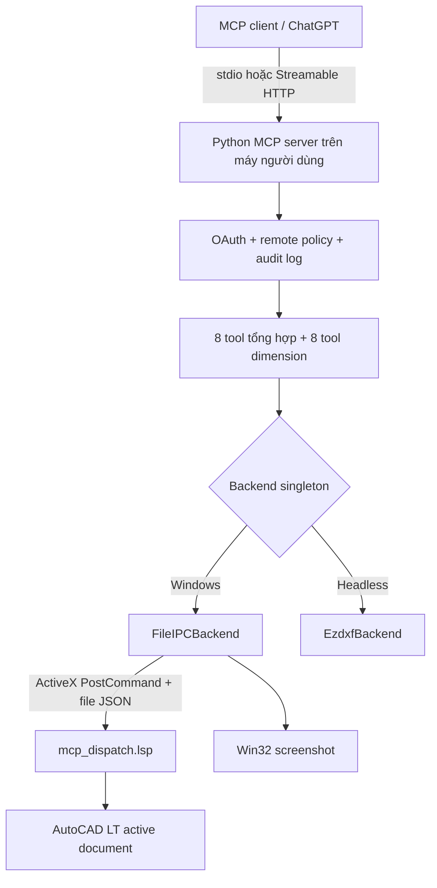
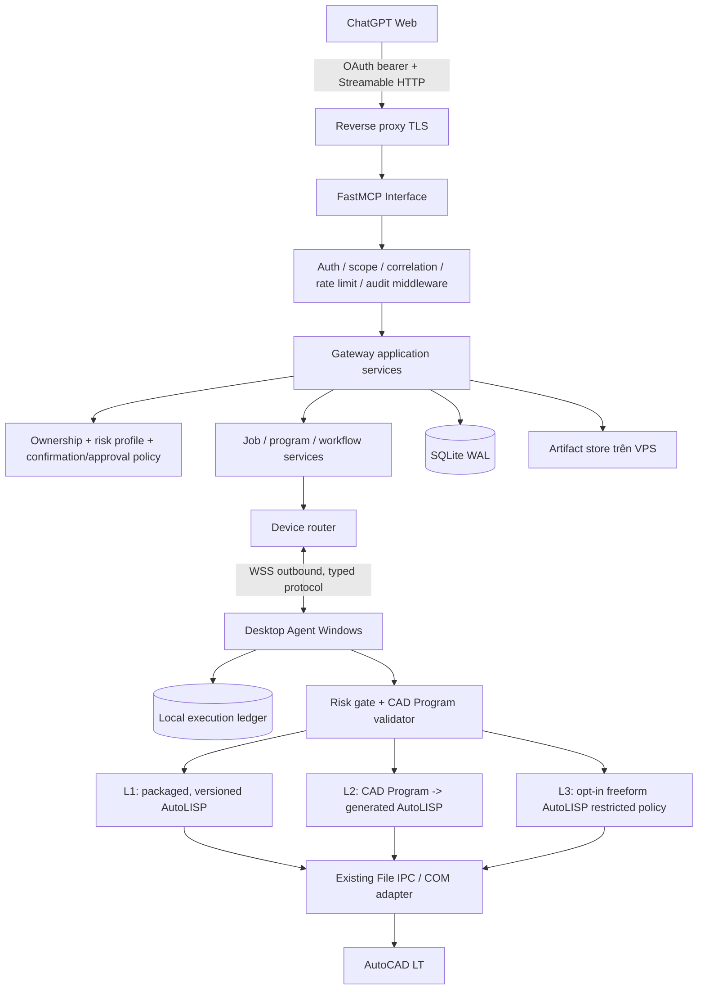
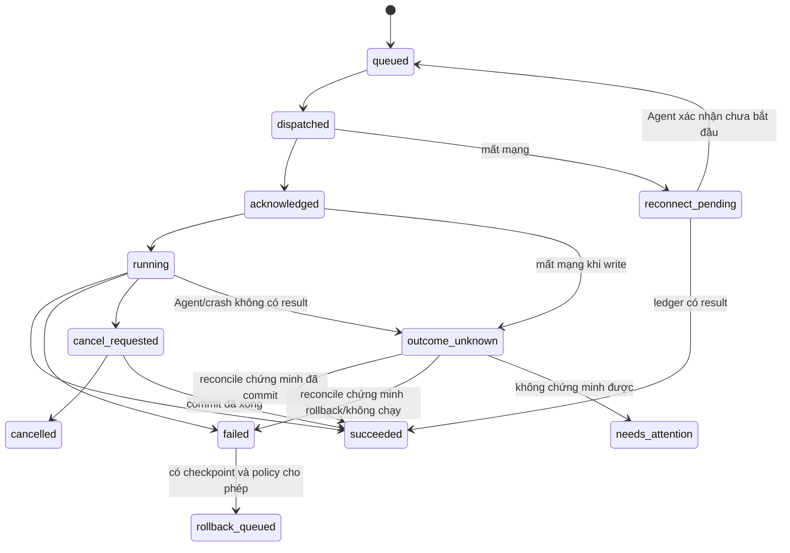
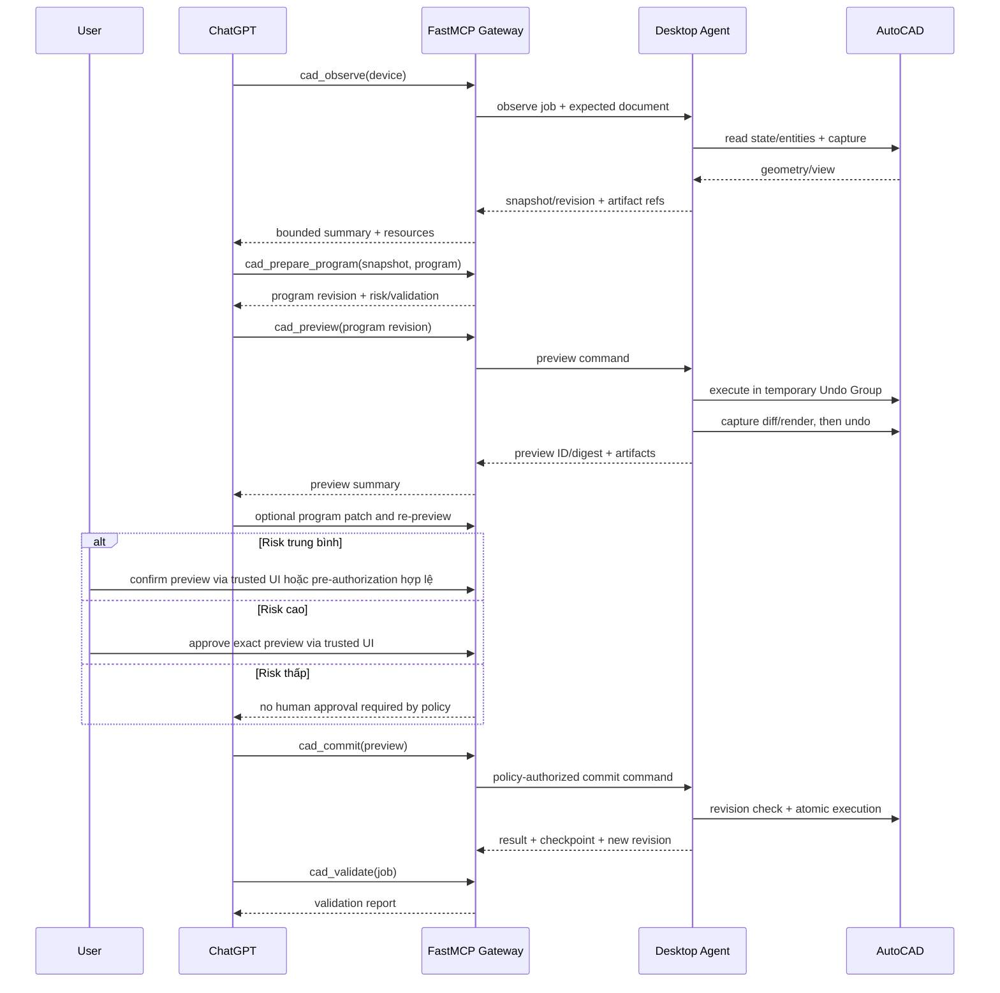

# Kế hoạch nâng cấp AutoCAD MCP nhiều người dùng bằng FastMCP

> Trạng thái: **đề xuất kiến trúc, chưa được phê duyệt để triển khai**
>
> Ngày khảo sát: 2026-07-21
>
> Phạm vi: phân tích, kiến trúc, migration, POC và kế hoạch triển khai; **không có code sản phẩm được thay đổi**
>
> Nguồn tham chiếu chính: code và test tại commit `7d6a782`; FastMCP PrefectHQ `3.4.4`

## 1. Executive summary

Repo hiện tại là một MCP server Python chạy trên chính máy có AutoCAD. ChatGPT gọi trực tiếp 8 tool tổng hợp, trong khi runtime thực tế đăng ký thêm 8 tool auto-dimension riêng. Các handler MCP gọi một backend singleton; backend `FileIPCBackend` điều khiển AutoCAD LT qua ActiveX/COM và các file JSON được AutoLISP xử lý. Mô hình này phù hợp cho một máy nhưng chưa có khái niệm user, device, durable job, pairing, artifact hay kết nối Desktop Agent outbound.

Kiến trúc đích được đề xuất là:

1. Một **Central Gateway trên VPS** nhận kết nối ChatGPT Web qua Streamable HTTP.
2. Gateway dùng **FastMCP của PrefectHQ**, pin chính xác `fastmcp==3.4.4`, chỉ cho lớp giao tiếp MCP: tools/resources/prompts, schema, request context, HTTP lifecycle, auth integration, authorization thô theo scope/tag, middleware và contract testing.
3. Domain services của Gateway không import decorator hay kiểu request của FastMCP. FastMCP handler chỉ chuyển identity và typed request sang các service độc lập.
4. Repo hiện tại được chuyển dần thành **Desktop Agent Windows**. AutoCAD execution, COM, File IPC, AutoLISP, screenshot, document state, primitive execution, preview, validation và rollback vẫn ở máy người dùng.
5. Desktop Agent không chạy FastMCP. Nó chủ động mở một kết nối WebSocket bảo mật tới Gateway và nhận typed command envelope. FastMCP không giải quyết kết nối này.
6. Gateway dùng **SQLite trên một VPS, một process ghi** trong giai đoạn đầu; SQLite là nguồn sự thật cho device, job, program, preview, risk policy, consent, artifact metadata và audit. Một hàng đợi trong RAM chỉ dùng để đánh thức worker, không được là nguồn sự thật.
7. Public MCP contract ban đầu có **10 tool cấp cao**, không expose primitive cũ và không dùng một mega-tool hàng trăm action. Scene data lớn, screenshot và diff đi qua resource/artifact reference thay vì nhét toàn bộ vào tool result.
8. Write được phân loại theo rủi ro, không bắt mọi thay đổi đi qua cùng một approval flow. Read chạy ngay; write thấp có thể chạy trực tiếp hoặc preview theo chế độ user; write trung bình phải preview rồi xác nhận; write cao phải preview và approval; write rất cao bị chặn hoặc chỉ chạy trong admin mode. Mọi write vẫn mang document revision và idempotency key. Mất kết nối trong lúc write tạo trạng thái `outcome_unknown`, không tự chạy lại.
9. AutoLISP dùng mô hình ba cấp: LISP tích hợp sẵn là runtime chính; CAD Program được Agent kiểm tra rồi biên dịch thành LISP là đường mặc định; LISP tự do do AI tạo là chế độ nâng cao, opt-in theo account/device và luôn chạy có giới hạn tại Desktop Agent.
10. Migration dùng feature flag và compatibility adapter. Luồng hiện tại vẫn chạy cho tới khi facade, simulated Agent, identity isolation và một AutoCAD thật đều qua POC.

Thứ tự POC nên là **A -> B -> C1 -> E -> D -> F -> C2**. Ngay sau Gateway giả lập, POC C1 kiểm tra đường truyền thật `ChatGPT -> VPS -> WebSocket -> Desktop Agent -> AutoLISP -> AutoCAD -> kết quả`; POC C2 chỉ hoàn tất preview/commit/rollback sau khi isolation, CAD Program và failure semantics đã được chứng minh. POC F cố ý làm rớt mạng đúng lúc thực thi để kiểm tra không chạy lệnh hai lần.

## 2. Mức độ chắc chắn của tài liệu

Tài liệu dùng ba nhãn:

- **Đã xác nhận**: đọc trực tiếp từ code, test, lockfile hoặc tài liệu chính thức.
- **Suy luận kiến trúc**: kết luận hợp lý từ code hiện tại nhưng cần POC trước khi cam kết production.
- **Chưa đủ dữ liệu**: phụ thuộc AutoCAD thật, hành vi ChatGPT Web, cấu hình Auth0 hoặc tải production chưa được đo trong khảo sát này.

Không có quyết định “production-ready” nào được suy ra chỉ từ việc endpoint trả HTTP 200/401. Các luồng OAuth, ownership, reconnect và write phải được kiểm thử bằng client thật hoặc simulator có failure injection.

## 3. FastMCP baseline và quyết định phiên bản

### 3.1. Điều đã kiểm chứng

Tại ngày 2026-07-21:

- GitHub Releases đánh dấu `v3.4.4` là release mới nhất, phát hành ngày 2026-07-09.
- PyPI ghi `fastmcp 3.4.4` yêu cầu Python `>=3.10`; repo hiện tại cũng yêu cầu Python `>=3.10` tại `pyproject.toml:7`.
- Repo hiện tại **không cài standalone FastMCP PrefectHQ**. Nó import `FastMCP` từ `mcp.server.fastmcp` tại `src/autocad_mcp/server.py:13` và lock `mcp==1.26.0` tại `uv.lock:835-837`. Tài liệu FastMCP gọi đây là FastMCP 1.x được tích hợp trong MCP Python SDK.
- Tài liệu FastMCP nói migration cơ bản từ import `mcp.server.fastmcp.FastMCP` thường bắt đầu bằng thay import, nhưng repo này còn phụ thuộc các API auth, ASGI, tool manager private và `mcp.types`, nên không được coi là “chỉ đổi một dòng”.
- Authorization theo callable/scope/tag và `AuthMiddleware` có từ FastMCP 3.0. OAuth token chỉ có trong HTTP transport, không có trong stdio.
- FastMCP có Streamable HTTP, ASGI app, lifecycle, tools/resources/prompts, typed schema, middleware, client in-memory, composition, proxy, custom health route và test utilities.
- FastMCP cảnh báo breaking change có thể xuất hiện ở minor version. Production phải pin exact version.

Nguồn chính thức:

- [FastMCP v3.4.4 release](https://github.com/PrefectHQ/fastmcp/releases/tag/v3.4.4)
- [FastMCP trên PyPI](https://pypi.org/project/fastmcp/)
- [Installation và versioning policy](https://gofastmcp.com/getting-started/installation)
- [Authorization](https://gofastmcp.com/servers/authorization)
- [Middleware](https://gofastmcp.com/servers/middleware)
- [HTTP/ASGI deployment](https://gofastmcp.com/deployment/http)
- [Testing](https://gofastmcp.com/servers/testing)
- [Resources](https://gofastmcp.com/servers/resources)
- [Tools và structured output](https://gofastmcp.com/servers/tools)

### 3.2. Version strategy được chốt cho POC

- Gateway POC pin `fastmcp==3.4.4`, không dùng `>=3.4.4`.
- Python Gateway chuẩn hóa ở Python 3.12.x trong container Linux. CI vẫn chạy compatibility trên Python 3.10 và 3.13 vì repo hiện tại hỗ trợ 3.10+ và Desktop Agent có thể đang dùng runtime khác.
- `uv.lock` là nguồn dependency resolution; image production pin thêm digest của base image.
- Không nâng FastMCP trong cùng PR với thay public contract hoặc Gateway-Agent protocol.
- Mỗi lần nâng FastMCP phải qua: schema snapshots, tool/resource/prompt discovery, in-memory client tests, Streamable HTTP stateful/stateless tests, OAuth discovery/token tests, host/origin tests, reverse-proxy tests và simulated Agent E2E.
- Theo dõi release notes, security advisory và thay đổi transitive `mcp`, Starlette, Pydantic, auth/JWT. FastMCP 3.4.3-3.4.4 đã thay hành vi Host/Origin guard, vì vậy production phải cấu hình trusted host/origin rõ ràng thay vì dựa vào default.
- Sau hai chu kỳ ổn định mới xem xét chuyển từ exact patch sang một quy trình bot tạo PR nâng patch; production vẫn lock exact.

## 4. Repo assessment có dẫn chứng

### 4.1. Stack, entrypoint và transport

| Hạng mục | Đã xác nhận từ repo | Ý nghĩa migration |
| --- | --- | --- |
| Ngôn ngữ | Python `>=3.10`; `pyproject.toml:1-16` | Có thể bổ sung Gateway FastMCP bằng Python, không cần bridge sang ngôn ngữ khác. |
| Entrypoint | `src/autocad_mcp/__main__.py` gọi `server.main()`; `src/autocad_mcp/server.py:714-755` chọn stdio hoặc Streamable HTTP | Giữ entrypoint này làm legacy trong migration. Gateway mới có entrypoint riêng. |
| MCP framework hiện tại | `mcp.server.fastmcp.FastMCP`; `src/autocad_mcp/server.py:13,53-61` | Đây không phải standalone FastMCP v3; phải có compatibility POC. |
| HTTP/ASGI | `src/autocad_mcp/http_server.py:51-132` tạo Starlette app, mount Streamable HTTP, host/config middleware và Uvicorn | Có kinh nghiệm ASGI có thể tái sử dụng về nguyên tắc; Gateway mới dùng FastMCP `http_app()` trong outer ASGI app. |
| OAuth | `OIDCTokenVerifier` kiểm issuer, audience, signature, expiry và scope; `src/autocad_mcp/oauth.py:64-249` | Logic và test là baseline, nhưng ưu tiên FastMCP `JWTVerifier` + `RemoteAuthProvider`; chỉ giữ custom verifier nếu POC chứng minh built-in thiếu yêu cầu Auth0. |
| Remote policy | `evaluate_operation()` phân read/write scope và path guard; `src/autocad_mcp/remote_policy.py:20-253` | Tái sử dụng policy knowledge. Ownership/device/risk phải chuyển thành domain authorization mới. |
| Host/origin | `AllowedHostMiddleware`, MCP transport security; `src/autocad_mcp/http_server.py:23-118` | Giữ fail-closed rule, đặt ngoài FastMCP app và kiểm reverse-proxy trust. |
| Test baseline | Lần chạy 2026-07-21: `302 passed, 1 skipped, 9 warnings` | Đây là regression gate trước/sau mỗi phase; warning ezdxf/pyparsing không phải lỗi migration. |

### 4.2. MCP interface hiện tại

`src/autocad_mcp/server.py:1-4` mô tả 8 tool tổng hợp:

- `drawing`
- `entity`
- `layer`
- `block`
- `annotation`
- `pid`
- `view`
- `system`

Tuy nhiên runtime thực tế có ít nhất **16 tool**. `tests/test_tool_registration.py:15-39` còn yêu cầu:

- `annotation_detect_parts`
- `annotation_plan_dimensions`
- `annotation_commit_dimension_plan`
- `annotation_auto_dimension`
- `annotation_batch_create_dimensions`
- `annotation_dimension_profiles`
- `annotation_audit_dimensions`
- `annotation_repair_dimension_layout`

Các tool tổng hợp dùng `operation: str` và `data: dict`, ví dụ `entity` tại `src/autocad_mcp/server.py:226-318`. Cách này giảm số tên tool nhưng tạo schema rộng, annotation tĩnh không mô tả được từng operation và policy phải tự dispatch lại. Các tool dimension riêng có annotation tốt hơn, ví dụ `annotation_detect_parts` tại `src/autocad_mcp/auto_dimension_tool.py:537-557`.

**Đã xác nhận:** không có `@mcp.resource` hay `@mcp.prompt` trong `src/`. Scene data và ảnh hiện trả trực tiếp trong tool result.

### 4.3. AutoCAD execution và backend seam

`AutoCADBackend` tại `src/autocad_mcp/backends/base.py:49-302` là seam tái sử dụng quan trọng. Nó đã tách phần lớn lệnh CAD khỏi MCP handler và có `CommandResult` chuẩn tại `base.py:10-30` cùng capability flags tại `base.py:33-46`.

Hai backend hiện có:

- `EzdxfBackend` cho headless DXF và test không cần AutoCAD.
- `FileIPCBackend` cho AutoCAD LT thật.

`FileIPCBackend` đã có các cơ chế đáng giữ:

- Tìm AutoCAD đang chạy và kết nối ActiveX/COM bằng `GetActiveObject`, không tự mở AutoCAD: `file_ipc.py:72-95,233-268`.
- Ghi nhận active document identity: `file_ipc.py:270-324`.
- Phân biệt idle, busy và modal qua `IsQuiescent`/`CMDACTIVE`: `file_ipc.py:301-324`.
- Một `asyncio.Lock` serializes command trên một process: `file_ipc.py:128-135,394-410`.
- Session ID, request ID, atomic command file và matching response IDs: `file_ipc.py:336-340,424-483`.
- Chỉ retry `ping`; write không tự retry: `file_ipc.py:394-409` và regression test `tests/test_file_ipc_reliability.py:185-204`.
- Kiểm active document đổi trong khi chờ: `file_ipc.py:486-506`.
- Route allowlist wrapper `SafeFileIPCBackend`: `src/autocad_mcp/backends/safe_file_ipc.py:8-130`.
- AutoLISP dispatcher có command handlers cụ thể, phù hợp làm runtime cấp 1 được đóng gói/version/kiểm thử: `lisp-code/mcp_dispatch.lsp:517-1463` và các reliability override phía cuối file.

Đây là nền tảng của Desktop Agent, nhưng `asyncio.Lock`, session ID và file request hiện chỉ đảm bảo single process/single machine. Chúng không thay thế durable job/idempotency đa user.

### 4.4. Tính năng hiện có và mức tái sử dụng

| Nhóm | Code hiện có | Đánh giá |
| --- | --- | --- |
| AutoCAD/document state | `FileIPCBackend._inspect_runtime()`, `health()`, `DocumentSnapshot`; `file_ipc.py:47-66,187-231,285-334` | Tái sử dụng trong Agent; cần thêm stable document ID và monotonic revision. |
| Drawing operations | `server.py:169-216`; backend methods `base.py:84-121` | Chuyển thành primitive nội bộ; file open/save/plot cần risk/path policy và approval khi mức rủi ro yêu cầu. |
| Entity CRUD | `server.py:224-318`; backend methods `base.py:123-190` | Tái sử dụng qua adapter; không expose public trực tiếp. |
| Layer/block/annotation/P&ID | `server.py:326-584`; `pid/cto_library.py` | Tái sử dụng làm primitive/skill capability. P&ID phụ thuộc thư viện máy người dùng nên capability manifest phải phản ánh. |
| Auto-dimension | `auto_dimension_tool.py`, `dimension_workflow.py`, `dimension_intelligence.py`, `part_detection.py` | Tái sử dụng mạnh: đây là workflow/skill đầu tiên của kiến trúc hybrid. |
| Preview/revision | Plan preview, fingerprint và expected revision tại `auto_dimension_tool.py:192-274,316-373`; store tại `dimension_plans.py:132-299` | Tái sử dụng pattern, không tái sử dụng in-memory store cho multi-user. |
| Transaction/undo | Batch dimension/repair dùng một UNDO group; `dimension_workflow.py:389-452,710-894`; static tests `test_lisp_reliability_static.py:132-163` | Mở rộng thành generic CAD Program transaction; hiện chưa bao phủ mọi operation. |
| Validation/intelligence | `dimension_intelligence.py:279-484,688-1088` | Tái sử dụng cho Scene Graph feature inference/audit, nhưng mới tập trung mechanical dimension. |
| Screenshot | Win32 `PrintWindow` và matplotlib; `screenshot.py:19-206`; byte limit tại `client.py:309-378` | Giữ capture ở Agent; Gateway lưu artifact, không trả base64 lớn trực tiếp. |
| Audit | `_safe` tạo request ID và `structlog` audit; `client.py:121-276` | Giữ field taxonomy, chuyển thành durable audit có user/device/job/correlation. |
| Auth | `oauth.py`, `remote_policy.py`, tests `test_oauth.py`, `test_remote_policy.py` | Dùng làm acceptance baseline; thay integration bằng FastMCP v3 nếu tương thích. |
| HTTP contract tests | `test_streamable_http.py:96-239` chạy initialize/list/call/reconnect/concurrency/policy | Tái sử dụng cách test; chuyển sang FastMCP Client và public v1 snapshots. |

### 4.5. Khoảng trống đã xác nhận

Không có dependency hoặc code trong `src/` cho SQLite/SQLAlchemy, Redis, WebSocket, heartbeat, `device_id`, `job_id`, `artifact_id`, approval token hay resume. Các plan/audit context hiện là dictionary trong RAM:

- `_plans = DimensionPlanStore()`
- `_plan_context = {}`
- `_audit_context = {}`

Tại `src/autocad_mcp/auto_dimension_tool.py:49-52`. `DimensionPlanStore` tự mô tả là in-process tại `dimension_plans.py:132-140`.

Khoảng trống sản phẩm:

- Không có user/device ownership.
- Không có persistent outbound Agent connection.
- Không có durable job state, progress, cancel, resume hay reconciliation.
- Không có risk policy/profile và generic confirmation/approval record do user thật tạo.
- Không có artifact store và pagination scene data.
- Không có generic CAD Program interpreter/semantic validator.
- Không có rollback checkpoint cho toàn bộ write.
- Không có Agent local execution ledger qua restart.
- Không có secure pairing, revoke hoặc signed Agent update.

### 4.6. Phần chưa đủ dữ liệu

- AutoCAD LT có cho phép gắn một marker bền vững vào DWG theo `job_id` mà không ảnh hưởng file/customer workflow hay không.
- Cách đáng tin cậy nhất để phát hiện external edit và tăng document revision: event hook, `DBMOD`, content fingerprint hay kết hợp.
- Latency và giới hạn payload thực tế của ChatGPT Web với resources, images, progress notification và elicitation.
- Auth0 DCR/token hiện tại đã luôn cấp `sub`, `autocad.read` và `autocad.write` đúng cho kết nối ChatGPT mới hay chưa.
- `PrintWindow` có ổn định trên các phiên bản AutoCAD, GPU mode, minimize và Remote Desktop thực tế của tập người dùng hay không.
- Mức tải user/device thực tế để xác định thời điểm SQLite/một process không còn đủ.

Các điểm này phải là tiêu chí POC hoặc pilot, không được điền bằng giả định.

### 4.7. Tài liệu cũ được tái sử dụng

| Tài liệu | Phần còn giá trị | Phần được thay thế bởi kế hoạch này |
| --- | --- | --- |
| `docs/ke-hoach-chatgpt-http-bridge.md` | Streamable HTTP, fail-closed OAuth, path/image guard, confirmation, audit và test bằng MCP protocol client | Mô hình ChatGPT kết nối thẳng server trên từng máy/tunnel riêng không còn là target multi-user. |
| `docs/phase0-baseline.md` | Baseline/spike discipline, pin SDK và test initialize -> tools/list -> tools/call | Spike mới phải dùng standalone FastMCP PrefectHQ v3 và public v1 contract. |
| `docs/phase2-remote-policy.md` | Read/write allowlist, path guard, safe audit và payload limit | Policy mới thêm user/device ownership, AutoLISP ba cấp, risk profile, confirmation/approval và Agent validation. |
| `docs/phase4-oauth.md` | Auth0 resource-server responsibilities, protected-resource metadata và token test checklist | OAuth chuyển về Central Gateway; Desktop Agent dùng device identity riêng, không dùng ChatGPT token. |
| `docs/file-ipc-error-model.md` và `docs/file-ipc-manual-test.md` | Error codes, busy/modal/document-change và manual AutoCAD checks | Được bọc trong Agent error taxonomy, job/reconcile và POC C1/F/C2. |
| `docs/auto-dimension.md` | Observe/plan/revise/commit/audit/repair pattern | Trở thành skill/workflow đầu tiên trên generic CAD Program/risk-policy/job model. |

Những tài liệu trên tiếp tục là baseline cho compatibility flow; tài liệu này là nguồn chính cho kiến trúc multi-user mới sau khi được duyệt.

## 5. Current và target architecture

### 5.1. Hiện trạng



Hạn chế chính: HTTP server, OAuth policy, domain workflow và AutoCAD execution cùng nằm trong một process/máy; muốn thêm user thứ hai phải expose thêm một máy hoặc tunnel riêng.

### 5.2. Kiến trúc đích



### 5.3. Ranh giới trách nhiệm

| Thành phần | Chịu trách nhiệm | Không chịu trách nhiệm |
| --- | --- | --- |
| ChatGPT | Hiểu yêu cầu, chọn tool cấp cao, lập/patch CAD Program, và khi được bật có thể đề xuất AutoLISP cấp 3; đọc preview/validation | Không tự nâng risk mode, tự bật LISP cấp 3, tự tạo approval cấp cao hoặc giữ job truth. |
| FastMCP Interface | MCP lifecycle, discovery, schema, context, HTTP transport, auth integration, scope/tag visibility, middleware hooks | Không route device, không quyết định job đã chạy, không hiểu hình học AutoCAD. |
| Gateway Domain/Application Core | Identity mapping, ownership, device selection, job state, idempotency, risk/profile, confirmation/approval, workflow, policy, audit, artifact references | Không gọi COM/AutoLISP, không hard-code hình dạng bản vẽ. |
| Device Transport | WSS session, heartbeat, command/progress/result, reconnect/reconcile, protocol negotiation | Không expose public MCP contract. |
| Storage | Durable state, isolation, audit, artifacts/checkpoints | Không quyết định business policy. |
| Desktop Agent | Device auth, AutoCAD presence, local serialization, independent validation, risk enforcement, biên dịch CAD Program thành LISP, chạy cả ba cấp AutoLISP, execution ledger, preview/commit/rollback | Không nhận quyền hay chế độ LISP từ payload do ChatGPT tự khai, không host public MCP. |
| AutoCAD runtime | Chạy AutoLISP/primitive, document transaction/Undo, render/screenshot | Không biết user OAuth hay Gateway job orchestration. |

## 6. Cấu trúc repo đề xuất

Giữ **monorepo** ít nhất đến hết pilot v1 để protocol, Agent và Gateway thay đổi nguyên tử trong cùng PR. Không di chuyển code cũ ngay. Cấu trúc mục tiêu theo từng bước:

```text
autocad-mcp/
  pyproject.toml                  # legacy package còn chạy trong migration
  src/autocad_mcp/               # luồng hiện tại, compatibility mode
  services/
    gateway/
      pyproject.toml              # Linux, fastmcp==3.4.4, SQLite/ASGI
      src/autocad_gateway/
        main.py
        mcp_interface/
          server.py               # decorators và FastMCP-only wiring
          models.py               # public typed request/response
          resources.py
          prompts.py
          middleware.py
        application/
          device_service.py
          observation_service.py
          program_service.py
          job_service.py
          consent_service.py
          workflow_service.py
        domain/
          models.py
          policies.py
          state_machines.py
        infrastructure/
          sqlite/
          artifacts/
          auth/
          agent_transport/
  apps/
    desktop_agent/
      pyproject.toml              # native Windows + pywin32
      src/autocad_agent/
        main.py
        connection.py
        pairing.py
        presence.py
        executor.py
        ledger.py
        update.py
        runtime_adapter.py
  packages/
    contracts/
      src/autocad_contracts/      # Gateway-Agent envelope + CAD Program schemas
    cad_core/
      src/autocad_core/           # framework-neutral models/validators/ports
  tests/
    ...                           # legacy regression vẫn giữ
  tests_gateway/
  tests_agent/
  tests_contract/
```

Nguyên tắc dependency:

```text
mcp_interface -> application -> domain
infrastructure -> application/domain ports
desktop_agent -> contracts + existing CAD runtime adapters
FastMCP type/decorator -X-> domain/application
Gateway -X-> pywin32/COM/AutoLISP
Desktop Agent -X-> FastMCP
```

Chỉ cân nhắc tách repo khi có ít nhất một trong ba điều kiện: team Gateway và Agent release độc lập; protocol đã ổn định qua hai minor version; hoặc quyền truy cập/source distribution của Agent khác Gateway. Trước đó, tách repo làm tăng nguy cơ lệch protocol và khó rollback.

## 7. FastMCP Adoption Plan

### 7.1. FastMCP nằm ở đâu

FastMCP chỉ nằm tại `services/gateway/src/autocad_gateway/mcp_interface/` và dependency wiring của Gateway. Một handler điển hình về mặt kiến trúc:

```text
FastMCP typed input
  -> lấy AccessToken claims và correlation context
  -> chuyển thành AuthenticatedPrincipal + command DTO
  -> gọi application service interface
  -> map domain result sang typed MCP output/resource link
```

Application service được unit test bằng fake repositories/router, không khởi động MCP server.

### 7.2. Thành phần dùng trực tiếp FastMCP

- Khai báo 10 public tools.
- Khai báo resource/resource template cho device capability, snapshot, scene page, artifact, job và skill catalog.
- Hai prompt template hướng dẫn vòng lặp plan/repair.
- Typed Pydantic schema và structured output.
- Streamable HTTP endpoint cho ChatGPT Web.
- `Context` cho request ID, progress/logging khi client hỗ trợ.
- Auth provider, AccessToken claims, component auth và `AuthMiddleware`.
- MCP middleware cho error mapping, rate limit entry, timing, correlation và audit hook.
- Lifespan khởi tạo/đóng DB, dispatcher và connection registry.
- In-memory FastMCP Client cho contract tests.
- Custom health route hoặc FastMCP ASGI app mounted vào outer Starlette app.

### 7.3. Thành phần không phụ thuộc FastMCP

- Device/user/job/program/preview/risk-profile/confirmation/approval domain models.
- SQLite repositories và migrations.
- Artifact store.
- Gateway-Agent WebSocket protocol.
- Device registry, presence và router.
- Job state machine, retry/reconcile/cancel.
- CAD Program schema registry, semantic/risk validator và AutoLISP level policy.
- Primitive/LISP package registry, CAD Program compiler và Agent capability negotiation.
- AutoCAD File IPC, COM, AutoLISP ba cấp, screenshot, preview, transaction và rollback.
- Scene Graph và workflow runtime.

### 7.4. Transport và ASGI

- ChatGPT dùng Streamable HTTP tại `/mcp` qua HTTPS.
- Một outer Starlette ASGI app chứa:
  - FastMCP app tại `/mcp`;
  - `/agent/ws` cho Agent outbound;
  - `/healthz` chỉ kiểm process sống;
  - `/readyz` kiểm DB writable, schema migration đúng và dispatcher chạy;
  - pairing/download routes có auth riêng.
- Lifespan của FastMCP phải được kết hợp đúng vào outer app theo tài liệu, tránh session manager không khởi tạo.
- Không dùng SSE cho thiết kế mới. Không dùng stdio ở Gateway production; stdio chỉ giữ cho legacy/local compatibility.

### 7.5. Authentication và identity mapping

Ưu tiên cấu hình FastMCP v3 như sau, cần được chứng minh trong POC A/E:

1. Dùng built-in `JWTVerifier` để kiểm JWKS, issuer, audience, expiry.
2. Bọc bằng `RemoteAuthProvider` để phát protected-resource metadata tới ChatGPT/Auth0 DCR.
3. Nếu Auth0 behavior không tương thích built-in, dùng custom `TokenVerifier` adapter dựa trên test hiện có; không tự host OAuth authorization server.
4. `sub` trong access-token claims là external user identity bắt buộc. `client_id`/`azp` chỉ nhận diện OAuth client, không được dùng làm user owner.
5. Map `(issuer, sub)` sang `users.id` nội bộ. Không nhận `user_id` từ tool input.
6. FastMCP scope/tag check là lớp thứ nhất; service ownership query là lớp bắt buộc thứ hai.

`cad_prepare_program`/`cad_preview`/`cad_commit` có scope nền `autocad.write`. Vì cùng tool có nhiều `source_kind`, static component auth của FastMCP không diễn tả được điều kiện “chỉ cấp 3 cần thêm scope”; domain service phải yêu cầu thêm `autocad.lisp.advanced` cho nhánh cấp 3 rồi tiếp tục kiểm account/device opt-in. Có scope nâng cao nhưng opt-in đang off vẫn bị từ chối.

Ví dụ rule logic, không phải code triển khai:

```text
token has autocad.write
AND device.owner_user_id == principal.user_id
AND device is not revoked
AND requested operation is in device capability manifest
AND expected document/revision matches
AND selected account/device mode permits the execution path
AND preview/confirmation/approval exists when the risk matrix requires it
```

### 7.6. Middleware bắt buộc

Thứ tự logic từ ngoài vào trong:

1. Trusted host/origin/reverse-proxy guard.
2. FastMCP authentication.
3. Correlation/request ID middleware.
4. Global scope/tag authorization.
5. Per-user/IP rate limit admission.
6. Input/response byte limit.
7. Timing/metrics.
8. Safe structured audit, không log token, CAD Program đầy đủ, path hay ảnh base64.
9. Error taxonomy mapping; production không trả traceback.

Không dùng generic retry middleware quanh tool write. Retry chỉ do `JobService` quyết định dựa trên loại operation và Agent reconciliation.

Không dùng response cache cho dữ liệu theo user nếu cache key không chứa identity. Tài liệu FastMCP cảnh báo built-in cache key mặc định không chứa user/session; public CAD resources nên tắt cache hoặc dùng storage/key riêng đã partition theo user.

### 7.7. Composition, mount, proxy và client

| Tính năng | Quyết định ban đầu | Khi nào đổi |
| --- | --- | --- |
| Một FastMCP server với module registration | **Dùng** | Đây là cách đơn giản nhất cho 10 tool. |
| `mount` nhiều FastMCP subserver | Chưa dùng | Chỉ khi capability pack có lifecycle/team riêng; phải chia sẻ state store đúng cách. |
| `import_server` | Không cần ở MVP | Có thể dùng để đóng gói module ổn định, nhưng Python registration thường đơn giản hơn. |
| MCP proxy tới Desktop Agent | **Không dùng** | Agent không phải MCP server; proxy sẽ phá ranh giới job/ownership và dễ expose primitive. |
| Proxy legacy MCP server | Chỉ cân nhắc trong POC ngắn | Không dùng làm production architecture vì giữ nguyên mega-tool và per-machine semantics. |
| FastMCP Client | **Dùng cho test** | Có thể dùng cho diagnostic/admin sau, không dùng làm device transport. |

### 7.8. FastMCP vs custom-code matrix

| Năng lực | FastMCP | Code riêng | Dịch vụ ngoài | Lý do |
| --- | ---: | ---: | ---: | --- |
| Tool declaration | Chính | Mỏng | Không | Decorator/schema/discovery là vai trò FastMCP. |
| Input/output schema | Chính | CAD semantic validation | Không | FastMCP validate envelope; domain validate primitive/capability/risk. |
| Resources/prompts | Chính | Resolver/ownership | Artifact store | FastMCP expose; data vẫn do service/repository cung cấp. |
| HTTP transport/lifecycle | Chính | Outer ASGI wiring | Reverse proxy/TLS | Không tự viết MCP transport. |
| Authentication | Chính integration | Identity mapping/fallback verifier | Auth0 | Auth0 phát token; FastMCP verify/integrate; domain map owner. |
| Authorization | Scope/tag/component | Ownership/device/risk/consent | Auth0 quản scope grant | Không thể dùng scope thay ownership. |
| Middleware | Pipeline/built-in | Correlation, safe audit, ownership admission | Metrics backend tùy chọn | FastMCP là điểm chặn MCP phù hợp. |
| Health/readiness | Custom route hook | Readiness logic | Reverse proxy monitor | FastMCP không biết DB/router health. |
| Device routing | Không | Chính | Không ở MVP | Domain riêng. |
| Persistent Agent connection | Không | Chính | Reverse proxy WSS | Không phải MCP transport. |
| Job management | Không làm source of truth | Chính | SQLite | FastMCP task không thay durable CAD job semantics. |
| Database | Không | Repository/migration | SQLite | Framework độc lập. |
| Artifact storage | Resource link/output | Chính | Local disk VPS; S3 sau | Không nhét blob lớn vào context. |
| CAD schema validation | Envelope | Chính | Không | Cần capability/version/risk knowledge. |
| AutoCAD execution | Không | Desktop Agent | AutoCAD | Giữ local. |
| Preview | Chỉ trả kết quả/link | Agent + domain | Artifact store | Phải chạy transaction CAD. |
| Rollback | Chỉ public tool schema | Agent + job service | SQLite/checkpoint store | Cần document revision và Undo semantics. |
| Audit | Middleware hook | Durable event model | SQLite/log sink | Built-in log không đủ multi-user compliance. |
| Testing | Client/in-memory transport | Simulator/failure injection | CI | Kết hợp cả hai lớp. |
| Observability | Timing/OTel hooks | Domain metrics/connection gauges | OTel/Prometheus tùy chọn | Framework không biết job/device SLO. |
| Composition/proxy | Có nhưng chưa cần | Module wiring | Không | Tránh runtime indirection sớm. |

### 7.9. Lock-in và cách giảm

Rủi ro lock-in nằm ở decorator, `Context`, auth provider, middleware object, component metadata và FastMCP-specific result types. Giảm bằng cách:

- Chỉ import FastMCP trong `mcp_interface/`.
- Public/domain DTO ở package riêng; interface mapper chịu trách nhiệm chuyển sang FastMCP.
- Không đưa `Context` vào application service signature.
- Contract test public JSON/schema độc lập với unit test domain.
- Outer ASGI, DB, Agent transport và artifacts không gọi FastMCP internals/private manager.
- Không phụ thuộc `mcp._tool_manager` như code hiện tại tại `server.py:128-132`.
- Không dùng provider/proxy động làm nơi chứa core business state.

## 8. Public MCP interface đề xuất

### 8.1. Nguyên tắc

- Tool set nhỏ, tên ổn định và theo mục đích người dùng.
- Read và write tách tool để annotation, scope và risk policy rõ.
- Không có `operation: str` tổng quát kiểu hiện tại.
- Không có primitive tool công khai.
- CAD Program envelope ổn định; primitive schema được version và đọc từ resource capability.
- Mọi output có `contract_version`, `correlation_id` và ID bền vững khi tạo state.
- Tool result nhỏ chỉ trả summary + resource/artifact refs.
- Annotations là hint cho client, không phải enforcement; server vẫn tự chặn.

### 8.2. Bảng tools v1

| Tool | Mục đích | Input khái niệm | Output khái niệm | Scope | Rủi ro / annotation | Consent | Service |
| --- | --- | --- | --- | --- | --- | --- | --- |
| `cad_list_devices` | Liệt kê máy thuộc user và trạng thái | filter online/capability | device summaries, default suggestion | `autocad.read` | read-only, idempotent | Không | `DeviceService.list_owned` |
| `cad_observe` | Chụp trạng thái document/selection/scene summary | device, observation level, optional viewport | snapshot ID, document revision, summary refs, artifact refs | `autocad.read` | không destructive; idempotent khi có idempotency key | Không | `ObservationService.observe` |
| `cad_query` | Query entity/relation trên một snapshot | snapshot ID, bounded filter, cursor, limit | page + next cursor + resource refs | `autocad.read` | read-only, idempotent | Không | `QueryService.query_snapshot` |
| `cad_prepare_program` | Chuẩn bị execution spec: packaged operation cấp 1, CAD Program cấp 2, hoặc freeform LISP cấp 3; validate schema/semantic/risk | discriminated `source_kind`, device, expected snapshot/revision, program/package args/code artifact hoặc revision + patch, idempotency key | execution/program ID + revision, validation/risk/required-next-step | `autocad.write`; thêm `autocad.lisp.advanced` cho cấp 3 | chỉ tạo state Gateway; không sửa CAD | Không | `ProgramService.prepare_execution` |
| `cad_preview` | Chạy preview có rollback nội bộ và tạo diff/render | execution/program ID + revision, device, expected document revision | preview ID, diff/risk/validation, artifact refs, quyết định bước tiếp theo | `autocad.write`; cấp 3 thêm `autocad.lisp.advanced` | temporary CAD side effect; không destructive theo kết quả, không tự retry | Không trước preview; cấp 3 vẫn phải opt-in | `PreviewService.start` |
| `cad_commit` | Thực thi execution theo risk policy; low-risk có thể không cần preview, medium/high phải dùng preview hợp lệ | execution/program revision hoặc preview ID, expected revisions, idempotency key | job ID; risk decision; commit result đến sau qua job | `autocad.write`; thêm `autocad.delete`/`autocad.lisp.advanced` khi cần | write; annotation tĩnh phải bảo thủ vì tool có thể chạy high-risk | Không / xác nhận / approval theo risk + mode | `CommitService.commit_with_policy` |
| `cad_validate` | Kiểm kết quả/drawing theo rule | snapshot/job/execution/program ID, validation profile | validation report + artifact refs | `autocad.read` | read-only đối với drawing | Không | `ValidationService.validate` |
| `cad_get_job` | Lấy state/progress/result của job | owned job ID, optional event cursor | state, progress, result/error, next event cursor | `autocad.read` | read-only, idempotent | Không | `JobService.get` |
| `cad_cancel_job` | Yêu cầu cancel cooperative | owned job ID, reason, idempotency key | accepted/too-late/current state | `autocad.write` | non-destructive, idempotent | Không | `JobService.cancel` |
| `cad_rollback` | Khôi phục checkpoint của commit | job/checkpoint ID, expected current document revision, idempotency key | rollback job ID/risk report | `autocad.write` | thay đổi drawing, destructive hint true | Theo risk của rollback và xung đột revision | `RollbackService.request` |

Không thêm public `cad_approve`. Nếu model có thể gọi tool đó thì confirmation/approval không chứng minh ý chí user. Khi risk policy yêu cầu, record phải được tạo bởi một channel ngoài quyền tự quyết của model: local Desktop Agent prompt/tray ở POC C2, sau đó companion web UI đã login. `cad_commit` kiểm risk decision và chỉ đòi record khi matrix bên dưới yêu cầu; low-risk được phép chạy thẳng nếu mode cho phép.

Nếu ChatGPT Web sau POC chứng minh một elicitation/confirmation primitive thật sự buộc user thao tác và cung cấp proof server-side, nó có thể trở thành confirmation/approval channel bổ sung; không giả định trước.

Annotation đề xuất phải bảo thủ và được snapshot-test:

| Tool | `readOnlyHint` | `destructiveHint` | `idempotentHint` | `openWorldHint` |
| --- | ---: | ---: | ---: | ---: |
| `cad_list_devices` | true | false | true | false |
| `cad_observe` | true | false | false | false |
| `cad_query` | true | false | true | false |
| `cad_prepare_program` | false | false | true | false |
| `cad_preview` | false | false | true | false |
| `cad_commit` | false | true | true | false |
| `cad_validate` | true | false | true | false |
| `cad_get_job` | true | false | true | false |
| `cad_cancel_job` | false | false | true | false |
| `cad_rollback` | false | true | true | false |

Các tool được đánh dấu idempotent chỉ giữ đúng tính chất đó khi Gateway bắt buộc idempotency key, so payload hash và trả lại cùng resource/job cho request lặp. Annotation không tự tạo idempotency và không thay server enforcement. `cad_observe` để `idempotentHint=false` vì một lần gọi mới có thể tạo snapshot/artifact mới dù không sửa bản vẽ.

### 8.3. Risk policy và ba chế độ người dùng

Risk được tính từ operation, số entity, vùng ảnh hưởng, file/path, AutoLISP level, capability và trạng thái document. ChatGPT có thể giải thích risk report nhưng không được tự hạ mức. Gateway quyết định theo policy trung tâm; Desktop Agent tính lại độc lập và dùng mức cao hơn nếu hai bên khác nhau.

| Mức | Ví dụ | Quy trình tối thiểu |
| --- | --- | --- |
| Đọc | Kiểm tra bản vẽ, đọc layer | Chạy ngay. |
| Thấp | Tạo line, circle, text mới | Chạy trực tiếp hoặc preview tùy mode/cài đặt. |
| Trung bình | Di chuyển hàng loạt, dimension, thay layer | Bắt buộc preview rồi xác nhận. |
| Cao | Xóa, purge, ghi đè file, AutoLISP cấp 3 | Bắt buộc preview và approval một lần, bind đúng digest/revision. |
| Rất cao | Động tới file ngoài workspace hoặc hệ thống | Chặn mặc định; chỉ admin mode riêng mới được xem xét, vẫn phải có policy/path guard và audit. |

Ba mode là policy được user chọn và lưu theo account, có thể override chặt hơn theo device. Mode không được làm thấp hơn các hard floor “Cao” và “Rất cao”:

| Mode | Thấp | Trung bình | Cao | Rất cao |
| --- | --- | --- | --- | --- |
| **An toàn** | Preview + xác nhận | Preview + approval một lần | Preview + approval một lần | Chặn. |
| **Cân bằng** | Chạy thẳng hoặc preview theo cài đặt; mặc định chạy thẳng với primitive tạo mới | Preview + xác nhận | Preview + approval một lần | Chặn. |
| **Tự động** | Chạy thẳng | Preview bắt buộc; có thể dùng pre-authorization có phạm vi, TTL và giới hạn entity thay cho xác nhận từng lần | Preview + approval một lần | Chặn, trừ admin mode riêng. |

`Tự động` không đồng nghĩa trao toàn quyền cho model. Pre-authorization do user tạo trước trong trusted UI, chỉ áp dụng cho tập operation/risk/device/workspace cụ thể, có TTL/budget và có thể thu hồi. LISP cấp 3 luôn thuộc mức Cao nên không được hưởng pre-authorization của mức Trung bình.

### 8.4. Resources/resource templates

| URI template | Nội dung | Size/authorization |
| --- | --- | --- |
| `cad://devices` | Danh sách device thuộc principal | Nhỏ; owner-filtered. |
| `cad://devices/{device_id}/capabilities` | Agent/protocol/CAD Program/compiler schema, packaged-LISP/primitive manifest và support/limits cấp 3 | Versioned, cache theo device/version; ownership bắt buộc. `supported` không đồng nghĩa `enabled`. |
| `cad://snapshots/{snapshot_id}/summary` | Document/scene summary | Bounded summary. |
| `cad://snapshots/{snapshot_id}/entities{?cursor,limit,types,layers}` | Entity pages | Limit cứng, cursor opaque, snapshot immutable. |
| `cad://snapshots/{snapshot_id}/relations{?cursor,limit,kinds}` | Relation graph pages | Chỉ relation được yêu cầu; không dump toàn graph. |
| `cad://artifacts/{artifact_id}` | Metadata, MIME, size, expiry và signed download ref | Blob không mặc định inline; owner/job isolation. |
| `cad://jobs/{job_id}` | Job summary và result refs | Owner-filtered. |
| `cad://skills{?domain,capability}` | Skill catalog/version/input/risk/recovery summary | Không biến mỗi skill thành tool. |
| `cad://skills/{skill_id}/{version}` | Skill detail và CAD Program template refs | Versioned và capability-filtered. |

FastMCP pagination cho component list không tự paginate scene entities. `cursor/limit` của scene là domain pagination trên immutable snapshot.

### 8.5. Prompts

Chỉ đề xuất hai prompt, vì prompt availability/UX của ChatGPT cần POC:

- `plan_cad_change`: hướng dẫn Observe -> Program -> risk decision -> direct commit hoặc Preview -> Confirm/Approve -> Commit -> Validate; không commit khi thiếu revision/risk evidence bắt buộc.
- `repair_after_validation`: nhận validation/job refs, tạo patch program nhỏ nhất và quay lại preview.

Prompt chỉ là hướng dẫn; policy, ownership, risk mode, confirmation/approval và budget vẫn enforce server-side.

### 8.6. Contract versioning

- MCP public contract bắt đầu `cad.mcp/1.0` trong metadata/output.
- Additive optional field: minor version, giữ backward compatibility.
- Xóa/đổi nghĩa field hoặc tool: public major mới; chạy song song tool v1/v2 trong một deprecation window.
- CAD Program schema có version riêng, ví dụ `cad.program/0.1`; không buộc tăng MCP contract khi thêm primitive tương thích.
- Gateway-Agent protocol có version riêng, ví dụ `cad.agent/1` với min/max negotiation.
- Artifact/snapshot schema có version riêng trong metadata.

## 9. Existing tool migration matrix

| Hiện có | Hướng migration | Public mới | Ghi chú |
| --- | --- | --- | --- |
| `system.status`, `health`, `get_backend`, `tool_manifest` | Bọc adapter, chuyển thành Agent presence/capability | `cad_list_devices`, capability resource | Không expose process internals VPS như CAD capability. |
| `system.runtime`, `init` | Agent diagnostic/admin nội bộ | Không public mặc định | Chỉ admin/support, audit đầy đủ. |
| `system.execute_lisp` | Tách thành AutoLISP cấp 1/2/3; không giữ raw legacy semantics trong production | Qua `cad_prepare_program`/`cad_commit`, không cần thêm public tool | Cấp 1 gọi package ID/version; cấp 2 nhận CAD Program để Agent sinh LISP; cấp 3 nhận code/artifact có opt-in account/device, preview, approval, budget và audit. |
| `drawing.info`, `get_variables` | Primitive read + normalized snapshot | `cad_observe`, `cad_query` | Whitelist system variables; không cho tên tự do nếu có dữ liệu nhạy cảm. |
| `drawing.create` | Primitive nội bộ v0/v1 | CAD Program | Create đơn lẻ thường risk Thấp: có thể direct commit hoặc preview theo mode. |
| `drawing.open/save/save_as_dxf/plot_pdf` | Compatibility rồi workflow/primitive rủi ro | CAD Program/workflow sau | Path restriction ở Agent; Gateway không gửi arbitrary path. |
| `drawing.purge` | Primitive high-risk | CAD Program v1+ | Preview/diff và approval bắt buộc. |
| `drawing.undo/redo` | Primitive recovery nội bộ | `cad_rollback` | Không expose generic undo vì có thể hoàn tác thao tác user. |
| `entity.list/count/get` | Adapter thành normalized entity snapshot/query | `cad_query` | Pagination và snapshot revision. |
| `entity.create_*` | Primitive registry | CAD Program v0 | Không tạo public tool theo mỗi shape. |
| `entity.copy/move/rotate/scale/mirror/offset/array/fillet/chamfer` | Primitive registry | CAD Program v1 | Capability-specific; semantic validation hai đầu. |
| `entity.erase` | Primitive delete high-risk | CAD Program v1 | Cần `autocad.delete`, approval và checkpoint. |
| `layer.*` | Primitive nội bộ | CAD Program v0/v1 | `list` vào snapshot; write vào program. |
| `block.list/get_attributes` | Query primitive | `cad_query` | Read-only. |
| `block.insert/update_attribute/define` | Primitive nội bộ | CAD Program v0/v1 | `define` chỉ nơi backend hỗ trợ. |
| Annotation cơ bản | Primitive nội bộ | CAD Program v0/v1 | Tái sử dụng backend methods. |
| `annotation_detect_parts` | Drawing intelligence | `cad_observe/query`, skill | Không còn public tool riêng sau compatibility. |
| `annotation_plan_dimensions` | Workflow/skill + program generator | skill resource + `cad_prepare_program` | Giữ khả năng revise và preview. |
| `annotation_commit_dimension_plan` | Adapter vào generic commit | `cad_commit` | Dùng risk decision/confirmation/domain job thay plan store RAM. |
| `annotation_auto_dimension` | Compatibility only rồi deprecated public | Skill/workflow | Auto-dimension thường risk Trung bình: one-shot cũ được tách thành preview -> xác nhận -> commit. |
| `annotation_batch_create_dimensions` | Primitive batch nội bộ | CAD Program | Giữ single Undo group. |
| `dimension_profiles` | Skill/config resource và admin operation | skill/resource | Save/delete profile cần ownership. |
| `audit_dimensions` | Validation profile | `cad_validate` | Tái sử dụng intelligence. |
| `repair_dimension_layout` | Generated patch workflow | prepare/preview/commit | Không commit trực tiếp từ audit ID RAM. |
| `pid.*` | Skill + primitive package capability | skill catalog + CAD Program | Chỉ hiện nếu CTO library có trên device. |
| `view.zoom_*` | Observation helper/Agent primitive | `cad_observe` | Không public riêng. |
| `view.get_screenshot` | Artifact capture | `cad_observe`, artifact resource | Trả ref, không base64 mặc định. |

Compatibility layer tiếp tục đăng ký tool cũ khi `AUTOCAD_MCP_INTERFACE=legacy` hoặc `dual`. Production Gateway chỉ expose public v1. `dual` chỉ dùng test/local migration, không để ChatGPT production nhìn cả hai bộ tool.

## 10. Gateway domain, storage và job model

### 10.1. Application services

- `IdentityService`: map token claims sang principal nội bộ.
- `DeviceService`: ownership, selection, presence, capability/version.
- `ObservationService`: tạo immutable snapshot, artifact và document revision record.
- `QueryService`: bounded query trên snapshot/scene index.
- `ProgramService`: schema, semantic, capability, AutoLISP level, risk, budget, revision và patch.
- `PreviewService`: tạo preview job và lưu diff/artifacts.
- `ConsentService`: quản confirmation, scoped pre-authorization và one-time approval ngoài model; bind actor + risk + digest/scope + expiry + user + device + revisions.
- `CommitService`: tính risk decision, kiểm confirmation/approval khi cần, revision/idempotency rồi tạo commit job.
- `JobService`: state machine, progress, cancel, reconciliation và result.
- `RollbackService`: checkpoint policy và rollback conflict handling.
- `WorkflowService`: skill steps, pause/resume/patch/fallback.
- `AuditService`: append-only events.

### 10.2. SQLite schema khái niệm

| Bảng | Trường identity/quan hệ quan trọng |
| --- | --- |
| `users` | internal ID, issuer, subject, status |
| `devices` | owner user, public key/fingerprint, name, status, revoked time, default flag |
| `execution_policies` | owner/device override, mode safe/balanced/automatic, AutoLISP level-3 opt-in, limits, version |
| `pairing_sessions` | hashed one-time code, user/device intent, expiry, consumed time |
| `agent_sessions` | device, connection ID, protocol/agent version, connected/last heartbeat |
| `capability_manifests` | device, manifest version/hash, supported primitives/program versions, packaged LISP/compiler versions |
| `documents` | device, document instance ID, path fingerprint/name, current revision |
| `snapshots` | document, revision, immutable content hash, scene/artifact refs |
| `programs` | owner/device/document, kind/CAD schema or LISP level, revision, digest, risk, status |
| `previews` | program revision, document revision, diff/artifact refs, expiry |
| `consents` | kind confirmation/pre-authorization/approval, approver user, preview digest hoặc bounded scope, risk, expiry, consumed/revoked time |
| `jobs` | owner/device/document, kind, state, deadline, idempotency key, payload hash |
| `job_events` | job sequence, timestamp, state/progress/error/result summary |
| `idempotency_keys` | owner/tool/key, payload hash, resource/job result |
| `artifacts` | owner/device/job, content hash, MIME, bytes, storage key, expiry |
| `checkpoints` | job/document revision before/after, Agent checkpoint ref, status |
| `audit_events` | actor, device, tool/internal operation, AutoLISP level/code hash/ref, risk decision, consent, job, correlation, result/error |
| `skills` / `workflow_runs` | versioned definition, capability needs, state/checkpoint |

Mọi bảng tenant data có `owner_user_id` hoặc join bắt buộc về owner. Repository API không có method “get by ID” trần; phải nhận principal/tenant để giảm nguy cơ IDOR.

### 10.3. SQLite operating rules

- Một VPS, một Gateway process/worker ở MVP.
- SQLite WAL, foreign keys ON, busy timeout, explicit short transactions.
- Không giữ transaction DB trong lúc chờ WebSocket/AutoCAD.
- Job claim dùng compare-and-swap state/version trong transaction ngắn.
- Backup định kỳ bằng SQLite backup API hoặc snapshot an toàn; test restore hàng tháng.
- Artifact blob nằm ngoài DB; DB chỉ giữ metadata/hash/path.
- Presence connection nằm RAM nhưng heartbeat/session events bền trong DB.
- Không chạy nhiều Uvicorn worker trước khi có shared connection router/broker.

Ngưỡng xem xét Postgres/Redis/S3: cần nhiều Gateway process, write contention đo được, HA, hàng nghìn concurrent sockets, artifact volume lớn, hoặc backup/restore RPO không đạt. Không migrate chỉ vì “production thường dùng Postgres”.

### 10.4. Job state machine



Terminal states: `succeeded`, `failed`, `cancelled`, `rolled_back`, `needs_attention`. `outcome_unknown` không được tự retry write.

## 11. Desktop Agent plan

### 11.1. Repo hiện tại chuyển thành Agent thế nào

Giữ nguyên `src/autocad_mcp/backends/`, `screenshot.py`, dimension/part intelligence và `lisp-code/` trong phase đầu. Thêm một Agent shell gọi cùng backend interface qua adapter. Không để Agent shell gọi hàm MCP handler trong `server.py`; handler chứa policy/formatting framework-specific.

Phần ở lại Agent:

- Detect AutoCAD, active document, idle/busy/modal.
- COM/ActiveX routing, File IPC và AutoLISP ba cấp.
- Packaged LISP/primitive implementation, CAD Program compiler và capability manifest.
- Local CAD Program/LISP validation lần hai và risk/profile enforcement.
- Single-flight execution per AutoCAD/document.
- Preview transaction, screenshot, entity diff, local checkpoint và rollback.
- Local command ledger/idempotency.
- User kill switch/pause remote control.
- Device credential và update client.

Phần chuyển lên Gateway:

- Public MCP contract và ChatGPT OAuth.
- User/device ownership, default device và session selection.
- Durable job/program/preview/risk-policy/confirmation/approval/workflow state.
- Cross-device routing, quotas, subscription/admin path.
- Artifact catalog, audit và observability tổng.
- Skill catalog và public schema/version policy.

### 11.2. Agent không chạy FastMCP

FastMCP local không mang lợi ích cho protocol private Gateway-Agent. Nó thêm MCP discovery/session/auth semantics không phù hợp, dễ vô tình expose primitive và không giải quyết durable delivery. Agent dùng typed WebSocket protocol riêng với shared contract package.

`EzdxfBackend` vẫn hữu ích trong Gateway/CI simulator hoặc preview headless, nhưng không được dùng như bằng chứng rằng AutoCAD thật sẽ behave giống hệt.

### 11.3. Presence và quyền điều khiển local

Agent state:

- `offline`
- `connecting`
- `online_idle`
- `online_busy_user`
- `online_busy_remote`
- `modal_dialog`
- `autocad_closed`
- `no_document`
- `paused_by_user`
- `update_required`
- `incompatible`

Agent phải có nút/tray “Tạm dừng điều khiển từ xa”; khi bật, nó từ chối command mới và báo `paused_by_user`, không tự đóng AutoCAD hay hủy lệnh user.

### 11.4. Pairing và device credential

Đề xuất:

1. Agent tạo Ed25519 key pair local, private key được bảo vệ bằng Windows DPAPI/Credential Manager.
2. Agent xin one-time pairing code có TTL ngắn.
3. Agent mở browser tới Gateway; user login Auth0 và xác nhận bind device.
4. Gateway lưu public key + owner; pairing code được hash, one-use.
5. Mỗi WSS session dùng challenge-response bằng device key rồi nhận device session token ngắn hạn, bound với `device_id` và owner.
6. Revoke device chặn session mới và đóng session hiện tại.

Không truyền device secret qua ChatGPT conversation. Không dùng hostname/MAC làm identity bảo mật.

### 11.5. Agent update

- Phase đầu: signed installer, manual update, Gateway chỉ cảnh báo min/recommended version.
- Sau pilot: manifest HTTPS có version, SHA-256 và chữ ký offline; staged rollout và rollback installer.
- Agent không chạy binary/update command do Gateway gửi tùy ý.
- Gateway có `min_agent_version` và capability negotiation, không force update giữa job.

### 11.6. Mô hình AutoLISP ba cấp

AutoLISP không phải đường phụ bị loại bỏ; nó là execution runtime chính tại Desktop Agent. Ba cấp dùng chung local ledger, document revision, timeout, entity budget, risk engine, preview/checkpoint và audit, nhưng có mức tin cậy khác nhau:

| Cấp | Nguồn code và cách gọi | Chính sách |
| --- | --- | --- |
| **1 — AutoLISP tích hợp sẵn** | Các file `.lsp` đóng gói cùng Agent, có package ID/version/hash, test và capability manifest. Ví dụ `create_line`, `create_circle`, `dimension_part`, `insert_pid_block`, `purge_drawing`. Gateway gửi typed operation + args; Agent chọn entrypoint đã biết. | Runtime chuẩn cho primitive/skill. Chạy bình thường theo risk của operation: read chạy ngay; create nhỏ có thể direct; `purge_drawing` vẫn là high-risk và cần preview + approval. Không coi mọi LISP cấp 1 là cùng một mức rủi ro. |
| **2 — AutoLISP sinh từ CAD Program** | ChatGPT tạo CAD Program có cấu trúc; Agent validate rồi compiler versioned sinh AutoLISP; code và hash được gắn với program revision. | **Đường mặc định cho yêu cầu CAD linh hoạt.** Preview là bước mặc định/bắt buộc của pipeline cấp 2; confirmation/approval sau preview tùy risk. Compiler chỉ sinh từ primitive/schema được capability manifest cho phép, không chèn raw code từ field tự do. |
| **3 — AutoLISP tự do do AI tạo** | Code LISP do AI đề xuất, truyền dưới dạng bounded payload/artifact và chỉ thực thi tại Agent. | Advanced/high-risk, default off cho user mới; phải opt-in theo account hoặc device. Bắt buộc preview + one-time approval; timeout, code-size/entity limits, static policy scan, workspace/path guard, local kill switch; ngắt hoặc rollback khi runtime cho phép. Không chạy LISP trên VPS. |

Luồng cấp 2:

```text
CAD Program
  -> Agent kiểm tra schema, capability, revision, risk và budget
  -> compiler versioned sinh AutoLISP
  -> preview trong Undo Group/checkpoint
  -> xác nhận/approval nếu risk policy yêu cầu
  -> chạy trong AutoCAD
  -> validate + ghi ledger/audit
```

Quy tắc cấp 3:

1. `autolisp_level3_enabled` phải được bật bởi user/admin trong trusted UI, không nhận từ tool payload; nếu policy account và device khác nhau thì dùng giá trị chặt hơn.
2. Agent kiểm code size, forms/symbols bị cấm, deadline, estimated/observed entity count, path/workspace và AutoCAD state. Static scan chỉ là lớp giảm rủi ro, không được quảng cáo là sandbox hoàn hảo.
3. Preview bắt buộc. Nếu preview không rollback sạch hoặc không đo được effect thì từ chối commit, không cho user “bỏ qua cảnh báo” ở mode thường.
4. Approval bind với code hash, preview digest, document revision, user, device, limits và expiry. Sửa một ký tự code làm approval mất hiệu lực.
5. Lưu full code trong audit artifact có mã hóa/quyền truy cập hạn chế; audit event thông thường lưu code hash/ref, caller, model/tool correlation, risk decision, kết quả và lỗi. Không đẩy full code vào log vận hành.
6. Timeout/cancel là cooperative khi AutoCAD đang chạy một form không thể ngắt an toàn. Agent chỉ dùng interrupt/Undo/checkpoint khi đã chứng minh không làm hỏng document; nếu không xác định được outcome thì chuyển `outcome_unknown`/`needs_attention`.

Capability manifest của Agent phải công bố riêng `lisp_packages`, `cad_program_compiler_versions`, `autolisp_level3_supported` và limit tối đa. Việc `supported=true` không có nghĩa cấp 3 đã được enable cho account/device.

## 12. Protocol Gateway-Agent

### 12.1. Transport

- WebSocket Secure `wss://<gateway>/agent/ws`, luôn do Agent mở outbound.
- TLS terminate tại reverse proxy; app chỉ trust forwarded headers từ proxy IP cụ thể.
- JSON cho control envelope. Artifact lớn upload/download qua HTTPS endpoint có one-time signed reference; không gửi base64 lớn qua WebSocket.
- Protocol heartbeat riêng không phụ thuộc MCP session.

### 12.2. Envelope khái niệm

```json
{
  "protocol_version": "cad.agent/1",
  "message_type": "command",
  "message_id": "msg_...",
  "correlation_id": "corr_...",
  "session_id": "as_...",
  "device_id": "dev_...",
  "user_id": "usr_...",
  "job_id": "job_...",
  "command_id": "cmd_...",
  "sequence": 12,
  "issued_at": "...",
  "deadline_at": "...",
  "idempotency_key": "...",
  "payload_hash": "sha256:...",
  "document": {
    "document_id": "doc_...",
    "expected_revision": 42,
    "expected_snapshot_id": "snap_..."
  },
  "command": {
    "kind": "preview_program",
    "execution_level": "autolisp_2",
    "schema_version": "cad.program/0.1",
    "compiler_version": "cad-lisp-compiler/0.1",
    "program_ref": "prog_...@3"
  }
}
```

`user_id` trong envelope chỉ để đối chiếu/audit; Agent kiểm nó khớp owner đã bind trong authenticated device session. Payload hash được ký/MAC qua session hoặc device key; cùng command/idempotency key nhưng hash khác phải bị từ chối.

### 12.3. Message types

| Direction | Message | Ý nghĩa |
| --- | --- | --- |
| Agent -> Gateway | `hello` | Agent/protocol version, device proof, AutoCAD/runtime summary, capability hash |
| Gateway -> Agent | `welcome` | Accepted version, session, heartbeat interval, policy/min version |
| Hai chiều | `heartbeat` | Presence, busy/modal/document/revision, last processed sequence |
| Gateway -> Agent | `command` | Typed observe/package-LISP/program-preview/commit/freeform-LISP/validate/cancel/rollback command |
| Agent -> Gateway | `ack` | `accepted`, `duplicate`, `rejected`, `already_terminal` |
| Agent -> Gateway | `progress` | Monotonic sequence, phase, percent/message bounded |
| Agent -> Gateway | `result` | Terminal state, hashes, diff/checkpoint/artifact refs, error taxonomy |
| Gateway -> Agent | `cancel` | Cooperative cancel request |
| Hai chiều | `reconcile` / `reconcile_result` | So sánh job/command ledger sau reconnect |
| Agent -> Gateway | `capability_update` | Manifest/version thay đổi khi AutoCAD/plugin/library đổi |
| Hai chiều | `error` | Protocol/auth/schema error, không dùng thay terminal job result |

### 12.4. Delivery, idempotency và replay

Network semantics là **at-least-once delivery, exactly-once effect khi có thể chứng minh**, không hứa exactly-once tuyệt đối giữa SQLite local và AutoCAD.

- Gateway giữ `job_id`, `command_id`, idempotency key và payload hash bền vững.
- Agent có SQLite ledger local: `accepted -> started -> previewed/committed/rolled_back -> result_sent`.
- Agent ghi `accepted` trước execution.
- Duplicate cùng ID/hash trả record cũ; duplicate khác hash trả `replay_payload_mismatch`.
- Read có thể retry có kiểm soát.
- Write chưa ack có thể redispatch; Agent ledger quyết định chưa chạy hay duplicate.
- Write đã `started` nhưng mất result chuyển `outcome_unknown`; không tự retry.
- Reconcile dùng local ledger, document revision, result/checkpoint hash và nếu khả thi một marker trong DWG. Nếu không chứng minh được thì `needs_attention`.
- Deadline hết hạn trước start: reject. Deadline hết khi đang chạy: cancel cooperative; không giả định rollback thành công.
- Replay protection gồm monotonic sequence/session nonce, short-lived device token và retained command ledger.

### 12.5. Cancellation

- `queued/dispatched`: cancel chắc chắn nếu Agent chưa `started`.
- Giữa các primitive: Agent dừng tại safe boundary và rollback preview/transaction nếu có thể.
- Trong một ActiveX/AutoLISP command: không gửi ESC bừa; trả `cancel_pending` cho tới command kết thúc, kế thừa nguyên tắc hiện tại.
- Sau commit: trả `too_late`; user dùng `cad_rollback` với revision check.

### 12.6. Version/capability negotiation

Agent `hello` gửi protocol min/max, CAD Program/compiler versions, packaged LISP/primitive manifest hash, khả năng hỗ trợ LISP cấp 3, AutoCAD edition/version và optional packages. Gateway chọn intersection; không có intersection thì state `incompatible` và không dispatch.

Program được prepare theo capability snapshot của device. Trước preview/commit, Agent vẫn kiểm lại manifest version/hash. Gateway-Agent lệch version được xử lý bằng capability, không bằng “cố chạy rồi xem lỗi”.

### 12.7. Error taxonomy tối thiểu

- `auth_invalid`, `device_revoked`, `owner_mismatch`
- `protocol_unsupported`, `capability_missing`, `schema_invalid`
- `deadline_expired`, `replay_detected`, `payload_mismatch`
- `autocad_not_running`, `no_active_document`, `autocad_busy`, `modal_dialog_active`
- `document_changed`, `revision_conflict`, `snapshot_expired`
- `validation_failed`, `risk_confirmation_required`, `risk_not_approved`, `approval_expired`
- `lisp_package_missing`, `lisp_compiler_mismatch`, `lisp_level3_disabled`, `lisp_policy_rejected`, `lisp_budget_exceeded`
- `preview_failed`, `commit_failed`, `rollback_failed`
- `dispatcher_timeout`, `command_routing_failed`, `outcome_unknown`
- `artifact_upload_failed`, `internal_error`

Map lỗi hiện có tại `docs/file-ipc-error-model.md` vào taxonomy này, giữ code chi tiết làm `cause_code` để không mất diagnostic.

## 13. CAD Program và primitive roadmap

### 13.1. Public envelope không phình schema

`cad_prepare_program` dùng discriminated top-level model với `source_kind`:

- `packaged_operation`: package/entrypoint ID + version + typed args, chạy AutoLISP cấp 1;
- `cad_program`: envelope có cấu trúc bên dưới, được compile sang AutoLISP cấp 2;
- `autolisp_level3`: code hoặc encrypted artifact ref + declared intent/budget, chỉ hiện/được chấp nhận khi có advanced scope và account/device opt-in.

Nhánh `cad_program` gồm:

- `schema_version`
- `program_id/revision` khi patch
- `device_id`
- `document_ref` gồm snapshot/revision
- `title/intent`
- `steps[]` gồm `step_id`, bounded `op` và `args`
- `preconditions[]`
- `postconditions[]`
- `requested_budget`
- `idempotency_key`

FastMCP/Pydantic validate cấu trúc top-level, length, ID và types chung. Danh sách primitive cùng schema chi tiết được version trong `cad://devices/{id}/capabilities`. Gateway registry và Agent registry cùng validate `op/args`; không phụ thuộc một public union hàng trăm primitive.

Nhánh cấp 3 là execution spec riêng, không được giả dạng một CAD Program và không đi qua compiler. Việc dùng chung tool cấp cao chỉ để tránh thêm `execute_lisp` raw/direct; Agent vẫn nhận message kind, policy và validation path riêng cho từng cấp.

CAD Program là representation để trao đổi và kiểm soát, không phải runtime cuối trong AutoCAD. Ở Agent, compiler versioned biến từng primitive hợp lệ thành AutoLISP cấp 2, tạo deterministic source/hash khi cùng program + compiler + package versions, rồi mới preview/thực thi. Generated source được lưu như execution artifact để debug và audit.

### 13.2. Phiên bản

| Phiên bản | Hỗ trợ | Chưa hỗ trợ |
| --- | --- | --- |
| `cad.program/0.1` | Chuỗi step tuyến tính; create line/circle/polyline/rectangle/text; ensure layer; references output bước trước; read preconditions; preview; atomic commit; validation; budget; compile sang AutoLISP cấp 2 | Loop, arbitrary expression, delete, file I/O, block define, raw/freeform LISP bên trong CAD Program. |
| `cad.program/1` | Safe expression grammar, variables/parameters, condition bounded, selection/query refs, modify/delete có risk, array/pattern, block/annotation/dimension, patch program, reusable component refs | Turing-complete code, unbounded loop, arbitrary file/network trong CAD Program. LISP tự do nếu bật đi theo contract cấp 3 riêng. |
| `cad.program/2` | Constraint/relations, higher-level features, layouts/plot profiles, richer reusable assemblies, declarative recovery | Python/.NET/shell tùy ý không thuộc CAD Program hoặc mô hình AutoLISP ba cấp. |

### 13.3. Primitive tối thiểu v0

- `system.assert_capability`
- `document.assert_revision`
- `layer.ensure`
- `entity.create_line`
- `entity.create_circle`
- `entity.create_polyline`
- `entity.create_rectangle`
- `annotation.create_text`
- `annotation.create_dimension_linear`
- `validation.assert_entity_count_delta`
- `validation.assert_bounds`

Preview/commit/rollback là runtime control, không phải primitive do program tự gọi.

### 13.4. Entity references

- Entity có sẵn: `{document_id, handle, snapshot_revision, fingerprint?}`.
- Entity mới: `$steps.<step_id>.entities[<index>]`.
- Không cho model dựa duy nhất vào list index của snapshot.
- Trước mutate, Agent resolve handle và kiểm type/fingerprint/precondition.
- Program patch tham chiếu `program_id + expected_program_revision`; không overwrite revision.

### 13.5. Validation ba lớp

1. **Schema validation tại Gateway**: type, bounds, size, required fields.
2. **Semantic/risk validation tại Gateway**: references, capability, dependency graph, budget, path/risk/mode/consent policy.
3. **Independent Agent validation**: schema/compiler/package version, signature, owner/device/session, deadline, capability, document revision, operation allowlist, generated-LISP hash và local limits.

Agent không tin kết quả validation từ Gateway.

### 13.6. Execution budgets ban đầu

Con số phải tune bằng POC, nhưng cần fail-closed default:

- Program v0 tối đa 100 steps.
- Tối đa 1.000 entities tạo/ảnh hưởng.
- Payload JSON tối đa 256 KiB; lớn hơn dùng artifact ref.
- Preview/commit deadline riêng; một primitive có timeout cứng.
- Không có loop v0.
- v1 loop/pattern phải có số lần lặp tĩnh và tổng expansion budget.
- Screenshot/diff/artifact có byte/pixel/count cap.
- LISP cấp 2/3 có generated/source byte cap; cấp 3 có form/depth/entity/time cap chặt hơn và không được tự nâng limit từ payload.

Budget được Gateway giảm theo plan/quota và Agent áp lại theo local cap; không cho request tăng vượt cap.

### 13.7. Preview, commit và rollback

Preview ưu tiên chạy toàn program trong một AutoCAD Undo Group/transaction tạm:

1. Kiểm document revision.
2. Ghi local ledger và checkpoint.
3. Chạy program.
4. Capture screenshot/entity diff/validation.
5. Undo toàn preview.
6. Xác nhận document trở về fingerprint/revision dự kiến.
7. Upload artifact và trả preview digest.

Đối với CAD Program cấp 2, commit chỉ chạy đúng program digest + compiler/package versions đã preview. Risk Thấp có thể không cần human approval nhưng vẫn dùng preview của pipeline cấp 2; risk Trung bình cần confirmation (hoặc bounded pre-authorization ở mode Tự động); risk Cao cần one-time approval. Nếu program/generated code/document/risk thay đổi, confirmation/approval mất hiệu lực.

Rollback không gọi generic `UNDO 1` mù. Nó dùng checkpoint/job marker và kiểm current revision. Nếu user đã sửa tiếp, rollback tạo conflict report/preview mới hoặc yêu cầu manual recovery.

## 14. Scene Graph và Drawing Intelligence roadmap

| Mức | Nội dung | Tái sử dụng | Cách truyền qua MCP |
| --- | --- | --- | --- |
| 1. Normalized snapshot | Entity ID/type/layer/bounds/geometry summary, document revision, selection | `entity_list/get`, `collect_dimension_records`, `EntityRecord` | Summary trong tool; pages qua resource template. |
| 2. Spatial/relation graph | R-tree/grid index; touch/intersect/inside/parallel/perpendicular/concentric/aligned/connected | Geometry helpers trong `part_detection.py`, `dimension_intelligence.py` | Query relation theo kind/region; không dump graph. |
| 3. Contour/region/annotation links | Closed contour, region membership, dimension/text association | Part detection và dimension audit | Feature summary + on-demand resource pages. |
| 4. Feature inference | Hole, slot, centerline, repeated pattern, part | `recognize_mechanical_features()` tại `dimension_intelligence.py:279-484` | Feature IDs, confidence/evidence refs. |
| 5. Anomaly detection | Detached dimensions, overlaps, impossible relation, geometry QA | `audit_dimensions()` tại `dimension_intelligence.py:688-946` | Validation report + bounded issues/artifacts. |

Snapshot là immutable và content-addressed. Scene result gắn `snapshot_id`/document revision. Nếu drawing đổi, query cũ vẫn đọc snapshot cũ nhưng không được dùng để commit mà không rebase/observe lại.

## 15. Skill và Workflow Engine

### 15.1. Skill model

Một skill versioned gồm:

- intent/knowledge và examples;
- typed inputs;
- required device capabilities;
- suggested observation/query steps;
- CAD Program template hoặc generator reference;
- validation profile;
- risk/confirmation/approval rules và mode floor;
- recovery/rollback guidance;
- compatibility range.

Auto-dimension hiện tại là skill đầu tiên: detect parts -> plan -> preview -> revise -> commit -> audit/repair. P&ID là skill/capability pack thứ hai. Không biến từng skill thành public tool; expose catalog/detail qua resources và chạy bằng CAD Program/workflow services.

### 15.2. Workflow runtime

Workflow state bền trong SQLite:

- `running`
- `waiting_for_agent`
- `waiting_for_user`
- `waiting_for_approval`
- `paused`
- `retryable`
- `needs_patch`
- `completed`
- `failed`

Workflow có thể chèn một CAD Program do ChatGPT tạo giữa các bước có sẵn. Nếu skill không phù hợp, ChatGPT đi thẳng `observe -> prepare_program`; vì vậy sản phẩm không thành workflow bot cứng.

Không dùng FastMCP background tasks làm workflow source of truth. FastMCP có thể phát progress nhưng state/recovery vẫn thuộc `WorkflowService`/SQLite.

## 16. Observe -> self-correct data flow



Dữ liệu bắt buộc giữa các bước:

- `document_id`, `document_revision`, `snapshot_id`/hash;
- selection và bounded scene summary;
- `program_id`, program revision/digest;
- `preview_id`, preview digest và expiry;
- screenshot/render artifact IDs;
- entity diff summary và full diff resource;
- validation/risk report;
- risk decision + mode/policy version và confirmation/approval ID nếu được yêu cầu;
- job state/event cursor;
- checkpoint ID và before/after revision.

## 17. Multi-user security architecture

### 17.1. Authorization matrix public tools

| Tool | Scope tối thiểu | Ownership | Capability | Revision | Consent | Rate/budget |
| --- | --- | --- | --- | --- | --- | --- |
| `cad_list_devices` | read | Chỉ device của principal | Không | Không | Không | Per-user list rate |
| `cad_observe` | read | Device owner/explicit grant | observe | Document identity | Không | Snapshot/artifact caps |
| `cad_query` | read | Snapshot owner | query type | Snapshot immutable | Không | Page/filter complexity |
| `cad_prepare_program` | write; cấp 3 thêm lisp.advanced | Device/document owner | primitive/package/compiler/LISP level | expected snapshot/revision | Không ở prepare | Program/code/step/entity caps |
| `cad_preview` | write; cấp 3 thêm lisp.advanced | Program/device owner | preview + primitives/LISP level | exact document revision | Không trước preview; cấp 3 cần opt-in | Runtime/artifact/code caps |
| `cad_commit` | write; delete thêm delete; cấp 3 thêm lisp.advanced | Program/preview/device owner | commit + primitives/LISP level | exact program/generated-code/preview/document | Không / confirm / approve theo risk + mode | Quota + single-flight |
| `cad_validate` | read | Target owner | validation profile | target revision | Không | Rule/entity cap |
| `cad_get_job` | read | Job owner | Không | Không | Không | Poll/event cursor cap |
| `cad_cancel_job` | write | Job owner | cancel | Job state | Không | Idempotency bắt buộc |
| `cad_rollback` | write | Checkpoint/device owner | rollback | exact current revision | Theo risk/xung đột | One-at-a-time |

FastMCP filter/hide component theo scope là defense-in-depth. Một user biết ID của user khác vẫn bị repository/service từ chối.

### 17.2. Authorization matrix internal operations

| Internal operation | Actor | Điều kiện |
| --- | --- | --- |
| Pair device | Authenticated user + local Agent proof | One-time code, unconsumed, TTL, public key challenge |
| Open Agent session | Device principal | Device active, signature/token valid, owner active, version compatible |
| Route command | Gateway service | User owns device, session active, capability/revision/risk mode/consent policy valid |
| Execute LISP cấp 1 | Agent | Signed typed command, session/device/owner match, package ID/version/hash, deadline, revision, risk/budget |
| Compile/execute LISP cấp 2 | Agent | CAD Program hợp lệ, compiler/package versions được negotiate, generated hash, preview và consent theo risk |
| Execute LISP cấp 3 | Agent | Account/device opt-in, local policy scan, limits, preview, one-time high-risk approval và code hash khớp |
| Upload artifact | Agent | One-time upload grant bound job/device/MIME/size/hash |
| Confirm medium-risk preview | Human principal hoặc pre-authorization do human tạo | Trusted UI/session scope, exact digest hoặc bounded operation/device/TTL; not model-issued |
| Approve high-risk preview | Human principal | Trusted UI session, exact preview/code digest/risk, one-use, not model-issued |
| Consume consent | Commit service | Same user/device/document/program/code/preview/policy, within scope, unexpired/unrevoked |
| Revoke device | Owner/admin | Audit; disconnect session; reject refresh/reconnect |
| Admin inspect | Admin scope/role | Tenant-aware, reason logged; no secret/blob dump mặc định |

### 17.3. Security controls

- JWT signature, issuer, audience, expiry và required scope; token claims validated server-side.
- User identity lấy từ `(iss, sub)`, không từ `client_id` hoặc tool args.
- Device asymmetric identity, short-lived session token, rotation/revoke.
- Strict owner joins cho device/job/program/preview/artifact/audit.
- `autocad.read`, `autocad.write`, `autocad.delete`, `autocad.lisp.advanced`, `autocad.admin`; subscription/quota và account/device opt-in là policy riêng, không nhét vào scope.
- AutoLISP theo ba cấp: packaged và generated chạy bình thường; freeform chỉ khi opt-in high-risk tại Agent. Python/.NET/shell tùy ý không thuộc remote execution contract.
- Agent path policy dùng logical workspace/export destinations; Gateway không gửi raw unrestricted path.
- Program/entity/time/payload/artifact limits cả Gateway và Agent.
- Confirmation/pre-authorization/approval do trusted human channel tạo; high-risk approval one-use, short TTL và digest-bound. Boolean `confirm=true` từ tool payload không đủ.
- Snapshot/document revision check trước preview/commit/rollback.
- Idempotency/replay protection và local ledger.
- Secrets không commit; VPS secret file/service manager permissions; device key DPAPI.
- Signed Agent update; không remote execute installer command.
- Explicit trusted hosts/origins; reverse proxy IP allowlist; không trust client-supplied forwarded headers.
- CORS không phải auth. Cookie-based pairing/admin UI có CSRF protection; MCP bearer path không dùng browser session cookie.
- Operational log không chứa token, full path, full CAD Program/LISP hay base64. Riêng LISP cấp 3 phải lưu full code trong encrypted/restricted audit artifact; event thường chỉ lưu digest/ref/caller/result/error.
- Artifact signed URL TTL ngắn, content disposition an toàn, MIME sniffing off/allowlist.

## 18. Migration strategy và phased roadmap

Mỗi phase dưới đây chỉ bắt đầu sau khi phase trước đạt exit criteria. Thời lượng chỉ để sắp thứ tự, không phải cam kết lịch.

### Phase 0 — Baseline, ADR và FastMCP compatibility spike

- **Mục tiêu/phạm vi:** khóa baseline, inventory contract hiện có, chạy POC A tối thiểu trong package tách biệt; không đổi production entrypoint.
- **Luồng sau phase:** legacy server vẫn chạy y nguyên; một FastMCP 3.4.4 facade test-only có thể list/call 2-3 tool với ezdxf/fake service.
- **Tái sử dụng:** `CommandResult`, `AutoCADBackend`, existing Streamable HTTP tests, OAuth fixtures.
- **Phần mới:** ADR version, schema snapshots, compatibility test matrix, dependency pin proposal.
- **FastMCP:** tool/schema/client in-memory/HTTP only.
- **Ranh giới:** chưa có Gateway thật, Agent hay DB.
- **Hoàn thành khi:** import không đụng private API; structured output, image/resource link, auth claims, host/origin và error behavior được xác nhận.
- **Kiểm thử:** full legacy suite; Python 3.10/3.12/3.13; Linux/Windows contract; initialize/list/call stateful/stateless.
- **Rủi ro:** FastMCP v3 schema/auth khác MCP SDK; transitive conflict.
- **Chưa làm:** multi-user, WebSocket, write thật.
- **Phụ thuộc:** kế hoạch này được duyệt.
- **Feature flag/compatibility:** facade ở entrypoint riêng, default legacy.
- **Rollback:** xóa package/spike branch; lockfile legacy không đổi nếu spike thất bại.
- **Demo:** `cad_list_devices` fake, `cad_observe` ezdxf và `cad_get_job` fake qua FastMCP client.

### Phase 1 — Tách service/domain seam khỏi MCP handler

- **Mục tiêu/phạm vi:** tạo framework-neutral DTO/ports/services quanh backend hiện có; thay đổi phẫu thuật, không rewrite CAD logic.
- **Luồng sau phase:** legacy tools gọi compatibility adapter -> service -> existing backend; behavior giữ nguyên.
- **Tái sử dụng:** toàn bộ backend/dimension/screenshot logic.
- **Phần mới:** `cad_core` models, runtime port, legacy adapter, contract tests.
- **FastMCP:** chưa mở rộng; facade POC gọi cùng service.
- **Ranh giới:** MCP formatting/policy không nằm trong service; COM vẫn local.
- **Hoàn thành khi:** unit test service không import/khởi động MCP; legacy tool outputs/regression không đổi ngoài field đã duyệt.
- **Kiểm thử:** golden behavior của từng nhóm primitive, errors và screenshot metadata.
- **Rủi ro:** vô tình refactor quá rộng; optional dimension monkey patches phụ thuộc globals.
- **Chưa làm:** persistence/job/device.
- **Phụ thuộc:** Phase 0.
- **Feature flag/compatibility:** `legacy` vẫn default; dual adapter test-only.
- **Rollback:** legacy handler có thể quay lại backend direct trong một commit revert.
- **Demo:** cả legacy MCP và FastMCP facade gọi cùng fake/runtime service.

### Phase 2 — FastMCP public facade local single-user

- **Mục tiêu/phạm vi:** hoàn thiện public v1 schema ở local mode với 3-5 tool đầu: list, observe, query, prepare, job status.
- **Luồng sau phase:** ChatGPT/test client -> FastMCP -> in-process application service -> ezdxf hoặc local runtime adapter.
- **Tái sử dụng:** HTTP/host/auth tests và observation/screenshot adapter.
- **Phần mới:** typed public models, resources, prompts thử nghiệm, correlation middleware.
- **FastMCP:** đầy đủ interface/lifecycle/testing; chưa dùng composition/proxy.
- **Ranh giới:** vẫn single process, chưa có outbound Agent.
- **Hoàn thành khi:** public schema nhỏ/stable, tool annotations đúng, không expose primitive/legacy tools.
- **Kiểm thử:** schema snapshots, malformed input, resource ownership fake, response size.
- **Rủi ro:** tool schema/CAD Program envelope phình; ChatGPT không dùng resource/prompt như mong đợi.
- **Chưa làm:** remote write/risk-consent flow/multi-user.
- **Phụ thuộc:** service seam.
- **Feature flag/compatibility:** `AUTOCAD_MCP_INTERFACE=legacy|public_v1`; không `dual` production.
- **Rollback:** switch về legacy entrypoint.
- **Demo:** local single-user observe/query DXF qua public v1.

### Phase 3 — Durable Gateway + simulated outbound Agent

- **Mục tiêu/phạm vi:** POC B: outer ASGI, SQLite, WSS protocol, device router và durable job state với fake Agent.
- **Luồng sau phase:** FastMCP -> job row -> WSS fake Agent -> progress/result -> job query.
- **Tái sử dụng:** error taxonomy và request IDs.
- **Phần mới:** repositories, migrations, job state machine, connection registry, simulator/failure injection.
- **FastMCP:** HTTP/auth test principal, progress/result interface.
- **Ranh giới:** fake Agent không gọi AutoCAD; SQLite là truth.
- **Hoàn thành khi:** route đúng fake device, timeout/cancel/reconnect/reconcile và restart Gateway không mất job.
- **Kiểm thử:** DB migration/restore, duplicate command, dropped socket, stale heartbeat, two devices.
- **Rủi ro:** coupling socket lifecycle với DB transaction; event ordering.
- **Chưa làm:** real device credential và CAD write.
- **Phụ thuộc:** Phase 2, protocol v1 draft.
- **Feature flag/compatibility:** Gateway service mới độc lập; legacy không đổi.
- **Rollback:** stop Gateway; không ảnh hưởng legacy local server.
- **Demo:** job ID/progress/result và reconnect với simulated Agent.

### Phase 4 — POC C1: Desktop Agent + AutoCAD thật, read-only

- **Mục tiêu/phạm vi:** ngay sau POC B, package Agent Windows tối thiểu, mở outbound WSS, đọc AutoCAD presence/document state và chạy một AutoLISP cấp 1 read-only đã đóng gói/versioned như `get_drawing_info`.
- **Luồng sau phase:** ChatGPT Web (kèm protocol test client để tái lập lỗi) -> VPS Gateway -> WSS -> Desktop Agent -> packaged AutoLISP -> AutoCAD -> typed result trở lại; không mở port/tunnel trên máy user.
- **Tái sử dụng:** File IPC, SafeFileIPC, active-document/busy/modal detection, `mcp_dispatch.lsp` và error taxonomy.
- **Phần mới:** Agent shell tối thiểu, local ledger, package/capability manifest và lab device credential.
- **FastMCP:** chỉ ở Gateway public path; Agent không import FastMCP.
- **Ranh giới:** lab một user/một device, read-only; chưa create/mutate, chưa approval UI, chưa coi credential/pairing là production-ready.
- **Hoàn thành khi:** ít nhất một call từ ChatGPT Web và cùng call từ protocol test client chạy end-to-end; đúng AutoCAD/document; busy/modal/document switch trả lỗi có cấu trúc; result gắn job/command/package version/hash.
- **Kiểm thử:** start/stop Agent, AutoCAD closed/no document/busy/modal, switch document, WSS reconnect, duplicate read command và package mismatch.
- **Rủi ro:** File IPC/AutoLISP hoạt động local nhưng lỗi khi bọc trong Agent lifecycle; antivirus/Windows packaging; latency qua VPS.
- **Chưa làm:** CAD Program, write, preview/commit/rollback đầy đủ, multi-user isolation.
- **Phụ thuộc:** Phase 3/POC B, một máy Windows + AutoCAD test và drawing không chứa dữ liệu thật.
- **Feature flag/compatibility:** `REAL_AGENT_C1` chỉ allowlist lab device; Gateway write off; legacy local vẫn default.
- **Rollback:** pause/stop Agent và revoke lab session; Gateway giả lập/legacy không bị ảnh hưởng.
- **Demo:** từ ChatGPT Web, `cad_observe` đi toàn tuyến và một packaged LISP read-only trả tên document/layer summary từ AutoCAD thật.

### Phase 5 — POC E: hai user, hai device và kiểm tra cô lập

- **Mục tiêu/phạm vi:** thêm Auth0 user identity, device keys/pairing, owner-scoped repositories và revoke; kiểm hai user/hai device trước khi mở write.
- **Luồng sau phase:** user A/B kết nối các device A/B riêng; mọi tool/resource/job/artifact/socket route chỉ đi tới owner tương ứng.
- **Tái sử dụng:** current OAuth test vectors, FastMCP auth/provider và Agent/device seam đã chứng minh ở C1.
- **Phần mới:** principal mapping, pairing browser flow, device challenge, authorization matrix và risk-policy ownership.
- **FastMCP:** `JWTVerifier`/`RemoteAuthProvider`, AccessToken claims, component/global auth.
- **Ranh giới:** scope check tại FastMCP; ownership/risk trong service; có thể dùng hai Agent simulator và lặp lại read-only trên C1 device.
- **Hoàn thành khi:** cross-tenant ID tests deny trước dispatch; user A không thể thấy/gọi device B; revoke đóng socket; audit đủ actor/device/job.
- **Kiểm thử:** token issuer/audience/expiry/scope/sub, IDOR fuzz, pairing replay/expiry, stolen old token, swapped device/session IDs.
- **Rủi ro:** Auth0 DCR claim shape, nhầm `client_id` với `sub`, route đúng socket nhưng trả artifact sai owner.
- **Chưa làm:** CAD Program/write AutoCAD thật.
- **Phụ thuộc:** Phase 4/C1, Auth0 test tenant/config.
- **Feature flag/compatibility:** no-auth chỉ CI/local simulator; public Gateway fail-closed OAuth.
- **Rollback:** disable public Gateway, revoke test devices; C1 lab/legacy local vẫn dùng được độc lập.
- **Demo:** user A không thể observe/cancel/job-query/resource-read device B và ngược lại.

### Phase 6 — POC D: CAD Program v0 + AutoLISP cấp 2

- **Mục tiêu/phạm vi:** bounded create-only CAD Program, semantic/risk validator, compiler versioned sang AutoLISP cấp 2, preview diff, consent policy và rollback model trên ezdxf/simulator.
- **Luồng sau phase:** observe -> prepare -> Agent-like validation -> generate LISP -> preview -> confirmation nếu policy yêu cầu -> commit -> validate.
- **Tái sử dụng:** backend create primitives, plan revision/fingerprint pattern, dimension preview renderer và capability manifest.
- **Phần mới:** program/compiler registry, generated-code artifact/hash, budgets, generic preview/commit service, risk modes và consent records.
- **FastMCP:** prepare/preview/commit/validate tools và resources.
- **Ranh giới:** FastMCP validate envelope; core và simulated Agent validate độc lập; ezdxf không thay bằng chứng AutoCAD thật.
- **Hoàn thành khi:** invalid refs/capability/budget/revision/compiler bị chặn; patch làm preview/consent invalid; cùng input sinh cùng code hash; low/medium policy cho quyết định đúng.
- **Kiểm thử:** property/fuzz schema, expansion/source cap, stale preview, duplicate idempotency, artifact ownership và ba mode An toàn/Cân bằng/Tự động.
- **Rủi ro:** compiler sinh code khác semantic Program; ezdxf transaction khác AutoCAD; schema quá generic.
- **Chưa làm:** modify/delete/loops và full real-COM commit.
- **Phụ thuộc:** Phase 5 ownership/risk policy.
- **Feature flag/compatibility:** `CAD_PROGRAM_V0=off` default ngoài POC tenants.
- **Rollback:** disable program tools/compiler; observation/C1 vẫn dùng được.
- **Demo:** tạo hình v0, xem generated-LISP hash + preview, commit theo mode và validate headless.

### Phase 7 — POC F: rớt mạng đúng lúc thực thi

- **Mục tiêu/phạm vi:** ghép Gateway, Agent thật/C1 runtime, local ledger và một deterministic low-risk operation để chủ động cắt mạng quanh điểm AutoCAD bắt đầu/kết thúc.
- **Luồng sau phase:** dispatch -> ack -> Agent ledger -> AutoLISP -> AutoCAD; proxy/failure injector cắt WSS tại từng điểm rồi reconnect/reconcile.
- **Tái sử dụng:** File IPC no-write-retry, request IDs, SQLite job state, Agent ledger và generated/package code hash.
- **Phần mới:** deterministic failure hooks, reconciliation evidence và operator `needs_attention` flow.
- **FastMCP:** `cad_get_job` phản ánh `reconnect_pending/outcome_unknown/needs_attention`; không retry write ở middleware.
- **Ranh giới:** chỉ drawing test/checkpoint; không dùng destructive/high-risk LISP; không tuyên bố exactly-once tuyệt đối.
- **Hoàn thành khi:** drop before ack/after ack/during AutoLISP/after AutoCAD effect/before result không tạo duplicate; state được chứng minh hoặc chuyển `needs_attention`.
- **Kiểm thử:** kill Agent/Gateway, proxy cut, restart AutoCAD khi phù hợp, duplicate command/hash mismatch và ledger corruption simulation.
- **Rủi ro:** effect đã xảy ra nhưng revision/marker chưa ghi; automation khó đặt đúng timing; Undo không an toàn.
- **Chưa làm:** UX preview/commit/rollback hoàn chỉnh và high-risk execution.
- **Phụ thuộc:** Phase 6/D và C1 machine; failure test chỉ bắt đầu khi backup/test drawing sẵn sàng.
- **Feature flag/compatibility:** failure injection chỉ lab build; global write kill switch luôn sẵn.
- **Rollback:** stop test, pause Agent, mở bản backup/checkpoint; không tự retry job unknown.
- **Demo:** dashboard/job history cho thấy từng điểm rớt mạng, reconcile evidence và entity chỉ được tạo tối đa một lần.

### Phase 8 — POC C2: preview, commit và rollback hoàn chỉnh trên AutoCAD thật

- **Mục tiêu/phạm vi:** hoàn tất Agent Windows, CAD Program cấp 2, risk modes, trusted consent UI, preview/commit/validate/rollback và policy AutoLISP cấp 3 trên AutoCAD thật.
- **Luồng sau phase:** observe -> prepare/choose packaged operation -> risk decision -> preview khi bắt buộc -> confirm/approve theo mode -> commit -> validate -> rollback khi yêu cầu.
- **Tái sử dụng:** C1 Agent/runtime, D compiler, F ledger/reconcile, File IPC, screenshot, dimension/part intelligence và Undo groups.
- **Phần mới:** production-shaped local credential, trusted tray UI, checkpoints, local policy cache, AutoLISP cấp-3 opt-in/limits/audit artifact.
- **FastMCP:** toàn bộ 10 public tools; Agent vẫn không import.
- **Ranh giới:** COM/LISP/code chỉ chạy local; cấp 3 off mặc định và chỉ bật trên test account/device; very-high file/system access vẫn blocked trừ admin test riêng.
- **Hoàn thành khi:** cấp 1 create thấp chạy theo mode; cấp 2 program preview/commit/rollback đúng code hash; một cấp-3 sample bị chặn khi off và chỉ chạy sau opt-in + preview + approval; busy/modal/document change và network recovery đều xác định.
- **Kiểm thử:** real AutoCAD E2E cho ba mode/risk levels, Agent/Gateway restart, close/switch document, code-size/time/entity limits, approval invalidation, rollback conflict và screenshot.
- **Rủi ro:** crash giữa AutoCAD effect và ledger update; preview Undo không khôi phục tuyệt đối; freeform LISP có thể né static scan.
- **Chưa làm:** broad v1 primitives, unattended update, production-wide cấp 3.
- **Phụ thuộc:** Phase 7/F đạt exit criteria.
- **Feature flag/compatibility:** per-account/device cohort; `AUTOLISP_LEVEL3=off` default; read/write/high-risk/admin kill switch tách riêng.
- **Rollback:** disable commit/cấp 3 tại Gateway và Agent policy; pause/uninstall Agent; legacy local còn chạy.
- **Demo:** line/circle cấp 1, một CAD Program cấp 2 và một LISP cấp 3 bounded trên drawing test, đều có risk decision/audit; preview, commit, validate và rollback hoàn chỉnh.

### Phase 9 — CAD Program v1 và skill/workflow hybrid

- **Mục tiêu/phạm vi:** thêm modify/delete có risk, bounded pattern/expression, auto-dimension và P&ID như skills.
- **Luồng sau phase:** ChatGPT chọn skill hoặc CAD Program; workflow pause/patch/re-preview/resume theo risk mode.
- **Tái sử dụng:** auto-dimension full pipeline, profiles, P&ID library/capability và AutoLISP cấp 1/2.
- **Phần mới:** workflow runtime, skill catalog, program patch/rebase, delete scope.
- **FastMCP:** skill resources/prompts; public tool set không tăng theo skill.
- **Ranh giới:** skill/knowledge ở Gateway; compile/execution primitive ở Agent; LISP cấp 3 vẫn là đường advanced riêng.
- **Hoàn thành khi:** auto-dimension giữ preview/revision/consent/undo; delete/purge luôn high-risk; custom CAD Program không cần skill mới.
- **Kiểm thử:** workflow persistence/restart, pause/confirmation/approval, incompatible capability, delete high-risk.
- **Rủi ro:** biến skill thành macro cứng; scope/tool annotations quá thô.
- **Chưa làm:** complete Scene Graph/constraints.
- **Phụ thuộc:** stable v0/C2 pilot.
- **Feature flag/compatibility:** skill/version allowlist per tenant/device.
- **Rollback:** disable skill/program v1; v0, packaged LISP và legacy compatibility còn.
- **Demo:** auto-dimension qua skill và một program custom không dùng skill.

### Phase 10 — Scene Graph tăng dần

- **Mục tiêu/phạm vi:** normalized snapshot, spatial index/relation graph, contour/annotation link, feature inference.
- **Luồng sau phase:** ChatGPT query bounded semantic scene thay vì đọc toàn entity dump.
- **Tái sử dụng:** part detection/mechanical intelligence/audit.
- **Phần mới:** immutable snapshot schema, index, relation/feature IDs, confidence/evidence.
- **FastMCP:** resource templates + query tool output refs.
- **Ranh giới:** computation có thể Agent/Gateway tùy dữ liệu; artifact/schema ở domain.
- **Hoàn thành khi:** result gắn snapshot, pagination đúng, context bounded, stale scene không commit được.
- **Kiểm thử:** golden drawings, relation accuracy/performance, malformed/large drawing budgets.
- **Rủi ro:** context explosion, inference được coi như fact.
- **Chưa làm:** nhận dạng mọi feature/ngành CAD.
- **Phụ thuộc:** snapshot/artifact stable.
- **Feature flag/compatibility:** relation/feature kinds versioned; confidence threshold per skill.
- **Rollback:** quay về entity snapshot/query cơ bản.
- **Demo:** query hole/slot/parallel/concentric trên bản vẽ mẫu và drill down resource.

### Phase 11 — Production hardening và pilot nhiều người dùng

- **Mục tiêu/phạm vi:** vận hành VPS, backup/restore, quotas, monitoring, signed Agent installer/update, support runbook.
- **Luồng sau phase:** pilot giới hạn user/device, read/write/risk mode/LISP level theo rollout cohort, SLO và incident recovery.
- **Tái sử dụng:** current Phase 4 OAuth operational lessons, launcher/health concepts.
- **Phần mới:** deployment image, reverse proxy, migrations, backups, dashboards/alerts, audit retention, staged releases.
- **FastMCP:** exact pin, telemetry/middleware, production ASGI.
- **Ranh giới:** Horizon/enterprise platform không bắt buộc; VPS tự quản ở v1; LISP cấp 3 vẫn off cho user mới.
- **Hoàn thành khi:** restore drill, device revoke, token rotation, Agent rollback, load/failure test và security review đạt.
- **Kiểm thử:** soak/load, backup restore, disk full, DB lock, proxy restart, cert renewal, update rollback và restricted audit-artifact access.
- **Rủi ro:** single VPS/process, SQLite writer contention, connection memory, artifact disk growth, cấp-3 audit data nhạy cảm.
- **Chưa làm:** HA/horizontal scale nếu chưa có nhu cầu đo được.
- **Phụ thuộc:** pilot candidates và operations owner.
- **Feature flag/compatibility:** cohort/tenant/device kill switches; read/write/delete/LISP3/admin tách riêng.
- **Rollback:** stop new admissions, disable writes/LISP3, drain jobs, pin previous Gateway/Agent, restore DB nếu migration rollback-safe.
- **Demo/milestone:** nhiều user điều khiển đúng máy riêng không mở inbound port, có risk mode, audit, consent và rollback.

## 19. POC plan và thứ tự quyết định

| Thứ tự | POC | Bằng chứng phải thu | Quyết định mở khóa |
| ---: | --- | --- | --- |
| 1 | A — FastMCP facade | v3.4.4 pin, Python matrix, schema, auth claims, ASGI, 2-3 tool local | Có dùng FastMCP v3 production được không; built-in auth đủ không. |
| 2 | B — Gateway + simulated Agent | route/job/progress/timeout/reconnect qua WSS + SQLite | Protocol/job state có khả thi trước AutoCAD không. |
| 3 | C1 — AutoCAD thật, read-only + safe LISP | full path ChatGPT Web -> VPS -> WSS -> Agent -> packaged read-only AutoLISP -> AutoCAD -> result, lặp lại được bằng test client | Đường truyền và runtime thật có hoạt động không; packaging/File IPC nào phải sửa trước khi làm auth/program. |
| 4 | E — Identity/device isolation | two-user/two-device deny matrix, pairing/revoke và durable audit | Có cô lập đúng trước khi mở write không. |
| 5 | D — CAD Program v0 | bounded schema, double validation, Agent compiler sinh AutoLISP cấp 2, preview/consent/commit trên simulator | Program/compiler/budget/risk modes có đủ nhỏ và mạnh không. |
| 6 | F — Disconnect/execution failure | drop before ack/after ack/during AutoLISP/after AutoCAD effect/before result; reconcile không duplicate | Semantics mất mạng trên đường thật có chấp nhận được không. |
| 7 | C2 — AutoCAD preview/commit/rollback | cấp 1/2 thật, cấp-3 opt-in gate, risk modes, preview, consent, commit, validate, rollback | File IPC/Undo/policy có đủ cho pilot hay cần .NET plugin sớm. |

Quyết định trì hoãn đến sau POC C2:

- .NET plugin thay File IPC bridge; AutoLISP ba cấp vẫn được giữ như execution capability.
- Postgres/Redis/S3 và multi-process Gateway.
- CAD Program v1 loop/expression/delete.
- Mở AutoLISP cấp 3 cho production cohort rộng; POC C2 chỉ bật trên account/device test.
- Automatic Agent update.
- Prefect Horizon hoặc nền tảng trả phí.
- Scene Graph inference nâng cao.

## 20. Testing strategy

### 20.1. Test pyramid

- **Domain unit:** state machine, ownership, risk/mode, confirmation/pre-authorization/approval, idempotency, schema/semantic validator không FastMCP/AutoCAD.
- **Repository:** SQLite migrations, constraints, tenant isolation, concurrent claim, backup/restore.
- **FastMCP contract:** in-memory Client list/call/read/get prompt, schema snapshots, auth visibility, annotations, structured outputs.
- **ASGI/HTTP:** Streamable HTTP stateful/stateless, metadata, bearer errors, host/origin/proxy headers, size limits.
- **Protocol:** simulated Agent, randomized ordering/duplicate/progress sequence, disconnect/reconnect/reconcile/version mismatch.
- **Agent unit:** local ledger, signature/deadline, capability, packaged-LISP manifest, CAD Program compiler/hash, level-3 opt-in/policy/limits và state transitions.
- **Headless CAD:** EzdxfBackend golden drawings, generated-LISP golden/hash, diff/validation/program budget.
- **AutoCAD integration:** native Windows + real AutoCAD cho COM/File IPC, AutoLISP cấp 1/2/3, busy/modal/document switch/Undo/screenshot và risk-mode matrix.
- **Security:** IDOR, cross-tenant resources, replay, stale consent, path escape, level-3 disabled/bypass/static-scan limits, forbidden system/file behavior và oversized payload/artifact.
- **Operations:** single VPS soak, disk full, SQLite lock, proxy restart, cert/auth outage, backup restore, Agent update rollback.

### 20.2. Existing tests retained

Toàn bộ `tests/` là regression gate. Các nhóm đáng tái sử dụng trực tiếp:

- `test_streamable_http.py` cho protocol-level HTTP.
- `test_oauth.py` và `test_remote_policy.py` cho invalid token/scope/host/path.
- `test_file_ipc_reliability.py` cho busy/modal/document/request IDs/no write retry.
- `test_dimension_plans.py` cho revision/idempotent commit pattern.
- `test_dimension_workflow.py`, `test_dimension_intelligence.py`, `test_part_detection.py` cho preview/feature/audit.
- `test_lisp_reliability_static.py` và `test_ipc_protocol.py` cho packaged dispatch/Undo/serialization; bổ sung golden tests cho compiler cấp 2 và policy harness cấp 3.

### 20.3. Contract compatibility gate khi nâng FastMCP

1. Diff `tools/list`, `resources/list`, templates và prompts snapshots.
2. Diff input/output JSON schema.
3. Verify annotations/tags/auth visibility.
4. Run malformed/oversized input.
5. Run HTTP initialize/list/call/reconnect stateful/stateless.
6. Run Auth0-like token fixtures và real staging login.
7. Run outer ASGI lifespan/health/readiness/reverse proxy.
8. Run simulator end-to-end và cancellation.
9. Chỉ nâng production sau canary; giữ previous image/lock để rollback.

## 21. Deployment, operations và bottlenecks

### 21.1. MVP VPS

- Linux VPS, one Gateway container/process.
- Caddy/Nginx terminate TLS, WebSocket upgrade và request body cap.
- Gateway bind private/loopback port; chỉ proxy public.
- Persistent volumes tách DB, artifacts và backups.
- System/service manager restart policy; graceful shutdown dừng nhận job, không cắt commit đang chạy nếu còn grace period.
- Health không phụ thuộc device online; readiness phụ thuộc DB/migration/dispatcher.
- Nightly backup + off-VPS copy; retention và restore test.
- Metrics: active sockets, devices by state, queue depth/age, job latency/error/unknown, SQLite busy time, artifact bytes, auth deny, consent expiry, risk/mode decisions, AutoLISP level executions/rejections, Agent/compiler/package versions.

### 21.2. Nút nghẽn dự kiến

| Nút nghẽn | Dấu hiệu | Giảm thiểu trước scale-out |
| --- | --- | --- |
| SQLite single writer | busy time, queue claim latency | WAL, short transactions, batch event inserts, one writer process. |
| One Gateway event loop | heartbeat delay, socket memory | Không block; bounded queues; offload CPU Scene Graph; load test. |
| Device connection registry in RAM | không dùng được multi-worker | Một worker MVP; sau đó broker/sticky ownership. |
| Artifact disk | disk growth/upload latency | Quota, TTL, content hash/dedupe, cleanup, off-VPS backup; S3 khi cần. |
| AutoCAD single active document/COM | device queue age | Serialize per device/document; communicate busy; không tăng Gateway retry. |
| Screenshot/scene payload | context/network/memory | summary + refs + pagination + byte/pixel caps. |
| Auth/JWKS outage | login/token verify failure | bounded cache, alert, fail closed; không bypass auth. |
| Scene/validation CPU | Gateway latency | compute bounded, cache by immutable snapshot, worker pool sau khi đo. |

Scale-out tương lai cần tách: Postgres làm durable truth; Redis/NATS làm connection/job routing; S3-compatible artifact store; nhiều Gateway worker. Đây là extension path, không phải Phase đầu.

## 22. Decisions, deferred decisions và open questions

### 22.1. Quyết định đề xuất ngay

1. FastMCP PrefectHQ `3.4.4` exact pin cho Gateway POC.
2. Gateway Python/ASGI trên VPS; Desktop Agent native Windows.
3. Agent outbound WSS, không FastMCP local, không inbound port/tunnel từng máy.
4. Monorepo, package boundaries rõ; legacy giữ nguyên trong migration.
5. SQLite + local artifact store + one Gateway worker cho MVP.
6. Public v1 gồm 10 tool cấp cao; primitives/skills không tạo thêm public tool.
7. Risk matrix + mode An toàn/Cân bằng/Tự động; confirmation/approval khi được yêu cầu phải ngoài quyền tự quyết của model.
8. CAD Program double validation và compiler versioned sang AutoLISP cấp 2; raw LISP không được chèn vào CAD Program.
9. At-least-once delivery + durable idempotency/reconciliation; write unknown không retry.
10. AutoLISP ba cấp: packaged là runtime chính, CAD Program -> generated LISP là đường mặc định, freeform LISP là advanced high-risk opt-in và chỉ chạy tại Agent.

### 22.2. Quyết định trì hoãn

- File IPC bridge hay .NET plugin là host/transport lâu dài; mô hình AutoLISP ba cấp vẫn là capability được hỗ trợ dù bridge thay đổi.
- Pairing dùng Gateway browser flow tự quản hay Auth0 Device Authorization Grant.
- Local Agent ledger SQLite hay một embedded KV khác; SQLite là mặc định POC.
- Confirmation/approval UI lâu dài nằm web companion, tray hay MCP elicitation đã được chứng minh.
- Snapshot revision hook chính xác của AutoCAD.
- Artifact local disk hay S3 trong production rộng.
- Scene intelligence chạy Agent hay Gateway theo từng loại.
- Khi nào split repo và multi-process.

### 22.3. Open questions phải trả lời bằng POC/pilot

1. FastMCP 3.4.4 + Auth0 DCR có trả full token claims và metadata đúng ChatGPT Web hiện hành không?
2. ChatGPT Web sử dụng resource templates/progress/prompt/elicitation đến mức nào?
3. Undo Group preview có khôi phục chính xác mọi primitive v0 trên AutoCAD LT không?
4. Crash ngay sau AutoCAD commit có thể xác định outcome bằng document marker/diff không?
5. Document revision nào vừa rẻ vừa phát hiện external edit đáng tin cậy?
6. `PrintWindow` và artifact size nào phù hợp drawing thực tế?
7. Số user/device/connections/retention dự kiến là bao nhiêu?
8. P&ID CTO license/deployment có cho phép đóng gói/điều khiển trên mọi Agent không?
9. User muốn confirmation/approval trên máy AutoCAD hay trên web khi hai nơi khác nhau?
10. Default mode cho user mới là An toàn hay Cân bằng, và ngưỡng số entity nào làm risk Thấp tăng thành Trung bình?
11. Trên các AutoCAD/version thật, timeout/interrupt/Undo nào đủ an toàn cho LISP cấp 3, và symbol/form nào phải bị policy chặn tuyệt đối?

## 23. Trả lời 20 câu hỏi bắt buộc

1. **Repo chuyển thành Desktop Agent thế nào?** Giữ backend/File IPC/LISP/screenshot/intelligence, thêm Agent shell outbound + local ledger + packaged-LISP registry + CAD Program compiler; MCP handler không đi theo Agent.
2. **Phần nào Agent/Gateway?** COM, AutoLISP ba cấp, compiler, preview, validation local và rollback ở Agent; identity, ownership, job, risk mode, consent, workflow, audit/artifact catalog ở Gateway.
3. **FastMCP vào repo thế nào?** Service Gateway package riêng trong monorepo; FastMCP chỉ ở `mcp_interface/`.
4. **Nếu stack không Python?** Không phải trường hợp này; repo đã Python 3.10+. Không cần adapter liên ngôn ngữ.
5. **Public interface cuối là gì?** 10 tool tại mục 8.2, 9 resource templates và 2 prompts thử nghiệm.
6. **Ít tool nhưng CAD mạnh?** Tool cấp cao nhận/version CAD Program envelope; primitive manifest nằm resource và validator registry, không thành tool.
7. **CAD Program/primitive phát triển ra sao?** v0 create-only tuyến tính; v1 modify/delete/pattern/expression bounded; v2 constraints/components/layouts; Agent compiler versioned biến các phiên bản này thành AutoLISP cấp 2.
8. **Observe/preview/tự sửa bằng dữ liệu gì?** snapshot/revision, scene pages, program/generated-code/preview revisions và hashes, diff, screenshot artifact, risk/mode/validation/consent và job/checkpoint IDs.
9. **Scene Graph/Skill Engine ra sao?** Snapshot -> relations -> contours -> features -> anomalies; skill catalog versioned chạy trên workflow nhưng luôn có free program path.
10. **User chỉ điều khiển device được cấp quyền thế nào?** `(iss,sub)` map principal; owner-filtered repository; device key/session; Agent kiểm owner session lại.
11. **FastMCP auth phối hợp ownership?** FastMCP scope/tag filter trước, domain ownership/capability/revision/risk-mode/consent check sau; cả hai bắt buộc.
12. **Mất kết nối/busy/chạy hai lần?** durable job + local ledger + reconcile; busy trả state; duplicate hash trả cached; write unknown không retry.
13. **Test Gateway chưa production/AutoCAD?** FastMCP in-memory Client, fake repositories, simulated Agent, ezdxf, failure injection và Auth0 token fixtures.
14. **POC nào trước/quyết định nào hoãn?** A-B-C1-E-D-F-C2; hoãn quyết định .NET bridge, Postgres/Redis/S3, v1 loops/delete, auto-update, Horizon và rollout rộng LISP cấp 3.
15. **Nguy cơ workflow bot cứng?** Nếu mọi capability thành skill macro/step cố định. Giảm bằng free CAD Program và skill chỉ là knowledge/template/recovery.
16. **Nguy cơ trao quá nhiều quyền ChatGPT?** Model tự bật LISP cấp 3/risk mode, raw path/system access, model-callable approval, unbounded code/program/delete và generic undo. Giảm bằng account/device opt-in, hard limits, local Agent enforcement, preview, trusted consent, ledger/audit và kill switch; very-high action vẫn blocked/admin-only.
17. **FastMCP lock-in/bottleneck?** Decorators/context/auth/middleware/private API; giảm bằng thin adapter/domain ports. Nó không nằm trên Agent transport hay CAD execution hot path.
18. **Khi nào composition/proxy?** Mount khi subserver thực sự có lifecycle/team riêng; proxy chỉ cho integration MCP khác. Không proxy Desktop Agent/legacy production.
19. **Gateway nghẽn ở đâu?** SQLite writer, one event loop/socket registry, artifact disk, scene CPU và per-device AutoCAD serialization; metric/threshold ở mục 21.
20. **Lộ trình hợp lý nhất?** Giữ legacy, spike/facade FastMCP, tách service seam, simulated durable Gateway, C1 AutoCAD read-only + safe packaged LISP, identity isolation, CAD Program/compiler, disconnect POC, C2 AutoCAD full flow, rồi skills/scene/production hardening.

## 24. Definition of Done tổng

Kế hoạch implementation chỉ được coi là đạt sản phẩm multi-user v1 khi:

- ChatGPT Web kết nối một Gateway FastMCP public duy nhất.
- Hai user/two devices test không có đường cross-tenant qua tool, resource, job, artifact hoặc Agent protocol.
- Desktop Agent không mở inbound port và user có thể pause/revoke.
- POC C1 chứng minh full path ChatGPT Web -> VPS -> WSS -> Agent -> packaged AutoLISP -> AutoCAD -> result trước khi xây sâu CAD Program.
- Observe trả snapshot/revision và scene/artifact bounded.
- AutoLISP cấp 1 chạy từ package versioned/tested; một CAD Program v0 được double-validate, compile sang LISP cấp 2, preview, committed, validated và rollback trên AutoCAD thật; consent đúng theo risk/mode.
- LISP cấp 3 mặc định off, chỉ chạy local Agent sau account/device opt-in, preview + one-time approval, limits và audit code/hash/caller/result/error; very-high action bị chặn/admin-only.
- Risk matrix được test đủ ba mode; read/low-risk không bị ép approval, medium luôn preview rồi xác nhận/pre-authorize hợp lệ, high luôn preview + approval.
- Network drop/crash matrix không tạo duplicate write; unknown outcome không bị tự retry.
- SQLite restart/backup/restore giữ job/audit/idempotency.
- Public contract chỉ có tool cấp cao, annotations/schema snapshots được duyệt.
- Legacy flow vẫn có rollback path cho tới hết pilot.
- FastMCP exact pin/upgrade gate, reverse proxy trust, secrets, quotas, audit và operational runbook hoàn tất.

## 25. Bước tiếp theo sau khi kế hoạch được duyệt

Chỉ bắt đầu **Phase 0**:

1. Chốt ADR về `fastmcp==3.4.4`, Python matrix và outer ASGI.
2. Tạo spike package/branch không ảnh hưởng entrypoint hiện tại.
3. Expose đúng 3 fake/local tool: `cad_list_devices`, `cad_observe`, `cad_get_job`.
4. Chạy FastMCP in-memory/HTTP/auth/schema compatibility tests.
5. Trình bày diff schema, dependency và POC evidence để duyệt Phase 1.

Không triển khai WebSocket, DB production, Desktop Agent, CAD Program hay migration code trước khi Phase 0 evidence được xem xét.
