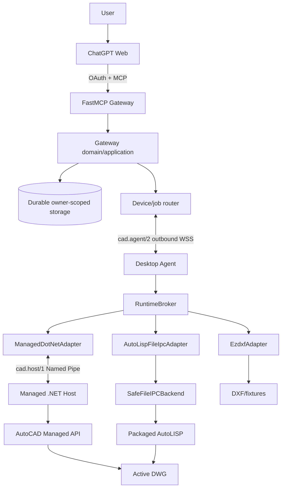

# Kế hoạch kiến trúc AutoCAD MCP nhiều người dùng — Managed .NET primary, AutoCAD LT compatibility

> Trạng thái cập nhật 2026-07-26: **PR #8 đã merge vào `main` tại commit `a3ddacc5e45fa2a3dbf1966ed2d35f12d04a55a7`. Phase 0–3.1 đã triển khai; Phase 4 C1 đã GO; Phase 5 đã triển khai Managed .NET R25 foundation, RuntimeBroker, entity/revision observation, local create-only CAD Program POC, production identity/pairing, owner isolation, Portal tối thiểu, R25 signing/rollback engineering và telemetry fail-open pilot. Phase 6 hiện là public CAD Program v0.**
>
> Evidence chính:
>
> - [phase5-runtime-foundation-evidence.md](./phase5-runtime-foundation-evidence.md)
> - [phase56-identity-isolation-evidence.md](./phase56-identity-isolation-evidence.md)
> - [phase5-signing-clean-vm-evidence.md](./phase5-signing-clean-vm-evidence.md)
> - [phase5-local-telemetry-pilot-evidence.md](./phase5-local-telemetry-pilot-evidence.md)
>
> Roadmap hiện hành: [Phase-6-plus.md](./Phase-6-plus.md). Kế hoạch triển khai gần nhất: [Phase-6.md](./Phase-6.md), [Phase-7.md](./Phase-7.md), [Phase-8.md](./Phase-8.md).

## 1. Executive summary

Sản phẩm dùng một public MCP/Gateway contract chung nhưng hỗ trợ ba runtime có vai trò khác nhau:

```text
ChatGPT Web
→ FastMCP Gateway
→ Desktop Agent
→ RuntimeBroker
   ├─ Managed .NET Host      AutoCAD Full 2018+; primary
   ├─ AutoLISP/File IPC      AutoCAD LT 2024+; compatibility
   └─ ezdxf                  headless/offline/test
```

Quyết định cốt lõi:

1. AutoCAD Full trên Windows dùng Managed .NET làm runtime chính.
2. AutoCAD LT 2024+ giữ AutoLISP/File IPC làm compatibility runtime.
3. ezdxf dùng cho DXF offline, golden tests, simulator và preview không-authoritative.
4. Public MCP tools không tách theo runtime.
5. ChatGPT gửi CAD Program có cấu trúc; không gửi arbitrary C#, DLL, LISP, shell hoặc command.
6. Gateway giữ identity, owner isolation, policy, durable jobs, approval, audit và routing.
7. Desktop Agent giữ device session, UI, local ledger, hard pause, RuntimeBroker và update shell.
8. Managed Host giữ AutoCAD application/document/database execution qua authenticated local IPC.
9. Write không silent fallback runtime.
10. AutoCAD Full không bị kéo xuống giới hạn của LT; khác biệt biểu diễn bằng capability manifest.

## 2. Current baseline

### 2.1. Phase 4 C1

Tuyến production-like đầu tiên đã chạy trên AutoCAD Mechanical 2025:

```text
ChatGPT → FastMCP Gateway → WSS Desktop Agent
→ SafeFileIPCBackend → COM/PostCommand → packaged AutoLISP
→ active DWG
```

Tuyến này tiếp tục tồn tại cho LT compatibility và fallback read-only có policy.

### 2.2. Phase 5 after PR #8

Đã triển khai:

- additive runtime/capability contracts;
- `RuntimeBroker` trong Agent;
- R25 `.NET 8` Managed Host;
- authenticated Named Pipe `cad.host/1`;
- health, observe, entity paging/events, document identity/revision;
- local create-only CAD Program validation/preview/commit/receipt;
- `cad.agent/2` device proof;
- browser pairing and Ed25519 device identity;
- owner-filtered Gateway storage;
- Next.js Portal/BFF;
- R25 lab signing, install/upgrade/rollback and clean-VM evidence;
- privacy-bounded local telemetry collector.

Public Gateway remains read-oriented; local write POC is not yet a public owner-scoped product lifecycle.

### 2.3. Remaining external gates

- CA-issued production code-signing certificate;
- trusted timestamp;
- private-key custody/provenance/SBOM/malware review;
- live revoke/re-pair drill;
- telemetry soak 3–7 days;
- older Full release-family smoke;
- real AutoCAD LT 2024+ certification.

Uncertified families/runtimes must not be advertised as supported.

## 3. Product support matrix

| Product | Platform | Target | Default runtime | Status rule |
|---|---|---:|---|---|
| AutoCAD Full / vertical with Managed .NET | Windows x64 | 2018+ target | `managed_dotnet` | support only after family real evidence |
| AutoCAD Mechanical | Windows x64 | 2018+ target | `managed_dotnet` | Mechanical 2025 is first proven host |
| AutoCAD LT | Windows x64 | 2024+ | `autolisp_file_ipc` | compatibility; real certification required |
| No AutoCAD / CI / DXF offline | Windows/Linux | N/A | `ezdxf_headless` | non-authoritative for live DWG safety |

AutoCAD LT before 2024 is not targeted because LT AutoLISP support starts at 2024. Managed .NET is not claimed for LT.

## 4. Architecture boundaries


```mermaid
flowchart TD
    U[User] --> GPT[ChatGPT Web]
    GPT -->|OAuth + MCP| FM[FastMCP Gateway]
    FM --> APP[Gateway domain/application]
    APP --> DB[(Durable owner-scoped storage)]
    APP --> ROUTER[Device/job router]
    ROUTER <-->|cad.agent/2 outbound WSS| AG[Desktop Agent]

    AG --> BROKER[RuntimeBroker]
    BROKER --> DOTNET[ManagedDotNetAdapter]
    BROKER --> LISP[AutoLispFileIpcAdapter]
    BROKER --> EZ[EzdxfAdapter]

    DOTNET <-->|cad.host/1 Named Pipe| HOST[Managed .NET Host]
    HOST --> API[AutoCAD Managed API]
    LISP --> SAFE[SafeFileIPCBackend]
    SAFE --> DISP[Packaged AutoLISP]
    API --> DWG[Active DWG]
    DISP --> DWG
    EZ --> DXF[DXF/fixtures]
```

### Gateway

Owns:

- OAuth/Auth0 identity;
- internal owner mapping;
- public FastMCP tools/resources/prompts;
- owner/device authorization;
- durable job state;
- program/preview/intent/consent/receipt records;
- risk/policy/approval;
- audit/artifacts;
- device routing;
- rate limits/quotas later.

Must not import Autodesk assemblies, call COM/LISP/Named Pipe directly or contain runtime-specific AutoCAD object logic.

### Desktop Agent

Owns:

- outbound WSS and device authentication;
- pairing credential/key storage;
- heartbeat/presence;
- command ledger/reconcile;
- RuntimeBroker and local capability publication;
- write lock/hard pause;
- local trusted confirmation;
- diagnostics/update shell.

UI actions go through Agent Core, never direct CAD adapters.

### Managed Host

Owns:

- AutoCAD process/document context;
- document lock and transactions;
- entity/object adapters;
- event/revision evidence;
- explicit operation registry;
- preview/commit/validate/receipt/checkpoint;
- bounded recovery query.

Does not own OAuth, tenant policy, public MCP, Internet listener or arbitrary plugin loading.

### AutoLISP/File IPC runtime

Keeps:

- `SafeFileIPCBackend` fail-closed allowlist;
- COM/PostCommand/File JSON path;
- packaged/versioned dispatcher;
- busy/modal/document checks;
- no raw LISP in production remote profile;
- no blind write retry;
- trusted path and bounded files.

It remains the LT runtime and an explicit compatibility path, not the capability ceiling for Full.

### ezdxf

Used for:

- DXF offline read/write;
- schema/semantic/golden tests;
- headless geometry validation;
- simulator and CI;
- scene/query prototypes.

It cannot alone authorize live DWG commit or prove AutoCAD transaction/vertical behavior.

## 5. RuntimeBroker and capability model

Runtime selection:

| Condition | Selection | UI/state |
|---|---|---|
| Full + valid Managed Host | `managed_dotnet`, primary | full capability |
| Full + missing/mismatched Host | fail/degraded; optional read fallback | plugin required or limited compatibility |
| LT 2024+ | `autolisp_file_ipc`, primary for LT | valid LT compatibility |
| no AutoCAD/offline DXF | `ezdxf_headless` | offline/headless |

No write/preview/rollback silent fallback. Runtime or package changes invalidate preview/approval.

Capability manifest includes:

- product/edition/release/vertical;
- runtime ID/role/framework/family;
- Agent/Host/LT package versions and hashes;
- registry version/hash;
- supported semantic capabilities;
- revision/preview strategy;
- degradation reason;
- protocol compatibility.

Capability tiers:

- `portable_core`;
- `managed_standard`;
- `managed_advanced`;
- `lt_compat`;
- `headless_only`;
- `experimental`.

Unsupported operation returns `capability_missing`; it is not translated to a “close enough” command.

## 6. Public MCP design

Keep a small high-level surface:

```text
cad_list_devices
cad_observe
cad_query
cad_prepare_program
cad_preview
cad_commit
cad_validate
cad_get_job
cad_cancel_job
cad_rollback          after Phase 7 gate
```

Rules:

- primitive operations are CAD Program statements, not public tools;
- FastMCP remains only at public boundary;
- domain services do not import FastMCP;
- large scene/program/evidence data uses owner-scoped resources;
- tool annotations/scopes/risk are explicit;
- public contract stays runtime-neutral;
- runtime/evidence returned for safety and diagnostics.

## 7. CAD Program architecture

```text
ChatGPT creates structured CAD Program
→ Gateway validates owner/schema/risk/capability/budget
→ immutable semantic program revision
→ preview pins exact execution environment
→ Agent validates and selects runtime
→ runtime adapter executes explicit registry
→ Host/adapter returns receipt/evidence
→ Gateway validates/materializes durable result
```

### Version roadmap

#### `cad.program/0.2` — Phase 6

- linear create-only steps;
- ensure layer;
- line/circle/polyline/rectangle/text/basic linear dimension;
- prior output references;
- pre/postconditions;
- bounded budgets;
- preview transaction abort;
- commit and validate;
- owner-scoped lifecycle and exact execution binding.

#### `cad.program/1.0` — Phase 8

- variables and safe expression AST;
- bounded repeat/pattern;
- immutable snapshot/query refs;
- move/copy/rotate/scale/mirror;
- offset/fillet/chamfer and carefully gated trim/extend;
- scoped delete/high-risk policy;
- block/attributes;
- richer annotation;
- patch/rebase and reusable component refs.

No arbitrary code in any version.

### Digests

- program digest covers semantic program revision;
- execution digest additionally covers runtime, Host/Agent/package, registry, capability, policy, document and compiler/interpreter evidence;
- preview/consent binds execution digest;
- semantic or execution environment changes invalidate old preview/consent.

## 8. Preview, commit, recovery and rollback

### Preview

Managed database-native primitives use transaction abort. Preview record stores exact binding and evidence; it is not human approval.

### Commit

- owner/scope/policy checks;
- exact active preview;
- document/runtime/package/registry revalidation;
- Agent write lock and hard pause;
- one concurrent write per document;
- durable Agent ledger;
- Host transaction + DWG receipt;
- no blind retry after started.

### Recovery — Phase 7

Evidence order:

1. Host durable receipt;
2. Agent local ledger;
3. Gateway durable result.

Proven not-started may requeue. Started/inconclusive becomes `outcome_unknown` or `needs_attention`. Reconcile does not execute operations.

### Approval — Phase 7

Approval is never an MCP tool. Trusted presenters:

- Agent local confirmation;
- Portal recent-auth approval.

One immutable execution intent, one consent truth, atomic consume/release, exact binding and expiry.

### Rollback — Phase 7

Explicit rollback plan from checkpoint/receipt, with preview and conflict detection. Generic AutoCAD Undo is not a product guarantee.

## 9. Identity and multi-user isolation

Owner identity is stable `(issuer, subject)`, not email, `client_id` or `azp`.

The signed-in product flow requests the complete user scope bundle once:
`autocad.read autocad.write autocad.device.manage`. This lets one authorized
session use observation, the existing Phase 6–9 write workflow and device
management without a second login. Holding the scopes does not bypass policy:
CAD writes still require exact device/document binding, preview, trusted
approval, commit, validation and recovery/rollback controls.

Trust boundaries:

| Credential | Holder | Used for |
|---|---|---|
| ChatGPT OAuth token | ChatGPT client | public MCP |
| Portal browser session | Browser/BFF | Portal API |
| Device key/session | Desktop Agent | Gateway WSS |
| Host local session | Agent + Host | Named Pipe |

Owner filtering covers:

- devices/sessions;
- jobs/snapshots/resources/artifacts;
- programs/revisions/previews/receipts;
- intents/consents/checkpoints/recovery;
- audit.

Cross-owner IDs return `not_found` before dispatch. Revoke closes WSS and blocks reconnect. Old replacement session cannot send terminal results.

## 10. Security invariants

- no arbitrary C#/DLL/LISP/Python/shell/command;
- no model-controlled executable/assembly/file path;
- signed trusted bundles and exact hashes;
- Named Pipe current-user ACL + authenticated session;
- bounded messages, payloads, entities, operations and deadlines;
- server-side canonical digests;
- owner/scope/device checks before dispatch;
- Agent and Host revalidate exact binding;
- no write silent fallback;
- no write retry after started without proven not-started;
- approval outside model;
- risk floor cannot be reduced by UI/model;
- telemetry fail open and privacy bounded;
- full audit correlation without secrets/raw drawing content by default.

## 11. UI boundaries

Detailed UI: [appendix-user-interface.md](./appendix-user-interface.md).

Summary:

- ChatGPT is work surface;
- Agent is local control/confirmation/diagnostics;
- Portal is account/device/policy/activity/approval/download/admin;
- Host is not a fourth account app;
- preview, approval, commit and validation are distinct states;
- `outcome_unknown` is distinct from failed and has no retry-write button;
- runtime labels distinguish LT compatibility from degraded Full fallback.

## 12. Packaging and release families

Target build families:

| Family | Expected AutoCAD | Runtime |
|---|---:|---|
| R22 | 2018 | .NET Framework 4.6 |
| R23 | 2019–2020 | .NET Framework 4.7 |
| R24 | 2021–2024 | .NET Framework 4.8 |
| R25 | 2025+ | .NET 8 Windows |

These are packaging strategy, not support claims. Each family requires real load/smoke and correct `PackageContents.xml` SeriesMin/SeriesMax.

Release units version independently:

- Gateway;
- Desktop Agent;
- Managed Host bundle;
- AutoLISP package;
- CAD Program schema/operation registry;
- Agent protocol;
- Host protocol;
- skills/operation packs later.

Production artifacts require CA trust, timestamp, hash/signature verification, provenance/SBOM/malware review, clean-VM install/upgrade/rollback and operator approval.

## 13. Testing strategy

### Per PR

- Python Gateway/Agent/contracts;
- FastMCP schema snapshots;
- .NET Host Core without Autodesk assemblies;
- Portal unit/component/E2E;
- ezdxf/golden;
- LT/File IPC regression;
- package/security validators.

### Controlled Windows/AutoCAD

- Host load/unload/startup;
- active/no document;
- busy/modal/document switch;
- observe/entity query;
- preview abort;
- commit/receipt/checkpoint;
- duplicate/reconnect;
- crash/reopen;
- SECURELOAD/trusted location;
- install/upgrade/rollback.

### Cross-runtime

Portable operations require same semantic input, normalized output, declared geometry tolerance and explicit unsupported behavior. Runtime-specific evidence may differ.

### Security/failure

- IDOR/replay/idempotency;
- pairing/revoke/session replacement;
- all write drop points;
- approval race/replay/invalidation;
- rollback conflict;
- arbitrary code/path rejection;
- telemetry outage fail-open.

## 14. Current roadmap

| Phase | Result |
|---:|---|
| 5 | Runtime, identity and local write foundation — merged |
| 6 | Public CAD Program v0 and Managed Write Pilot |
| 7 | Durable Recovery, Trusted Approval and Rollback |
| 8 | CAD Program v1 and Cross-Runtime Capability |
| 9 | Skill and Workflow Platform |
| 10 | Scene Graph and Drawing Intelligence |
| 11 | Packaging, Distribution and Multi-User Pilot |
| 12 | Production Hardening, Scale and Ecosystem |

Roadmap details: [Phase-6-plus.md](./Phase-6-plus.md).

## 15. Phase 6 next step

Phase 6 must implement public owner-scoped:

```text
cad_prepare_program
cad_preview
cad_commit
cad_validate
```

with `cad.program/0.2`, Gateway storage, typed Agent commands, `ProgramCommandExecutor`, R25 Host integration, runtime pinning, kill switches, live Mechanical 2025 E2E and no LT/read regression.

Detailed plan: [Phase-6.md](./Phase-6.md).

## 16. Decisions now

1. Managed .NET primary for Full; LT compatibility retained.
2. Desktop Agent stays out-of-process; Managed Host stays in AutoCAD.
3. FastMCP stays public boundary only.
4. CAD Program is runtime-neutral structured IR.
5. Public tools remain high-level and stable.
6. Runtime/capability/package/policy are pinned to execution.
7. No arbitrary code or model-supplied path/assembly.
8. No write silent fallback.
9. Approval is a trusted human action, not a model tool.
10. Release support requires evidence, not compile success.
11. Phase numbering after Phase 5 is normalized to Phase 6–12.

## 17. Deferred decisions

- exact old-family build splits after real smoke;
- final document revision algorithm for every object type;
- LT portable write compiler scope;
- which vertical after Mechanical gets first-class support;
- when scale evidence justifies PostgreSQL/queue/multi-worker;
- signed third-party skill/capability governance;
- whether some Agent components should later move to .NET.

## 18. Architecture Definition of Done

The target architecture is considered proven only when:

- public observe routes through Managed .NET on real Mechanical 2025;
- runtime/capability/package evidence is owner-scoped and visible;
- public create-only program preview/commit/validate works via Managed .NET;
- preview and approval invalidate on environment change;
- duplicate/failure matrix never creates second effect;
- trusted approval cannot be issued by model;
- rollback is receipt/checkpoint based and conflict-aware;
- LT compatibility remains intact and honestly reported;
- at least one older Full family and real LT environment are certified before support claim;
- installer/update/rollback is signed and production-trusted;
- two-user isolation, audit, diagnostics and telemetry remain privacy-safe;
- production scale decisions are backed by load evidence.
